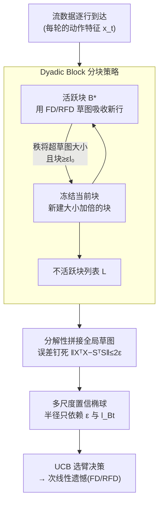

# Revisiting Matrix Sketching in Linear Bandits: Achieving Sublinear Regret via Dyadic Block Sketching

**会议**: ICLR 2026  
**arXiv**: [2410.10258](https://arxiv.org/abs/2410.10258)  
**作者**: Dongxie Wen, Hanyan Yin, Xiao Zhang, Peng Zhao, Lijun Zhang, Zhewei Wei (人民大学 & 南京大学)
**代码**: 无  
**领域**: 强化学习 / 在线学习 / Bandit  
**关键词**: 线性Bandit, 矩阵草图, Frequent Directions, 多尺度草图, 次线性遗憾, Dyadic Block Sketching

## 一句话总结

本文揭示了现有基于矩阵草图的线性Bandit方法在流数据频谱尾部较重时会退化为线性遗憾的根本缺陷，提出 Dyadic Block Sketching 多尺度草图框架，通过动态加倍草图大小控制全局逼近误差至预设参数 $\epsilon$，使算法在无需预知流矩阵频谱性质的情况下始终保证次线性遗憾，并在频谱友好场景下自适应恢复单尺度方法的计算效率。

## 研究背景与动机

**领域现状**：随机线性Bandit (SLB) 是在线学习的核心框架。经典 OFUL 算法通过正则化最小二乘+置信上界实现 $\widetilde{O}(d\sqrt{T})$ 遗憾界，但每轮更新为 $\Omega(d^2)$。在高维场景下代价不可接受，因此社区引入矩阵草图将每轮复杂度降至 $O(dl + l^2)$，其中 $l < d$ 为草图大小。

**核心痛点**：基于草图的 SOFUL、CBSCFD 方法遗憾界依赖频谱误差 $\Delta_T$。当流矩阵频谱重尾时，固定的小草图无法保留足够频谱信息，$\Delta_T$ 快速增长导致遗憾退化为**线性**——完全违背在线学习目标。

**根本矛盾**：最优草图大小取决于流矩阵频谱性质（未知），草图太小→线性遗憾，草图太大→失去效率。作者证明在局部凸臂空间中当几何常数 $q \geq 1/3$ 时，**任何**固定 $l < d$ 的 SOFUL 都必然线性遗憾 (Observation 1)。

**切入点**：借鉴流算法的 dyadic 框架，用多个几何级数增长的草图块逼近流矩阵，将全局误差与预设参数 $\epsilon$ 绑定，从而与未知频谱性质解耦。

## 方法详解

### 整体框架

DBSLinUCB 把"一张固定大小的草图"换成"一摞几何级数增长的草图块"。流数据（每轮被拉过的动作特征）逐行到达，先喂进一个正在吸收数据的活跃块；当活跃块快装不下时就冻结它、新建一个大小加倍的块继续接，于是块越靠后草图越大。借助一条"分解性"引理，所有块的草图能拼成一张全局草图，其逼近误差被一个预设参数 $\epsilon$ 钉死；这张全局草图再喂给基于 UCB 的选臂决策。关键在于：用户不再去猜未知的最优草图大小，只设一个全局误差 $\epsilon$，由分块机制自适应决定开多少块、每块多大，从而让逼近质量与流矩阵频谱性质彻底解耦——频谱友好时只开几块、保持高效，重尾时多开几块直到退化为精确更新、保住精度。

### 关键设计

**1. Dyadic Block 分块策略：让草图大小随数据自己长出来**

固定的小草图在重尾频谱下保不住信息，固定的大草图又浪费算力，问题在于没人事先知道该开多大。分块策略维护一个接收新行的活跃块 $\mathcal{B}^\star$ 和一组已冻结的不活跃块列表 $\mathcal{L}$：初始块草图大小为 $l_0$，每当活跃块的秩将要超过自己的草图大小、且块大小已不小于 $\epsilon l_0$ 时，就冻结当前块、新建一个大小加倍的块继续吸收数据。整个过程受两条不变量约束——不活跃块要么草图大小已覆盖其秩、要么块大小小于 $\epsilon l_0$（保证每块逼近质量），以及块数上限为 $\lfloor \log(d/l_0 + 1) \rfloor$（保证总开销可控）。在极端重尾、块数撞到上限时，算法干脆退化为 rank-1 精确更新，等价于不做草图的 OFUL，既不会失真也不会无限膨胀。

**2. 分解性与全局误差界：把拼接误差钉死在 $\epsilon$ 上**

多块草图能拼起来用、且最终保证还不依赖频谱，靠的是一条分解性（Decomposability, Lemma 3）：只要每块草图满足局部协方差误差界 $\|X_i^\top X_i - S_i^\top S_i\|_2 \leq \epsilon_i \|X_i\|_F^2$，则拼接后全局草图的误差就被各块误差之和所控制。换句话说，单块上能证明的逼近质量是可组合的，"每块管好自己"直接升级成"整体也管得住"。把分块策略的不变量代进来，最终得到一个与流矩阵频谱性质完全无关的全局误差界（Theorem 1）：

$$\|X^\top X - S^\top S\|_2 \leq 2\epsilon$$

实际开出的块数 $B = \lceil \min\{\log(k/l_0), \|X\|_F^2 / (\epsilon l_0)\} \rceil$ 随数据自适应——低秩友好时只开几块、草图很小，重尾时多开几块直到退化为精确更新。这正是范式转变的落点：复杂性从"选对草图大小"转移到了"由 $\epsilon$ 驱动的自适应计算"。

**3. 多尺度置信椭球：把遗憾从频谱误差 $\Delta_T$ 上解绑**

草图逼近会污染最小二乘估计，必须把这部分误差吸收进 UCB 的置信半径才能保证决策不被误导。基于多尺度草图重新推导的置信椭球（Theorem 2）半径为

$$\hat{\beta}_t(\delta) \lesssim R\sqrt{d \ln(1 + \epsilon/\lambda) + 2l_{B_t}} \cdot \sqrt{1 + \epsilon/\lambda} + \frac{H(\lambda + \epsilon)}{\sqrt{\lambda}}$$

它只依赖可控的 $\epsilon$ 和当前草图大小 $l_{B_t}$，而非旧方法里随重尾爆炸的频谱误差 $\Delta_T$。正是这一步把"草图退化→椭球膨胀→线性遗憾"的链条从源头掐断。

**4. FD 与 RFD 两个实例，给出次线性遗憾的双重保证**

把上面的椭球代入标准 UCB 分析，两种底层草图各得一条遗憾界。用 FD 的 DBSLinUCB-FD（Theorem 3）为

$$\text{Regret}_T = \widetilde{O}\left(\left(1 + \frac{\epsilon}{\lambda}\right)^{3/2} \cdot (d + l_{B_T}) \cdot \sqrt{T}\right),$$

取 $\epsilon = O(1)$ 即得 $\widetilde{O}(\sqrt{T})$，与 OFUL 同阶。改用正则化 FD 的 DBSLinUCB-RFD（Theorem 4）则进一步把 $\epsilon$ 的幂次从 $3/2$ 压到 $1/2$、并解耦 $d$ 与 $\epsilon$：

$$\text{Regret}_T = \widetilde{O}\left(\left(1 + \frac{\epsilon}{\lambda}\right)^{1/2} \cdot \sqrt{l_{B_T} T} + \sqrt{d l_{B_T} T}\right),$$

这得益于 RFD 的正定单调性和良条件性；若令 $\epsilon = O(T^{(2\gamma-1)/3})$，还能换取任意指定的 $O(T^\gamma)\ (\gamma \in [0.5,1))$ 遗憾，给出精度与效率之间一条连续可调的曲线。

## 实验关键数据

### 实验一：合成数据线性遗憾验证

设置：$d=500$, 100 arms, 高斯分布 $\mathcal{N}(0, I_d)$, 草图大小 $l \in \{50, 450\}$。

| 算法 | 草图大小 | 遗憾趋势 | 频谱误差 $\log(\Delta_T)/\log t$ |
|------|---------|---------|-------------------------------|
| OFUL | 无草图 | 次线性 (最优基准) | — |
| SOFUL | $l=450$ | 次线性 | $< 1/3$ ✔ |
| SOFUL | $l=50$ | **近线性** ❌ | $> 1/3$ ❌ 越过临界线 |
| CBSCFD | $l=450$ | 次线性 | $< 1/3$ ✔ |
| CBSCFD | $l=50$ | **近线性** ❌ | $> 1/3$ ❌ 越过临界线 |
| DBSLinUCB-FD | $l_0=50, \epsilon=8$ | **次线性** ✔ | 自适应控制 |
| DBSLinUCB-RFD | $l_0=50, \epsilon=8$ | **次线性** ✔ | 自适应控制 |

关键发现：$l=50$ 时 SOFUL/CBSCFD 频谱误差越过 $1/3$ 基准线→线性遗憾，精确验证 Observation 1。DBSLinUCB 以相同初始草图大小始终保持次线性遗憾。

### 实验二：MNIST 真实数据 + Pareto 前沿

设置：$d=784$, $M=10$ 类, 60000 样本, 2000 轮在线分类。

| 方法 | 配置 | 遗憾 (2000轮) | 时间节省 | 空间节省 |
|------|------|-------------|---------|---------|
| OFUL | 无草图 | ~200 (最优) | 0% (基准) | 0% (基准) |
| SOFUL | $l=600$ | ~250 | ~30% | ~25% |
| SOFUL | $l=50$ | >500 ❌ | ~85% | ~90% |
| DBSLinUCB-FD | $\epsilon=4, l_0=50$ | ~220 | ~60% | ~80% |
| DBSLinUCB-RFD | $\epsilon=4, l_0=50$ | ~210 | ~60% | ~80% |
| DBSLinUCB-FD | $\epsilon=25, l_0=50$ | ~300 | ~80% | ~90% |

关键发现：(1) DBSLinUCB 在 Pareto 前沿（遗憾 vs 时间/空间）全面优于 SOFUL，最多减少 40% 遗憾或同遗憾下减少 60% 时间 + 80% 空间。(2) 遗憾始终 <300，而 SOFUL 小草图下超 500。(3) $\epsilon$ 很小时不同 $l_0$ 表现趋同（Invariant 2 约束下更多依赖精确更新）。

## 亮点与洞察

- **从"猜草图大小"到"设误差参数"的范式转变**：用户直接控制精度 $\epsilon$ 而非猜测未知的频谱性质，这是将问题复杂性从参数选择转移到自适应计算的巧妙设计。
- **优雅的两端退化**：最好情况恢复 $O(dk)$ 的最优草图复杂度，最坏情况退化为 $O(d^2)$ 的 OFUL——两端均已知最优，中间平滑过渡。
- **框架通用性**：不绑定特定草图方法，任何满足协方差误差保证的草图(FD/RFD/随机投影)均可即插即用，模块化设计有很好的可扩展性。
- **理论-实验紧密呼应**：Observation 1 的频谱临界条件在实验中精确复现，Pareto 前沿直观展示效率-精度权衡。

## 局限性

- **$\epsilon$ 仍需人工设置**：最优 $\epsilon$ 依赖问题实例和 $T$ 的先验，完全自适应的 $\epsilon$ 调整未解决。
- **重尾场景下无加速**：$k=d$ 时退化为 $O(d^2)$，与 OFUL 相同——信息论上的必然，但实践中可能有更精细方案。
- **实验规模偏小**：$d=784$ (MNIST) 不够大，$d=10000+$ 的推荐系统场景需进一步验证。
- **限于随机平稳设置**：非平稳环境或对抗噪声下的块分裂策略需重新设计。
- **Frobenius 范数界非最紧**：作者指出可利用 FD 的自适应频谱尾界改进块分配，是明确的理论提升方向。

## 相关工作

- **vs SOFUL (Kuzborskij et al., 2019)**：固定 FD 草图，遗憾依赖 $\Delta_T$→可能线性遗憾。DBSLinUCB 通过多尺度草图解耦误差，低秩时可恢复相同效率。
- **vs CBSCFD (Chen et al., 2020)**：RFD 代替 FD 降低 $\Delta_T$ 阶，但固定大小的根本问题未解。DBSLinUCB-RFD 兼具 RFD 优势+自适应大小。
- **vs OFUL (Abbasi-Yadkori et al., 2011)**：无草图精确方法，$O(d^2)$。DBSLinUCB 频谱友好时大幅加速，最坏时退化为 OFUL——可视为其计算自适应泛化。
- **Dyadic 框架来源**：流算法中的 dyadic decomposition (Wang et al., 2013; Wei et al., 2016)，迁移到 Bandit 需额外处理置信椭球和遗憾分析。

## 评分

- 新颖性: ⭐⭐⭐⭐ 多尺度草图思想源自流算法，但应用到 Bandit 并证次线性遗憾是非平凡新贡献
- 实验充分度: ⭐⭐⭐⭐ 合成+MNIST 清晰验证理论，但缺少大规模高维真实数据集
- 写作质量: ⭐⭐⭐⭐⭐ 结构清晰，从陷阱揭示到方案提出逻辑流畅，图表直观
- 价值: ⭐⭐⭐⭐ 解决 sketch-based Bandit 根本缺陷，框架通用性好，应用场景相对小众

<!-- RELATED:START -->

## 相关论文

- [\[ICLR 2026\] Online Minimization of Polarization and Disagreement via Low-Rank Matrix Bandits](online_minimization_of_polarization_and_disagreement_via_low-rank_matrix_bandits.md)
- [\[ICLR 2026\] Single Index Bandits: Generalized Linear Contextual Bandits with Unknown Reward Functions](single_index_bandits_generalized_linear_contextual_bandits_with_unknown_reward_f.md)
- [\[NeurIPS 2025\] Generalized Linear Bandits: Almost Optimal Regret with One-Pass Update](../../NeurIPS2025/reinforcement_learning/generalized_linear_bandits_almost_optimal_regret_with_one-pass_update.md)
- [\[ICLR 2026\] AWM: Accurate Weight-Matrix Fingerprint for Large Language Models](awm_accurate_weight-matrix_fingerprint_for_large_language_models.md)
- [\[ICML 2026\] Practical and Optimal Algorithm for Linear Contextual Bandits with Rare Parameter Updates](../../ICML2026/reinforcement_learning/practical_and_optimal_algorithm_for_linear_contextual_bandits_with_rare_paramete.md)

<!-- RELATED:END -->
