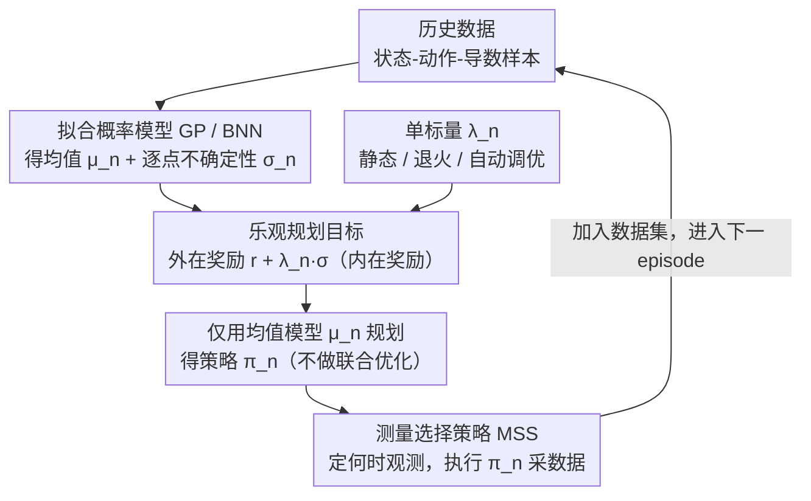

# Sample-efficient and Scalable Exploration in Continuous-Time RL

## 元信息
- **会议**: ICLR 2026
- **arXiv**: [2510.24482](https://arxiv.org/abs/2510.24482)
- **代码**: [https://go.klem.nz/combrl](https://go.klem.nz/combrl)
- **领域**: 强化学习
- **关键词**: continuous-time RL, model-based RL, optimistic exploration, epistemic uncertainty, Gaussian processes, Bayesian neural networks

## 一句话总结
提出 COMBRL 算法，通过最大化外在奖励与模型认知不确定性的加权和，在连续时间模型基 RL 中实现可扩展且样本高效的探索，并具有次线性后悔理论保证。

## 研究背景与动机
- 大多数 RL 算法假设离散时间动态，但真实世界控制系统（机器人、生物过程）天然由 ODE 描述。离散化可能遮蔽关键时间行为并限制控制灵活性。
- 先前连续时间 MBRL 方法（如 OCORL）通过联合优化策略和可信动力学来实现乐观探索，但计算代价很高，需对 plausible dynamics 集合做耦合优化，输入维度从 $d_u$ 升至 $d_u + d_x$，无法扩展到高维系统。
- 先前方法依赖外在奖励信号，无法处理无监督 RL / 系统辨识等场景。
- 核心问题：如何在连续时间 ODE 框架下设计既可扩展、样本高效又具理论保证的探索机制？

## 方法详解

### 整体框架
COMBRL（Continuous-time Optimistic Model-Based RL）要解决的是连续时间 ODE 系统里"既可扩展、又样本高效"的探索。它把控制过程切成一段段 episode，每段重复同一个闭环：先用概率模型（GP 或贝叶斯神经网络 BNN）拟合未知动力学 $\bm{f}^*$，得到均值预测 $\bm{\mu}_n(\bm{z})$ 和逐点的认知不确定性（epistemic uncertainty）$\bm{\sigma}_n(\bm{z})$；再以"外在奖励 + 不确定性"为目标，规划出下一条策略，去环境里采集新数据回填模型。关键在于：以往 OCORL 那类方法为了"乐观"要在一整个可信动力学集合上和策略做耦合优化，代价高、维度还会膨胀；COMBRL 把"乐观"折叠成一个标量加权目标，于是规划退化成对单一奖励函数的标准最优控制——既能换成神经网络模型扩展到高维，又能用同一个旋钮覆盖有监督和无监督两种探索场景。

### 关键设计

**1. 乐观规划目标：把探索动机直接写进奖励**

连续时间下没法像离散 MBRL 那样对状态转移逐步加噪来鼓励探索，COMBRL 转而在每个 episode $n$ 用一个加权积分目标来选策略：

$$\bm{\pi}_n = \arg\max_{\bm{\pi} \in \Pi} \int_0^T \frac{r(\bm{x}'(s), \bm{u}(s)) + \lambda_n \|\bm{\sigma}_{n-1}(\bm{x}'(s), \bm{u}(s))\|}{1 + \lambda_n}\, ds$$

分子前半是环境给的外在奖励 $r$，后半是模型在该状态-动作处的认知不确定性 $\|\bm{\sigma}_{n-1}\|$——它充当一种内在奖励，把策略推向"模型还没看明白"的区域；标量 $\lambda_n$ 调节二者比例，分母 $1+\lambda_n$ 做归一化让目标尺度不随权重漂移。这样一来，探索不再依赖对动力学集合的联合搜索，而是变成对一个**单一、已知**奖励函数的标准最优控制问题，任何现成的连续时间 planner 都能直接套用。

**2. 单标量 $\lambda_n$ 统一有监督与无监督探索：一个旋钮覆盖整条谱**

同一个 $\lambda_n$ 连续地切换 agent 的行为：$\lambda_n = 0$ 退化为只看外在奖励的贪心利用，$0 < \lambda_n < \infty$ 在利用与探索间权衡，$\lambda_n \to \infty$ 则彻底丢掉外在奖励、变成纯无监督的系统辨识。正因为探索动机已经被写进了同一个目标，这条谱不用换算法就能走通。论文给出三种调度 $\lambda_n$ 的方式——静态（固定值做网格搜索）、退火（$\lambda_n \propto \lambda_0 (1 - n/N)$，前期重探索、后期随模型变准转向利用）、以及基于互信息增益自适应调整的自动调优。实验显示自动调优能逼近最佳手调超参，省去了昂贵的逐任务调参。

**3. 均值模型替代联合优化：维度不膨胀才可扩展**

OCORL 为了实现乐观，要在可信动力学集合 $\mathcal{M}_{n-1} \cap \mathcal{F}$ 上和策略联合优化，并借重参数化技巧把规划的输入维度从 $d_u$ 抬到 $d_u + d_x$，在高维系统里代价急剧上升。COMBRL 指出这一步并非必需：既然不确定性已经以内在奖励的形式进了目标，规划时从 $\mathcal{M}_{n-1} \cap \mathcal{F}$ 里取**任意一个**模型即可，实践中直接拿均值模型 $\bm{\mu}_n$ 来 plan（GP 情形下论文也给出了如何严格取一个落在集合内的模型）。这把维度膨胀彻底消除，使方法对模型和 planner 都不挑——GP、BNN 都行，计算成本约为 OCORL 的 $1/3$。

**4. 测量选择策略（MSS）与双重理论保证：连续时间里"何时看"也进理论**

离散 RL 默认每步都观测，但连续时间系统必须额外决定在 $[0,T]$ 内**哪些时刻**采样和施控。COMBRL 沿用 Treven et al. (2023) 的测量选择策略（measurement selection strategy, MSS）$S = (S_n)_{n \geq 1}$ 来形式化这件事：每个 episode 指定一组测量时间点，它直接决定收集到的数据质量，并显式进入后悔界。围绕它论文给出两条保证。有监督侧（定理 1）：在 Lipschitz 连续、亚高斯噪声、well-calibrated 模型三条假设下，累积后悔 $R_N \leq \mathcal{O}\big(\sqrt{\mathcal{I}_N^3(\bm{f}^*, S) \cdot N}\big)$，其中 $\mathcal{I}_N$ 是刻画"学这套动力学有多难"的模型复杂度（由信息增益给出）；对 RBF 核加等距 MSS，$\mathcal{I}_N$ 仅以 $\text{polylog}(N)$ 增长，于是 $R_N$ 次线性、平均后悔趋于零、策略收敛到最优。无监督侧（定理 2，$\lambda_n \to \infty$）：最大认知不确定性以 $\mathcal{O}(\sqrt{\mathcal{I}_N^3 / N})$ 的速率衰减——没有奖励时模型也会被均匀地学好。两个界都显式依赖 MSS $S$，说明"何时观测"和"用什么策略"一样会左右学习效率，这也是连续时间相对离散版本独有的一维自由度。

## 实验关键数据

### 主实验：GP 动力学下的学习效果

| 环境 | 方法 | 渐近性能 | 计算时间比 |
|------|------|----------|-----------|
| Pendulum | Mean (λ=0) | 次优 | 1× |
| Pendulum | PETS | 中等 | ~1× |
| Pendulum | OCORL | 最优级 | ~3× |
| Pendulum | **COMBRL** | **最优级** | **~1×** |
| MountainCar | Mean (λ=0) | 次优 | 1× |
| MountainCar | **COMBRL** | **最优** | ~1× |

> COMBRL 在性能上匹配或超越 OCORL，同时计算成本仅为其约 1/3。

### 消融实验：内在奖励的效果

| 环境 | Mean (λ=0) | PETS | COMBRL (auto λ) | 性能提升 |
|------|-----------|------|-----------------|---------|
| Reacher (easy) | ~基线 | 中等 | 最优 | 显著 |
| Finger (spin) | ~基线 | 中等 | 最优 | 显著 |
| Cartpole (balance) | ~基线 | 接近 | 最优 | 中等 |
| Hopper (stand) | ~基线 | 中等 | 最优 | 显著 |

> COMBRL 在稀疏奖励或欠驱动任务中获得最大性能增益，在高维域中也有一致提升。自动调优 $\lambda_n$ 有效。

### 关键发现
1. COMBRL 在所有测试环境中一致优于 greedy baseline 和 PETS
2. 与 OCORL 性能相当，但计算开销仅约 1/3
3. 无监督学到的模型可迁移到未见下游任务
4. 自动 $\lambda_n$ 调优与最佳手调超参性能接近

## 亮点与洞察
- **统一框架**：单一标量 $\lambda_n$ 优雅地统一了有监督和无监督 RL 设置
- **可扩展性**：避免了对可信动力学集合的优化，可用 BNN 等神经网络模型
- **理论完备**：同时提供有监督后悔界和无监督样本复杂度界
- **MSS 的显式依赖**：首次明确了测量策略对连续时间 RL 性能的影响

## 局限性
- 理论分析依赖 RKHS 平滑性假设和 well-calibrated 模型假设，实际中 BNN 可能不完全满足
- 目前实验仅在中等维度任务验证（最高到 DMC 环境），超高维（如像素输入）的效果需验证
- $\lambda_n$ 的最优选择策略仍需进一步探索，自动调优方法的理论保证有限

## 相关工作
- **连续时间 MBRL**: OCORL (Treven et al., 2023) 提供理论保证但不可扩展；Yildiz et al. (2021) 贪心方法无探索
- **内在动机/无监督 RL**: Sekar et al. (2020), Pathak et al. (2019), Sukhija et al. (2023) 均为离散时间
- **离散时间对应**: Sukhija et al. (2025b) 研究离散时间版本，COMBRL 关注连续时间的不同理论和实验要求

## 评分
- 新颖性: ⭐⭐⭐⭐ — 将奖励+不确定性乐观探索统一到连续时间设置，同时处理有/无监督场景
- 理论深度: ⭐⭐⭐⭐ — 次线性后悔和样本复杂度双重保证
- 实验充分性: ⭐⭐⭐⭐ — 多环境对比、消融、自动调优验证
- 实用价值: ⭐⭐⭐⭐ — 计算高效，适用于连续时间物理控制系统

<!-- RELATED:START -->

## 相关论文

- [\[ICLR 2026\] Unsupervised Learning of Efficient Exploration: Pre-training Adaptive Policies via Self-Imposed Goals](unsupervised_learning_of_efficient_exploration_pre-training_adaptive_policies_vi.md)
- [\[ICLR 2026\] Virne: A Comprehensive Benchmark for RL-based Network Resource Allocation in NFV](virne_a_comprehensive_benchmark_for_rl-based_network_resource_allocation_in_nfv.md)
- [\[ICLR 2026\] SPIRAL: Self-Play on Zero-Sum Games Incentivizes Reasoning via Multi-Agent Multi-Turn Reinforcement Learning](spiral_self-play_on_zero-sum_games_incentivizes_reasoning_via_multi-agent_multi-.md)
- [\[ICLR 2026\] Solving Parameter-Robust Avoid Problems with Unknown Feasibility using Reinforcement Learning](solving_parameter-robust_avoid_problems_with_unknown_feasibility_using_reinforce.md)
- [\[ICLR 2026\] SPELL: Self-Play Reinforcement Learning for Evolving Long-Context Language Models](spell_self-play_reinforcement_learning_for_evolving_long-context_language_models.md)

<!-- RELATED:END -->
