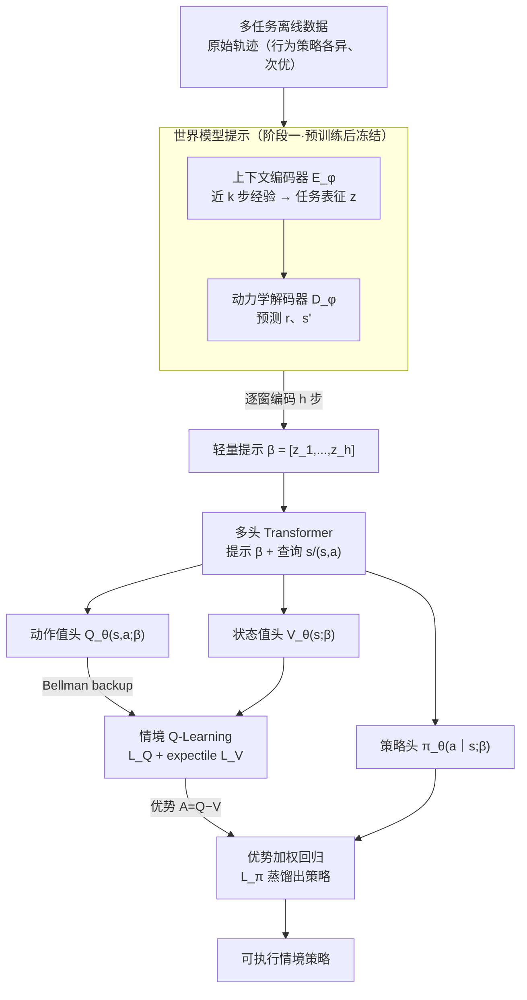

# Scalable In-Context Q-Learning

**会议**: ICLR 2026  
**arXiv**: [2506.01299](https://arxiv.org/abs/2506.01299)  
**代码**: [GitHub](https://github.com/NJU-RL/SICQL)  
**领域**: 强化学习/情境学习  
**关键词**: 情境RL, Q学习, 世界模型, 动态规划, 高效提示

## 一句话总结

提出 S-ICQL——将动态规划（Q-learning）和世界模型引入监督式 ICRL 框架，通过多头 Transformer 同时预测策略和情境值函数，预训练世界模型构建轻量级精确提示，advantage-weighted regression 提取策略，在离散和连续环境中从次优数据学习时一致超越所有基线。

## 背景与动机

**领域现状**：In-context RL（ICRL）将语言模型的情境学习能力扩展到决策领域——在多任务离线数据上预训练 Transformer，测试时通过 prompt 适应新任务而无需更新参数。现有方法分为两大分支：Algorithm Distillation（AD，用学习历史作为上下文自回归预测动作）和 Decision-Pretrained Transformer（DPT，基于交互转移序列预测最优动作）。

**现有痛点**：

- **监督预训练的固有局限**：AD 和 DPT 本质是模仿学习，无法超越收集数据的质量——缺乏 stitching 能力（将次优轨迹片段拼接成全局最优行为的能力）
- **AD 需要长 horizon 上下文**：需要完整的学习历史作为 prompt，且会继承次优行为的梯度更新规则
- **DPT 需要 oracle 最优动作标注**：在实际场景中往往不可行
- **原始轨迹作为提示效率低**：token 数量多且高度冗余，行为策略和任务信息纠缠在一起，导致有偏的任务推断

**核心矛盾**：RL 的精髓在于通过值函数的动态规划更新实现奖励最大化，而现有 ICRL 方法完全停留在监督学习范式中，放弃了 RL 的核心优势。如何在保持监督预训练的可扩展性和稳定性的同时，引入动态规划来释放从次优数据中学习的潜力？

**本文方案**：利用 RL 的两个基本性质——(1) 动态规划（Bellman backup）的 stitching 能力和 (2) 世界模型对环境动力学的精确表征——设计一个可扩展的 ICRL 框架，同时实现高效的奖励最大化和精确的任务泛化。

## 方法详解

### 整体框架

S-ICQL 想解决的是：监督式 ICRL（AD、DPT）本质是模仿学习，既超不过数据质量、又得拿冗长的原始轨迹当提示，于是论文把强化学习的两件法宝——动态规划与世界模型——接进这套框架。整体分两阶段转：第一阶段先**预训练一个世界模型**，把原始轨迹按动力学压成轻量提示 $\beta$，剥掉里头与任务无关的行为策略信息；第二阶段把 $\beta$ 喂进一个**多头 Transformer**，让它在该提示条件下同时输出策略 $\pi_\theta(a|s;\beta)$、状态值 $V_\theta(s;\beta)$ 和动作值 $Q_\theta(s,a;\beta)$，再用 **Bellman backup + expectile** 训值函数、用**优势加权回归**把值蒸馏成策略，三者端到端联合优化。问题设定是多任务离线 RL——任务 $M^i = \langle \mathcal{S}, \mathcal{A}, \mathcal{T}^i, \mathcal{R}^i, \gamma \rangle \sim P(M)$ 共享状态-动作空间但奖励或动力学各异，每个任务的离线数据 $\mathcal{D}^i$ 由任意行为策略收集，因此既可能次优、也可能彼此风格迥异。

### 关键设计

**1. 世界模型提示：把任务信息从行为策略里剥离出来**

直接拿原始轨迹当 prompt 的问题在于，轨迹里行为策略和任务信息纠缠在一起、token 又多又冗余，导致任务推断有偏；而环境动力学 $p(s', r | s, a)$ 本身就完整刻画了一个决策任务，且天然不受行为策略影响，所以用它来编码任务更精确也更紧凑。S-ICQL 为此预训练一个通用世界模型，由上下文编码器 $E_\phi$ 和动力学解码器 $D_\varphi$ 组成：编码器把近 $k$ 步经验 $\eta_t^i = (s_{t-k}, a_{t-k}, r_{t-k}, \ldots, s_t, a_t)^i$ 压成任务表征 $z_t^i = E_\phi(\eta_t^i)$，解码器在该表征条件下预测即时奖励和下一状态 $[\hat{r}_t, \hat{s}_{t+1}] = D_\varphi(s_t, a_t; z_t^i)$，训练目标就是最小化这两项的预测误差：

$$\mathcal{L}(\phi, \varphi) = \mathbb{E}_{\eta_t^i \sim M^i} \left[ \| [r_t, s_{t+1}] - D_\varphi(s_t, a_t; z_t^i) \|_2^2 \mid z_t^i = E_\phi(\eta_t^i) \right]$$

预训练完后冻结世界模型，把 $h$ 步轨迹逐窗编码成提示 $\beta^i := [z_1^i, \ldots, z_h^i] = [E_\phi(\eta_1^i), \ldots, E_\phi(\eta_h^i)]$。相比 AD 那种需要把完整学习历史塞进 context 的做法，这个提示既短又只携带纯任务信息。

**2. 情境 Q-Learning：用 Bellman backup 换来 stitching 能力**

AD 和 DPT 本质都是模仿学习，学到的策略上限被数据质量卡死，无法把多条次优轨迹的好片段拼成一条全局最优行为，而这种 stitching 恰恰是动态规划的看家本领。S-ICQL 因此在提示 $\beta$ 条件下做情境 Q-learning：动作值函数最小化 Bellman 误差

$$\mathcal{L}_Q(\theta) = \mathbb{E}_{(s_t^i, a_t^i, s_{t+1}^i) \sim \mathcal{D}^i} \left[ \left( r(s_t^i, a_t^i) + \gamma V_\theta(s_{t+1}^i; \beta^i) - Q_\theta(s_t^i, a_t^i; \beta^i) \right)^2 \right]$$

让回报信息沿着转移逐步回传，从而在数据里发现比任何单条采样轨迹都好的行为。为避免直接对动作取 $\max$ 在离线设定下选到分布外动作，状态值函数改用 expectile regression 拟合 $Q$ 的上尾分位数 $\mathcal{L}_V(\theta) = \mathbb{E}_{(s_t^i, a_t^i) \sim \mathcal{D}^i} [ L_2^\omega ( Q_{\hat{\theta}}(s_t^i, a_t^i; \beta^i) - V_\theta(s_t^i; \beta^i) ) ]$，其中非对称损失 $L_2^\omega(u) = |\omega - \mathbb{1}(u < 0)| \cdot u^2$ 在 $\omega \in (0.5, 1)$ 时对 $Q > V$ 的样本赋大权重 $\omega$、对 $Q < V$ 的只给 $1-\omega$，于是 $V$ 被推向 $\max_a Q(s, a)$ 而又不必真去枚举动作。

**3. 优势加权回归：把值函数蒸馏成可执行策略**

有了 $Q$ 和 $V$ 还需要一个动作输出，简单行为克隆只会平均复制数据里的好坏动作，浪费掉刚学到的值信息。S-ICQL 用 advantage-weighted regression 把值蒸馏进策略头：

$$\mathcal{L}_\pi(\theta) = -\mathbb{E}_{(s_t^i, a_t^i) \sim \mathcal{D}^i} \left[ \exp\!\left( \frac{1}{\lambda} \left( Q_{\hat{\theta}}(s_t^i, a_t^i; \beta^i) - V_\theta(s_t^i; \beta^i) \right) \right) \cdot \log \pi_\theta(a_t^i | s_t^i; \beta^i) \right]$$

优势 $A = Q - V$ 越大的动作被加权得越重，温度 $\lambda$ 控制这种偏好的尖锐程度，因此策略学的是在数据约束内尽量提升 $Q$ 值，而非无差别模仿。三个损失以 $(\mathsf{c}_1:\mathsf{c}_2:\mathsf{c}_3) = (1:1:1)$ 合成总目标 $\mathcal{L}(\theta) = \mathsf{c}_1 \mathcal{L}_\pi(\theta) + \mathsf{c}_2 \mathcal{L}_Q(\theta) + \mathsf{c}_3 \mathcal{L}_V(\theta)$，整个多头 Transformer 端到端联合优化，仅靠两个轻量值头就把动态规划接进了监督预训练流程。

## 实验结果

### 主实验：Mixed 数据集上的 Few-shot 评估

| 方法 | DarkRoom | Push | Reach | Cheetah-Vel | Walker-Param | Ant-Dir |
|:-----|:---------|:-----|:------|:------------|:-------------|:--------|
| DPT | 22.12 | 362.74 | 736.72 | -78.35 | 257.11 | 591.31 |
| AD | 42.72 | 604.50 | 738.96 | -67.37 | 424.82 | 215.01 |
| IDT | 40.70 | 621.58 | 790.68 | -59.46 | 343.01 | 631.83 |
| DICP | 59.76 | 487.28 | 706.46 | -66.53 | 403.90 | 745.05 |
| DIT | 30.90 | 633.58 | 758.92 | -74.50 | 253.94 | 723.49 |
| IC-IQL | 60.12 | 646.08 | 773.33 | -56.53 | 391.38 | 713.26 |
| **S-ICQL** | **66.05** | **653.04** | **806.97** | **-35.48** | **466.72** | **813.34** |

S-ICQL 在所有 6 个环境中均取得最佳表现。在复杂环境（Cheetah-Vel、Ant-Dir）中优势尤为明显，分别将误差从 -56.53 降至 -35.48（提升 37%）、从 745.05 提升至 813.34。

### 消融实验：各组件贡献分析

| 消融配置 | Reach | Cheetah-Vel | Ant-Dir |
|:---------|:------|:------------|:--------|
| w/o\_cq（去掉世界模型+Q学习 = DPT） | 736.72 | -78.35 | 591.31 |
| w/o\_c（去掉世界模型） | 792.09 | -56.19 | 693.87 |
| w/o\_q（去掉Q学习） | 752.41 | -63.66 | 784.07 |
| **S-ICQL（完整）** | **806.97** | **-35.48** | **813.34** |

世界模型和 Q-learning 两个组件各自贡献显著增益。去掉任一组件都导致性能下降，去掉两个退化为 DPT 时性能最差。Ant-Dir 上 Q-learning 贡献更大（+29 vs. w/o\_q），体现了 stitching 在复杂任务中的重要性。

### OOD 泛化实验

| 方法 | Cheetah-Vel (OOD) | Ant-Dir (OOD) |
|:-----|:-----------------|:-------------|
| DPT | -137.26 | 205.29 |
| IC-IQL | -101.89 | 540.20 |
| **S-ICQL** | **-83.45** | **664.95** |

在分布外任务上 S-ICQL 同样显著领先，Ant-Dir 上超出第二名 IC-IQL 约 23%，验证了世界模型赋予的 OOD 泛化能力。

## 评价

**评分**: ⭐⭐⭐⭐⭐

**优点**：

- 创新性地将动态规划（Q-learning stitching）和世界模型两大 RL 核心概念引入 ICRL，解决了监督预训练无法超越收集数据质量的根本局限
- 多头 Transformer 架构设计优雅——仅增加两个轻量级头即可同时预测策略和值函数，参数增量可忽略
- 世界模型驱动的提示构建方法精炼且有理论依据——环境动力学天然不受行为策略影响
- 实验极其全面：6 个标准环境 + 2 个复杂环境 + OOD 泛化 + stitching 验证 + 7 个竞争基线

**不足**：

- 提示长度与采样轨迹长度绑定，在长 horizon 交互问题中可能过长
- 世界模型需要额外的预训练阶段，增加了训练流程的复杂度
- 仅在标准 RL benchmark 上验证，未涉及更复杂的实际决策场景（如机器人操作的 sim-to-real）

<!-- RELATED:START -->

## 相关论文

- [\[ICLR 2026\] LongRLVR: Long-Context Reinforcement Learning Requires Verifiable Context Rewards](longrlvr_long-context_reinforcement_learning_requires_verifiable_context_rewards.md)
- [\[ICML 2026\] Safe In-Context Reinforcement Learning](../../ICML2026/reinforcement_learning/safe_in-context_reinforcement_learning.md)
- [\[ICLR 2026\] SPELL: Self-Play Reinforcement Learning for Evolving Long-Context Language Models](spell_self-play_reinforcement_learning_for_evolving_long-context_language_models.md)
- [\[ICLR 2026\] Sample-efficient and Scalable Exploration in Continuous-Time RL](sample-efficient_and_scalable_exploration_in_continuous-time_rl.md)
- [\[ICLR 2026\] Chain-of-Context Learning: Dynamic Constraint Understanding for Multi-Task VRPs](chain-of-context_learning_dynamic_constraint_understanding_for_multi-task_vrps.md)

<!-- RELATED:END -->
