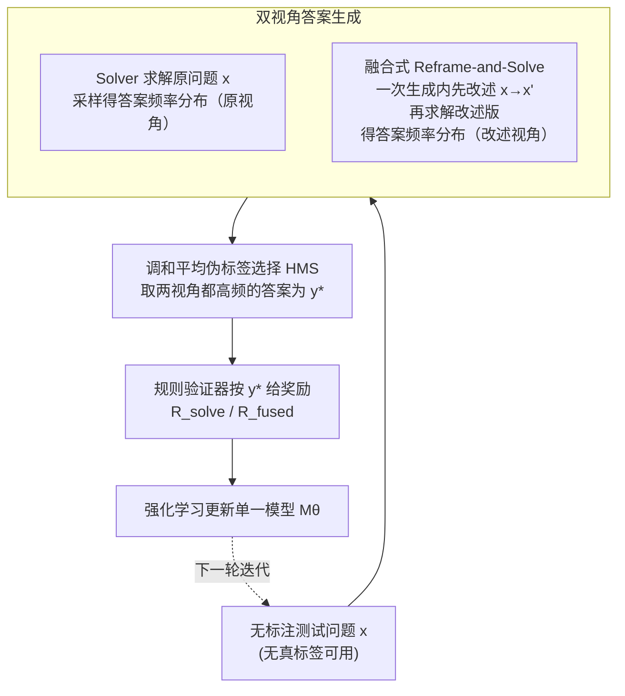

# Self-Harmony: Learning to Harmonize Self-Supervision and Self-Play in Test-Time Reinforcement Learning

**会议**: ICLR 2026  
**arXiv**: [2511.01191](https://arxiv.org/abs/2511.01191)  
**代码**: [Self-Harmony](https://github.com/) (论文中标注公开可用)  
**领域**: LLM 推理 / 测试时强化学习  
**关键词**: Test-Time RL, Self-Play, Pseudo-Label, Harmonic Mean, LLM Reasoning

## 一句话总结

提出 Self-Harmony 框架，通过让单一模型扮演两个角色（Solver 求解原始问题 + Reframer 改述问题），将答案在原始和改述视角下的调和平均得分作为伪标签选择标准，替代传统多数投票，在 30 个实验设置中 28 个达到 SOTA，且训练零失败。

## 研究背景与动机

**测试时强化学习（TTRL）是 LLM 推理的新范式**：TTRL 允许模型在推理阶段利用未标注的测试数据通过自生成反馈信号来自我改进，无需人工标注数据或外部模型辅助。

**多数投票存在致命缺陷**：当模型存在系统性推理缺陷时，错误答案可能比正确答案出现频率更高。此时多数投票不仅无法纠错，还会通过选择错误答案作为训练目标来放大错误——形成"回音室"效应。Liu et al. (2025b) 从理论上证明：当 $p(\text{Correct}|x) < p(\text{Wrong}|x)$ 时，随着采样数增加，多数投票恢复正确答案的概率趋近于零。

**核心直觉：正确答案应在语义等价的不同表述下保持稳定**：人类在面对不确定性时，常通过换角度思考来验证答案的鲁棒性。脆弱的推理路径容易被措辞变化打断，而正确推理则不受表面形式影响。

**现有替代方案的不足**：外部验证器或奖励模型（Lightman et al., 2024; Khalifa et al., 2025）虽然有效，但违背了"完全自包含"的测试时设置原则。

## 方法详解

### 整体框架

Self-Harmony 让单一模型 $M_\theta$ 在两个角色间切换：扮演 Solver $\pi_\theta$ 时对问题生成答案，扮演 Reframer $\rho_\theta$ 时把问题改述成语义等价但措辞不同的新问题。系统先求解原始问题、再改述、再求解改述版本，从而为同一个问题拿到两套相互独立的答案分布，最后用调和平均挑出跨视角都稳定的答案当伪标签，喂给强化学习更新模型。整条流程没有任何外部验证器或教师模型，全靠单模型自我对弈闭环。

### 关键设计

**1. 双视角答案生成：用"换个说法再问一遍"暴露脆弱的错误答案**

测试时 RL 没有真标签，只能从模型自己的采样里挑伪标签，而多数投票的盲区在于错误答案也可能高频出现。Self-Harmony 的破局点是引入视角不变性假设：一个真正正确的答案，无论问题怎么改述都应该稳定地被采到，而错误答案往往依赖于特定措辞，换个表述就塌了。具体做法是对原始问题 $x$ 采样得到答案集 $\{y_i\}$，对改述问题 $x'$ 采样得到 $\{y'_i\}$，分别统计每个候选答案的经验频率 $\hat{p}_0(a)$ 和 $\hat{p}_1(a)$。论文用实验验证了这个假设确实成立——正确答案在原始与改述问题间的一致性显著高于错误答案，这正是后续筛选伪标签的物理基础。

**2. 调和平均伪标签选择（HMS）：让答案必须两个视角都赞成才入选**

拿到两套频率后，关键是怎么融合。Self-Harmony 不取算术平均也不分别投票，而是选调和平均得分最高的答案作为伪标签：$y^\star = \arg\max_a \frac{2\hat{p}_0(a)\hat{p}_1(a)}{\hat{p}_0(a) + \hat{p}_1(a)}$。调和平均之所以关键，在于它对低值高度敏感——只要某个答案在任一视角下频率低，分数就会被压垮，因此只有在原始和改述两个分布里都频繁出现的答案才能胜出，那些只在单一视角下由脆弱推理碰巧高频的伪答案会被自然过滤掉。这一选择并非启发式：论文从信息论给出推导，调和平均恰好是 View-Invariant Infomax 目标 $J_\lambda(a) = I(Z_a; A) - \lambda I(Z_a; X)$ 在 $\lambda = 2$ 时的二阶近似最优解（Theorem 3.2，在视角不变、非退化、平衡置信和均匀视角先验等条件下成立），从而在理论上保证它比多数投票更鲁棒。

**3. 融合式 Reframe-and-Solve：把三次调用压成两次**

朴素实现需要 solve → reframe → solve 三步、三次模型调用，推理开销偏高。Self-Harmony 通过 system prompt 指示模型在一次生成里先改述问题再立即求解，把改述和求解合并成单次动作，于是整条流程只剩两次模型调用，在不损失双视角信号的前提下省下三分之一的推理成本。

### 损失函数 / 训练策略

求解动作的奖励直接用伪标签做监督：$R_{\text{solve}}(y) = \mathbb{I}[y = y^\star]$。融合改述-求解动作的奖励则采用门控设计——答案正确是拿奖励的前提，在此之上再叠加格式与多样性两道惩罚：

$$R_{\text{fused}}(y') = (1 - w_f R_{\text{format}}^{\text{penalty}}(y'))(1 - w_d R_{\text{div}}^{\text{penalty}}(y', y))\mathbb{I}[y' = y^\star]$$

其中多样性惩罚用原始与改述问题答案分布间的 Jensen-Shannon 散度衡量，鼓励改述真正提供不同视角而非换汤不换药地复述原题。门控（而非加法）的设计避免了给"格式漂亮但答案错误"的改述发奖励。

## 实验关键数据

### 主实验

Qwen3-1.7B-Base 在多个基准上的表现：

| 方法 | MATH500 | GSM8K | AIME2024 | AMC | GPQA | MMLU-Pro |
|------|---------|-------|----------|-----|------|----------|
| Before RL | 42.70 | 65.58 | 3.33 | 26.50 | 20.30 | 16.61 |
| GT-Reward（上界） | 71.80 | 85.97 | 20.83 | 53.01 | 53.80 | 85.71 |
| Majority-Voting | 64.64 | 83.80 | 9.37 | 37.65 | 24.68 | 44.82 |
| Co-Reward | 64.67 | 86.59 | 6.67 | 39.75 | 23.66 | 47.14 |
| **Self-Harmony** | **69.60** | **87.47** | **10.00** | **40.51** | **27.92** | **53.66** |

Llama-3.1-8B 的显著提升：GSM8K 从 60.5% 提升到 91.6%

Qwen3-4B 的显著提升：MATH500 从 60.2% 提升到 78.5%

### 消融实验

| 配置 | 效果 |
|------|------|
| 调和平均 vs 多数投票 | 调和平均在几乎所有设置中更优 |
| 双视角多数投票 vs 调和平均 | 调和平均更稳定，双视角多数投票仍有失败模式 |
| 门控奖励 vs 加法奖励 | 门控设计避免了对产出错误答案但格式良好的改述给予奖励 |
| 多样性惩罚的作用 | 鼓励生成真正提供新视角的改述，而非简单复述 |

### 关键发现

1. **30 个实验设置中 28 个排名第一**：覆盖 5 个开源模型 × 6 个推理基准
2. **零训练失败**：所有实验中没有出现训练崩溃，展现了前所未有的稳定性
3. **仅需 16+16 个 rollout**：原始 16 个、改述 16 个就能获得强大的改进效果
4. **与真实标签奖励（GT-Reward）的差距显著缩小**：Self-Harmony 的性能接近使用真实标签的上界
5. **Intuitor 和 Rent 等基线存在训练不稳定问题**：需要报告峰值分数（标 *），而 Self-Harmony 使用最终步分数

## 亮点与洞察

1. **调和平均的理论优美性**：从 View-Invariant Infomax 目标自然推导出调和平均，而非将其作为启发式规则引入，理论基础扎实
2. **单模型双角色的极简设计**：无需辅助模型或外部验证器，仅通过 prompt 切换角色，保持了方法的简洁性和可扩展性
3. **"正确答案应跨视角稳定"的核心直觉既简单又深刻**：这一观察源自人类认知的鲁棒性验证行为，在 LLM 中同样适用
4. **零失败率是重要的工程优势**：TTRL 方法的训练不稳定性是实际部署的一大障碍，Self-Harmony 的稳定性具有很强的实用价值

## 局限与展望

1. **改述质量依赖模型能力**：如果模型本身改述能力弱（如极小模型），Reframer 角色可能产生语义偏移
2. **计算开销翻倍**：每个问题需要生成两组 rollout（原始 + 改述），推理成本约为标准 TTRL 的 2 倍
3. **View-Invariance 假设的局限**：对于某些真正对措辞敏感的任务（如自然语言推理中的逻辑方向性），正确答案可能也受表述影响
4. **仅在推理任务上验证**：对于开放式生成、摘要等任务，调和平均伪标签的适用性未探讨
5. **超参数 $w_f, w_d$ 的敏感性**：融合奖励中的权重如何选择，对不同任务和模型的最优配置可能不同

## 相关工作与启发

- **TTRL (Zuo et al., 2025)**：开创了测试时 RL 范式，Self-Harmony 解决了其多数投票的核心弱点
- **Co-Reward**：使用两个模型互相验证，Self-Harmony 用单模型的两个角色替代，更简洁
- **Invariant Risk Minimization (Arjovsky et al., 2019)**：Self-Harmony 将 IRM 的跨环境不变性思想引入 TTRL 伪标签选择
- **FixMatch (Sohn et al., 2020)**：半监督学习中通过强/弱增强一致性选择伪标签的先驱工作，是 Self-Harmony 在 LLM 推理领域的精神前身
- 启发：调和平均作为跨视角一致性的度量，可能适用于其他需要多视角对齐的场景（如多模态融合、集成学习等）

## 评分

- **新颖性**: ⭐⭐⭐⭐⭐ — 调和平均伪标签 + 单模型自我对弈的组合极具创意，理论推导优美
- **实验充分度**: ⭐⭐⭐⭐⭐ — 5 个模型 × 6 个数据集 × 多种基线，30 个设置全面覆盖，零训练失败令人印象深刻
- **写作质量**: ⭐⭐⭐⭐ — 动机清晰，理论证明完整，框架图直观；但方法部分符号较密集
- **价值**: ⭐⭐⭐⭐⭐ — 解决了 TTRL 中的核心问题（多数投票陷阱），稳定性和通用性使其有望成为 TTRL 的默认方法

<!-- RELATED:START -->

## 相关论文

- [\[ICLR 2026\] SPELL: Self-Play Reinforcement Learning for Evolving Long-Context Language Models](spell_self-play_reinforcement_learning_for_evolving_long-context_language_models.md)
- [\[ICLR 2026\] Self-Improving Skill Learning for Robust Skill-based Meta-Reinforcement Learning](self-improving_skill_learning_for_robust_skill-based_meta-reinforcement_learning.md)
- [\[ICLR 2026\] SPIRAL: Self-Play on Zero-Sum Games Incentivizes Reasoning via Multi-Agent Multi-Turn Reinforcement Learning](spiral_self-play_on_zero-sum_games_incentivizes_reasoning_via_multi-agent_multi-.md)
- [\[ICML 2025\] ReVISE: Learning to Refine at Test-Time via Intrinsic Self-Verification](../../ICML2025/reinforcement_learning/revise_learning_to_refine_at_test-time_via_intrinsic_self-verification.md)
- [\[ICLR 2026\] Metis-SPECS: Decoupling Multimodal Learning via Self-distilled Preference-based Cold Start](metis-specs_decoupling_multimodal_learning_via_self-distilled_preference-based_c.md)

<!-- RELATED:END -->
