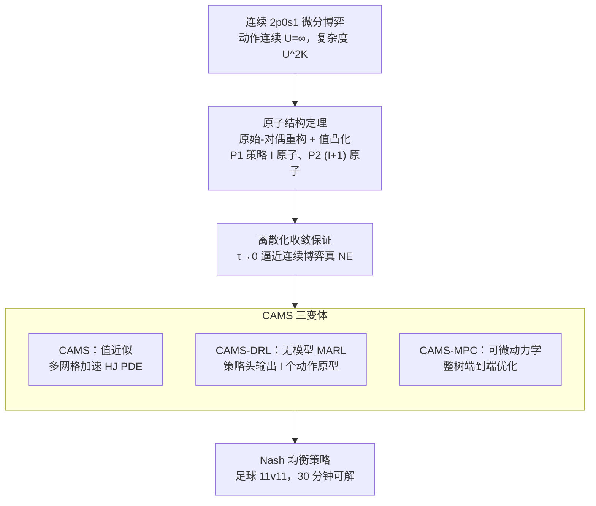

# Solving Football by Exploiting Equilibrium Structure of 2p0s Differential Games with One-Sided Information

**会议**: ICLR 2026  
**arXiv**: [2502.00560](https://arxiv.org/abs/2502.00560)  
**代码**: 待确认  
**领域**: Agent / 博弈论  
**关键词**: differential game, Nash equilibrium, atomic structure, one-sided information, football  

## 一句话总结
证明单边信息二人零和微分博弈中 Nash 均衡策略的原子结构——知情玩家 P1 的均衡策略集中在至多 $I$ 个动作原型上（$I$ = 博弈类型数），使博弈树复杂度从 $U^{2K}$ 降到 $I^K$，在美式足球 11v11 连续动作空间中（传统复杂度 $10^{440}$）实现 M1 MacBook 30 分钟求解。

## 研究背景与动机
**领域现状**：不完全信息博弈的求解（如扑克用 CFR）已取得重大进展，但连续动作空间的实时微分博弈（如体育运动）因状态-动作空间爆炸仍然难以求解。

**现有痛点**：传统求解方法（IIEFG + CFR）需要枚举所有动作组合，在连续空间中复杂度不可接受。11v11 美式足球的博弈树复杂度达 $10^{440}$。

**核心矛盾**：连续动作空间使得穷举不可行，但直接用 MARL（如 PPO/MMD）又难以收敛到 Nash 均衡。

**本文要解决**：利用一类微分博弈的均衡结构性质大幅降低求解复杂度。

**切入角度**：证明在 2p0s1（二人零和单边信息）微分博弈中，Nash 均衡策略具有原子结构——策略集中在有限个动作原型上。

**核心idea**：原子结构 + 原始-对偶博弈重构 → 将连续博弈离散化为有限个原型的组合问题。

## 方法详解

### 整体框架
全文围绕一个反直觉的事实展开：连续动作空间里，知情玩家 P1 的 Nash 均衡策略并不是铺满整个动作集的连续分布，而是精确坍缩到至多 $I$ 个离散动作原型上（$I$ 为博弈类型数）。论文先把连续微分博弈 $G$ 改写成可做动态规划的离散时间原始博弈 $G_\tau$（P1 先动、P2 最优响应）与对偶博弈 $G_\tau^*$（角色对调、类型改由 P1 自己选），在这两个博弈上证明这种原子结构；再证明离散时间解在步长 $\tau \to 0^+$ 时收敛到连续博弈的真 Nash 均衡；最后用一套 CAMS 求解器在 $I$ 个原型而非原始连续动作空间上做计算，从而绕开连续动作带来的维度爆炸——博弈树复杂度由 $U^{2K}$ 降到 P1 的 $I^K$。

### 关键设计

**1. 原子结构定理：把连续策略坍缩成有限个动作原型**

针对框架里的核心难题——连续动作空间无法枚举均衡（11v11 美式足球的博弈树复杂度高达 $10^{440}$）。本文先把原博弈 $G$ 改写成可做动态规划的离散时间原始博弈 $G_\tau$（P1 先动、P2 最优响应）与对偶博弈 $G_\tau^*$（角色对调、类型改由 P1 自己选），再在这两个博弈上证明核心结果（Theorem 4.1）：满足 Isaacs 条件的确定性 2p0s1 微分博弈中，P1 的均衡行为策略是 $I$-atomic 的——只在至多 $I$ 个动作上取正概率，P2 则是 $(I+1)$-atomic 的；这里 $I$ 是博弈类型数（如进攻方在「跑卫强冲」和「四分卫传球」间二选一时 $I=2$），与动作连续与否、动作多寡都无关。背后机制是值函数凸化（value convexification）：知情方 P1 通过在少数原型间混合来操纵对手对自己类型的信念 $p$，而非凸的非揭示值 $\tilde{V}_\tau$ 经凸化后在单纯形 $\Delta(I)$ 上至多需要 $I$ 个顶点，于是最优混合天然落在有限个原型上。这一性质把博弈树复杂度从 $U^{2K}$ 压到 P1 的 $I^K$、P2 的 $(I+1)^K$，是后续算法能跑起来的根基。

**2. 离散化收敛保证：让有限时间步的解逼近连续博弈的真 NE**

$G_\tau$ 在离散时间步 $\tau$ 上求解，必须保证这个离散解不会偏离原本连续博弈 $G$ 的均衡。Theorem 4.2 证明当 $\tau \to 0^+$ 时，原始-对偶解 $(\{\eta_{i,\tau}^\dagger\}, \zeta_\tau^\dagger)$ 收敛到连续微分博弈 $G$ 的 Nash 均衡，因此可以用足够小的步长把离散化偏差压到可忽略。收敛分析建立在对偶博弈的 Hamiltonian 之上，min-max 结构正对应双方的对抗优化，Isaacs 条件 $\min_u \max_v H = \max_v \min_u H$ 保证 min-max 与 max-min 可交换、均衡良定义。有了 Theorem 4.1（原子）与 4.2（收敛）两块，连续博弈的 NE 就既是原子的、又能通过离散求解逼近——这正是接下来 CAMS 求解器只需在 $I$ 个原型上计算的合法性来源。

**3. CAMS 三变体：把同一原子结构落到三类可计算的求解器上**

有了"只需处理 $I$ 个原型"这个结论，剩下的问题是在不同建模条件下真正算出这 $I$ 个原型和它们的混合权重，论文给出三种互补实现（统称 CAMS，continuous-action mixed-strategy solver）。CAMS 走值近似路线，在 $[0,T]\times\mathcal{X}\times\Delta(I)$ 上逼近值函数，并用多网格（multigrid）加速底层 Hamilton-Jacobi PDE 的求解——粗网格快速消去低频误差、细网格只补高频，计算量随网格分辨率而非动作数增长，因此动作越密也不会变慢；CAMS-DRL 走无模型 MARL 路线，P1 的策略网络吃进信息状态 $(t,x,p)$、直接输出 $I$ 个 logit 向量与 $I$ 个动作原型 $u^k$，把"原子策略"显式参数化进策略头，绕开标准 MARL 在不完全信息下难收敛的问题；CAMS-MPC 则在动力学可微时，沿 $I^K$ 条博弈树路径把整棵树搭成计算图做端到端 minimax 优化。三者分别对应有模型值近似、无模型学习、可微动力学三种场景，共享同一套原子结构。

## 实验关键数据

### Hexner 博弈（理论验证）

| 方法 | 4 阶段耗时 | 计算特性 |
|------|-----------|---------|
| CFR+ | 基线 | 随 $U$ 线性增长 |
| JPSPG | 24h | 随 $U$ 缓慢增长 |
| DeepCFR | 29-34h | 高 GPU 需求 |
| **CAMS** | **17h** | **不随 $U$ 增长** |

### 多网格加速

| 阶段数 | 基础 | 加速后 | 加速比 |
|--------|------|--------|--------|
| 4 | 9.3h | 2.3h | 4.0x |
| 10 | 27.6h | 10.9h | 2.5x |
| 16 | 46.2h | 17.8h | 2.6x |

### 美式足球（11v11 连续动作空间）
- 传统 IIEFG 复杂度：$10^{440}$（不可求解）
- 利用原子结构：**M1 Pro MacBook 上 30 分钟内求解**
- 进攻方隐藏意图时间：模型预测约 0.5 秒，实际教练分析约 1.0 秒

### 关键发现
- CAMS 计算复杂度不随离散化动作数 $U$ 增长——原子结构的核心优势
- CAMS-DRL 在 normal-form 博弈中准确逼近 NE，而 PPO 和 MMD 均失败
- 美式足球案例展示了理论到实践的巨大跨越（从不可解到 30 分钟）

## 亮点与洞察
- **原子结构的理论美感**：Nash 均衡策略在连续空间中"自然地"集中在有限个点上——这不是近似，而是精确的结构性质
- **从 $10^{440}$ 到 30 分钟**：可能是博弈论历史上最大的计算复杂度降低之一
- **三种 CAMS 变体**的设计展示了理论结果如何转化为实用算法
- 足球中"隐藏意图 0.5 秒"的发现与教练经验（1.0 秒）一致——理论预测与实际相符

## 局限与展望
- 仅适用于确定性动力学 + Isaacs 条件的 2p0s1 博弈——随机动力学/观测下凸 Bellman 算子仅为下界
- 复杂度仍随 $K$ 指数增长（$O(K^3 C^{2K} I^2 \varepsilon^{-4})$），多网格缓解但不消除
- 信念控制依赖精确状态可观测和完美回忆假设
- 未扩展到多人博弈或部分可观测场景

## 相关工作与启发
- **vs CFR/DeepCFR**: CFR 系列需要枚举动作空间，CAMS 利用结构避免枚举
- **vs MARL (PPO/MMD)**: 标准 MARL 在不完全信息博弈中难以收敛到 NE，CAMS-DRL 利用原子结构约束策略空间
- **vs R-NaD**: R-NaD 表现不错但仍不如 CAMS-DRL——结构化约束优于纯学习
- 可启发其他连续动作空间博弈的求解

## 补充技术细节

### Isaacs 条件的意义
Isaacs 条件要求 $\min_u \max_v H(x,u,v,\xi) = \max_v \min_u H(x,u,v,\xi)$，即 min-max 和 max-min 可交换。物理含义是双方的最优策略不依赖对方的即时选择，只依赖状态。这在美式足球中成立因为球员的物理运动在短时间尺度上近似独立。不满足此条件时均衡可能不存在或计算更复杂。

### 信念操纵（Belief Manipulation）
进攻方通过混合使用不同战术（原型动作），使防守方无法确定当前战术类型。值函数的凸化确保这种混合策略是最优的——这就是为什么均衡是原子的而非连续分布的。

## 评分
- 新颖性: ⭐⭐⭐⭐⭐ 原子结构定理是深刻的理论贡献
- 实验充分度: ⭐⭐⭐⭐ 理论验证+实际足球场景，覆盖三种变体
- 写作质量: ⭐⭐⭐⭐ 理论推导严谨，从简单博弈到足球的展开合理
- 价值: ⭐⭐⭐⭐⭐ 将不可解的问题变为可解——重大突破

<!-- RELATED:START -->

## 相关论文

- [\[ICLR 2026\] Nearly-Optimal Bandit Learning in Stackelberg Games with Side Information](nearly-optimal_bandit_learning_in_stackelberg_games_with_side_information.md)
- [\[ICML 2025\] Solving Zero-Sum Convex Markov Games](../../ICML2025/reinforcement_learning/solving_zero-sum_convex_markov_games.md)
- [\[ICLR 2026\] Helix: Evolutionary Reinforcement Learning for Open-Ended Scientific Problem Solving](helix_evolutionary_reinforcement_learning_for_open-ended_scientific_problem_solv.md)
- [\[ICLR 2026\] Solving Parameter-Robust Avoid Problems with Unknown Feasibility using Reinforcement Learning](solving_parameter-robust_avoid_problems_with_unknown_feasibility_using_reinforce.md)
- [\[ICLR 2026\] DiVE-k: Differential Visual Reasoning for Fine-grained Image Recognition](dive-k_differential_visual_reasoning_for_fine-grained_image_recognition.md)

<!-- RELATED:END -->
