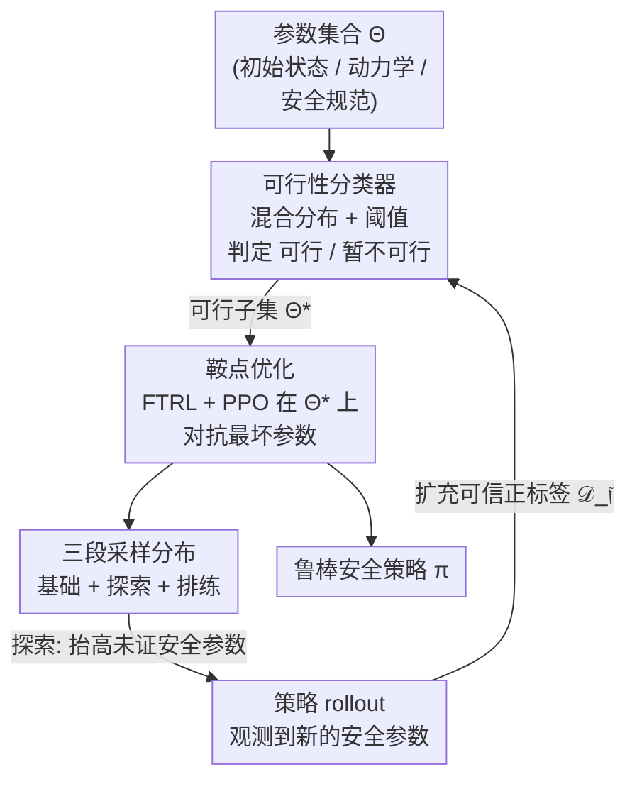

# Solving Parameter-Robust Avoid Problems with Unknown Feasibility using Reinforcement Learning

## 元信息
- **会议**: ICLR 2026
- **arXiv**: [2602.15817](https://arxiv.org/abs/2602.15817)
- **代码**: [https://oswinso.xyz/fge](https://oswinso.xyz/fge)
- **领域**: 强化学习
- **关键词**: safe RL, Hamilton-Jacobi, robust optimization, feasibility, curriculum learning, MuJoCo

## 一句话总结
提出 Feasibility-Guided Exploration (FGE)，同时识别可行参数子集并学习在该子集上安全的策略，解决可行性未知的参数鲁棒避障问题，在 MuJoCo 任务中比最佳现有方法多覆盖 50% 以上。

## 研究背景与动机
- **Hamilton-Jacobi (HJ) 安全控制**是获得最大安全初始状态集合的强大工具，但经典方法受维度灾难限制。
- **深度 RL 逼近 HJ**：用 RL 学习近似最优控制策略，但 RL 优化期望回报 vs. 最坏情况安全形成根本性不匹配——在低概率但仍应安全的状态上表现可能很差。
- **鲁棒优化**方案（如 RARL）对初始条件集合做最坏情况优化，但前提是该集合可行（即存在安全策略）。如果包含不可行参数，所有策略都同样差，导致退化。
- **关键困难**：确定可行参数集合本身就是 HJ 分析的目标——先验未知！
- 例子：自动驾驶中，暴风雪+高速可能无论如何都不安全；用这种不可能的场景训练会阻止模型学好晴天场景。

## 方法详解

### 整体框架
FGE 把"训练哪些场景"和"在这些场景上怎么安全"耦合成一件事来做：它一边维护一个对最大可行参数子集 $\Theta^* \subseteq \Theta$ 的估计（哪些参数下确实存在安全策略），一边在这个不断扩张的子集上做鲁棒策略学习。核心难点在于 $\Theta^*$ 先验未知，于是 FGE 用一个可行性分类器（feasibility classifier）把"已确认能安全"的参数从"暂时学不会"的参数里分出来，再用鞍点优化在可行子集上对抗最坏情况，最后用一套三段采样分布持续把已确认安全的边界往外推；新探到的安全参数又回流去扩充分类器的可信正标签，三件事串成一个边训练边扩张的闭环。

### 关键设计

**1. 可行性分类器：把"没成功"和"做不到"区分开**

鲁棒优化要先圈定一个可行参数集，可这个集合恰恰是 HJ 分析要求解的目标、先验未知。难点在于可行性标签天生不对称：某个参数 $\theta$ 下跑出一条安全轨迹就能确定它可行，但跑出一条不安全轨迹并不能断定它不可行——很可能只是当前策略还不够好。如果直接把"没成功"当成"不可行"，会把一大批本可救回的场景误判出局。FGE 因此不用单一在线样本训练分类器，而是构建一个混合分布 $p_{\text{mix}}(\mathfrak{f}, \theta) = \alpha \cdot p^*(\mathfrak{f}|\theta) p_{\mathcal{D}_\mathfrak{f}}(\theta) + (1-\alpha) \cdot p^\pi(\mathfrak{f}|\theta) \rho(\theta)$：第一项来自已确认安全的可靠正标签集合 $\mathcal{D}_\mathfrak{f}$，第二项是当前策略下、可能含假阴性的在线样本，再拟合 $q_\psi(\mathfrak{f}=1|\theta)$ 并阈值化得到分类结果。这样设计带来两个保证——不可行参数永远不会被错标为可行（零假阳性），而把可救场景误杀的假阴性率可以通过混合权重 $\alpha$ 和采样密度 $\rho$ 来控制。零假阳性尤其关键：它保证训练集里不会混进真正无解的场景去污染策略，让后面的鞍点优化始终在"确有解"的子集上博弈。

**2. 鞍点优化：把鲁棒安全控制变成收敛更稳的在线对抗**

确定了可行子集 $\Theta^*$，接下来要在它上面求一个最坏情况下也尽量安全的策略，这本质是个 maximin 问题。RARL 用一个对抗性策略去逼近最坏情况，其迭代等价于梯度下降-上升（GDA），训练常常不稳定、最后一轮反复震荡不收敛。FGE 改用在线学习的鞍点视角：策略侧解 $\pi_{t+1} = \arg\max_\pi \mathbb{E}_{\theta \sim \mathcal{D}_{\theta,t}}[J(\pi, \theta)]$，参数侧解 $\theta_{t+1} = \arg\min_{\theta} J(\pi_t, \theta)$，且最坏参数只在可行子集 $\theta \in \Theta^*$ 内取——这正是它和 RARL 的根本区别：不假设最坏扰动下仍可行，而是把对手限制在已证可行的范围里。具体实现用带二次正则的 Follow-the-Regularized-Leader (FTRL) 配合 PPO 更新策略，让相邻两轮策略保持接近，并维护一个排练缓冲区（rehearsal buffer）存历史最坏参数。相比 GDA，FTRL 的正则化让两侧博弈在鞍点附近平均迭代收敛，避免对抗参数来回拉扯导致的退化。

**3. 三段采样分布：让安全边界持续外扩而不回退**

光有分类器和鞍点还不够——分类器只能对已观测安全的参数控制假阴性，而 $\mathcal{D}_\mathfrak{f}$ 又只在策略对新参数安全时才扩张，二者会卡成"互相等对方先动"的死循环。要打破它，得主动去"碰"那些还没被证明安全的参数，同时别把已经学会的丢掉。FGE 因此把采样分布拆成三块：基础分布按原始参数分布采样以保持整体覆盖；探索分布用分类器做拒绝采样 $\theta\sim p(\cdot\mid\phi(\theta)=0)$，刻意抬高当前被判为不可行参数的采样概率，逼策略去开疆、从而发现新的安全参数回填 $\mathcal{D}_\mathfrak{f}$；排练分布则对先前已解决、但有退化风险的参数做近似最佳响应的复习采样以守土。三者组合的目标是同时最大化安全率增益、最小化安全率损失，使可行集合稳步扩张而非在新旧之间反复横跳。

### 损失函数 / 训练策略
策略训练沿用标准 PPO 目标，奖励设计成首次违规即终止的负指示器 $r_k = -\mathbb{1}\{h_\theta(\bm{s}_k) > 0\}$：停留在安全状态得 0，一旦进入不安全状态得 $-1$ 并结束 episode。这样累计回报直接对应"是否撞上不安全集合"，把安全率最大化干净地转写成可优化的 RL 目标。

## 实验关键数据

### 主实验：MuJoCo 安全覆盖率

| 环境 | Domain Rand. | RARL | FGE (Ours) | 提升 |
|------|-------------|------|-----------|------|
| Ant (避障) | ~40% | ~45% | **~70%** | +56% |
| Humanoid (避障) | ~35% | ~40% | **~65%** | +63% |
| HalfCheetah | ~50% | ~55% | **~78%** | +42% |

> FGE 在所有挑战性 MuJoCo 任务中比最佳基线多覆盖 50%+ 的安全参数集合。

### 消融实验：各组件贡献

| 消融设置 | 安全覆盖率 | 说明 |
|---------|----------|------|
| FGE (完整) | ~70% | 基准 |
| 无可行性分类器 | ~50% | 不可行参数干扰训练 |
| 无探索分布 | ~55% | 探索不充分 |
| 无排练分布 | ~60% | 已学技能退化 |
| 用密度模型替代分类器 | ~58% | 不如混合分布分类器 |

### 关键发现
1. 标准域随机化和 RARL 在参数可行性未知时严重受限
2. 可行性分类器的零假阳性保证对训练稳定性至关重要
3. FTRL 比 GDA（RARL 近似的方法）在鞍点问题上收敛更稳定
4. 探索和排练分布的平衡对持续扩展安全集合不可或缺

## 亮点与洞察
- **新问题定义**：参数鲁棒避障 + 未知可行性，填补了安全 RL 与 HJ 分析的重要空白
- **正标签学习**：巧妙处理单侧标签问题（只有正可靠），理论保证零假阳性
- **在线学习视角**：用鞍点方法替代不稳定的对抗性 RL，理论保证更强
- **实用三采样策略**：base + explore + rehearse 的组合灵感来自课程学习和在线学习

## 局限性
- 理论收敛保证依赖凸凹性和精确最佳响应等假设，实际中不完全满足
- 可行性分类器在高维参数空间中的准确性需更多验证
- 仅考虑确定性动力学，随机系统扩展未讨论
- MuJoCo 环境相比真实机器人仍有差距

## 相关工作
- **HJ 安全控制**: DeepReach (Bansal et al., 2021), ISAACS (Hsu et al., 2023), So et al. (2024)
- **鲁棒 RL**: RARL (Pinto et al., 2017), WCSAC (Yang et al., 2021)
- **无监督环境设计 (UED)**: PAIRED (Dennis et al., 2020), PLR (Jiang et al., 2021)
- **安全 RL**: Constrained MDP (Altman, 1999), SauteRL (Sootla et al., 2022)

## 评分
- 新颖性: ⭐⭐⭐⭐⭐ — 全新问题定义，可行性未知的鲁棒安全控制
- 理论深度: ⭐⭐⭐⭐ — 分类器保证、鞍点收敛分析
- 实验充分性: ⭐⭐⭐⭐ — 多 MuJoCo 环境、详细消融
- 实用价值: ⭐⭐⭐⭐ — 对机器人安全部署有直接意义

<!-- RELATED:START -->

## 相关论文

- [\[ICLR 2026\] SPELL: Self-Play Reinforcement Learning for Evolving Long-Context Language Models](spell_self-play_reinforcement_learning_for_evolving_long-context_language_models.md)
- [\[ICLR 2026\] Shop-R1: Rewarding LLMs to Simulate Human Behavior in Online Shopping via Reinforcement Learning](shop-r1_rewarding_llms_to_simulate_human_behavior_in_online_shopping_via_reinfor.md)
- [\[ICLR 2026\] SPIRAL: Self-Play on Zero-Sum Games Incentivizes Reasoning via Multi-Agent Multi-Turn Reinforcement Learning](spiral_self-play_on_zero-sum_games_incentivizes_reasoning_via_multi-agent_multi-.md)
- [\[ICLR 2026\] Unsupervised Learning of Efficient Exploration: Pre-training Adaptive Policies via Self-Imposed Goals](unsupervised_learning_of_efficient_exploration_pre-training_adaptive_policies_vi.md)
- [\[ICLR 2026\] Virne: A Comprehensive Benchmark for RL-based Network Resource Allocation in NFV](virne_a_comprehensive_benchmark_for_rl-based_network_resource_allocation_in_nfv.md)

<!-- RELATED:END -->
