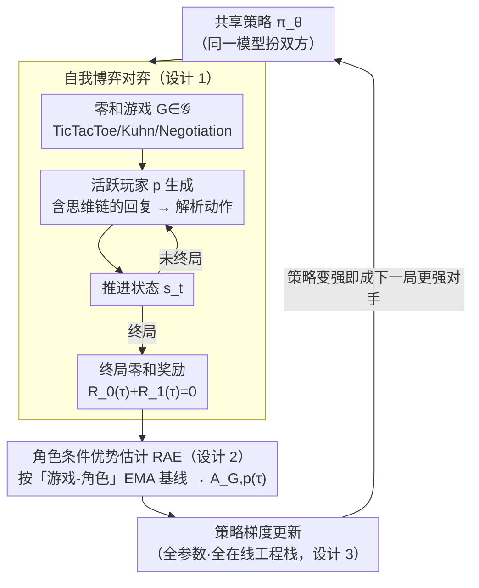

# SPIRAL: Self-Play on Zero-Sum Games Incentivizes Reasoning via Multi-Agent Multi-Turn Reinforcement Learning

## 元信息
- **会议**: ICLR 2026
- **arXiv**: [2506.24119](https://arxiv.org/abs/2506.24119)
- **代码**: [https://github.com/spiral-rl/spiral](https://github.com/spiral-rl/spiral)
- **领域**: 强化学习
- **关键词**: self-play, zero-sum games, multi-agent RL, reasoning, LLM, transfer learning

## 一句话总结
提出 SPIRAL 框架，让 LLM 在多轮零和游戏中进行自我博弈训练，通过角色条件优势估计（RAE）稳定训练，在无领域特定数据的情况下将推理能力提升最高 10%，并发现不同游戏发展出互补的认知能力。

## 研究背景与动机
- **RLVR 的瓶颈**：当前 RL 提升 LLM 推理依赖人工精心设计的奖励函数和领域特定数据集（如数学题），可扩展性受限。
- **自我博弈的潜力**：从 TD-Gammon 到 AlphaGo，自我博弈在传统 AI 中取得巨大成功，但将其应用于 LLM 推理提升几乎未被探索。
- **固定对手的局限**：训练模型对抗固定对手（如 Mistral/Gemini）会导致过拟合静态策略（图 2）。
- **技术挑战**：多轮多 Agent 自回归生成的计算需求巨大，标准 RL 在多 Agent 设置中方差高。

## 方法详解

### 整体框架
SPIRAL 想解决的是：提升 LLM 推理为什么非得喂人工标注的数学题不可？它把训练信号完全交给一组两人零和游戏——让同一个 LLM 跟自己对弈，胜负本身就是奖励，无需任何领域数据。整套循环这样转：同一份策略 $\pi_\theta$ 按系统提示分别扮演玩家 0 和玩家 1，每一回合活跃方先生成一段含思维链的完整回复，从中解析出合法动作推进棋局/牌局，直到终局把胜负折算成一对相反的零和奖励；这批轨迹再经角色条件优势估计（RAE, role-conditioned advantage estimation）算出优势、做策略梯度更新，更新后的策略立刻成为下一局更强的对手。因为对手永远是「刚变强一点的自己」，难度自动贴着模型当前水平爬升，形成一条无限的自适应课程。游戏集合 $\mathcal{G}$ 覆盖 TicTacToe（空间推理）、Kuhn Poker（概率推理）、Simple Negotiation（策略优化）三类技能，整条流水线跑在分布式 Actor-Learner 架构上以撑住多轮多 Agent 的吞吐。

### 关键设计

**1. 多游戏共享策略的自我博弈：用零和对弈造出无限自适应课程**

整体框架里那条「对手永远是变强的自己」的回环，靠的就是这一设计。RLVR 依赖人工设计的奖励和领域数据，而训练对抗一个固定对手又会让模型过拟合一套静态策略。SPIRAL 让同一策略 $\pi_\theta$ 同时充当对弈双方，靠系统提示做角色条件化：每轮活跃玩家 $p$ 采样出完整回复 $y_t^{(p)} \sim \pi_\theta(\cdot \mid s_t, p, G_i)$，解析出动作后更新状态，游戏满足零和约束 $R_0(\tau)+R_1(\tau)=0$，奖励只在终局结算。因为对手就是不断变强的自己，难度始终贴着模型当前水平自动爬升，省去了任何人工标注，也避免了对静态对手的过拟合。三个游戏分别逼出互补的认知技能——空间、概率、策略——多游戏混训进一步产生协同。

**2. 角色条件优势估计 RAE：消除位置优势带来的训练方差**

自我博弈的轨迹要能稳定地反过来更新模型，关键卡点在方差。零和游戏里同一模型在优化两个相反目标，又因游戏不对称（如 TicTacToe 先手有天然优势）让两个角色的期望回报本就不同，若用单一全局基线，优势信号会被位置优势污染、方差极高。RAE 为每个「游戏-角色」对单独维护一个指数滑动平均（EMA）基线 $b_{G,p} \leftarrow \alpha\, b_{G,p} + (1-\alpha)\, R_p(\tau)$，并据此算优势 $A_{G,p}(\tau) = R_p(\tau) - b_{G,p}$，再代入方差缩减后的策略梯度：

$$\nabla_\theta J_{\text{SPIRAL}}(\theta) = \mathbb{E}_{G \sim \mathcal{G}} \,\mathbb{E}_{\tau \sim \pi_\theta \times \pi_\theta \mid G} \left[\sum_{p \in \{0,1\}} \sum_{t \in T_p} A_{G,p}(\tau)\, \nabla_\theta \log \pi_\theta(y_t^{(p)} \mid s_t, p, G)\right]$$

角色特定的归一化把先后手等位置红利从奖励中扣掉，让梯度只反映「这一步相对同角色平均水平下得好不好」。它是训练能否稳住的分水岭：去掉 RAE，模型约 200 步后会逐渐放弃推理、生成空白思维链（thinking collapse），加上后才能持续学到有效策略。

**3. 全参数在线训练的工程栈：撑住多轮多 Agent 的算力开销**

前两个设计要落地，绕不开多轮多 Agent 自回归生成的巨大吞吐压力。实现基于 Oat 框架的分布式 Actor-Learner 架构，用 vLLM 做高效推理、TextArena 模拟游戏环境，并采用全参数（非 LoRA）、全在线（非离线）更新——保证 Actor 采集轨迹用的策略和 Learner 正在优化的参数始终同步，自我博弈的课程才能真正在「最新策略」上持续推进，而不是追着一个滞后的旧版本打。

## 实验关键数据

### 主实验：推理基准表现

| 模型 | Math500 | AIME24 | AIME25 | AMC-23 | GPQA-D | Avg. |
|------|---------|--------|--------|--------|--------|------|
| Qwen3-4B-Base | 73.4 | 9.6 | 6.2 | 42.4 | 30.6 | 34.0 |
| + SFT-Multi | 74.2 | 13.7 | 11.7 | 51.1 | 37.8 | 39.7 |
| + **SPIRAL-Multi** | **78.2** | **19.7** | **13.3** | **61.6** | **40.1** | **44.5** |
| | +4.8 | +10.1 | +7.1 | +19.2 | +9.5 | **+10.5** |

| 模型 | Avg. 基线 | + SPIRAL-Multi | 提升 |
|------|---------|---------------|------|
| Qwen3-4B-Base | 34.0 | **44.5** | +10.5 |
| Qwen3-8B-Base | 39.5 | **49.6** | +10.1 |
| Octothinker-8B-Base | 25.8 | **33.8** | +8.0 |
| Llama-3.1-8B-Instruct | — | — | +2.0 |

> 多游戏 SPIRAL 超越 SFT on 25K 专家轨迹，DeepSeek-R1-Distill 模型仍可受益。

### 消融实验：各游戏贡献（Qwen3-4B-Base）

| 训练设置 | Math500 | AIME24 | Minerva | Avg. |
|---------|---------|--------|---------|------|
| SPIRAL-TicTacToe | 76.0 | 15.0 | 38.2 | ~40 |
| SPIRAL-Kuhn | 76.4 | 18.2 | 42.4 | 43.4 |
| SPIRAL-Negotiation | 75.8 | 14.5 | 39.0 | ~39 |
| **SPIRAL-Multi** | **78.2** | **19.7** | **42.6** | **44.5** |

> 不同游戏发展互补能力：TicTacToe→空间推理，Kuhn→概率推理，Negotiation→策略优化。多游戏组合产生协同效应。

### 关键发现
1. 自我博弈在 4 个不同模型家族（Qwen3、Llama、Octothinker）上均一致提升
2. 多游戏训练 > 单游戏训练 > SFT on 专家轨迹 > 固定对手训练
3. RAE 是训练稳定的关键——无 RAE 导致 thinking collapse
4. 通过 CoT trace 分析发现三种从游戏迁移到数学的推理模式：逐案分析、期望值计算、模式识别
5. 自我博弈的自适应课程是关键——固定对手训练失败

## 亮点与洞察
- **零人工监督**：完全不需要数学题或领域特定数据，游戏自动生成无限训练数据
- **迁移性发现**：游戏中学到的推理模式（案例分析、概率估计）可迁移到学术推理
- **RAE 的必要性**：优雅解决多 Agent 零和训练的方差问题，防止 thinking collapse
- **互补技能**：不同游戏培养不同认知能力，多游戏协同 > 单游戏

## 局限性
- 当前仅测试三个相对简单的游戏，更复杂游戏（如 Diplomacy）的效果未知
- 计算开销较大：多轮多 Agent 自回归生成需要大量 GPU
- 迁移机制的分析仍是事后的、定性的，缺乏严格的理论解释
- 在已高度优化的 instruct 模型上提升有限（Llama-3.1-8B-Instruct 仅 +2.0）

## 相关工作
- **LLM RL 推理**: OpenAI o1, DeepSeek-R1, GRPO (Shao et al., 2024)
- **LLM 自我博弈**: SPAG (Cheng et al., 2024) 单游戏离线；Absolute Zero (Zhao et al., 2025) 单轮编程
- **游戏中的 LLM**: RAGEN (Wang et al., 2025b), ViGaL (Xie et al., 2025b)
- **多 Agent RL**: Cicero (FAIR et al., 2022) 关注单一游戏的超人表现

## 评分
- 新颖性: ⭐⭐⭐⭐⭐ — 多游戏多轮零和自我博弈提升通用推理，全新范式
- 理论深度: ⭐⭐⭐ — RAE 有直觉说明但缺严格理论分析
- 实验充分性: ⭐⭐⭐⭐⭐ — 4 个模型家族 × 8 个推理基准 × 详细消融 × CoT 分析
- 实用价值: ⭐⭐⭐⭐ — 无需领域数据提升推理，但计算成本较高

<!-- RELATED:START -->

## 相关论文

- [\[ICLR 2026\] SPELL: Self-Play Reinforcement Learning for Evolving Long-Context Language Models](spell_self-play_reinforcement_learning_for_evolving_long-context_language_models.md)
- [\[ICLR 2026\] Unsupervised Learning of Efficient Exploration: Pre-training Adaptive Policies via Self-Imposed Goals](unsupervised_learning_of_efficient_exploration_pre-training_adaptive_policies_vi.md)
- [\[ICLR 2026\] RuleReasoner: Reinforced Rule-based Reasoning via Domain-aware Dynamic Sampling](rulereasoner_reinforced_rule-based_reasoning_via_domain-aware_dynamic_sampling.md)
- [\[ICLR 2026\] Unveiling the Cognitive Compass: Theory-of-Mind-Guided Multimodal Emotion Reasoning](unveiling_the_cognitive_compass_theory-of-mind-guided_multimodal_emotion_reasoni.md)
- [\[ICLR 2026\] Solving Parameter-Robust Avoid Problems with Unknown Feasibility using Reinforcement Learning](solving_parameter-robust_avoid_problems_with_unknown_feasibility_using_reinforce.md)

<!-- RELATED:END -->
