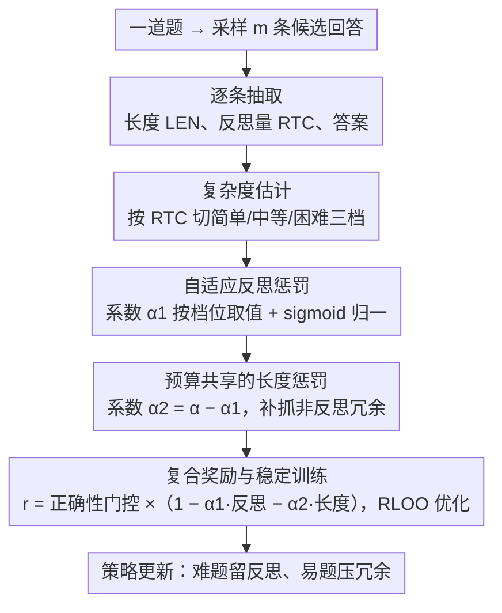

# Stop Unnecessary Reflection: Training LRMs for Efficient Reasoning with Adaptive Reflection and Length Coordinated Penalty

**会议**: ICLR 2026  
**arXiv**: [2602.12113](https://arxiv.org/abs/2602.12113)  
**代码**: [https://github.com/ZeweiYu1/ARLCP](https://github.com/ZeweiYu1/ARLCP)  
**领域**: 强化学习  
**关键词**: 大推理模型, 过度反思, 自适应惩罚, 高效推理, RLVR

## 一句话总结

提出 ARLCP（Adaptive Reflection and Length Coordinated Penalty），一种自适应强化学习方法，根据问题复杂度动态调节反思惩罚和长度惩罚的权重，在保持或提升准确性的同时大幅减少推理 token 消耗。

## 研究背景与动机

- **过度推理问题**：大推理模型（LRM）如 DeepSeek-R1 在思维链中产生大量冗余反思（如反复 "wait"、"hmm"），导致高 token 消耗和计算开销，但并不改善准确性。
- **关键观察**：
  1. **反思与复杂度正相关**：问题越难，反思 token 越多
  2. **过度反思导致错误**：错误回答的平均反思 token 远多于正确回答
  3. **准确性随反思增加而下降**：超过一定阈值后，更多反思反而降低准确率
- **现有方法的问题**：
    - 推理阶段方法（Early Exit）不改变模型能力，效率提升有限
    - 训练阶段方法（统一长度惩罚）常牺牲推理质量
    - 缺乏根据问题复杂度动态调节的机制

## 方法详解

### 整体框架

ARLCP（Adaptive Reflection and Length Coordinated Penalty，自适应反思与长度协调惩罚）把"少反思"做成强化学习里的奖励塑形。它的整条链路是：对每道题先采样多条候选回答，数出每条的反思 token 量并据此估计"这道题对当前模型有多难"；再在 0/1 正确性奖励之上叠加一个**总预算固定**的惩罚项，把这份预算按难度在"反思惩罚"和"长度惩罚"之间动态分配——难题多留反思、易题狠压冗余；最后用 RLOO 优化策略，让模型学会在保住正确率的前提下把推理 token 砍下来。

### 关键设计

**1. 复杂度估计：用模型自己的反思量当难度计**

要按难度区别对待，最直接的办法是再训一个难度评估器，但那既贵又未必和当前模型的能力对齐。ARLCP 干脆直接数一条回答里命中的反思 token 数，记作 RTC（Reflection Token Counts，反思 token 计数，靠 "wait"、"hmm"、"alternatively" 等关键词匹配），并按两个阈值切成三档：$\text{RTC}\le n_1$ 为简单、$n_1<\text{RTC}\le n_2$ 为中等、$\text{RTC}>n_2$ 为困难（实验取 $n_1=40,\,n_2=80$）。论文实测反思量与问题难度正相关，所以模型自己的反思行为就是一把现成的、天然与模型能力对齐的"难度计"，无需任何额外模块。

**2. 自适应反思惩罚：难题宽容、易题严管**

对所有题用同一档惩罚是行不通的——压力太小则易题的冗余压不下去，太大则难题必要的反思也被砍了。ARLCP 让反思惩罚系数 $\alpha_1$ 随复杂度档位取值：$\lambda_1=0.05,\lambda_2=0.1,\lambda_3=0.15$ 分别对应简单/中等/困难。注意越难的题权重越大，这并非鼓励反思，而是难题本就反思多、惩罚曲线要更陡才能把"超出必要范围"的部分压住。惩罚量本身用 sigmoid 把 RTC 相对同题正确回答分布做归一化：$f(\text{RTC})=\sigma\!\big((\text{RTC}-\mu_R)/\sigma_R\big)$，其中 $\mu_R,\sigma_R$ 是同题正确回答反思量的均值与标准差；反思量明显超过均值时惩罚趋近 1，落在均值附近则几乎不罚。

**3. 预算共享的长度惩罚：补抓非反思性的冗余**

只压反思 token 还漏掉了叙述啰嗦、重复展开这类非反思性的浪费，于是再加一项形式相同的长度惩罚 $f(\text{LEN})=\sigma\!\big((\text{LEN}-\mu_L)/\sigma_L\big)$（同样以同题正确回答为基准）。关键在于它的系数取总预算的**剩余**部分 $\alpha_2=\alpha-\alpha_1$（总预算 $\alpha=0.2$）：反思惩罚吃得多、留给长度惩罚的就少，两者此消彼长地共享同一份固定预算，避免两项相加把奖励压垮——这正是方法名里 "Coordinated（协调）" 的含义。

**4. 复合奖励与稳定训练：先答对、再省 token**

压 token 绝不能以答错为代价，而这种带长度惩罚的非标准目标又容易把训练带崩。ARLCP 把三项合成最终奖励 $r=\mathcal{C}\cdot\big(1-\alpha_1 f(\text{RTC})-\alpha_2 f(\text{LEN})\big)$，其中 $\mathcal{C}=\mathbf{1}\{\text{答案正确}\}$ 是 0/1 正确性门控。写成乘性门控意味着答错直接清零、再省 token 也无意义，只有答对的回答之间才比谁更精简，从机制上杜绝了"为压长度而牺牲正确"的退化解。两个工程细节保证它跑得稳又准：优化器选 RLOO（REINFORCE Leave-One-Out）而非更流行的 GRPO，因为 GRPO 在这种含长度惩罚的非标准目标下对扰动敏感、容易突然崩溃；而上面两项归一化的基准统计量 $\mu,\sigma$ 都**只在正确回答上**计算——错误回答常伴随大量冗余反思，若混入会污染均值方差、让惩罚基准失真。

## 实验结果

### 主实验：DeepSeek-R1-Distill-Qwen-1.5B

| 方法 | AMC2023 Acc | AIME2024 Acc | AIME2025 Acc | GSM8K Acc | MATH500 Acc | ΔAcc | ΔLength |
|------|------------|-------------|-------------|-----------|------------|------|---------|
| Vanilla | 66.72 | 30.00 | 21.40 | 78.46 | 80.20 | - | - |
| NoThinking | 49.22 | 14.38 | 9.79 | 69.98 | 69.20 | -12.84 | -81.04% |
| TLMRE | 72.10 | 25.80 | 19.60 | 84.30 | 82.10 | +1.42 | -58.10% |
| AdaptThink | 67.19 | 30.83 | 22.50 | 84.23 | 83.20 | +2.23 | -51.47% |
| LASER | 75.94 | 28.75 | 25.42 | 82.26 | 84.60 | +4.04 | -38.69% |
| **ARLCP** | **73.28** | **34.17** | **26.46** | **87.34** | **84.60** | **+5.81** | **-53.05%** |

### DeepSeek-R1-Distill-Qwen-7B

| 方法 | ΔAcc | ΔLength |
|------|------|---------|
| Vanilla | - | - |
| AdaptThink | +1.87 | -34.68% |
| **ARLCP** | **+2.70** | **-35.00%** |

### 消融实验

| 设置 | ΔAcc | ΔLength |
|------|------|---------|
| ARLCP (完整) | +5.81 | -53.05% |
| 仅反思惩罚 (无长度惩罚) | +4.2 | -45.3% |
| 仅长度惩罚 (无反思惩罚) | +2.1 | -48.7% |
| 固定惩罚 (非自适应) | +3.5 | -50.1% |

### 关键发现

- 1.5B 模型：长度减少 **53.1%**，准确率提升 **5.8%**
- 7B 模型：长度减少 **35.0%**，准确率提升 **2.7%**
- 自适应机制比固定惩罚效果显著更好
- 两个惩罚组件互补，缺一不可

## 亮点与洞察

1. **深入的实证分析**：系统性地揭示了过度反思现象及其与复杂度的关系
2. **反思 token 作为复杂度指标**：利用模型自身的反思行为估计问题难度，免除外部复杂度评估
3. **动态惩罚分配**：总预算 $\alpha$ 在反思和长度惩罚间根据复杂度自动分配
4. **效率-准确性双赢**：在大幅减少 token 的同时还能提升准确性

## 局限性

- 复杂度分类的阈值 $(n_1, n_2)$ 需要手动设定
- 反思 token 通过关键词匹配检测（"wait", "hmm", "alternatively"），可能不够精确
- 仅在数学推理任务上验证，代码推理等场景的效果未知
- 依赖于 DeepSeek-R1 蒸馏模型，对非蒸馏模型的效果待探索

## 相关工作

- **高效推理**：Early Exit（提前停止）、Model Switch（模型切换）、NoThinking（跳过思考）
- **训练阶段方法**：TLMRE（长度惩罚 RL）、LASER（基于准确性的长度约束）
- **SFT 方法**：SFT-Shortest（选择最短正确回答微调）

## 评分

- **创新性**: ⭐⭐⭐⭐ — 自适应反思惩罚是新颖的切入点
- **技术深度**: ⭐⭐⭐ — 方法相对直观，但设计合理
- **实验充分性**: ⭐⭐⭐⭐ — 多基准多模型，对比全面
- **实用价值**: ⭐⭐⭐⭐⭐ — 直接解决 LRM 部署中的效率痛点

<!-- RELATED:START -->

## 相关论文

- [\[ICLR 2026\] REA-RL: Reflection-Aware Online Reinforcement Learning for Efficient Reasoning](rea-rl_reflection-aware_online_reinforcement_learning_for_efficient_reasoning.md)
- [\[ICLR 2026\] Unsupervised Learning of Efficient Exploration: Pre-training Adaptive Policies via Self-Imposed Goals](unsupervised_learning_of_efficient_exploration_pre-training_adaptive_policies_vi.md)
- [\[ICML 2026\] CAMEL: Confidence-Gated Reflection for Reward Modeling](../../ICML2026/reinforcement_learning/camel_confidence-gated_reflection_for_reward_modeling.md)
- [\[ICLR 2026\] RM-R1: Reward Modeling as Reasoning](rm-r1_reward_modeling_as_reasoning.md)
- [\[ICLR 2026\] FAPO: Flawed-Aware Policy Optimization for Efficient and Reliable Reasoning](fapo_flawed-aware_policy_optimization_for_efficient_and_reliable_reasoning.md)

<!-- RELATED:END -->
