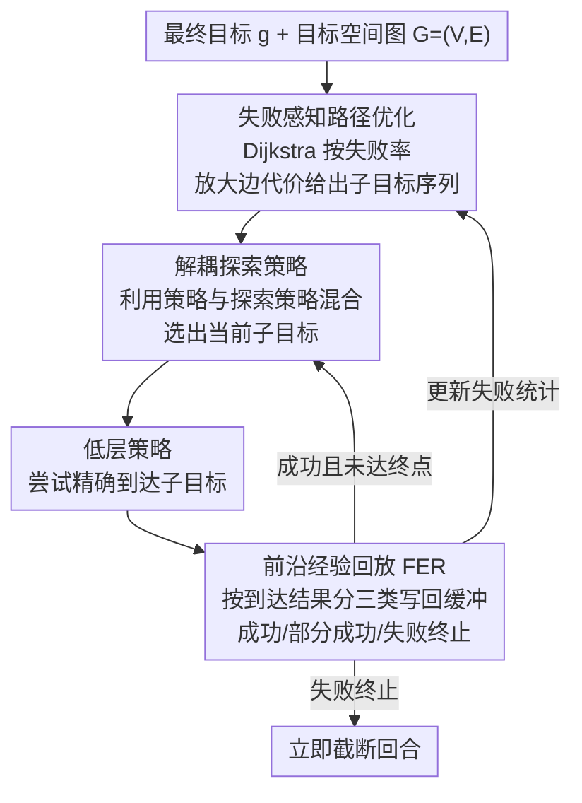

# Strict Subgoal Execution: Reliable Long-Horizon Planning in Hierarchical Reinforcement Learning

**会议**: ICLR 2026  
**arXiv**: [2506.21039](https://arxiv.org/abs/2506.21039)  
**代码**: [https://github.com/Jaebak1996/SSE](https://github.com/Jaebak1996/SSE)  
**领域**: 分层强化学习 / 目标条件 RL  
**关键词**: 分层RL, 子目标执行, 图规划, 前沿经验回放, 长时程任务

## 一句话总结

提出 SSE（Strict Subgoal Execution）框架，通过**前沿经验回放（FER）** 严格区分子目标到达成功与失败，配合解耦探索策略和失败感知路径优化，在每个高层步骤内强制完成子目标到达，显著减少高层决策步数并提升长时程任务成功率。

## 研究背景与动机

- **长时程目标条件任务的挑战**：目标遥远、奖励稀疏，探索困难
- **HER 在高层的问题**：传统图-层次 RL 对高层策略使用 HER（Hindsight Experience Replay），将失败轨迹中的中间状态当作虚拟子目标。这导致：
    - 高层策略反复选择不可达子目标
    - 高层轨迹过长，信用分配困难
    - 同一子目标产生高度不一致的转移
- **核心思路**：不是让高层策略反复尝试不可达子目标，而是严格执行——成功就继续，失败就立即终止。

## 方法详解

### 整体框架

SSE 在标准的图-层次 RL 架构上做了一个看似激进的改动：高层每选一个子目标，低层就必须把它精确到达，否则当场截断回合，绝不让高层在不可达子目标上反复消耗步数。整体是一个闭环：图规划（失败感知路径优化）在目标空间图上给出子目标序列，解耦探索策略据此挑出当前子目标，低层策略尝试精确到达，前沿经验回放（FER）按到达结果把这次尝试分成三类写回高层经验，并把失败统计反馈给图规划——成功就继续下一个子目标，失败就立即截断回合。整套机制提供网格离散化（SSE Grid，适合 2D/3D 目标空间）和神经网络（SSE Model，可扩展到高维目标空间）两种实现变体，差别只在如何表示与采样子目标节点。

### 关键设计

**1. 前沿经验回放（FER）：用三类经验标定可达边界，取代会污染高层的 HER**

传统图-层次 RL 对高层用 HER，把失败轨迹里偶然路过的中间状态当成「事后子目标」塞回缓冲区，结果高层学到的是「这个不可达点其实可达」的错误信号，于是反复挑选够不到的子目标、轨迹越拉越长。FER 的做法是按子目标真正的执行结果把高层转移分成三类写入缓冲 $\mathcal{B}_F^h$：

$$\mathcal{B}_F^h = \begin{cases} (s_t, g, \tilde{g}_t, \sum_{j=t}^{t'-1} r_j, s_{t'}) & \text{成功} \\ (s_t, g, \tilde{g}_t, 0, s_T) & \text{失败终止} \\ (s_t, g, \text{wp}_{\text{final}}, \sum_{j=t}^{t_{\text{wp}}-1} r_j, s_{t_{\text{wp}}}) & \text{部分成功} \end{cases}$$

低层精确到达子目标时记为成功，写入真实回报；一旦判定不可达（误差 $\|\phi(s_{t'}) - \tilde{g}_t\| \geq \lambda$）就记为失败终止，回报置 0、下一状态写成终止态 $s_T$ 并立即截断当前回合，让高层 Q 值清楚地把「不可达」标成低价值；介于两者之间则记为部分成功，把这段轨迹里最后一个真正到达的路标点 $\text{wp}_{\text{final}}$ 作为有效子目标记录回报。这样高层经验里再没有「失败被当成成功」的污染，Q 值刻画的就是子目标的可达前沿，消融里一旦把 FER 换回 HER 或干脆去掉，任务直接彻底失败，说明它是整套方法的地基。

**2. 解耦探索策略：把利用和探索拆成两条策略，避免严格约束下探索枯竭**

严格执行虽然干净，但如果高层一味贪心选当前最优子目标，就很难再去碰那些尚未验证的远处区域，覆盖会迅速塌缩。SSE 因此把高层拆成利用策略 $\pi^h$ 和探索策略 $\pi^{\text{exp}}$ 两条并按比例 $\eta : (1-\eta)$ 混合。利用侧是常规的 $\epsilon$-greedy，多数时候挑 Q 值最高的子目标、小概率 $\epsilon$ 在目标集 $\mathcal{G}$ 上均匀乱选：

$$\pi^h(\tilde{g}_t | s_t, g) = \begin{cases} \arg\max_{\tilde{g}} Q^h(s_t, \tilde{g}, g) & 1-\epsilon \\ \text{Uniform}(\mathcal{G}) & \epsilon \end{cases}$$

探索侧则把概率三等分，分别投向最终目标 $g$、当前已知最远可达点 $\tilde{g}_{\max,t}$、以及从新颖节点集合 $V_{\text{novel}}$ 里均匀采的未访问点 $\tilde{g}_{\text{novel}}$：

$$\pi^{\text{exp}}(\tilde{g}_t | s_t, g) = \begin{cases} g & 1/3 \\ \tilde{g}_{\max,t} & 1/3 \\ \tilde{g}_{\text{novel}} \sim \text{Uniform}(V_{\text{novel}}) & 1/3 \end{cases}$$

三个方向分别对应「直奔目标」「沿已知前沿往外推」「主动探未知」，让前沿在严格执行的同时持续向外扩张；消融中去掉探索策略后性能显著退化，印证了这条解耦的必要性。

**3. 失败感知路径优化：让 Dijkstra 在图上主动绕开高失败区**

子目标序列由图 $G=(V,E)$ 上的最短路给出，但若某些节点总是到不了，反复规划经过它们只会浪费回合。SSE 据此给边代价乘上一个与目标节点失败率挂钩的惩罚因子：

$$\tilde{d}(v_1 \to v_2) = d(v_1 \to v_2) \times \max(1, c_{\text{dist}} \cdot \text{ratio}_{\text{fail}}(v_2))$$

其中 $\text{ratio}_{\text{fail}}(v_2)$ 是目标节点 $v_2$ 的历史失败比例，$c_{\text{dist}}$ 控制惩罚强度，外层 $\max(1,\cdot)$ 保证低失败节点的代价不被缩小、只放大常失败节点。Dijkstra 在这张被改写过的图上自然会绕开失败频繁的区域，把规划资源留给真正走得通的路径；它对最终成败影响相对温和（去掉后只是适度退化），更多是加速收敛的一层优化。

## 实验结果

### 主实验：9 个长时程任务（5 seeds）

| 环境 | HIRO | HRAC | HIGL | DHRL | BEAG | NGTE | SSE |
|------|------|------|------|------|------|------|-----|
| U-maze | ✗ | ✗ | △ | △ | ✓ | ✓ | **✓✓** |
| π-maze | ✗ | ✗ | △ | △ | ✓ | ✓ | **✓✓** |
| AntMazeComplex | ✗ | ✗ | ✗ | △ | ✓ | △ | **✓✓** |
| AntMazeBottleneck | ✗ | ✗ | ✗ | ✗ | △ | ✗ | **✓✓** |
| AntKeyChest | ✗ | ✗ | ✗ | ✗ | ✗ | ✗ | **✓✓** |
| AntDoubleKeyChest | ✗ | ✗ | ✗ | ✗ | ✗ | ✗ | **✓✓** |

（✓✓=高成功率快收敛, ✓=成功, △=部分成功, ✗=失败）

### 消融实验（AntDoubleKeyChest）

| 变体 | 表现 |
|------|------|
| SSE 完整 | ✓（约 3M 步解决） |
| SSE + FPS（替换网格为 FPS） | 成功但收敛慢 |
| SSE + HER（替换 FER 为 HER） | **完全失败** |
| SSE 无 $\mathcal{B}_F^h$（无 FER） | **完全失败** |
| SSE 无 $\pi^{\text{exp}}$（无探索策略） | 显著退化 |
| SSE 无路径优化 | 适度退化 |

### 关键发现

- FER 是核心——移除 FER 或使用 HER 均导致彻底失败
- SSE 使智能体仅需 **单个高层步骤** 即可到达地图上任意可达位置
- AntDoubleKeyChest 仅需 **3 个高层步骤** 完成整个任务（拿两把钥匙+到达终点）

## 亮点与洞察

1. **每步必达的思想**：强制子目标必须被到达才继续，根本性地减少了高层决策步数
2. **FER 的精巧设计**：将经验细致分为成功/失败/部分成功三类，定位可达边界
3. **无需课程学习**：SSE 自动发现子目标的正确执行序列
4. **计算效率优势**：失败时立即终止回合，避免长无效轨迹，实际迭代更快

## 局限性

- 引入新超参数（$\eta$, $c_{\text{dist}}$, $d_\mathcal{G}$），但消融研究表明有效范围稳定
- 假设目标空间 $\mathcal{G}$ 已知——这在许多环境中是标准假设
- 网格方法仅适用于低维目标空间
- 主要在固定目标设置下评估

## 相关工作

- **目标条件 RL**：HER、UVFA、优先目标采样
- **图规划 HRL**：HIGL、DHRL、BEAG、NGTE
- **前沿探索**：与传统前沿探索（边界状态）不同，SSE 的"前沿"指成功/失败边界

## 评分

- **创新性**: ⭐⭐⭐⭐ — 严格子目标执行思想简单却高效
- **技术深度**: ⭐⭐⭐⭐ — FER 设计精巧，三种经验类型的划分有充分动机
- **实验充分性**: ⭐⭐⭐⭐⭐ — 9 个环境，全面对比 7 个基线，消融详尽
- **实用价值**: ⭐⭐⭐⭐ — 在复杂长时程任务上显著优于现有方法

<!-- RELATED:START -->

## 相关论文

- [\[ICML 2026\] Long-Horizon Model-Based Offline Reinforcement Learning Without Explicit Conservatism](../../ICML2026/reinforcement_learning/long-horizon_model-based_offline_reinforcement_learning_without_explicit_conserv.md)
- [\[NeurIPS 2025\] Reinforcement Learning for Long-Horizon Multi-Turn Search Agents](../../NeurIPS2025/reinforcement_learning/reinforcement_learning_for_long-horizon_multi-turn_search_agents.md)
- [\[ICLR 2026\] LongRLVR: Long-Context Reinforcement Learning Requires Verifiable Context Rewards](longrlvr_long-context_reinforcement_learning_requires_verifiable_context_rewards.md)
- [\[ICLR 2026\] Model Predictive Adversarial Imitation Learning for Planning from Observation](model_predictive_adversarial_imitation_learning_for_planning_from_observation.md)
- [\[ICLR 2026\] SPELL: Self-Play Reinforcement Learning for Evolving Long-Context Language Models](spell_self-play_reinforcement_learning_for_evolving_long-context_language_models.md)

<!-- RELATED:END -->
