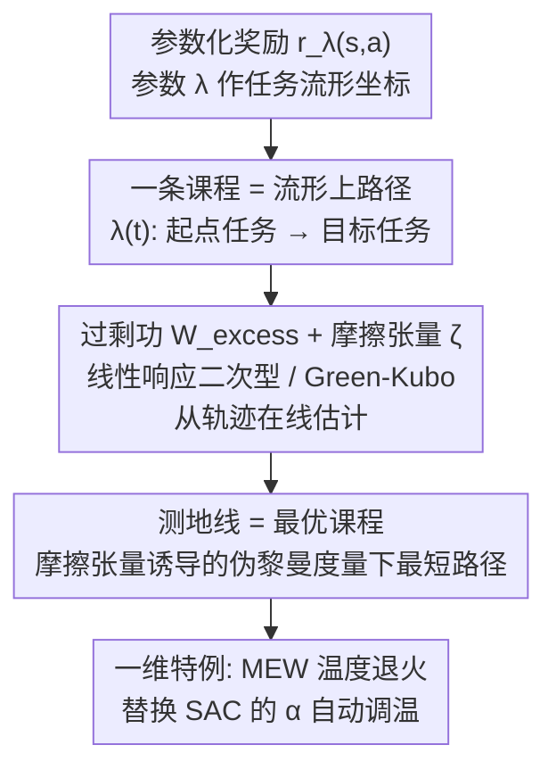

# Thermodynamics of Reinforcement Learning Curricula

**会议**: ICLR 2026  
**arXiv**: [2603.12324](https://arxiv.org/abs/2603.12324)  
**代码**: 无  
**领域**: 强化学习  
**关键词**: 课程学习, 非平衡热力学, 最大熵RL, 温度退火, 黎曼几何, 测地线

## 一句话总结
本文利用非平衡热力学中的过剩功（excess work）最小化框架，将RL中的课程学习形式化为任务空间上的测地线优化问题，并推导出基于摩擦张量的温度退火算法MEW，在MuJoCo Humanoid任务上超越标准SAC温度调节方法。

## 研究背景与动机

**领域现状**：现代RL系统很少在单一、静态任务上训练，而是通过课程学习、温度退火、奖励塑形等方式让agent接触一系列相关任务。然而，如何合理地变化任务参数仍缺乏理论指导。

**现有痛点**：实践中常用的线性插值（linearly interpolating）任务参数隐式假设任务空间是平坦且各向同性的。但实际上，不同方向的参数变化对agent的学习难度差异很大——某些方向适应代价高，某些方向低。

**核心矛盾**：缺乏一个原则性的框架来量化任务参数变化的"适应代价"，导致课程设计依赖启发式方法（如固定衰减、手动调参），可能在高摩擦区域过快变化参数，造成策略不稳定。

**本文目标**：(1) 如何定义和计算任务空间上的"学习难度"度量？(2) 什么是最优的课程路径？(3) 能否推导出实用的温度退火算法？

**切入角度**：从统计力学出发，将RL中策略对任务参数变化的响应类比为非平衡物理系统的驱动过程，利用线性响应理论将过剩功近似为二次型，从而在任务参数空间上建立伪黎曼度量。

**核心 idea**：最优课程对应任务空间中摩擦张量诱导几何下的测地线——在学习困难的方向减速、在容易的方向加速。

## 方法详解

### 整体框架
这篇论文想回答一个被课程学习长期回避的问题：当我们一边训练 agent、一边连续改变任务参数（奖励权重、温度、难度）时，怎样的改变路径代价最小？作者把参数化奖励函数 $r_\lambda(s,a)$ 的参数 $\lambda \in \mathbb{R}^L$ 当成一张「任务流形」上的坐标，于是一条课程就是这张流形上连接起点任务和目标任务的路径 $\lambda(t)$。关键转换是：把 agent 跟不上参数变化所付出的累积代价定义成物理里的「过剩功」（excess work），再去最小化它——这样课程设计就从拍脑袋的调度问题变成了一个干净的几何优化问题，最优课程自然落成流形上的测地线。整条思路是一级一级往下推：从任务参数化出发，先把适应代价写成可计算的摩擦张量，再证明最优课程就是该几何下的测地线，最后落到一维温度退火得到能直接用的 MEW 算法。

### 关键设计

**1. 过剩功与摩擦张量：把「适应代价」写成可计算的二次型**

痛点是缺一个量化「以有限速度改任务参数会多付多少代价」的工具。作者借用非平衡热力学的线性响应理论：在准静态（变化足够慢）极限下，策略落后于参数变化所产生的过剩功可以近似成一个沿路径的二次型积分

$$\mathcal{W}_{\text{excess}} = \int_0^\infty \dot{\lambda}_i(t)\, \zeta_{ij}(\lambda(t))\, \dot{\lambda}_j(t)\, dt$$

其中核心的 $\zeta_{ij}$ 就是「摩擦张量」，由 Green-Kubo 关系给出：

$$\zeta_{ij}(\lambda) = \beta \sum_{t=0}^{\infty} \mathbb{E}_{\tau \sim p_\lambda}\big(\delta X_i(\mathbf{s}_t, \mathbf{a}_t) \cdot \delta X_j(\mathbf{s}_0, \mathbf{a}_0)\big)$$

直觉上，摩擦张量在某个方向取大值，意味着沿该方向扰动任务时，奖励梯度的涨落会在长时间尺度上持续不散——agent 需要很久才能重新稳定，于是这个方向「贵」。这一步把抽象的「哪些方向难学」落成了一个能从轨迹采样直接估计的物理量。

**2. 测地线最优课程：最优路径就是这张几何下的最短测地线**

有了过剩功的二次型，参数空间就被赋予了一个伪黎曼度量（度规正是摩擦张量 $\zeta_{ij}$）。最小化过剩功等价于在这个度量下求测地线，满足

$$\ddot{\lambda}^k + \Gamma^k_{ij}(\lambda)\, \dot{\lambda}^i \dot{\lambda}^j = 0$$

由此得到一个干净而反直觉的推论：**实践中常用的线性插值课程只有在诱导几何恰好平坦（$\zeta_{ij}(\lambda) = c$，各向同性）时才最优**；一旦任务空间是弯的，硬走直线就会撞进高摩擦区。作者用 GridWorld 把这点画了出来——测地线会主动绕开相变点 $\lambda_1 = \lambda_2$ 附近的高摩擦带，而线性路径直接穿过去，付出更高的 regret。这就解释了为什么固定衰减、手动调参这类启发式在某些区域会让策略突然不稳。

**3. MEW 温度退火算法：把框架落到 SAC 的 $\alpha$ 调节上**

完整的测地线在高维任务空间里难解，但作者指出一个一维特例已经很有用：最大熵 RL 里的温度退火。把逆温 $\beta = \alpha^{-1}$ 当作唯一的控制参数 $\lambda$，摩擦张量就退化成奖励自身的自协方差，测地线条件给出一条显式的温度更新规则

$$\dot{\alpha} \propto \frac{\alpha^2}{\sqrt{\sum_k \langle \delta r_k\, \delta r_{t+k} \rangle}}$$

读法很直白：奖励方差大（高摩擦）的阶段就把温度调慢一点，方差小的阶段就加速——这给了「自适应正则化该走多快」一个有物理依据的答案，而不是固定一条衰减曲线。这就是 MEW（Minimum Excess Work）算法。

### 损失函数 / 训练策略
MEW 不引入任何额外损失项，它只替换温度调度这一环：以 ASAC（Average-reward SAC）为基础算法，把原本的自动调温方案换成上面的 MEW 更新规则即可。所需的摩擦量（奖励自协方差）能直接从训练过程中已有的奖励样本在线估计，计算开销很低。

## 实验关键数据

### 主实验（MuJoCo Humanoid-v5）

| 方法 | 性能表现 | 温度调度特征 |
|------|---------|------------|
| 固定高温 | 收敛但次优 | 温度始终不变 |
| 固定低温 | 早期不稳定 | 温度始终不变 |
| SAC自动调温 | 次优，温度非单调 | 初始快速下降后上升 |
| **MEW** | **最优** | **单调递减，run间一致性高** |

### 关键发现
- SAC标准方法（Haarnoja et al., 2018b）初始快速降温导致策略过早确定性化，后续需要回升补偿
- MEW的温度曲线是单调的，根据适应的相对代价动态调整步长
- MEW在不同run之间的一致性显著高于标准方法（置信区间更窄）
- GridWorld实验清晰展示了线性路径穿越最大摩擦区的次优性

### 消融实验
- 在GridWorld中比较线性路径和测地线路径的regret，测地线路径绕过相变点后regret显著更低
- 摩擦张量的可视化确认了任务空间的几何确实是弯曲的（非欧几里得的）

## 亮点与洞察
- **统计力学与RL的深度联系**：不是表面类比，而是利用MaxEnt RL的Boltzmann分布结构建立精确映射。摩擦张量的Green-Kubo关系在RL中有明确的可计算形式
- **"学习困难"的几何化**：将抽象的"哪些地方难学"转化为可测量的几何量（摩擦），使优化课程不再靠拍脑袋
- **实用性强**：MEW只需奖励方差估计，计算开销低，可直接嵌入现有deep RL算法
- **解释能力**：框架可以解释为什么某些经验性的RL不稳定现象——可能是因为在弯曲流形上过于激进地驱动高维非平衡系统

## 局限与展望
- 当前理论依赖准静态假设（线性响应理论），在参数变化很快时近似可能失效
- 实验仅在一维温度退火上验证了MEW，更高维任务空间的测地线求解需要开发可扩展的摩擦张量估计器
- 摩擦张量的计算需要策略已近似收敛，对于训练初期的非平稳阶段可能不准确
- 与distributional RL的结合（利用方差估计）是一个有前景的方向

## 相关工作与启发
- **vs 课程学习启发方法**: 现有课程学习缺乏理论最优性保证。本框架提供了基于物理原理的最优性准则
- **vs 自动温度调节（SAC）**: SAC的minimum entropy constraint方法是反应式的（reactive），MEW是前瞻式的（proactive），基于摩擦预测未来适应代价
- **vs 奖励塑形**: 势函数奖励塑形（PBRS）在框架中对应度量的退化方向（零特征值），理论上统一了这一现象
- **vs Optimal Transport课程学习（Huang et al., 2022）**: OT方法需要源和目标任务分布，MEW只需在线奖励统计量
- **vs 线性插值/固定衰减**: 线性课程仅在几何平坦时最优——框架精确刻画了何时（以及为何）线性不够好
- **vs Fisher信息度量**: 摩擦张量与Fisher信息矩阵形式相似但含义不同——Fisher度量的是参数空间中的信息几何，摩擦张量度量的是任务空间中的适应代价

## 评分
- 新颖性: ⭐⭐⭐⭐⭐ 热力学-RL的深度联系极为优雅，测地线课程的概念开创性
- 实验充分度: ⭐⭐⭐ GridWorld验证了几何概念，但deep RL实验仅限Humanoid一个任务
- 写作质量: ⭐⭐⭐⭐⭐ 数学推导严谨，物理直觉清晰，论文结构紧凑
- 价值: ⭐⭐⭐⭐ 为课程学习和温度调节提供了理论基础，MEW算法直接可用
- 可扩展性: ⭐⭐⭐ 一维温度退火已验证，多维任务空间需要可扩展的摩擦估计器
- 理论深度: ⭐⭐⭐⭐⭐ 从非平衡热力学到RL课程的映射数学严谨且物理直觉清晰

<!-- RELATED:START -->

## 相关论文

- [\[NeurIPS 2025\] DISCOVER: Automated Curricula for Sparse-Reward Reinforcement Learning](../../NeurIPS2025/reinforcement_learning/discover_automated_curricula_for_sparse-reward_reinforcement_learning.md)
- [\[ICLR 2026\] Stackelberg Coupling of Online Representation Learning and Reinforcement Learning](stackelberg_coupling_of_online_representation_learning_and_reinforcement_learnin.md)
- [\[ICLR 2026\] Learning to Generate Unit Test via Adversarial Reinforcement Learning](learning_to_generate_unit_test_via_adversarial_reinforcement_learning.md)
- [\[ICLR 2026\] ReMoT: Reinforcement Learning with Motion Contrast Triplets](remot_reinforcement_learning_with_motion_contrast_triplets.md)
- [\[ICLR 2026\] Self-Improving Skill Learning for Robust Skill-based Meta-Reinforcement Learning](self-improving_skill_learning_for_robust_skill-based_meta-reinforcement_learning.md)

<!-- RELATED:END -->
