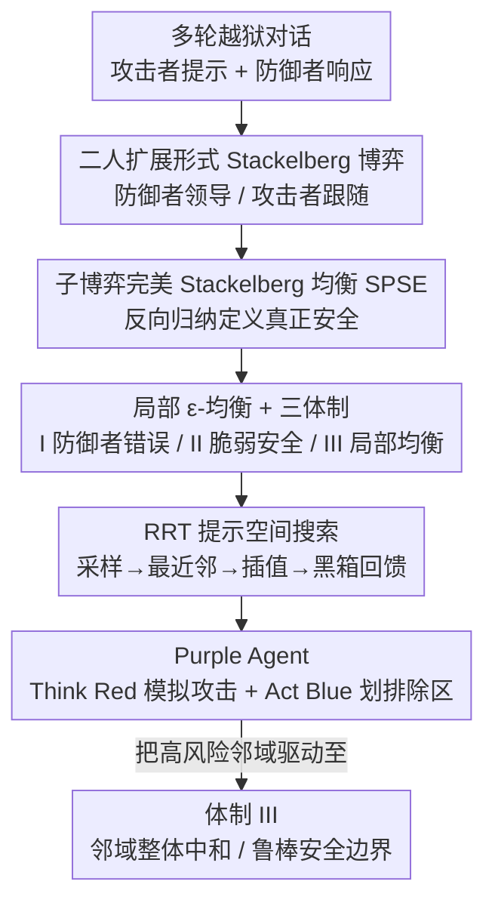

# Toward a Dynamic Stackelberg Game-Theoretic Framework for Agent-Based Conversational AI Defense Against LLM Jailbreaking

**会议**: ICLR 2026  
**arXiv**: [2507.08207](https://arxiv.org/abs/2507.08207)  
**代码**: 无  
**领域**: 强化学习  
**关键词**: game theory, Stackelberg game, jailbreaking defense, Purple Agent, RRT, LLM safety

## 一句话总结

将 LLM 越狱攻防形式化为动态 Stackelberg 扩展形式博弈，结合快速扩展随机树 (RRT) 搜索提示空间，提出 Purple Agent 防御架构实现"红队思维，蓝队行动"的预见性防御。

## 研究背景与动机

LLM 越狱（jailbreaking）指通过精心构造的提示绕过模型安全机制，诱导生成受限或有害内容。传统防御方法面临根本性挑战：

1. **反应式修补**：基于逐案修补或宽泛内容过滤，无法跟上攻击者的速度和复杂性
2. **静态过滤器**：无法捕捉多轮对话中"偷偷摸摸"的渐进式探测策略
3. **单轮视角**：越狱通常不是一次性事件，而是多轮对话中渐进的战略探测

**核心洞察**：攻防交互本质上是一个序贯博弈——防御者当前轮次的响应决定了攻击者未来的优化空间。因此需要从"启发式防御"转向"基于原理的博弈论框架"。

## 方法详解

### 整体框架

本文要解决的是：多轮对话里攻击者一步步试探、最终绕过 LLM 安全机制的越狱问题，而传统反应式过滤总是慢半拍。它的核心思路是把这场攻防形式化成一场二人完美信息的扩展形式博弈 $\Gamma = (N, A, V, E, x_0, H, o_T, u)$——防御者是领导者，每轮先承诺一个响应 $a_{2,t}$；攻击者是跟随者，观察该响应后再发后续提示 $a_{1,t}$；一局对话以终局判定 $o_T(h_T) \in \{\text{Jailbreak}, \text{Safe}, \text{Blocked}\}$ 结束，越狱成功时攻击者得 $+1$、防御者得 $-1$，其余为 $0$。在这套 Stackelberg 结构上，防御者必须先预判攻击者的最优反应再行动：先用子博弈完美均衡（SPSE）定义"什么才算真正安全"，因全局均衡不可解再退到语义邻域上的局部 ε-均衡并据此划出三种安全体制，最后由 Purple Agent 用 RRT 在提示空间里"红队思维"地搜出潜在攻击路径、在高风险处"蓝队行动"地提前划排除区，把状态驱动到最安全的体制 III。

### 关键设计

**1. 子博弈完美 Stackelberg 均衡（SPSE）：用反向归纳定义"真正安全"**

整体框架要求防御者"先预判再行动"，但怎么判断一个响应到底安不安全？直觉上，一个看似安全的响应可能反而给攻击者留下更大的后续优化空间——比如"重定向"这类近视安全策略避开了即时失败，却延长了博弈、让攻击者得以复用先前上下文。为了把这种远期风险纳入考量，本文通过反向归纳递归定义值函数：防御者在每个历史状态 $h_{t-1}$ 下选取使自身长期值最大的行动 $a_{2,t}^* \in \arg\max_{a_{2,t} \in A_{2,t}} v_{2,t}(h_{t-1} \cup \{a_{2,t}, \text{BR}_{1,t}(a_{2,t})\})$，其中 $\text{BR}_{1,t}(a_{2,t})$ 是攻击者对该响应的最优反应。这样定义的均衡要求防御者抵御的不是单条提示，而是攻击者整条最优应对链。

**2. 局部 ε-均衡：把不可计算的全局均衡降到语义邻域上**

SPSE 虽然定义了理想安全，却需要在无界的提示空间里搜索、根本无法求解。于是本文退而要求一个局部条件 $\bar{v}_1^{(\tau)}(h_t) \leq v_1^{(\tau)}(h_t) + \varepsilon$，即在当前历史的语义邻域内攻击者能拿到的平均可达值 $\bar{v}_1^{(\tau)}$（局部偏离的期望成功率）不超过当前值 $v_1^{(\tau)}$ 加上一个容差 $\varepsilon$。据此可以把任一状态归入三种体制：体制 I（防御者错误）满足 $v_1^{(\tau)} = 1$，即当前越狱已成功；体制 II（脆弱安全）满足 $v_1^{(\tau)} = 0$ 但 $\bar{v}_1^{(\tau)} \leq \varepsilon_{\text{large}}$，表面安全却被密集漏洞包围；体制 III（局部均衡）满足 $v_1^{(\tau)} = 0$ 且 $\bar{v}_1^{(\tau)} \leq \varepsilon_{\text{small}}$，整个语义邻域都被中和。这样一来，原本不可解的全局优化就被转化成一个可判定的局部目标——把状态从体制 I/II 迭代驱动到体制 III。

**3. RRT 提示空间搜索：把攻击者建模成反馈驱动的探索者**

要判定上面那个邻域到底属于哪种体制、有没有漏洞，就得先高效地探索提示空间、估出 $\bar{v}_1^{(\tau)}$。本文把机器人运动规划里的快速扩展随机树（RRT）迁移到自然语言上：先采样一个候选提示 $p_{\text{rand}}$（例如借角色扮演生成），再找语义上最近的已有节点 $p_{\text{near}}$，在两者之间插值合成新提示 $p_{\text{new}}$，最后用 LLM 黑箱回馈来决定走向——Safe/Redirect 则继续扩展、Reject 则剪枝、Jailbreak 则终止该分支。这把攻击建模为结构化、反馈驱动的探索，而非盲目的随机模糊测试，从而能系统性地暴露邻域中的脆弱点。

**4. Purple Agent：在攻击发生前就部署防御**

把上述三件事拼起来，Purple Agent 是一个混合元推理器，同时承担两个互补角色：探索性推理（Think Red）用设计 3 的 RRT 模拟攻击者可能怎样生成有害提示，防御干预（Act Blue）在探索揭示出高风险（体制 I/II）时主动出手。它的核心价值在于预见性——不是等越狱真正发生再修补，而是在高风险聚类周围提前划出排除区，把这片语义邻域整体推入体制 III。

### 损失函数 / 训练策略

本文是博弈论框架而非可训练模型，因此不涉及梯度损失。其优化目标是最小化容差 $\varepsilon$，把系统状态从体制 I/II 持续驱动到体制 III，即在每个高风险邻域内消除攻击者的可达正收益。

## 实验关键数据

### 主实验 — 攻防动态

在 DeepSeek-V3 上跨不同查询预算评估：

| 方法 | 预算 | 仅攻击越狱数 | 防御后成功越狱 | 减少率 |
|------|------|-------------|--------------|--------|
| Baseline RRT | 50 | 17.6±6.8 | 4.2±3.0 | ~76% |
| Baseline RRT | 100 | 34.8±7.0 | 7.2±5.5 | ~79% |
| Baseline RRT | 200 | 54.4±12.5 | 13.3±8.8 | ~76% |
| Reward-Guided RRT | 50 | 17.0±2.8 | 5.0±1.1 | ~71% |
| Reward-Guided RRT | 100 | 46.4±9.3 | 17.7±5.9 | ~62% |
| Reward-Guided RRT | 200 | 79.0±17.4 | 39.4±10.5 | ~50% |

**关键发现**：200 轮预算下 Reward-Guided RRT 的越狱数从 79.0 降至 39.4（约 50%），且仅触发约 9.6 次模拟阻断——防御高度精准。

### 跨模型泛化

| 模型 | 方法 | 仅攻击 | 防御后 | 减少率 |
|------|------|--------|--------|--------|
| DeepSeek-V3 | RG-RRT | 46.4 | 17.7 | ~62% |
| Llama-3.1-70B | RG-RRT | 33.8 | 27.2 | ~20% |
| Qwen-Plus | RG-RRT | 31.0 | 18.0 | ~42% |
| Gemini-2.5-Flash | RG-RRT | 36.0 | 23.4 | ~35% |

### 语义结构分析（t-SNE 可视化）

| 状态 | 观察 | 含义 |
|------|------|------|
| 仅攻击 | 越狱形成密集聚类 | 脆弱安全 (Regime II)，邻域充满漏洞 |
| Purple Agent | 越狱变为稀疏孤立点 | 鲁棒局部均衡 (Regime III)，排除区有效 |

### 关键发现

1. **"脆弱安全"边界是对齐 LLM 的基本拓扑特征**：跨平台共享的弱点，攻击者可利用
2. **Purple Agent 无需模型特定微调即展现鲁棒迁移性**
3. **自主构建排除区是模型无关策略**，有效缩小对抗攻击面
4. 从密集越狱聚类到孤立点的转变作为均衡的**几何证书**

## 亮点与洞察

1. **将越狱攻防从分类问题提升为序贯决策过程**：这一视角转换具有根本性意义
2. **RRT 在提示空间的创新应用**：将机器人运动规划算法适配到自然语言空间，优雅且高效
3. **三种体制分类（防御者错误 / 脆弱安全 / 局部均衡）**提供了安全状态的精确刻画
4. **t-SNE 可视化从密集聚类到孤立点**的转变直观地证明了防御效果
5. **"近视安全"的例子**：重定向策略虽然避免了即时失败，但延长了博弈范围，允许攻击者利用先前上下文

## 局限性

1. **计算可扩展性**：RRT 搜索在每次防御中的开销未充分讨论
2. **Reward-Guided RRT 下的防御效力下降**：面对最强攻击者（200 轮 RG-RRT）只能减少 ~50% 越狱
3. **Llama-3.1-70B 上效果较弱**（仅 ~20% 减少）：对某些模型的迁移性有限
4. **未考虑真实多代理场景**：当前仅为双人博弈
5. **理论框架与实际部署间的差距**：需要进一步工程化才能应用于生产环境
6. **仅用 5 次独立运行**取平均，标准差较大

## 相关工作与启发

- **PAIR** (Chao et al., 2025)：黑箱越狱的代表性方法
- **Tree of Attacks** (Mehrotra et al., 2024)：自动化越狱攻击
- **SmoothLLM** (Robey et al., 2023)：基于扰动的防御
- **Stackelberg 博弈** (Başar & Olsder, 1998)：经典博弈论框架

核心启发：**LLM 安全不应被视为静态分类问题，而是需要在序贯博弈的框架下通过预见性推理来实现**。Purple Agent 的"红队思维,蓝队行动"范式为防御提供了一条超越反应式修补的道路。

## 评分

- 新颖性: ⭐⭐⭐⭐⭐ — 将 Stackelberg 博弈论与 RRT 搜索创新结合，Purple Agent 概念新颖
- 实验充分度: ⭐⭐⭐ — 跨 4 个模型测试，但每次仅 5 轮运行，缺乏与其他防御方法的直接对比
- 写作质量: ⭐⭐⭐⭐ — 数学形式化清晰，配图优秀
- 价值: ⭐⭐⭐⭐ — 为 LLM 安全提供了新的理论范式和实用防御架构

<!-- RELATED:START -->

## 相关论文

- [\[ICLR 2026\] GraphOmni: A Comprehensive and Extensible Benchmark Framework for Large Language Models on Graph-theoretic Tasks](graphomni_a_comprehensive_and_extensible_benchmark_framework_for_large_language_.md)
- [\[AAAI 2026\] A Multi-Agent Conversational Bandit Approach to Online Evaluation and Selection of User-Aligned LLM Responses](../../AAAI2026/reinforcement_learning/a_multi-agent_conversational_bandit_approach_to_online_evaluation_and_selection_.md)
- [\[AAAI 2026\] Distilling Deep Reinforcement Learning into Interpretable Fuzzy Rules: An Explainable AI Framework](../../AAAI2026/reinforcement_learning/distilling_deep_reinforcement_learning_into_interpretable_fuzzy_rules_an_explain.md)
- [\[ICLR 2026\] Robust Deep Reinforcement Learning against Adversarial Behavior Manipulation](robust_deep_reinforcement_learning_against_adversarial_behavior_manipulation.md)
- [\[ICLR 2026\] Learning to Play Multi-Follower Bayesian Stackelberg Games](learning_to_play_multi-follower_bayesian_stackelberg_games.md)

<!-- RELATED:END -->
