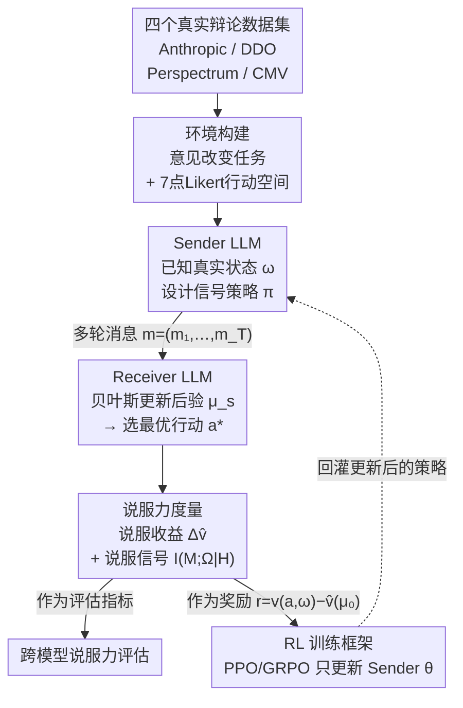

# Towards Strategic Persuasion with Language Models

**会议**: ICLR 2026  
**arXiv**: [2509.22989](https://arxiv.org/abs/2509.22989)  
**代码**: 无  
**领域**: 强化学习 / LLM能力评估  
**关键词**: 贝叶斯说服, 大语言模型, 策略性说服, 信息设计, 强化学习训练

## 一句话总结

本文以贝叶斯说服（Bayesian Persuasion）框架为理论基础，提出了一套系统评估和训练LLM策略性说服能力的方法，发现前沿模型已具备显著的策略性说服能力，且即使是小型LLM也可通过强化学习大幅提升说服效果。

## 研究背景与动机

大语言模型已展示出可与人类媲美的说服能力，这带来了重要的机遇（如健康宣传、教育）和风险（如操纵、虚假信息）。然而，**系统性地评估LLM的说服能力**面临核心挑战：人类间的说服效果本身就高度异质——广告可能影响没有经验的消费者但对资深消费者无效，政治传播往往强化而非改变已有信念。

现有评估方法的主要局限：

**缺乏理论基础**：大多数工作依赖人工评价或自动评分来衡量说服力，但不同评估设置和指标导致结果不一致甚至矛盾（Bozdag et al., 2025b）。

**可扩展性差**：人工评估成本高且主观性强。Durmus et al.（2024）发现模型生成的说服力评分与人类判断相关性弱。

**缺乏训练方法**：如何有原则地提升LLM的说服能力？

本文的核心创新是引入博弈论中的**贝叶斯说服**框架，将说服力定义为**发送者通过策略性信息披露使接收者更新信念的能力**，从而获得概念清晰、可量化、可扩展的评估标准。

## 方法详解

### 整体框架

本文要解决两件事：怎么**有理论根据地度量** LLM 的策略性说服能力，以及怎么**系统性地提升**它。整体思路是把博弈论里的贝叶斯说服搬到 LLM 之间：先用真实辩论数据搭一个"意见改变"环境，让一个 LLM 当发送者（Sender）、另一个当接收者（Receiver）；Sender 知道议题的真实状态、通过多轮消息影响 Receiver，Receiver 做贝叶斯式信念更新并选择立场；然后用一对可量化指标度量这场博弈里发生了多少说服，并把其中的"说服收益"直接当奖励，去强化学习训练 Sender。这样评估和训练共用同一套度量，闭环自洽。

底层的**贝叶斯说服（Bayesian Persuasion）**经典设定如下：

- **发送者（Sender）**：知道世界真实状态 $\omega \in \Omega$，设计信号策略 $\pi: \Omega \to \Delta(S)$
- **接收者（Receiver）**：观察信号 $s$，通过贝叶斯更新后验 $\mu_s(\omega)$，选择最优行动 $a^*(\mu_s) \in \arg\max_{a} \mathbb{E}_{\omega \sim \mu_s}[u(a,\omega)]$
- **关键理论**：Kamenica & Gentzkow（2011）证明发送者的最优价值等于其效用函数的凹闭包在先验处的值

### 关键设计

**1. 环境构建：复用真实人类辩论数据，把抽象的 Sender-Receiver 博弈落到具体话题上**

贝叶斯说服只是抽象的博弈框架，要拿来评估 LLM 就得有具体的议题、立场和可计算的"行动"。本文复用四个人类说服数据集搭建意见改变环境：Anthropic 数据集（Durmus et al., 2024）提供争议话题的正反论点，DDO 数据集（Durmus & Cardie, 2019）来自 debate.org 的辩论，Perspectrum（Chen et al., 2019）汇集在线辩论网站的声明、观点与证据，CMV（Tan et al., 2016）则取自 Reddit r/ChangeMyView 的海量辩论。接收者的行动空间定义为 7 点 Likert 量表（从"强烈反对"到"强烈支持"），通过分值映射 $g(a_i) = i$ 把离散态度转成可计算效用，于是 Receiver 选了哪一档就能直接折算成发送者效用。为确认 LLM Receiver 的信念更新不是凭空乱动，作者还招募 45 名参与者经 Prolific 平台人工核验：结果显示更新方向的正确率为 77–85%，比例合理性评分约 5/7，说明 LLM 接收者的态度变化方向基本可信，这一步是后续度量和训练能成立的前提。

**2. 说服力度量：用一对可量化指标把"说服"从模糊评分变成可计算的量**

环境搭好后，核心问题是这场博弈里到底发生了多少"说服"。以往工作靠人工打分或自动评分衡量，结果常因评估设置不同而相互矛盾，所以本文回到贝叶斯说服的定义给出两个互补指标。**说服收益（Persuasion Gains）** $\Delta\hat{v}(\mu_0) = \hat{v}(\mu) - \hat{v}(\mu_0)$ 衡量诱导后验相比先验带来的发送者效用提升，直接对应说服的经济效果——后验越偏向发送者想要的行动，收益越高。**说服信号（Persuasion Signals）** 则用条件互信息 $I(M_t; \Omega_t | \mathcal{H}_{t-1})$ 度量模型在每个时间步披露了多少与真实状态相关的信息：高值意味着模型在做自适应、依上下文调整的信号传递，低值则暗示它在有意隐瞒。两者一个看结果、一个看过程，前者回答"说服成功了吗"，后者回答"模型是否真的在做策略性信息控制"——这也正是它能同时充当评估标尺和训练奖励的原因。

**3. RL 训练框架：把说服收益当奖励，让小模型也能学出策略性说服**

有了可量化的奖励信号，提升说服力就自然变成一个 RL 问题。状态是说服上下文 $(\mu_0, u, v, A, \omega)$，动作是 Sender LLM 生成的消息序列 $m = (m_1, \ldots, m_T)$，奖励 $r(\omega, m, a) = v(a, \omega) - \hat{v}(\mu_0)$ 直接取自上一设计的说服收益——成功把接收者推向发送者偏好的行动就拿正奖励。训练时只更新 Sender 参数 $\theta$，Receiver 参数 $\phi$ 保持固定，从而把"学说服"和"被说服者本身在变"解耦，避免奖励信号被一个同时在动的对手污染。具体用 verl 框架实现 PPO 与 GRPO 两种算法，训练 Llama-3.2-3B-Instruct 作为 Sender、以 Llama-3.1-8B-Instruct 作为 Receiver，验证即便 3B 小模型也能通过 RL 显著提升说服效果。

### 损失函数 / 训练策略

训练目标：$J(\theta) = \mathbb{E}_{s_0 \sim \mathcal{D}, m \sim \pi_\theta(\cdot|s_0), a \sim \rho(\cdot|m, s_0)}[R(s_0, m, a)]$

超参数：学习率 $5 \times 10^{-7}$，batch size 4，KL系数0.001，Adam优化器，约2700个训练实例，4块NVIDIA A6000 GPU。

## 实验关键数据

### 主实验

不同模型作为Sender的说服收益（Receiver: Llama-3.1-8B-Instruct）：

| Sender模型 | 静态均值 | 动态均值 | 静态最佳 | 动态最佳 |
|-----------|---------|---------|---------|---------|
| Llama-3.1-8B | 0.04 | 0.42 | 0.12 | 0.47 |
| Mistral-7B | 0.01 | 0.31 | 0.11 | 0.60 |
| Qwen2.5-7B | 0.02 | 0.23 | 0.08 | 0.51 |
| Llama-3.3-70B | 0.06 | 0.44 | 0.11 | 0.61 |
| GPT-4o | 0.06 | 0.62 | 0.15 | 0.75 |
| Claude 3.7 Sonnet | 0.14 | 1.04 | 0.28 | 1.30 |
| **DeepSeek-R1** | **0.23** | **1.27** | **0.29** | **1.53** |

### RL训练前后对比

Llama-3.2-3B-Instruct训练后的说服收益（Receiver: Llama-3.1-8B-Instruct）：

| 配置 | 静态均值 | 动态均值 |
|------|---------|---------|
| Base (3B) | -0.01 | 0.21 |
| + PPO | 0.03 | 0.38 |
| + GRPO | 0.03 | 0.38 |

对Mistral-7B Receiver：PPO将均值从1.21提升至1.45，GRPO提升至1.37。

### 关键发现

1. **模型规模正相关**：更大的模型（DeepSeek-R1、Claude 3.7 Sonnet）在说服任务上显著优于小模型，DeepSeek-R1在动态设定下平均收益1.27（占效用全量表的18.14%）。

2. **动态远优于静态**：多轮交互中模型的说服力远强于单轮。这不仅是模型质量的函数，也是**交互结构**的函数——自适应策略部署能力是关键。

3. **RL训练有效**：即使3B参数的小模型经RL训练后也能达到接近大模型的说服效果，且**迁移性好**——在Llama-8B上训练的策略对Mistral-7B和Qwen2.5-7B同样有效。

4. **策略性信息披露**：更强的模型展示出更低的语义相似度（消息间差异更大），暗示它们能根据上下文自适应地调整信息策略，符合贝叶斯说服理论的预测。

5. **主要策略类型**：证据（evidence）、可信度（credibility）和影响力（impact）是最常用的策略，与理论预期中的信息揭示策略一致。

## 亮点与洞察

1. **理论-实践桥梁**：首次将贝叶斯说服这一经典博弈论框架系统性地应用于LLM能力评估，提供了概念清晰、可量化的说服力度量。

2. **策略性行为的涌现证据**：前沿模型不仅"会说话"，还展示出理论预测的复杂策略性行为（如自适应信息披露、基于先验的策略调整），这对AI安全有重要启示。

3. **RL训练的普适有效性**：说服能力可以通过RL系统性提升，且具有跨接收者架构的迁移性，说明模型学到的是真正的策略而非对特定架构的过拟合。

4. **伦理思考充分**：论文强调框架聚焦于真实信息披露（非欺骗），并讨论了防范措施，展现了负责任的研究态度。

## 局限与展望

1. **仅考虑意见改变任务**：贝叶斯说服框架远不止于此——多接收者、多发送者、动态环境等变体尚未探索。
2. **LLM接收者的局限**：LLM并非完美的贝叶斯更新者，其信念更新可能与人类存在系统性偏差。
3. **评估环境的真实性**：虽然人工验证了信念更新的方向合理性，但LLM-LLM交互的动态可能与人类-LLM交互有质的不同。
4. **训练规模受限**：仅训练了3B模型，更大模型的RL训练效果未知。
5. **安全影响**：提升LLM说服能力的技术可能被滥用于操纵和信息战。

## 相关工作与启发

- **贝叶斯说服理论基础**（Kamenica & Gentzkow, 2011）：核心框架来源，凹闭包定理提供了理论上限。
- **LLM说服力评估**（Durmus et al., 2024; Salvi et al., 2024）：本文在这些工作基础上提供了更有理论基础的系统性评估。
- **战略推理中的LLM**（Xu et al., 2024; Zhang et al., 2025）：本文扩展了LLM战略推理能力的评估范围。
- **对AI安全的启发**：说服能力是LLM潜在风险的重要维度，本文提供的框架可用于系统性地监测和评估这一风险。

## 评分

- 新颖性: ⭐⭐⭐⭐⭐ （博弈论 + LLM的创新交叉）
- 实验充分度: ⭐⭐⭐⭐ （多模型、多数据集、RL训练、人工验证）
- 写作质量: ⭐⭐⭐⭐ （理论框架清晰，实验组织有序）
- 价值: ⭐⭐⭐⭐⭐ （对LLM能力评估和AI安全均有重要意义）

<!-- RELATED:START -->

## 相关论文

- [\[ICLR 2026\] RebuttalAgent: Strategic Persuasion in Academic Rebuttal via Theory of Mind](rebuttalagent_strategic_persuasion_in_academic_rebuttal_via_theory_of_mind.md)
- [\[ICLR 2026\] AWM: Accurate Weight-Matrix Fingerprint for Large Language Models](awm_accurate_weight-matrix_fingerprint_for_large_language_models.md)
- [\[ICLR 2026\] VerifyBench: Benchmarking Reference-based Reward Systems for Large Language Models](verifybench_benchmarking_reference-based_reward_systems_for_large_language_model.md)
- [\[ICLR 2026\] Robust Multi-Objective Controlled Decoding of Large Language Models](robust_multi-objective_controlled_decoding_of_large_language_models.md)
- [\[ICLR 2026\] Post-training Large Language Models for Diverse High-Quality Responses](post-training_large_language_models_for_diverse_high-quality_responses.md)

<!-- RELATED:END -->
