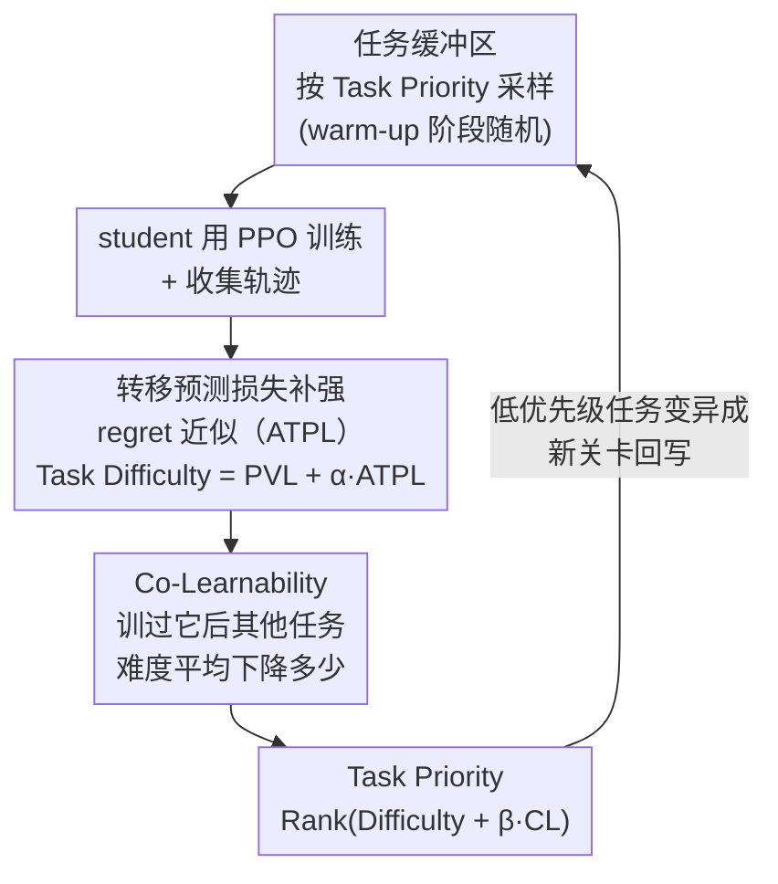

# TRACED: Transition-aware Regret Approximation with Co-learnability for Environment Design

**会议**: ICLR 2026  
**arXiv**: [2506.19997](https://arxiv.org/abs/2506.19997)  
**代码**: [https://github.com/Cho-Geonwoo/TRACED](https://github.com/Cho-Geonwoo/TRACED)  
**领域**: 强化学习  
**关键词**: 无监督环境设计, 课程学习, regret近似, 转移预测误差, Co-Learnability, 零样本迁移

## 一句话总结
TRACED改进无监督环境设计（UED）中的regret近似——在传统PVL基础上加入转移预测误差（ATPL）捕获动力学模型失配，并引入Co-Learnability度量任务间迁移效益，在MiniGrid和BipedalWalker上以10k更新超越所有baseline的20k更新性能。

## 研究背景与动机

**领域现状**：UED是一种co-evolutionary框架，teacher自适应生成高学习潜力的任务，student学习鲁棒策略。现有方法（PLR⟂、ACCEL等）通过regret度量学习潜力，但由于真实最优策略 $\pi^*$ 未知，只能使用粗糙代理（PVL、MaxMC）。

**现有痛点**：(1) PVL仅通过价值函数误差近似regret，忽略了动力学模型失配对未来回报的影响；(2) 现有方法独立处理每个任务，不考虑训练一个任务如何影响其他任务的表现。

**核心矛盾**：regret = 最优回报 - 当前回报，但其中最优回报不可知。PVL作为代理主要反映value estimation error，未捕获transition prediction error对regret的贡献。

**本文目标**：(1) 提供更精确的regret近似；(2) 建模任务间的迁移关系用于课程优化。

**切入角度**：从regret的分解出发，识别出PVL未覆盖的future value gap中的动力学成分，用transition prediction loss（ATPL）补充。同时引入Co-Learnability利用任务间regret变化的相关性。

**核心 idea**：在PVL基础上加入ATPL捕获动力学不确定性，并用Co-Learnability度量任务间迁移效益，形成统一的Task Priority评分指导课程设计。

## 方法详解

### 整体框架
TRACED要解决的是UED里"怎么给任务打分"这一个环节。它完全沿用ACCEL的co-evolutionary循环——teacher维护一个任务buffer、采样任务给student训练、再把高价值任务replay回去——唯一的改动是把打分函数从PVL换成更精确的Task Priority。一个任务进来后，TRACED先算它的Task Difficulty（PVL再加上动力学失配项ATPL），再算它的Co-Learnability（训过它之后其他任务变简单了多少），两者加权合成Task Priority，teacher据此优先采样得分高的任务、训练完再把低优先级任务变异成新关卡回写buffer。整条回路相对ACCEL几乎零侵入，所以方法可以直接嫁接到现有UED框架上。

### 关键设计

**1. 转移预测损失补强 regret 近似（ATPL）：给只看价值误差的 PVL 补上动力学失配这一项**

regret的定义是"最优回报减当前回报"，但最优策略 $\pi^*$ 不可知，所以实践中只能用PVL这类代理。TRACED的出发点是把one-step regret拆开看清PVL到底漏了什么：

$$\text{Regret}(s,a) = \underbrace{V^*(s) - \hat{V}^*(s)}_{\text{(i) value error}} + \underbrace{r(s,a^*) - r(s,a)}_{\text{(ii) reward gap}} + \gamma \underbrace{(\mathbb{E}[\hat{V}^*(s'')] - \mathbb{E}[V^\pi(s')])}_{\text{(iii) future value gap}}$$

PVL只对应第(i)项的价值估计误差，而第(iii)项的"未来价值缺口"取决于学到的转移模型 $\hat{P}$ 与真实转移 $P$ 之间的失配——这正是PVL看不见的盲区。TRACED用一条轨迹上的平均转移预测损失来度量这个失配，定义ATPL为 $\text{ATPL}(\tau) = \frac{1}{T}\sum_{t=0}^T L_{\text{trans}}(s_t, a_t)$，再把它加权并入PVL，得到组合近似 $\widehat{\text{Regret}}(\tau) = \text{PVL}(\tau) + \alpha \cdot \text{ATPL}(\tau)$。论文在附录里进一步证明ATPL是第(iii)项中动力学成分的upper bound，因此这一项不是凑出来的heuristic，而是有理论支撑地填补了regret分解里被忽略的那块。

**2. Co-Learnability：把任务间的迁移效益显式纳入打分**

现有方法独立给每个任务打分，忽略了"训练任务A可能让任务B也变简单"这种正迁移。Co-Learnability就是用来量化这件事的：训完任务 $i$、进入下一轮 $k+1$ 后，看其他被replay任务的难度平均下降了多少，

$$\text{CoLearnability}_i(k) = \frac{1}{|\mathcal{T}_{k+1}|}\sum_{j \in \mathcal{T}_{k+1}}[\text{TaskDifficulty}(j,k) - \text{TaskDifficulty}(j,k+1)]$$

正值意味着训了 $i$ 之后其他任务的难度确实掉了，说明 $i$ 对它们有正迁移；用语言来类比，西班牙语→英语共享词根、迁移效益高（高CL），日语→英语关系远、迁移效益低（低CL）。引入它的意义在于，纯按难度选任务容易一头扎进最难的任务，却忽略了那些虽不最难、但能撬动一批其他任务的"杠杆任务"，Co-Learnability正是把这种杠杆效应补回评分里。

**3. Task Priority：把难度和迁移效益合成最终的采样依据**

最终teacher用的评分把前两项加权合并，并套一层Rank变换：

$$\text{TaskPriority}(i,t) = \text{Rank}(\text{TaskDifficulty}(i,t) + \beta \cdot \text{CoLearnability}(i,t))$$

Task Difficulty和Co-Learnability量纲、尺度都不一样，直接相加容易被某一项的异常值带偏，Rank变换只取相对排序、丢掉绝对数值，因此对outlier更鲁棒。采样时按 $p(i|t) \propto 1/\text{TaskPriority}(i,t)$ 给优先级高（rank靠前）的任务更大的被选概率，从而把"既难又能正迁移"的任务推到课程前列。

### 训练策略
Student使用PPO。转移模型 $f_\phi$ 为循环网络，在agent训练过程中同步训练。MiniGrid用16 workers，BipedalWalker用4 workers。

## 实验关键数据

### MiniGrid零样本迁移

| 方法 | 10k updates IQM | 20k updates IQM | Wall-clock (h) |
|------|-----------------|-----------------|----------------|
| DR | 低 | 低 | 5.82±0.12 |
| PLR⟂ | 中 | 中 | 14.87±0.62 |
| ADD | 中 | 中 | 22.48±0.27 |
| ACCEL | 中 | 中 | 12.94±0.66 |
| **TRACED** | **最高** | **-** | **13.78±0.36** |

TRACED 10k updates即超越所有baseline 20k updates，wall-clock减半。

### BipedalWalker零样本迁移
- TRACED 10k > ACCEL-CENIE 20k（所有指标：median、IQM、mean、optimality gap）
- 在所有6个terrain上持续领先

### PerfectMaze极端测试
- PerfectMazeLarge（51×51）：TRACED 10k solved rate 27%±23% > ACCEL 20k 20%±25%
- PerfectMazeXL（100×100）：TRACED 10k 10%±14% 接近 ACCEL 20k 12%±28%

### 消融实验

| 配置 | MiniGrid IQM | 说明 |
|------|-------------|------|
| TRACED (full) | 最高 | ATPL + CL |
| TRACED - CL | 次高 | 仅ATPL，仍强于baseline |
| TRACED - ATPL | 最低 | 仅CL，提升有限 |

ATPL是主要驱动力，CL在与ATPL结合时提供额外增益。

### 课程复杂度分析
- TRACED下最短路径长度和障碍物数量增长速度远快于ACCEL
- 课程从easy→moderate→challenging的演进明显比baseline更高效

## 亮点与洞察
- **Regret分解的理论贡献**：精确识别了PVL作为regret代理的不足——缺少动力学失配项。这个insights可迁移到任何使用regret的UED方法
- **ATPL的双重效果**：既改善regret估计精度，又加速课程复杂度ramp-up（因为动力学不确定性高的任务确实更challenging）
- **样本效率翻倍**：10k updates达到baseline 20k的性能，wall-clock几乎减半
- **Co-Learnability的轻量级**：仅利用已有的difficulty变化信息，无需额外建模开销

## 局限与展望
- Co-Learnability使用简单的difficulty变化差值代替Shapley values，可能不够精确
- 转移模型 $f_\phi$ 需要额外训练，增加6%计算开销
- 实验环境（MiniGrid/BipedalWalker）规模有限，更复杂的3D环境有待验证
- $\alpha$ 和 $\beta$ 的敏感性分析在附录中，但自适应调节方案可探索

## 相关工作与启发
- **vs ACCEL**: TRACED直接构建于ACCEL之上，仅替换评分函数。改进是orthogonal的
- **vs CENIE**: CENIE用环境novelty作为评分，TRACED通过ATPL隐式捕获novelty
- **vs PLR⟂**: PLR⟂使用PVL/MaxMC，TRACED证明这些代理不够精确

## 评分
- 新颖性: ⭐⭐⭐⭐ Regret分解识别PVL不足、ATPL补充、CL迁移度量，组合创新
- 实验充分度: ⭐⭐⭐⭐⭐ 双环境、消融、课程分析、PerfectMaze极端测试、统计显著性
- 写作质量: ⭐⭐⭐⭐ 结构清晰，理论与实验结合好，notation规范
- 价值: ⭐⭐⭐⭐ 对UED领域有明确改进，方法简洁易于集成到现有框架

<!-- RELATED:START -->

## 相关论文

- [\[ICLR 2026\] Don't Just Fine-tune the Agent, Tune the Environment](dont_just_fine-tune_the_agent_tune_the_environment.md)
- [\[NeurIPS 2025\] Scalable Neural Incentive Design with Parameterized Mean-Field Approximation](../../NeurIPS2025/reinforcement_learning/scalable_neural_incentive_design_with_parameterized_mean-field_approximation.md)
- [\[ICLR 2026\] Is Pure Exploitation Sufficient in Exogenous MDPs with Linear Function Approximation?](is_pure_exploitation_sufficient_in_exogenous_mdps_with_linear_function_approxima.md)
- [\[ICLR 2026\] Regret-Guided Search Control for Efficient Learning in AlphaZero](regret-guided_search_control_for_efficient_learning_in_alphazero.md)
- [\[ICLR 2026\] Online Prediction of Stochastic Sequences with High Probability Regret Bounds](online_prediction_of_stochastic_sequences_with_high_probability_regret_bounds.md)

<!-- RELATED:END -->
