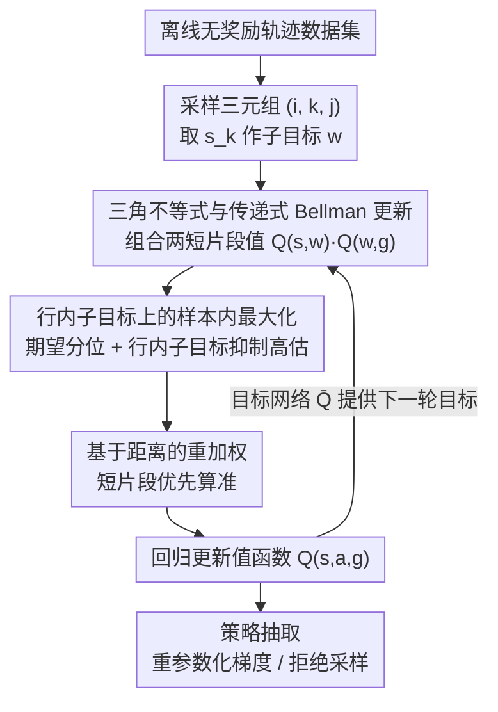

# Transitive RL: Value Learning via Divide and Conquer

**会议**: ICLR 2026  
**arXiv**: [2510.22512](https://arxiv.org/abs/2510.22512)  
**代码**: 无  
**领域**: 强化学习 / 目标条件RL  
**关键词**: 分治算法, 值函数学习, 离线RL, 目标条件强化学习, 三角不等式

## 一句话总结

本文提出 Transitive Reinforcement Learning（TRL），一种基于分治范式的新型值函数学习算法，利用目标条件RL中固有的三角不等式结构，将值函数更新递归分解为子问题，在长时间跨度任务上实现了优于TD学习和蒙特卡洛方法的性能。

## 研究背景与动机

目标条件强化学习（Goal-Conditioned RL, GCRL）关注一个基本问题：**学习一个策略，能够从任意状态以最少步数到达任意目标状态**。这一问题在机器人导航、操控规划等领域有广泛应用。

GCRL中学习值函数（描述从一个状态到目标状态所需的最小步数）主要有两种经典范式：

**时序差分（TD）学习**：通过逐步的单步自举（bootstrapping）传播值信息。优点是方差低（动态规划），但缺点是**偏差累积**——对于长度为 $T$ 的轨迹，需要 $O(T)$ 次递归更新才能传播完整信息，每次更新都可能引入近似误差，误差会逐步累积。

**蒙特卡洛（MC）方法**：直接使用完整轨迹的回报来估计值函数。优点是无偏倚，但缺点是**高方差**——长轨迹的总回报方差随轨迹长度增长。

这两种方法各有致命弱点，特别是在**长时间跨度（long-horizon）**任务中：

- TD方法的偏差累积使得估计越来越不准确
- MC方法的高方差使得学习极其缓慢

本文的核心洞察是：GCRL问题中存在一个**三角不等式结构**——从A到C的最短距离不超过从A到B再从B到C的距离之和。这一结构可以被利用来设计比TD和MC都更好的值函数学习算法。

## 方法详解

### 整体框架

TRL 面向**离线目标条件强化学习（offline Goal-Conditioned RL, GCRL）**：手里只有一批无奖励、无标注的轨迹，要学一个目标条件值函数 $Q(s, a, g)$ 来度量"从状态 $s$ 出发、到达目标 $g$ 最少要几步"，再据此抽取策略。真正的难点是长时跨度（论文里的机器人任务动辄上千步）：TD 沿轨迹逐格回传值信息要 $O(T)$ 次 Bellman 递归、偏差越滚越大；MC 直接吃整条回报又方差爆炸。

TRL 的破法是**分治**——不沿轨迹一步步传，而是把"$s$ 到 $g$"劈成"$s$ 到子目标（subgoal）$w$"和"$w$ 到 $g$"两段、各自的值组合起来，递归二分下去，理想情况下只要 $O(\log T)$ 次递归。整条 pipeline 是：从数据集采一条轨迹、再采三元组 $i<k<j$（用 $s_k$ 当子目标）→ 用目标网络读出两个短片段的值 → 按三角不等式组合成长片段的更新目标 → 套上样本内期望分位 + 行内子目标来抑制高估、再按距离重加权 → 回归更新 $Q$ → 最后抽取策略。

### 关键设计

**1. 三角不等式与传递式 Bellman 更新：把最短路结构变成分治更新规则**

TD 的偏差累积和 MC 的高方差，根子上都在于"信息只能沿轨迹一步步传或一整条传"。TRL 抓住 GCRL 的一个固有几何性质：值函数本质是最短路距离，天然满足三角不等式——绕任意子目标 $w$ 走的距离不短于直达，$d^*(s, g) \leq d^*(s, w) + d^*(w, g)$，$w$ 落在最优路径上时取等。换算到值函数 $V^* = \gamma^{d^*}$ 就成了 $V^*(s, g) \geq V^*(s, w)\,V^*(w, g)$，于是最优值是所有子目标里"最松"的那个界，给出**传递式（transitive）Bellman 更新**：

$$V(s, g) \leftarrow \max_{w}\, V(s, w)\,V(w, g)$$

（相邻状态对直接是 1 步 $\gamma^1$、$s = g$ 时为 $\gamma^0$）。这其实就是图论里 Floyd-Warshall 最短路"用中转点松弛边权"搬到连续状态空间。它的价值在递归深度：把长片段不断二分，$O(T)$ 的逐格传播被压到 $O(\log T)$，而每层仍是动态规划式的组合（不是 MC 吃整条回报），于是同时绕开 TD 的偏差累积和 MC 的高方差。

**2. 行内子目标上的样本内最大化：让分治更新在离线高维任务上不崩**

更新规则里的 $\max_w$ 是落地最大的坑：在函数逼近 + 离线设定下，对大量子目标取 max 会专挑那个被正向高估的值，导致灾难性高估——这正是以往传递式方法只能在二维玩具迷宫上跑、一上机器人任务成功率就归零的原因。TRL 用两个改动驯服它。其一，把硬 $\max$ 换成**软的期望分位回归（expectile，$\kappa \in [0.5, 1)$）**：$\mathbb{E}[\ell^2_\kappa(V(s, g) - \bar V(s, w)\bar V(w, g))]$，不必显式枚举状态就能近似最大值。其二，子目标只从轨迹内部取（称为**行内 / 行为子目标，behavioral subgoals**）——更新 $V(s_i, s_j)$ 时只用同一条轨迹上 $i \leq k \leq j$ 的 $s_k$，而非全状态空间任取。看似保守，却是关键：任取状态当子目标"有效"的概率极低，会逼着用更激进的分位、训练随之失稳；限制在轨迹内即便数据是随机原子动作也够用（类比一步 RL 的行为值函数在次优数据上往往就够）。

**3. 基于距离的重加权：先把短片段算准，再支撑长片段**

传递式更新里，长片段 $(s_i, s_j)$ 的目标值靠两个短片段 $(s_i, s_k)$、$(s_k, s_j)$ 拼出来，所以短片段必须先准。TRL 给每个样本 $(s_i, s_j)$ 的损失乘上权重 $w(s_i, s_j) := 1/(1 + \log_\gamma Q(s_i, a_i, s_j))^\lambda$（$\lambda$ 为超参），让权重大致与估计距离成反比、把训练重心压在短片段上——正对应经典动态规划"先解小子问题、再拼大问题"的求解次序。

### 损失函数 / 训练策略

合上三件套，TRL 的值损失采用 Q 版传递算子、实测用二元交叉熵（BCE）：

$$\mathcal{L}_{\text{TRL}}(Q) = \mathbb{E}_{\tau \sim \mathcal{D}}\big[\, w(s_i, s_j)\, D_\kappa\big(Q(s_i, a_i, s_j),\ \bar Q(s_i, a_i, s_k)\,\bar Q(s_k, a_k, s_j)\big)\,\big]$$

其中 $D_\kappa(x, y) := |\kappa - \mathbb{I}(x > y)|\,D(x, y)$ 是损失 $D$ 的期望分位变体，$\bar Q$ 为目标网络；边界情形下若 $k - i \leq 1$ 则用 $\gamma^{k-i}$ 替换 $\bar Q(s_i, a_i, s_k)$（另一段同理）。训练每步：采一条轨迹、采 $i < k < j$（均匀采样），$s_k$ 作子目标。值函数学好后抽取策略，默认用重参数化梯度（DDPG+BC），在行为策略高度多模态的长时跨度拼图任务上改用拒绝采样更好。

## 实验关键数据

### 主实验

在高难度、长时间跨度的离线GCRL基准上与现有算法比较：

| 基准任务 | 指标 | TRL | TD-based最佳 | MC-based最佳 | 其他GCRL |
|---------|------|-----|-------------|-------------|---------|
| 长距离导航 | 成功率 | **最优** | 偏差累积退化 | 高方差表现差 | 中等 |
| 复杂操控 | 成功率 | **最优** | 中等 | 差 | 中等 |
| 超长距离规划 | 成功率 | **最优** | 严重退化 | 几乎不可用 | 差 |

### 消融实验

| 配置 | 关键指标 | 说明 |
|------|---------|------|
| TRL (完整) | 最优 | 基准配置 |
| 去除分治 (TD替代) | 显著下降 | 验证分治的核心作用 |
| 去除动态规划 (MC替代) | 明显下降 | 验证DP的方差控制作用 |
| 不同递归深度 | $\log T$ 最优 | 过深过浅均非最优 |
| 中间点采样数量 | 适度即可 | 多中间点略有帮助 |

### 关键发现

1. **分治递归深度 $O(\log T)$ 的优势显著**：这是TRL的核心理论优势。对于长达上千步的轨迹，TD需要上千次递归传播值信息（每次都有近似误差），而TRL理想情况下只需约 $\log T$ 层（千步轨迹也就十层左右）。论文同时证明，即便不严格取中点、而是在 $i$ 与 $j$ 之间随机采子目标，理想表格情形下仍保持 $O(\log T)$ 递归。

2. **在长时间跨度任务上优势尤为明显**：当轨迹长度增加时，TD和MC方法的性能快速退化，而TRL的性能退化缓慢，差距越来越大。

3. **兼得TD和MC的优点**：TRL既有TD的低方差特性（通过动态规划），又避免了TD的偏差累积问题（通过对数级递归），实现了两全其美。

4. **对离线数据质量的鲁棒性**：即使离线数据集中的轨迹不是最优的，TRL仍能通过三角不等式的最小化操作找到更短的路径。

## 亮点与洞察

1. **巧妙利用问题结构**：三角不等式是GCRL问题的固有几何性质。将其转化为算法设计原则（分治更新规则）是非常优雅的思路。与Floyd-Warshall的联系提供了良好的直觉。

2. **理论保证优美**：$O(\log T)$ vs $O(T)$ 的递归深度差异直接转化为偏差累积的阶数差异，理论分析清晰有力。

3. **概念简单但效果显著**：算法的核心思想一句话就能描述——"用中间点把长路径分成两段"——但这个简单思想在实验中带来了巨大的性能提升。

4. **通用性**：分治思想不局限于特定的环境或任务，适用于任何满足三角不等式的值函数学习问题。

## 局限与展望

1. **仅适用于GCRL**：TRL利用的是最短路径的三角不等式结构，不能直接推广到一般的RL问题（如含奖励折扣的累积奖励最大化）。

2. **中间点的选择**：在连续空间中，如何高效地找到好的中间点是一个实际挑战。如果数据集中缺少"桥梁"状态，分治效果会打折扣。

3. **离线设定的局限**：目前仅在离线设定下验证。在线版本（结合探索）可能需要额外的设计。

4. **函数逼近误差**：虽然递归深度减少了，但每一层的函数逼近误差仍然可能累积。$O(\log T)$ 层的累积误差是否在实践中始终可控需要更多验证。

5. **与分层RL的关系**：分治策略与分层强化学习（Hierarchical RL）有天然联系，但本文未深入探讨。结合子目标发现方法可能进一步提升性能。

6. **离线数据的覆盖度要求**：TRL需要数据集中包含足够的"中间状态"来构建分治路径。对于稀疏数据集，这一要求可能成为瓶颈。

## 相关工作与启发

- **TD学习与MC方法**：TRL可以看作这两种经典方法的统一和超越——在偏差和方差的连续谱中找到了一个更优的均衡点。
- **Floyd-Warshall算法**：TRL的值更新规则与图中最短路径的动态规划算法直接对应，体现了离散算法向连续RL问题的自然迁移。
- **离线GCRL**（如WGCSL、Quasimetric RL等）：TRL提供了一种完全不同的值学习范式，与现有方法互补。
- **启发**：这项工作启示我们，许多经典的算法设计原则（如分治）在RL中可能有深刻的应用，关键是找到问题中对应的数学结构（如三角不等式）。

## 评分

- 新颖性: ⭐⭐⭐⭐⭐ （分治 + RL的创新结合，概念清晰优雅）
- 实验充分度: ⭐⭐⭐⭐ （长时间跨度基准上的优越表现）
- 写作质量: ⭐⭐⭐⭐ （算法动机和理论分析清晰易懂）
- 价值: ⭐⭐⭐⭐ （为GCRL值学习开辟了新范式）

<!-- RELATED:START -->

## 相关论文

- [\[ICLR 2026\] Divide, Harmonize, Then Conquer It: Shooting Multi-Commodity Flow Problems with Multimodal Language Models](divide_harmonize_then_conquer_it_shooting_multi-commodity_flow_problems_with_mul.md)
- [\[ICLR 2026\] ROMI: Model-based Offline RL via Robust Value-Aware Model Learning with Implicitly Differentiable Adaptive Weighting](model-based_offline_rl_via_robust_value-aware_model_learning_with_implicitly_dif.md)
- [\[ICML 2025\] Divide and Conquer: Grounding LLMs as Efficient Decision-Making Agents via Offline Hierarchical Reinforcement Learning](../../ICML2025/reinforcement_learning/divide_and_conquer_grounding_llms_as_efficient_decision-making_agents_via_offlin.md)
- [\[ICLR 2026\] Value Flows](value_flows.md)
- [\[ICLR 2026\] Continuous-Time Value Iteration for Multi-Agent Reinforcement Learning](continuous-time_value_iteration_for_multi-agent_reinforcement_learning.md)

<!-- RELATED:END -->
