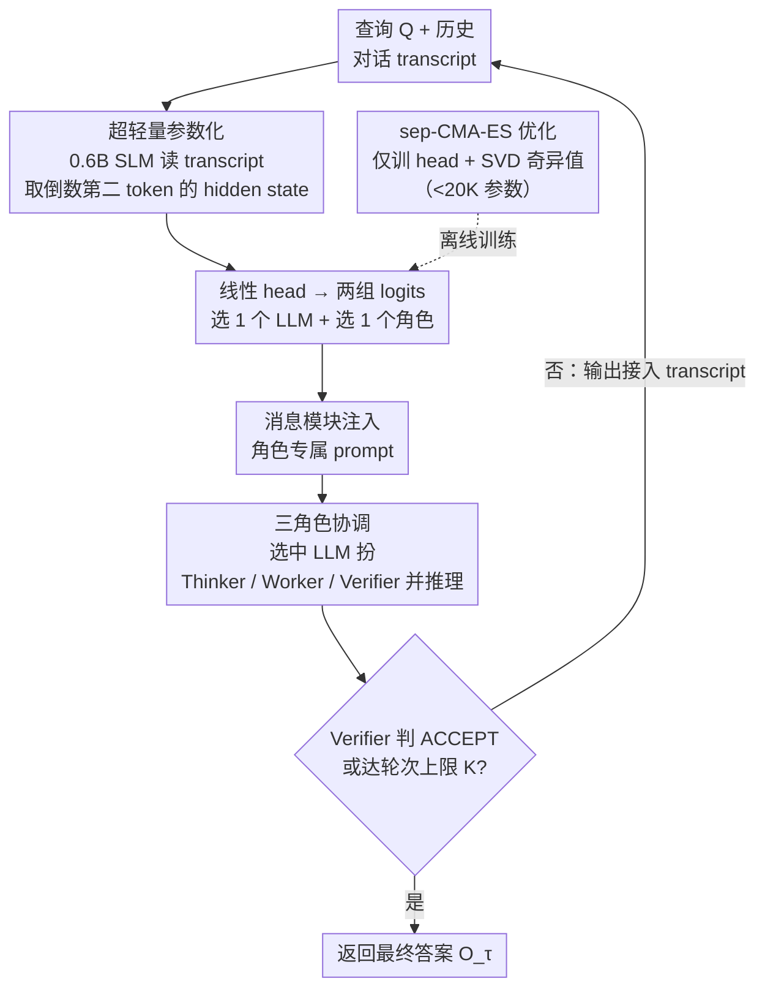

# Trinity: An Evolved LLM Coordinator

**会议**: ICLR 2026  
**arXiv**: [2512.04695](https://arxiv.org/abs/2512.04695)  
**代码**: 无（Sakana AI）  
**领域**: 强化学习 / LLM协作  
**关键词**: LLM协调, 模型组合, 进化策略, CMA-ES, 多角色协作, test-time composition

## 一句话总结
Trinity设计了一个轻量级coordinator（0.6B SLM + ~10K可训练参数的head），通过sep-CMA-ES优化，在多轮对话中将查询分配给不同LLM并指定Thinker/Worker/Verifier三种角色，在LiveCodeBench上达到86.2% pass@1的SOTA，在4个分布内和4个分布外任务上一致超越所有单模型和多agent基线。

## 研究背景与动机

**领域现状**：LLM scaling law虽有效但代价高昂、收益递减。模型合并（model merging）受限于架构不兼容和闭源API。宏观层面的test-time模型组合（coordination）是一个有前景的替代方向。

**现有痛点**：(1) 现有routing/coordination方法（MasRouter、RouterDC、Smoothie等）无法有效利用多样化模型的互补优势，某些方法甚至降低性能到不如随机选择；(2) 缺乏对输入查询的丰富上下文理解来做出有效的delegation决策。

**核心矛盾**：Coordinator需要足够的语义理解力来正确分配任务，但又不需要（也不应该）像底层agent那样强大。如何用最少的参数学到最有效的coordination策略？

**本文目标**：(1) 如何从小模型的内部表示中提取足够的语义信号用于coordination？(2) 如何在极端参数预算（~10K）下优化coordination策略？(3) 如何设计有效的多轮协作模式？

**切入角度**：利用SLM隐藏状态（而非生成文本）作为上下文表示，用极轻量级head做routing决策，通过进化策略而非RL进行优化。

**核心 idea**：小模型的hidden states包含足够的语义信号，一个<20K参数的head就能协调多个顶级LLM超越任何单一模型。

## 方法详解

### 整体框架
Trinity 把"用哪个 LLM、让它扮演什么角色"这件事交给一个极轻量的协调器（coordinator）决定，而被协调的顶级 LLM 本身一字不改。协调器是一个 Qwen3-0.6B 小语言模型（SLM）外挂一层线性头（head）：每一轮把到目前为止的完整对话 transcript 喂给 SLM，从它倒数第二个 token 的 hidden state 读出两组 logits——一组在 $L$ 个候选 LLM 里选一个、一组在 Thinker/Worker/Verifier 三种角色里选一个；选定后消息模块给该 LLM 注入对应角色的 prompt 并取回输出，把输出接进 transcript 进入下一轮，直到 Verifier 判定 ACCEPT 或达到轮次上限 $K$ 才停。协调器那层 head 的参数则在离线阶段用 sep-CMA-ES 这种进化策略训出来。

### 关键设计

**1. 超轻量参数化：让协调头只学"怎么分配"而不重学语言能力**

协调器要有足够语义理解力把任务派对，又不该像底层 agent 那样昂贵——Trinity 把真正可训练的部分压到不到 20K 参数（比常规微调小几个数量级），核心是只在两处下手。一是 head 本身，它是一层线性映射，把 hidden state $h \in \mathbb{R}^d$ 投到 $\mathbb{R}^{L+3}$ 的 logits 上（$L$ 个 LLM 加 3 个角色），不引入任何额外结构。二是对 SLM 的权重矩阵做 SVD 分解后只学习奇异值的缩放、固定住正交基，用极少的自由度给 hidden state 补一点任务相关的表征改善。这套设计能成立的关键洞察是：协调器生成的文本被整个丢弃，真正用到的只有 hidden state 导出的 logits——既然不需要它把话说完，就可以只取早期 token（而非等到生成结束）的 hidden state 快速出决策，进一步压低开销。

**2. 三角色协调：把复杂能力外包给底层 LLM，自己只做分工**

如果协调器自己要会规划、会解题、会校验，那它就不可能只用上万参数；Trinity 的破法是给每轮被选中的 LLM 指派一个明确职责。Thinker 负责策略规划，分析当前状态、给出计划/分解/对部分解的批判等高层指导，还可顺带指定下一轮的角色；Worker 负责具体执行，产出代码、推导、数值结果这类可操作内容；Verifier 负责质量评估，输出判断 $u_k \in \{\texttt{ACCEPT}, \texttt{REVISE}\}$ 并可附带诊断 $\delta_k$。终止时刻定义为 $\tau = \min\{k \le K : R_k = \mathrm{V}\ \text{且}\ u_k = \texttt{ACCEPT}\}$，没人 ACCEPT 就跑满 $K$ 轮、返回 $O_\tau$。这样划分把"获得复杂能力"这件难事完全外包（offload）给底层强模型，协调器只需做轻量的"派谁、扮谁"决策——这正是设计 1 能只用上万参数的前提。

**3. sep-CMA-ES 优化：在高维稀疏奖励下用进化策略替代 RL**

这个优化问题有几个棘手特征叠在一起：参数维度高（~10K）、参数块之间耦合很弱、每走一步都要让被协调的 agent 真实推理一遍因而单步代价极高，而奖励只是答案对错的二值终端信号 $R(\tau) \in \{0,1\}$，整体目标即 $J(\theta) = \mathbb{E}_{\tau \sim \pi_\theta}[R(\tau)]$。直接上 RL 在这里很吃亏：REINFORCE 的逐参数梯度信噪比极低，弱块间耦合让梯度病态、credit assignment 很差。Trinity 改用 sep-CMA-ES——它只维护一个对角协方差矩阵，天然契合这种近似 block-diagonal 的优化景观，在高维且评估预算被严格卡死（10K 维问题只给 1.5K–40K 次评估）的设定下比 RL、模仿学习和随机搜索都更稳。文中 Proposition 1 进一步给出理论支撑：在迭代次数 $T$ 较小的 regime 下，sep-CMA-ES 的改进量随迭代近似线性增长，而随机搜索只有对数增长。

## 实验关键数据

### 分布内评测（4个benchmark）

| 方法 | MATH500 | MMLU | RLPR | LiveCodeBench v6 |
|------|---------|------|------|------------------|
| GPT-5 (4K) | 0.91 | 0.92 | 0.34 | 0.56 |
| Gemini-2.5-pro (4K) | 0.92 | 0.91 | 0.41 | 0.47 |
| Claude-4-Sonnet (4K) | 0.90 | 0.89 | 0.37 | 0.51 |
| MoA | 0.83 | - | 0.38 | 0.39 |
| **Trinity** | **0.95** | **0.94** | **0.44** | **0.61** |

Trinity在所有4个任务上一致领先。MATH500相对error reduction 11.76%（vs Gemini-2.5-pro 5x CTX）。
LiveCodeBench SOTA: **86.2% pass@1**（V1 train → V6 test）。

### 零样本迁移（4个未见任务）

| 模型 | AIME | BigCodeBench | MT-Bench | GPQA-D | Average |
|------|------|-------------|----------|--------|---------|
| Gemini Pro 2.5 | 46.67 | 35.10 | 9.37 | 75.25 | 52.34 |
| GPT-5 | 46.67 | 33.80 | 9.35 | 72.73 | 51.07 |
| **Trinity** | **50.00** | **35.80** | **9.60** | **76.82** | **54.21** |

在所有4个未见任务上超越每个单模型，证明泛化能力。

### 关键发现
- 平均相对error reduction 21.9%（vs second-best方法）
- 某些baseline方法降低性能低于随机（如RouterDC在RLPR上0.28 < random 0.32），凸显effective coordination的难度
- Trinity在3/4任务上接近"Per-Question-Best"上限
- 涌现的task-aware策略：不同任务类型展现不同的T/W/V选择模式

## 消融实验
- Head架构：block-diagonal-10（极少参数）仍保留大部分性能 → 证实block-$\varepsilon$-separability
- SVD微调 vs 不微调：微调提供额外的表征改善
- sep-CMA-ES vs REINFORCE vs random search vs imitation learning：CMA-ES在此regime下大幅领先

## 亮点与洞察
- **极端参数效率**：<20K可训练参数协调7个顶级LLM（含GPT-5、Claude-4-Sonnet），这一参数量级令人惊叹
- **Hidden states的语义密度**：证明即使0.6B SLM的internal representation也足以为coordination提供丰富的上下文信号
- **进化策略 vs RL的niche**：在高维、弱耦合、稀疏奖励、高per-step成本的特定regime下，CMA-ES理论和实证上优于policy gradient——打破了"RL万能"的思维定式
- **三角色设计的优雅性**：T/W/V分工将coordinator从complex skill acquisition中解放出来，只需做assignment

## 局限与展望
- 依赖闭源API的LLM pool，成本和延迟是实际部署瓶颈
- Coordinator的SLM仍需推理每轮的完整transcript，对很长对话可能有效率问题
- 三角色的prompt设计是hand-crafted的，role自动化发现值得探索
- 训练集规模较小（400 LiveCodeBench samples），更大规模训练效果有待验证

## 相关工作与启发
- **vs MoA/LLM-Blender**: 简单的mixture/融合方法不够——有效coordination需要query-level的上下文理解
- **vs RouterDC/MasRouter**: 现有routing方法缺乏multi-turn推理和role assignment的能力
- **vs Model merging**: Trinity完全不修改底层模型权重，兼容闭源和异构模型
- **vs Self-reflection**: 单模型self-reflection（5x SR）仍不如Trinity，因为它无法进行inter-model互补

## 评分
- 新颖性: ⭐⭐⭐⭐⭐ SLM hidden state + 超轻量head + CMA-ES的组合极为创新
- 实验充分度: ⭐⭐⭐⭐⭐ 8个benchmark（4 in-dist + 4 zero-shot），全面的消融和理论分析
- 写作质量: ⭐⭐⭐⭐⭐ 问题定义精确，理论分析扎实，实验展示清晰
- 价值: ⭐⭐⭐⭐⭐ LiveCodeBench SOTA，开创了超轻量coordination的新范式

<!-- RELATED:START -->

## 相关论文

- [\[ICLR 2026\] References Improve LLM Alignment in Non-Verifiable Domains](references_improve_llm_alignment_in_non-verifiable_domains.md)
- [\[ICLR 2026\] ReMix: Reinforcement Routing for Mixtures of LoRAs in LLM Finetuning](remix_reinforcement_routing_lora.md)
- [\[ICLR 2026\] How Far Can Unsupervised RLVR Scale LLM Training?](how_far_can_unsupervised_rlvr_scale_llm_training.md)
- [\[ACL 2026\] Efficient Hyperparameter Optimization for LLM Reinforcement Learning](../../ACL2026/reinforcement_learning/efficient_hyperparameter_optimization_for_llm_reinforcement_learning.md)
- [\[ICLR 2026\] Toward a Dynamic Stackelberg Game-Theoretic Framework for Agent-Based Conversational AI Defense Against LLM Jailbreaking](toward_a_dynamic_stackelberg_game-theoretic_framework_for_agent-based_conversat.md)

<!-- RELATED:END -->
