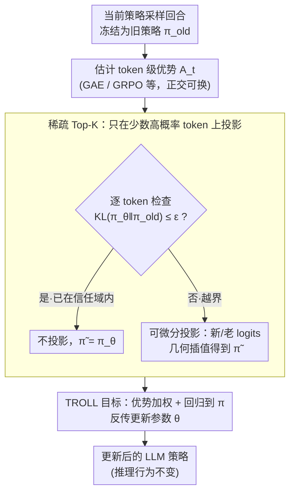

# TROLL: Trust Regions improve Reinforcement Learning for Large Language Models

**会议**: ICLR 2026  
**arXiv**: [2510.03817](https://arxiv.org/abs/2510.03817)  
**代码**: 无  
**领域**: 强化学习 / LLM微调  
**关键词**: 信任域, PPO, 策略裁剪, KL约束, LLM强化学习, Token级优化

## 一句话总结

本文提出 TROLL（Trust Region Optimization for Large Language models），用可微分的离散信任域投影替代PPO中的裁剪（clipping）机制，实现了基于原则性KL约束的token级策略更新，在数学推理和代码生成任务上一致性地优于PPO裁剪方法。

## 研究背景与动机

基于PPO（Proximal Policy Optimization）风格的裁剪目标函数已成为LLM基于奖励的强化学习微调的标准选择。从RLHF（人类反馈强化学习）到数学推理训练，PPO-clip几乎无处不在。然而，裁剪机制本身存在根本性问题：

**PPO裁剪的设计初衷与实际效果之间的差距**：

**历史背景**：裁剪最初作为TRPO（Trust Region Policy Optimization）中基于KL散度的信任域约束的一个**简单近似**而引入。TRPO保证每次策略更新在KL散度意义下不超过一个阈值，但计算代价高。PPO用裁剪比率 $\text{clip}(\frac{\pi_\theta}{\pi_{old}}, 1-\epsilon, 1+\epsilon)$ 来近似这一效果。

**裁剪是粗糙的近似**：裁剪操作简单地截断概率比率，但它与KL约束的关系并不精确。具体而言：
   - 裁剪只约束了概率比率的范围，未直接限制KL散度
   - 裁剪在边界处梯度为零，导致信息丢失
   - 裁剪对所有token一视同仁，无法反映不同token的重要性差异

**实际后果**：裁剪经常导致**不稳定的更新**和**次优性能**。特别是在LLM场景下，每个回合涉及数百个token的联合策略，裁剪的粗糙性被放大。

尽管近期工作探索了改进的优势估计方法（如GRPO、DAPO等）和归一化技术，但**裁剪机制本身几乎从未被质疑或替换**。

本文的核心贡献是：回归信任域的基本原理，用一种可微分的、有原则性的信任域投影来直接替代裁剪操作。

## 方法详解

### 整体框架

TROLL 要解决的问题很具体：PPO 训练里那个看似无关紧要的裁剪操作，其实是 TRPO 信任域约束的一个粗糙替身，而这个替身正悄悄拖累训练。TROLL 把裁剪整个拆掉，换成一个**离散可微分的信任域投影**——在每个 token 位置上施加精确的 KL 散度约束，让更新后的分布既朝着提升优势的方向走、又不偏离采集这批数据时所用的旧策略太远。

一次更新的流程是：用当前 LLM 策略采一批回合，把它冻结为旧策略 $\pi_{old}$；照常用任意方法（GAE、GRPO…）估计每个 token 的优势 $A_t$；逐 token 检查当前策略 $\pi_\theta$ 是否已经偏离 $\pi_{old}$ 超过 KL 阈值 $\epsilon$——没越界的 token 原样放过，越界的才做一次可微投影，把它拉回信任域；最后用一个把"优势加权"和"回归到投影结果"合在一起的目标反传更新参数。为了让这套在十几万词表的大模型上跑得动，所有投影都只在每个 token 的 Top-K 高概率子集上进行。

因为只动训练阶段的更新方式、不改变推理时的采样行为，TROLL 可以零成本接到任何现成的 PPO-clip 管道上；又因为约束施加和优势估计是两个独立维度，它和 GAE、GRPO 等各种优势估计方法天然正交、可叠加使用。

### 关键设计

**1. Token 级 KL 信任域约束：把"限制概率比率"换成"限制分布距离"**

PPO 的裁剪在概率比率空间里动手脚，截断 $\frac{\pi_\theta}{\pi_{old}}$ 的取值范围，但比率被卡住并不等于两个分布真的接近。TROLL 转而在**概率分布空间**上直接下约束：对每个 token 位置 $t$，要求更新后的分布与采集数据时的旧策略 $\pi_{old}$ 之间的 KL 散度不超过阈值 $\epsilon$。具体而言，它求解一个凸投影——找一个离当前策略 $\pi_\theta$ 最近、又仍落在 $\pi_{old}$ 的 $\epsilon$-信任域内的分布 $\tilde\pi$：

$$\tilde\pi(o_t) = \arg\min_{\hat\pi}\, KL\big(\hat\pi \,\|\, \pi_\theta(o_t)\big)\quad \text{s.t.}\quad KL\big(\hat\pi \,\|\, \pi_{old}(o_t)\big) \leq \epsilon$$

这正是 TRPO 性能改进保证所要求的那种约束——信任域理论从一开始要的就是 KL 上界，而不是概率比率上界。裁剪只是当年为工程简便对它做的近似；TROLL 让这个理论约束重新变得可直接操作，约束粒度也从单个比率回到了整个分布。注意约束的是「新策略与旧策略」而非某个固定参考策略，目的是稳定 on-policy 的逐步更新，而不是像 RLHF 那样把模型拴在 SFT 模型附近。

**2. 闭式可微分投影 + 回归目标：让 KL 投影能反向传播**

直接施加 KL 约束的难点在于：投影到约束集合通常不可微，一旦不可微梯度就传不回网络——这正是 TRPO 当年没能在大模型上落地的工程瓶颈。TROLL 的关键发现是上面那个凸投影有**闭式解**，且这个解是新、旧两套 logits 的几何插值：

$$\tilde\pi(o_t) \propto \exp\!\left(\frac{\log \pi_{old}(o_t) + \eta\,\log \pi_\theta(o_t)}{\eta + 1}\right)$$

其中步长 $\eta$ 控制把新策略往旧策略拉回多少，可对每个 token 单独求解约束对应凸对偶（一个标量问题，用几次三分/n 分搜索就够精确）。因为这是初等可微运算，梯度能穿过投影一路传回参数。投影后还有一个隐患：网络原始输出 $\pi_\theta$ 自身仍可能离 $\pi_{old}$ 任意远，于是 TROLL 在目标里加一项把 $\pi_\theta$ 回归到（停止梯度的）投影结果 $\tilde\pi$ 上，既用 $\tilde\pi$ 算重要性比率、又把它当回归靶子，从而让真正的网络输出也被约束在信任域内。

**3. 稀疏 Top-K 投影：只在少数高概率 token 上做投影**

LLM 词表动辄十几万（如 Qwen3 是 151,936），若在完整词表上对每个 token 都做一次 KL 投影，计算量会把信任域的好处吃光。TROLL 的效率关键是：对每个 token，贪心选出按概率质量排序、累计覆盖几乎全部质量的 Top-K 个 token（外加始终保留实际被采样的那个 token 以保证它有梯度），只在这个子集上算投影，其余长尾 token 原样不动。更进一步，只有当某个 token 真的违反了信任域约束时才需要投影，而这只发生在极少数高度相关的 token 上，其余可在过滤阶段直接跳过。这之所以成立，是因为预训练 LLM 困惑度很低、输出分布高度长尾——论文报告用 $K=64$、$\epsilon=10^{-5}$ 通常就能保留 99.999% 的概率质量，让信任域方案在大模型规模下变得实际可跑。

### 损失函数 / 训练策略

TROLL 的目标函数把"优势加权"和"回归到投影分布"合在一起，结构上仍与标准 PPO 同源，但用信任域投影 $\tilde\pi$ 取代了裁剪：

$$J_{TROLL}(\theta) = \mathbb{E}_{o\sim\pi_{old}}\!\left[\frac{1}{|o|}\sum_t \frac{\tilde\pi(o_t)}{\pi_{old}(o_t)}\,A_t \;-\; \alpha\,KL\big(\pi_\theta(o_t)\,\|\,\lfloor\tilde\pi(o_t)\rfloor\big)\right]$$

其中 $\lfloor\cdot\rfloor$ 表示停止梯度，$\alpha$ 是回归项权重。投影分布 $\tilde\pi$ 同时充当两个角色：一是算重要性比率 $\tilde\pi/\pi_{old}$ 的策略，二是约束网络原始输出 $\pi_\theta$ 的回归靶子。整个流程见 Algorithm 1：每步重设 $\pi_{old}$、稀疏化 logits、估计优势，再逐 token 走"检查 KL→（越界才）投影→更新"。

与 PPO-clip 的对比：

| 组件 | PPO-clip | TROLL |
|------|---------|-------|
| 约束对象 | 概率比率 $\frac{\pi_\theta}{\pi_{old}}$ | 与旧策略的分布距离 |
| 约束方式 | 比率裁剪 $[1-\epsilon, 1+\epsilon]$ | KL 投影 $KL(\cdot\|\pi_{old}) \leq \epsilon$ |
| 约束粒度 | 单个标量比率 | 整个 token 分布 |
| 理论保证 | 无直接保证 | KL 散度上界（信任域） |
| 边界梯度 | 为零（信息丢失） | 非零（保持梯度流） |
| 计算开销 | 极低 | 略高（Top-K 稀疏化后可控） |

## 实验关键数据

### 主实验

跨模型族和任务的一致性优势：

| 任务 | 模型 | 指标 | TROLL | PPO-clip | 提升 |
|------|------|------|-------|---------|------|
| 数学推理 (MATH) | Qwen-2.5系列 | 成功率 | 更高 | 基准 | 训练速度更快 |
| 数学推理 (GSM8K) | Llama系列 | 成功率 | 更高 | 基准 | 稳定性更好 |
| 代码生成 | 多个模型族 | Pass@1 | 更高 | 基准 | 最终性能更优 |

### 消融实验

| 配置 | 训练稳定性 | 最终性能 | 说明 |
|------|----------|---------|------|
| PPO-clip（基线） | 波动大 | 基准 | 裁剪的固有不稳定性 |
| TROLL（完整） | **显著更稳定** | **最优** | 精确KL约束的效果 |
| TROLL + GAE | 稳定 | 高 | 与标准优势估计兼容 |
| TROLL + GRPO | **最稳定** | **最高** | 与先进优势估计方法互补 |
| 不同稀疏度K | K过小退化 | K适中最优 | Top-K设置需要调节 |
| 不同KL阈值δ | δ过小过保守 | δ适中最优 | 类似于PPO的ε调节 |

### 关键发现

1. **训练速度更快**：TROLL达到相同性能所需的训练步数明显少于PPO-clip，说明每步更新更有效率。这归功于信任域投影避免了裁剪导致的梯度信息丢失。

2. **训练更稳定**：PPO-clip训练曲线经常出现震荡和突变，而TROLL的训练曲线平滑得多。这是因为精确的KL约束比裁剪提供了更可靠的策略更新控制。

3. **最终性能更优**：在训练充分后，TROLL的最终成功率/通过率一致性地高于PPO-clip。这说明裁剪的粗糙近似确实导致了次优解。

4. **跨模型族和任务的一致性**：优势不局限于特定模型或任务，说明这是一个通用的改进而非特定场景的调参优化。

5. **与优势估计方法的正交性**：无论使用GAE还是GRPO来估计优势，TROLL都能提供改进，表明约束施加方式和优势估计是相互独立的改进维度。

## 亮点与洞察

1. **重新审视"被忽视的常量"**：PPO-clip已经成为如此标准的选择，以至于裁剪机制本身几乎从未被质疑。TROLL的贡献在于挑战了这一默认假设，证明"更好的近似 = 更好的性能"。

2. **理论与实践的统一**：信任域方法的理论优势（如性能改进保证）长期以来因计算困难而无法在LLM中实现。TROLL通过稀疏化和可微分投影解决了这一工程问题，使理论优势转化为实际收益。

3. **即插即用设计**：TROLL不改变推理行为、不引入新的超参数类型（KL阈值 $\delta$ 对应PPO的裁剪范围 $\epsilon$），可以零障碍地替换现有PPO训练管道。

4. **稀疏化的直觉**：仅在Top-K token上执行投影的设计不仅节省计算，还暗含了一个深刻洞察——策略更新最重要的信息集中在高概率token的分布变化上。

## 局限与展望

1. **计算开销略有增加**：虽然稀疏化降低了投影成本，但相比极度简单的裁剪操作，TROLL仍有额外开销。在极大规模训练中（数百GPU），这一差异可能变得显著。

2. **Top-K大小的选择**：稀疏度K需要调节。过小的K可能无法充分约束分布变化，过大的K失去了效率优势。自适应K的选取可能是一个改进方向。

3. **仅在数学推理和代码生成上验证**：尚未在通用对话、创意生成等更多样的LLM任务上验证。不同任务对信任域大小的需求可能不同。

4. **与DPO等新方法的对比缺失**：当前RL-based LLM训练正在与DPO（Direct Preference Optimization）等无需在线RL的方法竞争。TROLL在这一更大背景下的定位需要进一步明确。

5. **KL方向的选择**：投影的约束写成 $KL(\tilde\pi \| \pi_{old})$ 这一方向，反向 KL 在某些场景下可能更合适。这一设计选择的影响值得进一步探索。

6. **与其他信任域方法的比较**：TRPO、自然策略梯度等方法在LLM场景下的表现如何？TROLL的改进是来自信任域本身还是其特定的实现方式？

## 相关工作与启发

- **TRPO（Schulman et al., 2015）**：TROLL的理论源头，TRPO使用精确的KL约束但计算代价高。
- **PPO（Schulman et al., 2017）**：TROLL直接改进的目标，PPO用裁剪近似TRPO的KL约束。
- **RLHF管道**（如InstructGPT、OpenAI o系列）：TROLL可以直接集成到这些管道中。
- **GRPO/DAPO等**：与优势估计的改进正交互补，组合使用效果更佳。
- **启发**：这项工作提醒我们，在快速发展的领域中，早期为了"工程简便"所做的近似（如裁剪）可能已不再是最优选择。随着问题规模和任务复杂度的增长，回归基本原理（如信任域）可能带来显著收益。

## 评分

- 新颖性: ⭐⭐⭐⭐ （对经典方法的有原则替代，技术创新在稀疏投影）
- 实验充分度: ⭐⭐⭐⭐ （多模型、多任务、多优势估计方法的系统验证）
- 写作质量: ⭐⭐⭐⭐ （动机清晰，与PPO的对比到位）
- 价值: ⭐⭐⭐⭐⭐ （直接替代PPO-clip，影响面极广）

<!-- RELATED:START -->

## 相关论文

- [\[ICLR 2026\] VerifyBench: Benchmarking Reference-based Reward Systems for Large Language Models](verifybench_benchmarking_reference-based_reward_systems_for_large_language_model.md)
- [\[ICLR 2026\] Robust Multi-Objective Controlled Decoding of Large Language Models](robust_multi-objective_controlled_decoding_of_large_language_models.md)
- [\[ICLR 2026\] AWM: Accurate Weight-Matrix Fingerprint for Large Language Models](awm_accurate_weight-matrix_fingerprint_for_large_language_models.md)
- [\[ICLR 2026\] Post-training Large Language Models for Diverse High-Quality Responses](post-training_large_language_models_for_diverse_high-quality_responses.md)
- [\[ICLR 2026\] GraphOmni: A Comprehensive and Extensible Benchmark Framework for Large Language Models on Graph-theoretic Tasks](graphomni_a_comprehensive_and_extensible_benchmark_framework_for_large_language_.md)

<!-- RELATED:END -->
