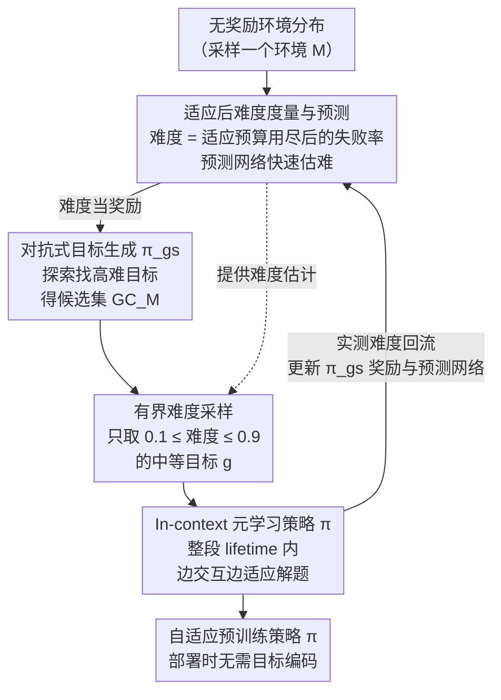

# Unsupervised Learning of Efficient Exploration: Pre-training Adaptive Policies via Self-Imposed Goals

## 论文信息
- **会议**: ICLR 2026
- **arXiv**: [2601.19810](https://arxiv.org/abs/2601.19810)
- **代码**: 已开源
- **领域**: 强化学习 / 无监督预训练 / 元学习
- **关键词**: 无监督RL, 自动课程学习, 元学习, 目标生成, 探索策略

## 一句话总结
提出 ULEE 方法，通过对抗式目标生成和基于适应后难度的课程学习，在无监督环境中元学习出具备高效探索和快速适应能力的预训练策略。

## 研究背景与动机

### 核心问题
大规模预训练在视觉和语言领域取得了巨大成功，但强化学习仍然以从头训练为主。如何在没有外部奖励的情况下预训练出通用的 RL 策略（foundation policy），使其具备可迁移的探索和适应能力？

### 现有方法的局限
1. **基于内在奖励的方法**（如 DIAYN）：学到的技能多样性有限，性能随训练推进后容易停滞甚至下降
2. **目标条件策略**：在目标未知或无法编码时表现不佳
3. **固定目标空间假设**：多数课程学习方法假设目标空间在训练和评估时一致
4. **基于即时性能的难度估计**：没有考虑适应预算，不适用于需要多轮适应的评估场景

### 关键动机
人类通过自主设定和追求目标来发展能力。论文关注三个核心问题：**目标如何生成**、**如何选择**、**如何从中学习**。在下游任务分布广泛且未知的场景下，零样本解决所有任务不可能，因此需要优化多轮探索和适应效率。

## 方法详解

### 整体框架

ULEE 想解决的是：在一批没有外部奖励的环境里，预训练出一个会快速探索、又能随交互历史不断适应的通用策略 $\pi$，而不必依赖任何下游任务信息。它的做法是让智能体自己给自己出题、自己学着解题——核心是一套**自动课程**：先用一个对抗式搜索策略在环境里找出当前 $\pi$ 还做不好的目标，再按难度过滤，只把"跳一跳够得着"的中等难度目标喂给 $\pi$ 训练。而"难不难"不按一次成功率算，而是看 $\pi$ 用完一段适应预算之后还解不解得出——这条**适应后难度**贯穿全程：它既是对抗搜索的奖励、又是采样过滤的依据、还是预测网络要拟合的标签。

### 关键设计

**1. 适应后难度度量与预测网络：让"难"匹配真实评估场景**

以往课程学习（如 GoalGAN）用策略当下一次的成功率来判断目标难易，但 ULEE 的部署场景是给智能体一段适应预算、看它最后能否解题，"一上来就难"和"练几轮还难"是两码事。为此 ULEE 把目标 $g$ 的难度定义为适应预算用尽后的失败率，

$$d(g; \pi, M) = 1 - \mathbb{E}_{\rho_M, P_M, \pi}\left[\frac{1}{K}\sum_{j=H-K+1}^{H}\mathbf{1}\{\exists t: f(s_{t+1}^{(j)})=g\}\right]$$

一个 lifetime 含 $H$ 个 episode，但只统计最后 $K$ 个的成功率，前面 $H-K$ 轮全部留给探索与适应。这样得到的难度衡量的是"练完之后还做不做得到"，正好对齐评估时关心的少样本适应能力；其中 $f$ 是把状态映射到目标空间的函数（如基于访问计数的 $f_{\text{counts}}$），它的选择给课程注入了关键的归纳偏置。问题是真实算一次 $d(g;\pi,M)$ 得让 $\pi$ 在环境里实打实跑一整个 lifetime，开销很大；于是 ULEE 再训一个难度预测器 $\hat{d}_\phi$，用监督回归去拟合实测难度，$\mathcal{L}_{DP}(\phi) = \frac{1}{|B_g|}\sum_{(g,\xi,\tilde{d})\in B_g}(\hat{d}_\phi(g,\xi) - \tilde{d}(g))^2$（$\xi$ 为上下文、$\tilde{d}$ 为实测标签）。有了它，下面的对抗搜索和采样都能直接查难度，不必每次都付环境交互成本。

**2. 对抗式目标生成：用一个搜索策略去戳痛点**

有了难度信号，还需要一个高效产难题的机制。ULEE 训练一个目标搜索策略 $\pi_{gs}$，让它的奖励直接就是所到状态对应目标的难度，$r_t^{gs} = d(f(s_t); \pi, M)$，整体最大化 $\mathcal{J}_{gs}(\pi_{gs}) = \mathbb{E}_{M,\pi_{gs}}\left[\sum_{t=0}^{T-1}\gamma^{t} r_t^{gs}\right]$——也就是说 $\pi_{gs}$ 被激励去主动找那些当前 $\pi$ 适应后仍解不好的目标，与 $\pi$ 形成对抗。每进入一个环境 $M$，先让 $\pi_{gs}$ 跑若干 episode 把它探到的状态收集成候选目标集 $GC_M$，再从中挑题给 $\pi$ 练。相比随机撒目标，这种对抗搜索能持续把课程顶在 $\pi$ 的能力边界上，避免课程退化成一堆早已学会的简单目标、导致学习停滞。

**3. 有界难度采样：避开太易和太难的无效题**

拿到候选集 $GC_M$ 后并非照单全收，而是只采中等难度区间的目标：$g_M \sim \text{Unif}(S)$，$S = \{g \in GC_M : LB \le d(g;\pi,M) \le UB\}$，取 $LB=0.1$、$UB=0.9$。太易（已经稳过）和太难（怎么练都过不了）的目标都几乎不提供学习信号，砍掉两端能让梯度集中在"跳一跳够得着"的目标上。消融显示，把这条有界采样换成在全部候选上均匀采样会明显变差，尤其当目标搜索退化为随机时，有界采样几乎是兜底学习信号的关键。

**4. In-context 元学习策略：把适应能力内化进一次前向**

最终被部署、也是唯一被评估的就是预训练策略 $\pi$。它采用黑箱元学习，输入是整段交互历史（过往观察、动作、奖励），输出当前动作，从而在一个 lifetime 内边交互边适应。训练目标是最大化整段 lifetime（跨 $H$ 个 episode）的累积折扣回报，

$$\mathcal{J}(\pi) = \mathbb{E}_{M \sim \mu^{\text{unsup}}, g \sim p(g|M)}\left[\mathbb{E}_{\rho_M, P_M, \pi}\left[\sum_{j=1}^{H}\sum_{t=0}^{T-1}\gamma^{(j-1)T+t} r_t^{(j)}\right]\right]$$

其中 $j$ 索引 lifetime 内各 episode。骨架用 Transformer-XL 承载长程历史上下文，策略用 PPO 优化。关键在于 $\pi$ 本身**不是目标条件**的——这正好绕开目标条件策略的死穴：评估时目标未知、无法编码或表示已严重分布外，$\pi$ 都只靠上下文历史自己适应，不需要任何目标编码即可直接部署。

## 实验

### 实验设置
- **环境**: XLand-MiniGrid，基于 JAX 的程序化生成部分可观测格子环境
- **三个基准**: 4Rooms-Trivial、4Rooms-Small、6Rooms-Small
- **基线**: DIAYN、PPO（从头训练）、RND（在线探索）、RL²（元学习）

### 主实验结果

| 指标 | ULEE | DIAYN | Random |
|------|------|-------|--------|
| 20-episode 探索覆盖率 | **最高（2x+）** | 中等 | 低 |
| Few-shot 适应（30 episode） | **3× 提升** | 单跳式改进 | - |
| Fine-tuning（1B steps） | **持续领先** | 短暂优势 | - |
| Meta-RL 初始化 | **全面提升** | - | 基线 |

### 消融实验

| 变体 | 目标搜索 | 采样策略 | 相对性能 |
|------|----------|----------|----------|
| ULEE (adversarial + bounded) | 对抗式 | 中等难度 | **最优** |
| ULEE (random + bounded) | 随机 | 中等难度 | 次优 |
| ULEE (adversarial + uniform) | 对抗式 | 均匀 | 略低 |
| ULEE (SED) | 对抗式 | 即时难度 | 难度增大时退化 |

### 关键发现
1. 对抗式目标搜索 + 中等难度采样效果最佳
2. 基于适应后性能的难度度量在更难环境中优势更大
3. 目标映射 $f_{\text{counts}}$ 比 $f_{\text{grid}}$ 更适合作为归纳偏差
4. 预训练预算增加到 50 亿步仍能持续改善
5. ULEE 能够泛化到不同网格大小和房间结构的 MiniGrid 任务

## 亮点
1. **适应后难度度量**：将课程学习从即时评估扩展到考虑适应预算的元学习场景，是一个重要概念创新
2. **无条件策略预训练**：不依赖目标条件化，直接部署，适用范围更广
3. **多层次评估**：覆盖零样本探索、few-shot 适应、长期微调和元学习初始化四个维度
4. **系统性消融**：清楚展示每个组件的贡献

## 局限性
1. 目前仅在 2D 网格世界中验证，向高维连续控制任务的扩展性未知
2. 目标映射 $f$ 的选择仍需人工设计，如何自动发现合适的目标空间是开放问题
3. 对抗式训练引入了额外的 25% 计算开销
4. 在最困难的分布外任务上仍有 60% 的任务无法获得回报

## 相关工作
- **无监督 RL**: DIAYN、RND 等内在奖励方法
- **自动课程学习**: GoalGAN、AMIGo 等，但都未考虑适应后度量
- **无监督元学习**: Gupta et al. (2018) 首先探索，ULEE 在此基础上引入对抗式课程
- **Ada (DeepMind)**: 在程序生成环境中大规模元学习，但使用外部任务分布而非自生成目标

## 评分
- **创新性**: ⭐⭐⭐⭐ — 适应后难度度量和无条件策略元学习的组合很有新意
- **实验充分性**: ⭐⭐⭐⭐ — 多维度评估，但环境难度有限
- **写作质量**: ⭐⭐⭐⭐ — 方法和实验组织清晰
- **实用性**: ⭐⭐⭐ — 突破性应用还需进一步扩展到更复杂环境

<!-- RELATED:START -->

## 相关论文

- [\[ICLR 2026\] Sample-efficient and Scalable Exploration in Continuous-Time RL](sample-efficient_and_scalable_exploration_in_continuous-time_rl.md)
- [\[ICLR 2026\] SPELL: Self-Play Reinforcement Learning for Evolving Long-Context Language Models](spell_self-play_reinforcement_learning_for_evolving_long-context_language_models.md)
- [\[ICLR 2026\] SPIRAL: Self-Play on Zero-Sum Games Incentivizes Reasoning via Multi-Agent Multi-Turn Reinforcement Learning](spiral_self-play_on_zero-sum_games_incentivizes_reasoning_via_multi-agent_multi-.md)
- [\[ICLR 2026\] Solving Parameter-Robust Avoid Problems with Unknown Feasibility using Reinforcement Learning](solving_parameter-robust_avoid_problems_with_unknown_feasibility_using_reinforce.md)
- [\[ICLR 2026\] Shop-R1: Rewarding LLMs to Simulate Human Behavior in Online Shopping via Reinforcement Learning](shop-r1_rewarding_llms_to_simulate_human_behavior_in_online_shopping_via_reinfor.md)

<!-- RELATED:END -->
