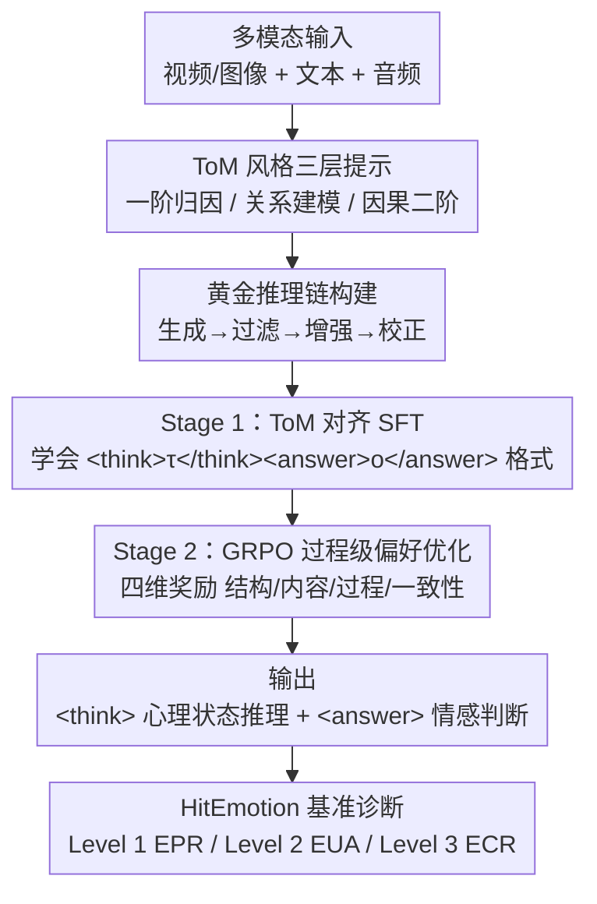

# Unveiling the Cognitive Compass: Theory-of-Mind-Guided Multimodal Emotion Reasoning

## 论文信息
- **会议**: ICLR 2026
- **arXiv**: [2602.00971](https://arxiv.org/abs/2602.00971)
- **代码**: [https://HitEmotion.github.io/](https://HitEmotion.github.io/)
- **领域**: 多模态情感计算 / 心智理论 / 强化学习 / 大模型
- **关键词**: Theory of Mind, 情感推理, MLLM, 层次基准, GRPO, 推理链优化

## 一句话总结
构建基于心智理论（ToM）的层次化多模态情感理解基准 HitEmotion，并提出 TMPO 框架通过中间心理状态作为过程级监督来增强 MLLM 的情感推理能力。

## 研究背景与动机

### 核心问题
尽管多模态大语言模型（MLLM）在各种任务上表现出色，但在深层情感理解方面仍然存在明显缺陷。核心原因在于：

**缺乏统一认知框架**：现有基准仅提供粗粒度得分，无法定位模型推理能力的断点

**推理链不忠实**：CoT 推理看似连贯但实质是模板匹配，缺乏对心理状态的真正追踪

**情感幻觉**：模型在跨模态冲突线索下产生扭曲的情感归因

### 现有基准局限
- EQ-Bench、EmoBench 等仅覆盖文本模态
- EmoBench-M、EmotionHallucer 等虽然多模态但任务设计分散，没有按认知深度组织
- 无一基准同时提供推理链和理由评估

## 方法详解

### 整体框架

这篇论文做两件事：先用一个按认知深度组织的基准 HitEmotion 把「模型到底在哪一层情感推理上掉链子」量化出来，再用 TMPO（ToM-guided reasoning chain Preference Optimization）训练框架把心智理论（Theory of Mind, ToM）的中间心理状态当成可监督、可奖励的过程信号，去补上 MLLM 在深层情感推理上的断点。

TMPO 的训练链路从「怎么把心理状态写下来」开始：先用与认知三层对齐的 ToM 风格提示约束模型，把推理过程写进 `<think>`、最终情感判断写进 `<answer>`；由于现有数据集没有现成的「黄金推理链」，论文用一条四步流水线（生成→过滤→增强→校正）批量造出追踪心理状态的标注链。拿到这批数据后，先做 ToM 对齐的监督微调（SFT）让模型学会这套结构化推理格式，再用 GRPO 做过程级偏好优化、让推理链不只是格式像、还要忠实可靠。训练出的模型最终放到 HitEmotion 三层基准上接受诊断式评测。

### 关键设计

**1. HitEmotion 基准：按认知深度把情感任务切成三层，定位推理断点**

现有基准只给一个粗粒度总分，无法回答「模型是在感知层就错了，还是在因果归因层才崩」。HitEmotion 把 24 个任务、20,114 个实例（覆盖视频和图像）按认知深度堆成三层。Level 1 是情感感知与识别（Emotion Perception and Recognition, EPR），只要求把多模态信号映射到预定义情感类别，如面部表情识别、多模态情感识别；Level 2 是情感理解与分析（Emotion Understanding and Analysis, EUA），需要上下文感知和关系推理，如幽默理解、讽刺检测、多方对话情感；Level 3 是情感认知与推理（Emotion Cognition and Reasoning, ECR），要求因果推理和二阶心智推理，如情感诱发推理、情感解释、反讽理解。这样一旦某个模型在 Level 3 大幅掉分而 Level 1 正常，就能精确指认它缺的是高阶认知而非低阶感知。它也是表 1 里唯一同时提供推理链（Rea-chain）和理由（Rationale）标注的基准。

**2. ToM 风格三层提示 + 黄金推理链构建：先把「心理状态怎么推」写成可学的标注**

要让模型学会追踪心理状态，先得有「正确的推理过程」长什么样的样本，而现有数据集只有答案、没有推理链。论文用一个与基准三层一一对应的 ToM 风格提示 $\mathcal{P}$ 约束输出格式：Level 1 做一阶心理状态归因，整合可观察信号去推断情感；Level 2 做关系与上下文心智建模，把情感关联到特定实体或沟通目标；Level 3 做因果归因与二阶推理，解释情感为何产生、又如何被社交地解读。任务被统一形式化为映射 $(T,A,V)\rightarrow(\tau,o)$，即从文本 $T$、音频 $A$、视频 $V$ 推出推理链 $\tau$ 和答案 $o$。由于黄金 $\tau$ 不存在，论文用一条四步流水线——LLM 生成 → 过滤 → 增强 → 校正——批量造出高质量、真正追踪心理状态的推理链。值得一提的是，这套 ToM 提示即便不训练、单作为提示策略，也能显著拉高闭源模型在高层任务上的表现，相当于给推理搭了一层「脚手架」。

**3. Stage 1 ToM 对齐 SFT：把结构化推理格式先教给模型**

模型的 CoT 常常看着连贯实则是模板匹配，没有真正把推理和结论分开。SFT 阶段用结构化模板强制解耦：中间推理一律用 `<think></think>` 包裹、最终答案用 `<answer></answer>` 包裹，目标字符串是 $y=\texttt{<think>}\tau\texttt{</think>}\texttt{<answer>}o\texttt{</answer>}$，训练就是在这种格式下最小化负对数似然：

$$\mathcal{L}_{\text{SFT}}(\theta) = -\mathbb{E}_{((\mathcal{P},T,A,V), y)} [\log \pi_\theta(y | \mathcal{P}, T, A, V)]$$

其中 $\pi_\theta$ 是参数为 $\theta$ 的 MLLM 策略。这一步让模型获得「先深思、再下结论」的初步结构化推理能力，但只是模仿格式，还谈不上忠实。

**4. Stage 2 GRPO 过程级偏好优化：把心理状态变成奖励，而不只看最终对错**

SFT 只能模仿格式，无法保证推理链「忠实」。Stage 2 对每个输入采样 $N$ 个候选输出 $\{y_1,\dots,y_N\}$，用一个四维奖励同时评判结果和过程：

$$R(y) = \mu_1 R_{\text{structure}} + \mu_2 R_{\text{content}} + \mu_3 R_{\text{process}} + \mu_4 R_{\text{consistency}}$$

四个分量各管一件事：$R_{\text{structure}}$ 看推理步骤的顺序是否正确，$R_{\text{content}}$ 看最终答案对不对，$R_{\text{process}}$ 奖励是否用了领域特定的心理状态语言，$R_{\text{consistency}}$ 则对逻辑和事实不一致施加惩罚。关键在于 $R_{\text{process}}$ 和 $R_{\text{consistency}}$ 让中间心理状态直接进入梯度——它既是监督信号也是奖励来源，而不只是被当成通往答案的中转。优化用 GRPO，在组内归一化相对优势 $A_i$ 上做带 KL 约束的策略提升：

$$\max_{\pi_\theta} \mathbb{E}_{y_i \sim \pi_{\text{old}}} \left[ \frac{\pi_\theta(y_i)}{\pi_{\text{old}}(y_i)} A_i \right] - \beta D_{KL}(\pi_\theta \| \pi_{\text{ref}})$$

其中 $A_i$ 由组内奖励 $R(y_i)$ 的相对排名得到，KL 项把策略约束在参考模型 $\pi_{\text{ref}}$（即初始 SFT 模型）附近以稳定训练。这一步把推理能力从「通用涌现」推向「领域获取」。

## 实验

### 基线模型评测（EPR Level 1）

| 模型 | FESD | ISA | MESA | MER | MSA | OSA | SIA |
|------|------|-----|------|-----|-----|-----|-----|
| VideoLLaMA3-7B | 61.78 | 46.85 | 21.60 | 52.18 | 64.62 | 67.89 | 35.20 |
| LLaVA-One-Vision-7B | 63.44 | 49.19 | 17.05 | 39.50 | 65.40 | 63.00 | 27.00 |

### 关键发现

1. **SOTA 模型在高层认知任务上表现不一致**：即使最强的闭源模型在 ECR 层仍存在显著缺陷
2. **ToM 推理链单独作为提示策略就能显著提升闭源模型表现**：验证了 ToM 作为推理"脚手架"的有效性
3. **TMPO 优化带来一致性提升**：在所有评估任务上超越基线，生成的推理链在忠实度和逻辑一致性方面显著更优
4. **从"通用涌现"到"领域获取"**：TMPO 将推理能力从通用属性转化为认知特化技能

## 亮点
1. **首个将心理学理论与 MLLM 推理过程和理由生成统一的评估框架**
2. **ToM 提示机制设计精妙**：三层认知层次对应三种不同深度的推理模板
3. **GRPO + 过程级奖励的创新组合**：中间心理状态既作为监督信号也作为奖励来源
4. **规模性**：24 个数据集、20K+ 实例的综合基准

## 局限性
1. 金标准推理链依赖 LLM 生成，可能引入 LLM 固有偏差
2. 基于重构已有数据集，原始标注质量不一
3. GRPO 训练计算成本较高
4. 主要评估在单轮 QA 场景，对多轮交互的情感推理未充分探索

## 相关工作
- **多模态情感计算**: SALV、PAD 等融合策略从早期/晚期发展到中间交互方案
- **情感智能评估**: EQ-Bench → EmoBench-M → EmotionHallucer 的演进
- **ToM 推理**: 从 ToMBench 到 MMToM-QA 揭示 MLLM 的 ToM 缺陷
- **推理优化**: DeepSeek-R1 的 GRPO 方法在文本推理中的成功

## 评分
- **创新性**: ⭐⭐⭐⭐ — ToM 认知框架与 MLLM 评估/训练的深度融合
- **实验充分性**: ⭐⭐⭐⭐⭐ — 24 个数据集的全面评估
- **写作质量**: ⭐⭐⭐⭐ — 问题定义清晰，方法动机充分
- **实用性**: ⭐⭐⭐⭐ — 提供评估工具包和优化方法

<!-- RELATED:START -->

## 相关论文

- [\[ICLR 2026\] RuleReasoner: Reinforced Rule-based Reasoning via Domain-aware Dynamic Sampling](rulereasoner_reinforced_rule-based_reasoning_via_domain-aware_dynamic_sampling.md)
- [\[ICLR 2026\] SPIRAL: Self-Play on Zero-Sum Games Incentivizes Reasoning via Multi-Agent Multi-Turn Reinforcement Learning](spiral_self-play_on_zero-sum_games_incentivizes_reasoning_via_multi-agent_multi-.md)
- [\[ICLR 2026\] Sample-efficient and Scalable Exploration in Continuous-Time RL](sample-efficient_and_scalable_exploration_in_continuous-time_rl.md)
- [\[ICLR 2026\] Shop-R1: Rewarding LLMs to Simulate Human Behavior in Online Shopping via Reinforcement Learning](shop-r1_rewarding_llms_to_simulate_human_behavior_in_online_shopping_via_reinfor.md)
- [\[ICLR 2026\] Virne: A Comprehensive Benchmark for RL-based Network Resource Allocation in NFV](virne_a_comprehensive_benchmark_for_rl-based_network_resource_allocation_in_nfv.md)

<!-- RELATED:END -->
