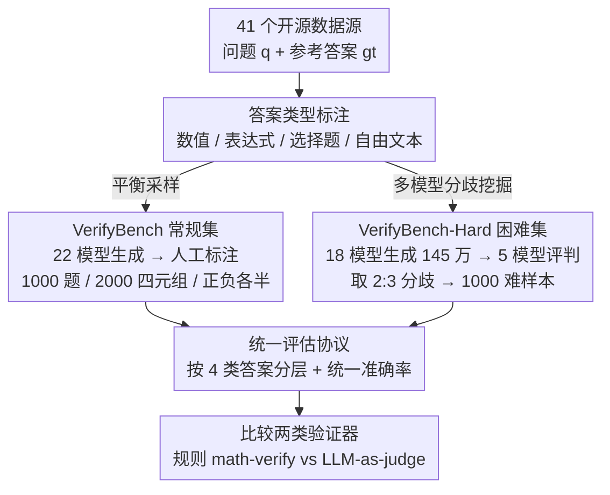

# VerifyBench: Benchmarking Reference-based Reward Systems for Large Language Models

**会议**: ICLR 2026  
**arXiv**: [2505.15801](https://arxiv.org/abs/2505.15801)  
**代码**: [GitHub](https://github.com/ZJU-REAL/VerifyBench)  
**领域**: 强化学习  
**关键词**: reward model, benchmark, verification, LLM, reinforcement-learning

## 一句话总结

针对大型推理模型（LRM）训练中广泛使用的基于参考答案的奖励系统，构建了 VerifyBench 和 VerifyBench-Hard 两个评测基准，通过严格的人工标注评估各类验证系统的准确性，发现即使最强模型在困难样本上也仅达约 88% 准确率，揭示了当前验证系统的显著改进空间。

## 研究背景与动机

**LRM 训练依赖参考答案奖励**：OpenAI o1、DeepSeek-R1 等推理模型在 RL 训练中使用基于参考答案的奖励系统（reference-based reward），即根据模型输出与标准答案的一致性来给予奖励。

**现有 benchmark 聚焦偏好比较**：现有奖励模型评测（如 RewardBench）主要评估成对偏好判断——在两个回答中选择更好的一个，而非判断单个回答是否正确。

**评测与实际使用场景脱节**：LRM 训练中的奖励系统需要判断回答与参考答案是否一致（绝对正确性），而非比较两个回答的优劣（相对偏好），存在本质区别。

**规则方法的局限**：SimpleRL 中使用的 math-verify 等规则方法在数学表达式匹配上存在明显缺陷，但缺乏标准化评测来量化这些不足。

**困难样本的需求**：模型在简单验证任务上表现良好（约 95%），但在真正有歧义的困难样本上差距显著（约 70-88%），需要专门的困难基准来推动进步。

## 方法详解

### 整体框架

VerifyBench 把"评测奖励系统"从主流的偏好比较重新定义成一个绝对正确性判断任务：给定问题 $q$、参考答案 $gt$ 和模型回答 $r$，验证系统 $R_\phi$ 只需判断 $r$ 是否与 $gt$ 一致，而不是在两个回答里挑更好的那一个——这才是 LRM 在 RL 训练里真正用奖励系统做的事。围绕这个定义，作者从 41 个开源数据源出发，并行构造两个数据集：一个用"答案类型标注 → 22 个模型生成回答 → 平衡下采样"做出分布自然、正负均衡的常规集 VerifyBench，另一个用"18 模型海量生成 → 5 个顶级模型评判 → 挑出多模型分歧样本"挖出最有歧义的困难集 VerifyBench-Hard。两个集合的标签都经双人独立标注 + meta-annotator 裁决锁定，最后接入同一套评估协议，按四种答案类型分层、用统一准确率同时考验规则方法（math-verify）与 LLM-as-judge 两类验证器。

### 关键设计

**1. VerifyBench 常规集：用平衡采样消除评测偏差**

现有奖励模型评测多是成对偏好比较，与 LRM 在 RL 训练里"判断单个回答对不对"的真实需求脱节。VerifyBench 因此用 Llama-3.3-70B 先把问题自动标成数值、代数表达式、选择题、自由文本四种答案类型，每类随机采 2,000 题凑成 8,000 候选，再用 22 个开/闭源模型生成 17.6 万个回答。关键在最后一步：作者发现模型预测在答案类型和正确性上都有明显偏斜，于是做受控下采样——每类只保留 250 题、每题配 1 正 1 误两个回答，最终得到 1,000 题、2,000 个 $(q, gt, r, y)$ 四元组（$y$ 为人工标注的正确性标签），四类均匀、正负各半。这样最终分数只反映验证能力本身，而不会被某类答案多、或正样本多带偏。

**2. VerifyBench-Hard 困难集：用多模型分歧挖掘争议样本**

常规验证任务上各大模型已经能达到 93–95% 的准确率，分数挤在天花板附近，难以拉开方法差距。作者先用 18 个开源模型对同一批问题生成约 145 万个回答，再让 5 个在 VerifyBench 上表现最好的 LLM 逐一评判，专门挑出"两个模型判一边、另三个判另一边"的 2:3 分歧样本——这些正是真正有歧义、最能暴露验证系统短板的案例。经过跨数据域和来源的分层采样选出 2,000 个交人工标注，最终得到 1,000 个困难样本。与常规集不同，这里采用自然分布而非强制平衡，因此正确回答只占 29.1%，这一偏斜本身后来揭示了大模型"误接受"错误答案的倾向。

**3. 统一评估协议：分层 + 同标尺比较两类验证器**

真实训练里两条验证路线并存——DeepSeek-R1 用规则方法防止 reward hacking，Seed1.5-Thinking 用模型方法换取更精确的信号，但一直缺乏公平比较，也说不清各自栽在哪。VerifyBench 把两类系统都接进同一个准确率指标

$$\text{Accuracy} = \frac{1}{|\mathcal{D}|} \sum_{(q,gt,r,y) \in \mathcal{D}} \mathbb{I}[E(R_\phi(q, gt, r)) = y]$$

其中 $R_\phi$ 是验证系统输出、$E(\cdot)$ 抽取其判定、$y$ 为人工标签。更关键的是不只报一个总分，而是按四种答案类型分别给准确率：数值（Numeric）比较直接、代数表达式（Expression）要判数学等价、选择题（Multi-choice）要理解选项语义、自由文本（String）最难精确匹配。正是这种分层视角暴露了规则方法 math-verify 在选择题（55.00%）和自由文本（51.60%）上接近随机猜测的系统性缺陷——单看总分根本看不出它具体弱在哪。

整个 benchmark 不涉及训练，质量靠数据流程保证：每个样本至少两名标注者独立判定、分歧时由 meta-annotator 裁决；涉及代码的正确性定义为"可执行且通过随机测试输入"；分层采样控制数据域与来源分布，避免采样偏差渗入分数。

## 实验关键数据

### 主实验

**VerifyBench 总体准确率（%）**：

| 模型/方法 | Numeric | Expression | MC | String | AVG |
|----------|---------|-----------|-----|--------|-----|
| math-verify (规则) | 85.60 | 75.60 | 55.00 | 51.60 | **66.95** |
| GPT-4o | 94.80 | 90.20 | 96.80 | 90.80 | 93.15 |
| DeepSeek-V3 | 96.80 | 93.00 | 97.60 | 91.60 | 94.75 |
| DeepSeek-R1 | 98.00 | 92.60 | 98.00 | 92.00 | **95.15** |
| Qwen3-32B | 97.60 | 94.00 | 99.00 | 92.60 | 95.80 |
| gpt-oss-120b | 98.00 | 94.80 | 99.20 | 91.40 | **95.85** |

**VerifyBench-Hard 总体准确率（%）**：

| 模型/方法 | Numeric | Expression | MC | String | AVG |
|----------|---------|-----------|-----|--------|-----|
| math-verify (规则) | 84.52 | 82.95 | 68.37 | 78.26 | **76.00** |
| GPT-4o | 71.43 | 65.91 | 75.35 | 71.30 | 72.60 |
| DeepSeek-R1 | 82.14 | 81.82 | 90.93 | 85.22 | **86.60** |
| gpt-oss-120b | 84.13 | 80.68 | 92.56 | 86.09 | **87.90** |
| Llama-3.2-1B | 44.40 | 41.00 | 37.60 | 53.60 | 44.15 |

### 消融实验

**不同答案类型的难度分析（VB-Hard）**：

| 答案类型 | VerifyBench 最高 | VB-Hard 最高 | 下降幅度 |
|---------|----------------|-------------|---------|
| Numeric | 98.00% | 84.52% | -13.5% |
| Expression | 94.80% | 82.95% | -11.9% |
| Multi-choice | 99.20% | 92.56% | -6.6% |
| String | 92.60% | 86.09% | -6.5% |

**模型规模效应（Llama 系列，VB-Hard）**：

| 模型 | 参数量 | VB-Hard AVG |
|------|--------|------------|
| Llama-3.2-1B | 1B | 25.60% |
| Llama-3.2-3B | 3B | 33.90% |
| Llama-3.1-8B | 8B | 43.20% |
| Llama-3.3-70B | 70B | 54.70% |
| Llama-4-17B-16E | 17B×16E | 48.50% |

### 关键发现

1. **规则方法严重不足**：math-verify 在 VerifyBench 上仅 66.95%，特别是在选择题（55.00%）和自由文本（51.60%）上接近随机猜测，说明 DeepSeek-R1 使用的规则奖励存在显著缺陷。
2. **VB vs VB-Hard 的巨大差距**：顶级模型在 VerifyBench 上达 95%+ 但在 VB-Hard 上仅 87-88%，证明困难验证任务确实是当前瓶颈。
3. **大模型更容易"误接受"**：VB-Hard 中正确回答仅占 29.1%，说明更大模型更倾向于错误地将不正确答案判为正确——这对 RL 训练尤其危险，会产生虚假正奖励。
4. **模型规模提升有限**：在 VB-Hard 上，从 Llama-1B 到 70B 准确率从 25.6% 提升到 54.7%，但仍远未达到可靠水平，表明单纯扩大模型规模不够。
5. **推理能力有助于验证**：DeepSeek-R1 的推理能力在 VB-Hard 上带来了明显优势（86.60% vs GPT-4o 的 72.60%）。

## 亮点与洞察

1. **填补了评测空白**：首个专门评估基于参考答案的奖励系统的 benchmark，直接对应 LRM RL 训练的实际场景。
2. **VerifyBench-Hard 的构建方法巧妙**：利用多模型分歧来识别困难样本，确保 benchmark 具有区分度。
3. **规则方法的系统性弱点**：量化了 math-verify 在不同答案类型上的表现差异，为 RL 训练中奖励系统的选择提供了实证指导。
4. **"误接受"偏向的发现**：大模型倾向于接受错误答案的发现，对 RL 训练中的 reward hacking 有重要警示意义。
5. **严格的数据质量保证**：双人标注 + meta-annotator 仲裁，41 个数据源 × 22 个模型的大规模覆盖。

## 局限与展望

1. **仅限推理任务**：VerifyBench 聚焦数学和逻辑推理，未覆盖代码生成、创意写作等场景的验证。
2. **答案类型有限**：排除了证明型和开放式问题，而这些在实际研究中同样重要。
3. **静态 benchmark**：随着模型能力提升，VB-Hard 可能很快饱和，需要持续更新。
4. **评测方式单一**：仅使用 prompt-based LLM-as-judge，未深入探索专门训练的验证模型。
5. **未探索验证失败的下游影响**：验证不准确如何具体影响 RL 训练质量（如 reward hacking、训练不稳定）未做实证分析。

## 相关工作与启发

- **RewardBench**：评估成对偏好判断的 benchmark，VerifyBench 与之互补——一个评估相对偏好，一个评估绝对正确性。
- **DeepSeek-R1**：使用规则方法（rule-based reward）防止 reward hacking，但 VerifyBench 揭示了规则方法的显著不足（66.95%），建议结合模型方法。
- **Seed1.5-Thinking**：使用模型方法生成更精确的奖励信号，VerifyBench 为评估这类方法提供了标准化工具。
- **启发**：RL 训练中的验证准确性直接影响模型推理能力的上限。在 VB-Hard 上的 ~88% 准确率意味着约 12% 的奖励信号是错误的，这会系统性地降低 RL 训练的效果。建立更准确的验证系统可能是提升推理模型能力的关键瓶颈之一。

## 评分

- **新颖性**: ⭐⭐⭐⭐ 首次系统性地将 reference-based reward 评估从偏好比较中独立出来，VB-Hard 的构建方法有创意
- **实验充分度**: ⭐⭐⭐⭐⭐ 覆盖 20+ 个模型、4 种答案类型、两个难度级别，人工标注严格
- **写作质量**: ⭐⭐⭐⭐ 问题定义清晰，benchmark 构建流程完整，数据统计详尽
- **价值**: ⭐⭐⭐⭐ 对 LRM RL 训练中的奖励系统设计有直接指导意义，揭示了规则方法的不足和模型验证的改进空间

<!-- RELATED:START -->

## 相关论文

- [\[ICLR 2026\] AWM: Accurate Weight-Matrix Fingerprint for Large Language Models](awm_accurate_weight-matrix_fingerprint_for_large_language_models.md)
- [\[ICLR 2026\] Robust Multi-Objective Controlled Decoding of Large Language Models](robust_multi-objective_controlled_decoding_of_large_language_models.md)
- [\[ICLR 2026\] Post-training Large Language Models for Diverse High-Quality Responses](post-training_large_language_models_for_diverse_high-quality_responses.md)
- [\[ICLR 2026\] TROLL: Trust Regions improve Reinforcement Learning for Large Language Models](troll_trust_regions_improve_reinforcement_learning_for_large_language_models.md)
- [\[ICLR 2026\] GraphOmni: A Comprehensive and Extensible Benchmark Framework for Large Language Models on Graph-theoretic Tasks](graphomni_a_comprehensive_and_extensible_benchmark_framework_for_large_language_.md)

<!-- RELATED:END -->
