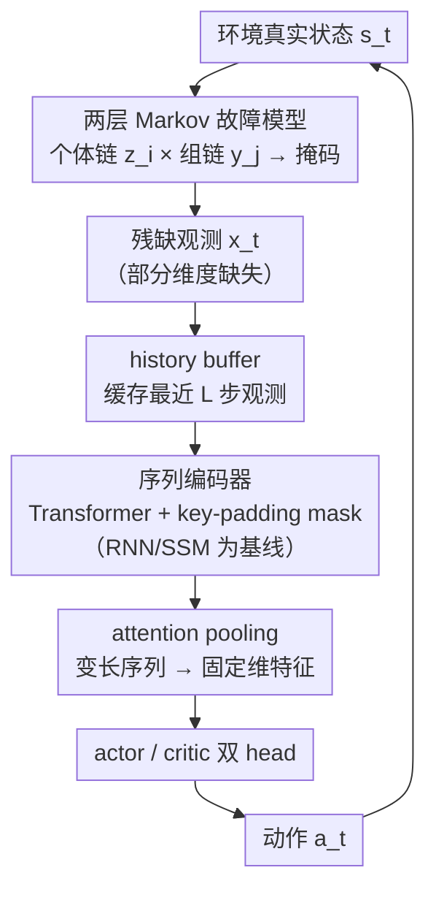

# When Sensors Fail: Temporal Sequence Models for Robust PPO under Sensor Drift

**会议**: ICLR 2026  
**arXiv**: [2603.04648](https://arxiv.org/abs/2603.04648)  
**代码**: 无  
**领域**: 强化学习  
**关键词**: 传感器故障, 部分可观测性, 鲁棒性, Transformer, 状态空间模型, PPO, 序列建模

## 一句话总结
本文研究PPO在时间持续性传感器故障下的鲁棒性，提出将Transformer和SSM等序列模型集成到PPO中，推导了随机传感器故障下无限时间horizon奖励退化的高概率上界，并在MuJoCo实验中验证Transformer-PPO在严重传感器dropout下显著优于MLP、RNN和SSM基线。

## 研究背景与动机

**领域现状**：真实世界RL系统（机器人控制、自动驾驶）依赖的传感器反馈常常不可靠——故障、通信中断或瞬态损坏导致部分可观测性和性能退化。

**现有痛点**：(1) 标准MLP策略假设完全观测状态，传感器不可靠时性能急剧下降；(2) 实际系统中传感器故障具有时间持续性和组间关联性（如共享通信总线/电源），简单的独立掩码模型不够真实；(3) 现有序列模型在RL中的鲁棒性比较（如RLBenchNet）仅是纯经验的，缺乏理论刻画。

**核心矛盾**：RL策略的鲁棒性与其对时间上下文的利用能力直接相关，但缺乏理论框架量化这种关系。

**本文目标**：(1) 提供传感器故障下奖励退化的理论bound；(2) 系统比较不同序列架构在PPO中的鲁棒性；(3) 理解哪些架构特性驱动了鲁棒性差异。

**切入角度**：建立两层Markov传感器故障模型（个体+组级别），集成多种序列编码器进PPO，理论+实验双轨验证。

**核心 idea**：Transformer通过自注意力机制灵活引用历史有效观测，自然跳过缺失数据gap，是传感器不可靠环境下最鲁棒的策略架构。

## 方法详解

### 整体框架
本文要回答的问题是：当传感器会不定时掉线、策略只能看到残缺观测时，PPO 该用什么样的网络架构才扛得住。整条流水线是这样转的：先用一个两层 Markov 链刻画真实系统中"既有个体故障又有成组故障"的传感器失效过程，由它对环境真实状态打掩码、产生残缺观测；这些观测被压进一个固定长度的历史缓存（history buffer），再交给一个序列编码器（Transformer 或 RNN/SSM）把缺失位置屏蔽掉、从可用历史里重建出一个固定维特征；该特征同时喂给 PPO 的 actor 和 critic 两个 head 输出动作与价值。在这套运行流水线之外，本文还从理论上推导出一个高概率的奖励退化上界，把"哪些因素决定鲁棒性"拆成可解释的因子，并在 MuJoCo 上对 8 种架构做横评。

### 关键设计

**1. 两层 Markov 传感器故障模型：把"独立掩码"换成贴近真实的相关故障**

整体框架里给观测打掩码的第一环，必须先把"故障长什么样"建对。现有工作大多假设每个传感器独立、逐帧随机失效，但真实系统里共享通信总线或电源的传感器往往成组同时挂掉，且故障会持续若干步而非逐帧重采样。本文为此设计两层结构：个体层给每个传感器 $i$ 一条二值 Markov 链 $z_i(t)\in\{0,1\}$（故障率 $p_{\text{fail}}$、恢复率 $p_{\text{recover}}$），组层给每个组 $j$ 一条链 $y_j(t)\in\{0,1\}$（参数 $p_{\text{fail}}^{\text{group}}$、$p_{\text{recover}}^{\text{group}}$）；传感器真正可用当且仅当个体和所在组都在线，即有效状态 $x_i(t)=z_i(t)\cdot y_j(t)$，稳态可用概率因两层独立而相乘 $\pi_x=\pi_z\cdot\pi_y$，有效故障概率 $p_{\text{fail}}^{\text{eff}}=1-(1-p_{\text{fail}})(1-p_{\text{fail}}^{\text{group}})$。Markov 结构天然带来时间持续性，组层耦合带来相关性，两者合起来就能模拟快速个体抖动、成组掉线、慢恢复长中断等丰富故障模式，使鲁棒性评测不再失真。

**2. 序列编码器统一接入 PPO：Transformer 用自注意力跨越缺失、RNN/SSM 作对照**

观测一旦残缺，策略就必须从历史里把信息补回来，所以框架中段把序列编码器统一插进 PPO 的 actor-critic 骨架。核心架构是 Transformer-PPO：维护一个长度 $L$ 的循环 history buffer 缓存最近观测，经线性投影加正弦位置编码后送入 Transformer encoder，并用 key-padding mask 把无效（缺失）位置直接屏蔽，让注意力只在真正可用的 token 上计算；随后一个可学习的 attention pooling 把变长序列加权汇聚成固定维特征，分别喂给 actor 和 critic 两个 head。这样每个动作的产生都能跨越数据 gap 直接 attend 到任意一段有效历史，缺失越多、回看越远，越能体现注意力相对 recurrent 结构的优势。为公平横评，本文把 GRU、LRU、LinOSS 等递归/状态空间模型也套进同一套 PPO 骨架，统一成接口 $(h_t,z_t)=\mathcal{E}_\psi(h_{t-1},x_t;d_t)$，其中 $h_t$ 为隐状态、$d_t$ 为 episode 结束标志（用于在边界重置状态）。这类模型靠逐步更新的隐状态隐式记忆历史，但其状态更新假设输入流平滑连续，一旦遇到成组、持续的缺失就容易偏移或冲掉关键信息——这正为后文"为何 recurrent 不如 attention 鲁棒"的实验结论埋下伏笔。

**3. 高概率奖励退化 bound：把鲁棒性拆成可解释的若干因子**

为了不止于经验比较，本文在若干平滑性与混合性假设（Assumptions 5.1–5.5）下证明，以概率 $\geq 1-\delta$ 累积奖励退化 $S$ 满足

$$S \leq \mu_S + C_{\max}\min\left\{\sqrt{\frac{2\tau}{1-\gamma^2}\ln\frac{2}{\delta}} + \frac{4}{3}\tau\ln\frac{2}{\delta},\ \frac{1}{1-\gamma}\right\}$$

其中均值退化 $\mu_S\leq\frac{L_Q L_\pi}{1-\gamma}\sum_{i=1}^d(1-\pi_{x,i})h_i$，最坏情况下单步影响 $C_{\max}=L_Q L_\pi\sum_i B_i$，$\tau$ 是增广 Markov 链的 mixing time。这个式子把退化拆成均值项与波动项：均值项只依赖各传感器的边际可用率 $\pi_{x,i}$，故障的相关性不直接进入期望；波动项随 mixing time $\tau$ 以 $\sqrt{\tau}$ 和 $\tau$ 两个量级增长，意味着故障越持久（链混合越慢）抖动越大；而策略平滑性 $L_\pi$ 与 critic 平滑性 $L_Q$ 全局缩放整个上界——这正解释了为何能利用历史、产生更平滑动作的序列模型更鲁棒，也给出了"提升可用率、缩短中断、压低策略 Lipschitz 常数"这一可操作的鲁棒化方向。

## 实验关键数据

### 实验设置
- 4个MuJoCo环境：HalfCheetah-v4, Hopper-v4, Walker2d-v4, Ant-v4
- 8种PPO agent：MLP + 3 RNNs/SSMs(LRU, GRU, LinOSS) + 3 Transformers(Transformer, UniTS, GTrXL)
- 传感器参数：$p_{\text{fail}}=1\%$, $p_{\text{recover}}=90\%$, $p_{\text{fail}}^{\text{group}}=55\%$, $p_{\text{recover}}^{\text{group}}=90\%$ → 有效恢复率60%

### 主实验结果

| 架构 | 完全观测 | 60%部分观测 | 退化程度 |
|------|---------|-----------|---------|
| MLP | 通常最高 | 严重退化 | **最大** |
| GRU | 竞争力中等 | 偶尔略好于MLP | 显著退化 |
| LRU | 竞争力中等 | 偶尔略好于MLP | 显著退化 |
| LinOSS | 中等 | 中等 | 显著退化 |
| GTrXL | 中等 | 表现不稳定 | 中等 |
| **Transformer** | **竞争力强** | **所有环境最优** | **最小** |
| UniTS | 最差 | 最差 | - |

### 关键发现
- **完全观测下**：MLP通常最优（MuJoCo环境是Markovian的），序列模型的额外复杂性有时反而是负担
- **部分观测下**：Transformer一致性最鲁棒，在所有环境上评测median最高
- RNN/SSM（包括GTrXL）的内存机制在传感器故障下效果有限——recurrent dynamics对输入的均匀处理和平滑时间流假设在数据缺失时被违反
- UniTS在所有设置下表现最差——其per-variable独立处理的归纳偏置不适合需要跨变量joint temporal patterns的连续控制

## 亮点与洞察
- **理论bound的实用价值**：明确了影响鲁棒性的关键因素——策略平滑性、critic敏感性、传感器可用率、故障持续性。这为设计鲁棒agent提供了原则性指导
- **Transformer vs Recurrence的深层解释**：Stateless Transformer处理所有变量jointly within单个序列，自注意力允许每个输出直接attend到所有可用历史token，自然跳过gap；而recurrent models的sequential state update在缺失输入时会diverge或丢失关键信息
- **实用的传感器模型**：两层Markov模型可模拟丰富的故障模式（快速个体故障、快速组故障、混合动态、慢恢复长中断）

## 局限与展望
- MuJoCo环境相对简单，更复杂的真实机器人任务有待验证
- 所有模型共享固定PPO配置和匹配的架构容量——更深入的架构搜索可能改变排名
- 理论bound依赖策略平滑性假设，对深度网络策略的tight估计仍有挑战
- 传感器故障模型假设mask独立于状态（Assumption 5.5），实际中状态与传感器状态可能相关

## 相关工作与启发
- **vs DRQN**: DRQN用LSTM处理部分观测但缺乏理论分析，且不针对传感器故障的时间结构
- **vs RLBenchNet**: RLBenchNet纯经验比较且掩码机制过于简化（永久删除速度/缩小观测窗），不建模真实传感器故障
- **vs Decision Transformer**: DT用于offline RL，本文聚焦online PPO下的鲁棒性

## 评分
- 新颖性: ⭐⭐⭐⭐ 传感器故障模型+理论bound+系统架构比较的组合有价值
- 实验充分度: ⭐⭐⭐⭐ 8种架构、4种环境、8种子、完全/部分观测对比，统计严谨
- 写作质量: ⭐⭐⭐⭐⭐ 理论清晰、解释直观、与先前工作对比充分
- 价值: ⭐⭐⭐⭐ 为鲁棒RL的架构选择提供理论支撑和经验指导

<!-- RELATED:START -->

## 相关论文

- [\[NeurIPS 2025\] Incremental Sequence Classification with Temporal Consistency](../../NeurIPS2025/reinforcement_learning/incremental_sequence_classification_with_temporal_consistency.md)
- [\[AAAI 2026\] DRMD: Deep Reinforcement Learning for Malware Detection under Concept Drift](../../AAAI2026/reinforcement_learning/drmd_deep_reinforcement_learning_for_malware_detection_under_concept_drift.md)
- [\[ICLR 2026\] Robust Multi-Objective Controlled Decoding of Large Language Models](robust_multi-objective_controlled_decoding_of_large_language_models.md)
- [\[NeurIPS 2025\] Robust Adversarial Reinforcement Learning in Stochastic Games via Sequence Modeling](../../NeurIPS2025/reinforcement_learning/robust_adversarial_reinforcement_learning_in_stochastic_games_via_sequence_model.md)
- [\[ICLR 2026\] Deep SPI: Safe Policy Improvement via World Models](deep_spi_safe_policy_improvement_via_world_models.md)

<!-- RELATED:END -->
