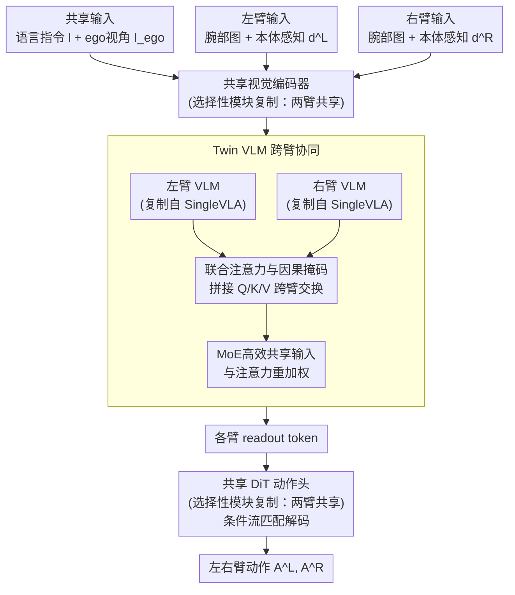

# TwinVLA: Data-Efficient Bimanual Manipulation with Twin Single-Arm Vision-Language-Action Models

**会议**: ICLR 2026  
**arXiv**: [2511.05275](https://arxiv.org/abs/2511.05275)  
**代码**: [项目页面](https://jellyho.github.io/TwinVLA/)  
**领域**: 机器人操作/双臂  
**关键词**: 双臂操作, VLA, 模块化组合, 联合注意力, 数据高效

## 一句话总结

提出TwinVLA——将两个预训练单臂VLA通过联合注意力和MoE组合为双臂VLA的模块化框架，仅需~800h公开单臂数据+50 episode双臂微调数据+25 H100 GPU-days，即可匹及使用10,900h私有数据+1,000+ GPU-days的π0性能水平。

## 研究背景与动机

**领域现状**：Vision-Language-Action模型(VLA)在单臂机器人操作任务上取得了显著成功，能够有效泛化到不同任务、物体和环境。然而，双臂操作——叠衣服、组装零件等复杂任务所必需的能力——由于公开双臂数据的稀缺而进展有限。

**现有痛点**：

1. **数据瓶颈严重**：π0依赖超过10,000小时的私有双臂数据，RDT-1B需要约2,400小时混合数据集，这些规模的数据收集成本极高且不可复现
2. **计算开销巨大**：RDT-1B在48块H100上训练一个月，π0的计算需求更高，超过1,000 H100 GPU-days
3. **单体架构的局限**：现有方法将两臂动作混合在单一模型中训练，未利用双臂操作天然的模块化结构
4. **跨体态迁移困难**：单臂和双臂的观测/动作空间差异大，单体模型需在异构数据上联合训练

**核心矛盾**：公开可用的双臂数据极其稀缺，但现有方法都需要大规模双臂预训练数据。如何用丰富的单臂数据构建高性能双臂策略？

**本文方案**：受神经科学启发——人类双臂控制由SMA和胼胝体协调两个独立运动系统，而非单一控制器——提出模块化的TwinVLA：复制预训练单臂VLA → 联合注意力跨臂融合 → MoE高效处理共享输入 → 少量双臂数据微调。

## 方法详解

### 整体框架

TwinVLA把"双臂操作"重新表述成"两个单臂策略协同"。它分三步走：先在Open X-Embodiment(OXE)单臂数据(~800h)上预训练一个0.8B的紧凑VLA(SingleVLA)，让模型先学会单臂的抓取、放置、移动等基本技能；再把这份SingleVLA完整复制成左、右两份，仅通过联合注意力让两臂在每一层交换信息、通过专家混合(Mixture-of-Experts, MoE)高效处理两臂共享的语言指令与第一人称视角；最后只用约50 episode双臂演示微调，无需任何双臂预训练。

观测被拆成三路：两臂共享的语言指令 $l$ 与ego视角图像 $I_{ego}$，以及各臂独立的腕部图像和本体感知 $d$。视觉先经共享编码器，再分别进入左、右VLM；两份VLM靠联合注意力耦合，各自产出readout token；最后由共享的DiT动作头把两路token联合解码成左右臂动作。动作头沿用条件流匹配(Conditional Flow Matching)训练，损失为 $\mathcal{L}^{T}(\theta) = \mathbb{E}_{p(A_t|o_t),\,q(A_t^\tau|A_t)} \|v_\theta(A_t^\tau, h_t, d_t) - \mathbf{u}(A_t^\tau|A_t)\|^2$，推理时以前向Euler积分 $A_t^{\tau+\delta} = A_t^\tau + \delta\, v_\theta(A_t^\tau, h_t, d_t)$ 从噪声逐步采出动作。

### 关键设计

**1. 选择性模块复制：让单臂先验在该共享的地方共享、该分化的地方分化**

整模复制会浪费参数也丢掉单臂技能的可迁移性，因此TwinVLA按"是否体态相关"分层处理：视觉编码器与DiT动作头被两臂共享，因为视觉理解和底层运动控制对左右臂本就是同一回事；VLM backbone被完整复制成两份，因为决策层需要臂特异性；本体感知编码器则各臂独立。这样总参数只有1.3B(与RDT-1B的1.2B相当)，相比"复制整模"几乎不增加计算开销，又让"抓取/放置/移动"这类基本技能在两臂间天然迁移。消融里"从头训练、不用单臂预训练"会让真实世界成功率暴跌46%，印证了这份可迁移先验的价值。

**2. 联合注意力与因果掩码：把两套单臂流缝成一个能互相看见的双臂系统**

两份VLM若各算各的，就退化成两个互不通气的单臂策略，无法协调动作。借鉴Mixture-of-Transformers(MoT)的思路，TwinVLA只共享自注意力层：把两个VLM的Q、K、V拼接后做一次统一自注意力，再按臂把输出切回各自的流，而投影、前馈等其余组件保持臂特异，从而在每一层都完成轻量的跨臂信息交换。为同时保住自回归因果性并避免信息泄漏，它设计了专门的因果掩码——各臂区域内保持下三角因果性，共享模态(语言+ego视角)对两臂完全可达，每臂只能注意到对侧一半的token，既让两臂"看见彼此"，又不至于让对侧上下文淹没自身决策。消融显示这是最关键的组件，去掉后真实世界成功率下降36%。

**3. MoE高效共享输入与注意力重加权：把冗余开销压下去、把预训练的注意力分布稳住**

语言指令和第一人称视角是两臂共享的，若各送一份进两个VLM会近乎翻倍显存。TwinVLA只对共享输入用软MoE路由 $\text{MoE}(x) = w_{\text{left}} \cdot \text{FFN}_{\text{left}}(x) + (1-w_{\text{left}}) \cdot \text{FFN}_{\text{right}}(x)$，其中权重 $w_{\text{left}}$ 由线性层加softmax算出，让共享token只算一遍却仍融合两臂专家；去掉MoE会让显存多占21%、真实成功率掉9%。此外，微调时新增的臂特定token会稀释预训练学到的模态注意力分布，于是引入注意力重加权(Attention Re-weighting)还原各模态原本的重要性，使初始微调loss降低40%。

## 实验关键数据

### 主实验：真实世界五项双臂任务

| 方法 | 参数量 | 预训练数据 | 计算量 | 平均成功率 |
|------|--------|-----------|--------|-----------|
| Diffusion Policy | 271M | 无 | - | 最低 |
| RDT-1B | 1.2B | ~2,400h | >1,000 GPU-days | 中 |
| **TwinVLA** | **1.3B** | **~800h** | **25 GPU-days** | **高** |
| π0 (上界) | 3.3B | ~10,900h | >1,000 GPU-days | 最高 |

TwinVLA在平均成功率上显著超越RDT-1B (+26%)，接近π0的性能，尽管数据量仅为π0的7%、计算量不到其3%。

### 消融实验：各组件贡献

| 消融设置 | 仿真成功率变化 | 真实世界成功率变化 | 说明 |
|---------|--------------|-----------------|------|
| 完整TwinVLA | 基线 | 基线 | — |
| w/o 注意力重加权 | -1.1% | -4.0% | 初始loss增加40% |
| w/o MoE | -2.2% | -9.0% | VRAM增加21% |
| w/o 联合注意力 | -6.2% | -36.0% | 最关键组件 |
| 从头训练(无预训练) | -4.6% | -46.0% | 预训练至关重要 |

联合注意力是最关键的组件，在真实世界去掉后成功率下降36%，证明跨臂协调对双臂操作不可或缺。

### 数据效率

| 演示数量 | TwinVLA | RDT-1B |
|---------|---------|--------|
| 20 episodes | 起步 | 起步 |
| 35 episodes | 快速超越RDT-1B | 缓慢提升 |
| 50 episodes | 显著领先 | 仍在追赶 |

TwinVLA展示了陡峭的学习曲线，50条演示即可超越使用大量数据预训练的RDT-1B。

### 鲁棒性与语言跟随

| 场景 | RDT-1B | π0 | TwinVLA |
|------|--------|-----|---------|
| 低光照(Fold towel) | 15.0% | 40.0% | **45.0%** |
| 干扰物(Fold towel) | 15.0% | **60.0%** | 25.0% |
| 语言跟随(多任务) | 基线 | 基线+x | **基线+21.8%** |

TwinVLA对光照变化鲁棒，在语言跟随评测中平均超越RDT-1B 21.8%和π0。

## 亮点与洞察

- **"复制而非重训"的范式意义**：TwinVLA证明了正确的架构归纳偏置比暴力数据收集更有效——40倍计算效率和13倍数据效率的提升不是增量改进，而是范式级跨越
- **神经科学与工程的对应**：人类双臂的SMA/胼胝体协调机制 ↔ TwinVLA的联合注意力，生物学原理直接指导了架构设计
- **25 vs 1,000+ GPU-days**：使双臂VLA研究从少数有私有数据的实验室"民主化"为任何有少量双臂演示的团队都可参与
- **单臂先验的可迁移性**：基本操作技能(抓取、放置、移动)在单臂和双臂间共享，Twin结构让这种迁移自然发生

## 局限性

- 视觉分布差异：两臂的视觉输入与单臂预训练分布不同，限制泛化
- 绝对末端执行器(EEF)控制：体态无关但不如相对动作灵活
- 干扰物场景性能较弱(25% vs π0的60%)

## 评分

- 新颖性: ⭐⭐⭐⭐⭐ 模块化双臂VLA组合的首次系统实现
- 实验充分度: ⭐⭐⭐⭐ 真实+仿真+数据/计算效率+消融
- 写作质量: ⭐⭐⭐⭐⭐ 动机清晰，神经科学类比直觉优美
- 价值: ⭐⭐⭐⭐⭐ 对双臂VLA研究有范式级影响

<!-- RELATED:START -->

## 相关论文

- [\[ICLR 2026\] MemoryVLA: Perceptual-Cognitive Memory in Vision-Language-Action Models for Robotic Manipulation](memoryvla_perceptual-cognitive_memory_in_vision-language-action_models_for_robot.md)
- [\[ICLR 2026\] VLBiMan: Vision-Language Anchored One-Shot Demonstration Enables Generalizable Bimanual Robotic Manipulation](vlbiman_vision-language_anchored_one-shot_demonstration_enables_generalizable_bi.md)
- [\[ICML 2026\] StableVLA: Towards Robust Vision-Language-Action Models without Extra Data](../../ICML2026/robotics/stablevla_towards_robust_vision-language-action_models_without_extra_data.md)
- [\[ICML 2026\] Seeing Realism from Simulation: Efficient Video Transfer for Vision-Language-Action Data Augmentation](../../ICML2026/robotics/seeing_realism_from_simulation_efficient_video_transfer_for_vision-language-acti.md)
- [\[ICLR 2026\] ST4VLA: Spatially Guided Training for Vision-Language-Action Models](st4vla_spatially_guided_training_for_vision-language-action_models.md)

<!-- RELATED:END -->
