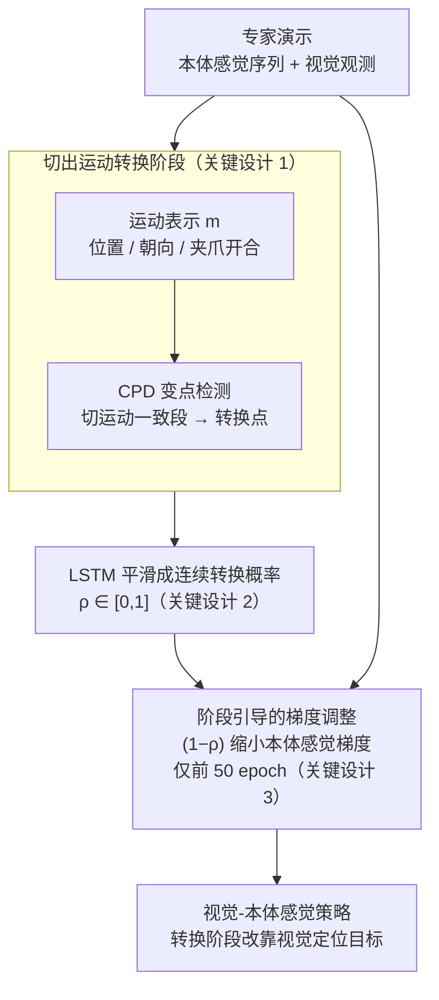

# When would Vision-Proprioception Policies Fail in Robotic Manipulation?

**会议**: ICLR 2026  
**arXiv**: [2602.12032](https://arxiv.org/abs/2602.12032)  
**代码**: [Project Page](https://gewu-lab.github.io/GAP/)  
**领域**: 机器人  
**关键词**: 视觉-本体感觉策略, 模态时序性, 梯度调整, 运动转换阶段, 机器人操作

## 一句话总结
揭示视觉-本体感觉操作策略在运动转换阶段（motion-transition phases）会失效的原因——本体感觉信号在优化中占主导导致视觉学习被抑制，并提出Gradient Adjustment with Phase-guidance (GAP)算法，通过自适应调低本体感觉梯度来恢复视觉模态的学习，在仿真和真实环境中均显著提升策略的泛化性。

## 研究背景与动机

本体感觉（proprioception）信息对精确的伺服控制至关重要，它提供了机器人的实时关节状态。在学习型操作策略中，将本体感觉与视觉结合使用被普遍认为能增强策略在复杂任务中的表现。然而，现有研究报告了**矛盾的发现**：
- HPT证明视觉+本体感觉明显优于纯视觉
- Octo发现加入本体感觉反而导致性能变差

**核心矛盾**：本体感觉信息理论上应该是有益的补充，但在实践中视觉-本体感觉策略的泛化性常常不如纯视觉策略。**这一矛盾的根源是什么？何时会发生？**

**关键发现**：通过时序控制实验（temporally controlled experiments），作者发现问题出在**运动转换阶段**（motion-transition phases）。在操作任务中，机器人的运动可以分为"运动一致阶段"（如持续向前移动）和"运动转换阶段"（如需要定位新目标并改变运动方向）。

- **运动一致阶段**：本体感觉信号有效，策略表现正常
- **运动转换阶段**：视觉模态应发挥关键作用（定位目标），但视觉-本体感觉策略中的视觉模态学习被抑制

**原因分析**：从优化角度看，本体感觉信号简洁且低维，在训练中提供更快的损失下降，导致优化被本体感觉信号主导。视觉信号虽然包含目标定位等关键信息，但由于像素级的变化相比本体感觉信号更微妙，其学习被压制（模态竞争/模态惰性问题）。

## 方法详解

### 整体框架
GAP（Gradient Adjustment with Phase-guidance，阶段引导的梯度调整）不改动策略网络结构，整条流水线只做一件事：先离线地从专家演示的本体感觉信号里**找出哪些时刻属于"运动转换阶段"**，再在行为克隆训练里**按这些时刻动态削弱本体感觉分支的梯度**。具体地，它先把每段轨迹的运动写成一个可计算的表示，用变点检测切出运动一致与运动转换的边界，再用一个 LSTM 把硬切分点平滑成每个时间步的连续转换概率 $\rho$；训练时本体感觉编码器的梯度被乘上 $(1-\rho)$ 缩小。这样当机器人需要定位新目标、改变运动方向时（$\rho$ 大），本体感觉几乎不再更新，优化压力被逼到视觉分支上，原本被压制的视觉模态重新拿到学习信号。

### 关键设计

**1. 切出运动转换阶段：把"机器人此刻在不在改变运动方向"变成可计算的边界**

要按阶段调梯度，前提是知道哪些时刻属于运动转换。GAP 不依赖语义或人工标注，直接拿现成的本体感觉信号做这件事。它先定义时间步 $i$ 到 $j$ 之间的运动表示 $m_{i:j} = \{p_{i:j}, \theta_{i:j}, g_{i:j}\}$，三个分量分别是夹爪位置变化、朝向变化、开合度变化，合起来完整刻画机械臂的运动状态。再用变点检测（Change Point Detection, CPD）配合动态规划，按运动一致性距离

$$d(m_{t_1:t_2}, m_{i:i+1}) = -\cos(p_{t_1:t_2}, p_{i:i+1}) - \alpha\cos(\theta_{t_1:t_2}, \theta_{i:i+1}) - \beta(\text{sgn}(g_{t_1:t_2}) == \text{sgn}(g_{i:i+1}))$$

把整条轨迹切成若干内部运动方向一致的段（三项分别看位置、朝向、夹爪开合方向是否一致，$\alpha=1$、$\beta=2\times10^{-3}$ 平衡三者）。CPD 最小化总代价后，段与段之间的断点就是运动转换发生处。相比用语义阶段或人工标注，这套纯几何的检测能自动覆盖全轨迹，消融里也比人工标注更全面。

**2. LSTM 平滑成连续转换概率：把离散切分点变成可微的阶段信号**

CPD 给的是硬边界，但真实的运动转换是渐变的——直接拿离散标签去乘梯度会在断点处突变、过于生硬，还会把 CPD 自身的分割误差直接灌进训练。GAP 因此训练一个 LSTM，对本体感觉的时间差分 $\Delta s_i = s_{i+1} - s_i$ 建模，利用序列上下文输出每个时间步属于运动转换阶段的连续概率 $\rho_i \in [0,1]$。训练时以 CPD 的切分作监督，并对转换点附近的时间步降低惩罚，让网络学到平滑过渡而非照搬硬标签。消融实验里这个连续 $\rho$ 明显优于直接用离散 CPD 标签，正是因为它既吸收了 CPD 的先验、又抹平了它的分割误差。

**3. 阶段引导的梯度调整：在转换阶段按 $\rho$ 关掉本体感觉的学习，逼网络去看图像**

这是 GAP 的核心，也是它真正动手的地方。训练每个 epoch，本体感觉特征提取器（transformer 之前的参数）的更新被调制为

$$\omega_s^{j+1} = \omega_s^j - \lambda \cdot (1-\rho) \cdot \eta \nabla_{\omega_s^j} \mathcal{L}_{BC}(\omega_s^j)$$

其中 $\lambda=0.3$ 控制调整强度、$\rho$ 是上一步预测的转换概率。当 $\rho$ 接近 1（运动转换阶段），系数 $(1-\rho)$ 趋近 0，本体感觉几乎不再更新，模型没法再靠它去拟合这些时刻，只能转而从视觉里学目标定位——这把原来"全局拼接两模态"的粗放竞争，细化成了与阶段相关的精细平衡。但调整若贯穿整个训练，会持续压制本体感觉、反而损害运动一致阶段本该依赖的精确伺服，所以 GAP 只在前 50 个 epoch（总 100）应用：视觉分支早期建立起定位能力后，后期放开让两模态正常协同。消融显示 $\lambda$ 在 0.2–0.4、early-stage 取 50 epoch 都鲁棒。

### 损失函数 / 训练策略
整体沿用行为克隆范式，以MSE作为基准损失。视觉分支用ResNet-18提取512维表示后接4层temporal transformer，本体感觉分支用3层MLP，两路特征拼接后送入3层MLP policy head输出长度 $L=9$ 的动作序列。训练用Adam优化器、学习率3e-4、batch size 128，在单卡RTX 3090上跑100个epoch；Meta-World使用100条专家演示，RoboSuite使用500条合成轨迹。

## 实验关键数据

### 主实验（仿真+真实环境）

| 方法 | Meta-World (4任务平均) | RoboSuite (4任务平均) | 说明 |
|------|------------|------------|------|
| Vision-only | 80.5% | 64.6% | 纯视觉基线 |
| Concatenation | 71.8% | 53.8% | 视觉-本体感觉，性能**下降** |
| MS-Bot | 83.5% | 69.4% | 使用语义阶段信息 |
| Aux Loss | 83.5% | 56.3% | 辅助视觉预测损失 |
| Mask | 84.5% | 62.0% | 随机掩码本体感觉 |
| **GAP (Ours)** | **88.4%** | **73.0%** | **全面最优** |

真实世界实验（20次rollout）：

| 方法 | 单臂3任务 | 双臂3任务 |
|------|----------|----------|
| Vision-only | 41/60 | 35/60 |
| Concatenation | 28/60 | 24/60 |
| **GAP (Ours)** | **50/60** | **49/60** |

### OOD泛化实验

| 方法 | assembly | bin-picking | stack | threading | cube | handover |
|------|----------|-------------|-------|-----------|------|----------|
| Vision-only | 78% | 59% | 63% | 32% | 12/20 | 12/20 |
| Concatenation | 62% | 32% | 49% | 28% | 7/20 | 9/20 |
| **GAP** | **88%** | **67%** | **72%** | **49%** | **15/20** | **15/20** |

### VLA模型兼容性（Octo微调）

| 方法 | disassemble | push-wall | put hammer | threading |
|------|-------------|-----------|------------|-----------|
| Octo-V (视觉only) | 95% | 77% | 92% | 69% |
| Octo-VP (视觉+本体感觉) | 82% | 65% | 88% | 57% |
| Octo-VP + **GAP** | **100%** | **85%** | **97%** | **78%** |

### 消融实验

| 配置 | 关键指标 | 说明 |
|------|---------|------|
| Human标注 vs CPD | GAP (CPD) 更优 | 自动检测比人工更全面 |
| HDBSCAN聚类 | 性能下降 | 破坏了轨迹时序结构 |
| CoTPC | 次于GAP | 简单余弦距离不够 |
| Fixed ρ vs LSTM | LSTM显著更优 | 连续概率比离散标签好 |
| λ=0.1/0.2/0.3/0.4/0.5 | 0.2-0.4均可 | 对λ不敏感 |
| 应用GAP的epoch数 | 50 epochs最优 | 太少不够，太多会过度抑制 |

### 关键发现
- 标准的视觉-本体感觉拼接策略比纯视觉**一致性地更差**（平均下降约15%），验证了OOD泛化问题的普遍性
- 介入实验精确定位了问题：**运动转换阶段**的视觉模态被抑制，导致策略无法有效定位目标
- GAP通过梯度调整使视觉分支恢复学习，Linear-probing实验直接证实了视觉特征质量的提升（如assembly任务从61%到74%）
- GAP兼容多种模态融合方式（Concatenation、Summation、FiLM）和策略架构（MLP head、Diffusion head、VLA/Octo）
- 在真实世界的单臂和双臂任务中均有效，证明了方法的实际部署价值

## 亮点与洞察
- **诊断精准**：通过时序控制介入实验，精确定位了"运动转换阶段"这一关键失败模式，而非笼统地说"多模态不好"
- **优化视角深刻**：从梯度竞争/模态惰性的角度解释了视觉学习被抑制的机制，连接了多模态学习的理论分析
- **方法简洁有效**：仅修改本体感觉分支的梯度幅度——不改架构、不加模块、不引入额外损失
- **适配性强**：兼容CNN/Transformer/Diffusion/VLA多种架构，单臂/双臂，仿真/真实环境
- **消融极其充分**：运动检测方法、LSTM vs替代方案、超参数α/β/λ/训练阶段数全部消融
- **反直觉发现**：本体感觉本应帮助机器人，但在深度学习优化中反而抑制了视觉学习——揭示了多模态学习中一个被忽视的陷阱

## 局限与展望
- 所有实验均在单一具身（single embodiment）上进行，未在跨具身数据集上验证
- CPD的运动一致性距离依赖手工设计的度量（余弦相似度+符号函数），可能不适用于所有类型的操作任务
- LSTM的训练依赖CPD提供的标签，如果CPD分割有系统性偏差，LSTM也会受到影响
- GAP仅在训练早期应用（前50/100 epochs），这个阈值在不同任务和数据规模下可能需要调整
- 未探索更复杂的模态融合策略（如attention-based fusion）与GAP的结合
- 梯度调整的幅度对所有时间步使用相同的λ，可以考虑自适应λ
- 仅关注了视觉和本体感觉两种模态，未考虑触觉（tactile）等额外模态

## 相关工作与启发
- **模态竞争/模态惰性**（Huang et al. 2022, Fan et al. 2023）：多模态学习中一个模态主导优化的普遍问题，GAP是在机器人操作领域的具体解法
- **HPT (Wang et al. 2024)**：展示了本体感觉的积极效果
- **Octo**：报告了本体感觉的负面效果，本文解释并解决了这一矛盾
- **Modality Temporality (Feng et al.)**：提出了模态重要性随时间变化的概念，本文将其特化为"运动转换阶段"
- **Diffusion Policy (Chi et al. 2023)**：GAP与diffusion head兼容且效果更好
- 启发：梯度调整的思路可推广到任何一种模态在优化中过度主导的多模态学习场景

## 评分
- 新颖性: ⭐⭐⭐⭐ （诊断视角新颖，方法虽简洁但有效）
- 实验充分度: ⭐⭐⭐⭐⭐ （14+任务、多架构、仿真+真实、全面消融、OOD、VLA兼容性）
- 写作质量: ⭐⭐⭐⭐ （问题驱动，逻辑清晰，图表丰富）
- 价值: ⭐⭐⭐⭐⭐ （解决了机器人操作中一个实际且普遍的问题）

<!-- RELATED:START -->

## 相关论文

- [\[ICLR 2026\] MemoryVLA: Perceptual-Cognitive Memory in Vision-Language-Action Models for Robotic Manipulation](memoryvla_perceptual-cognitive_memory_in_vision-language-action_models_for_robot.md)
- [\[ICLR 2026\] VLBiMan: Vision-Language Anchored One-Shot Demonstration Enables Generalizable Bimanual Robotic Manipulation](vlbiman_vision-language_anchored_one-shot_demonstration_enables_generalizable_bi.md)
- [\[ICML 2026\] RoboMME: Benchmarking and Understanding Memory for Robotic Generalist Policies](../../ICML2026/robotics/robomme_benchmarking_and_understanding_memory_for_robotic_generalist_policies.md)
- [\[ICLR 2026\] RoboInter: A Holistic Intermediate Representation Suite Towards Robotic Manipulation](robointer_a_holistic_intermediate_representation_suite_towards_robotic_manipulat.md)
- [\[CVPR 2025\] RoboGround: Robotic Manipulation with Grounded Vision-Language Priors](../../CVPR2025/robotics/roboground_robotic_manipulation_with_grounded_vision-language_priors.md)

<!-- RELATED:END -->
