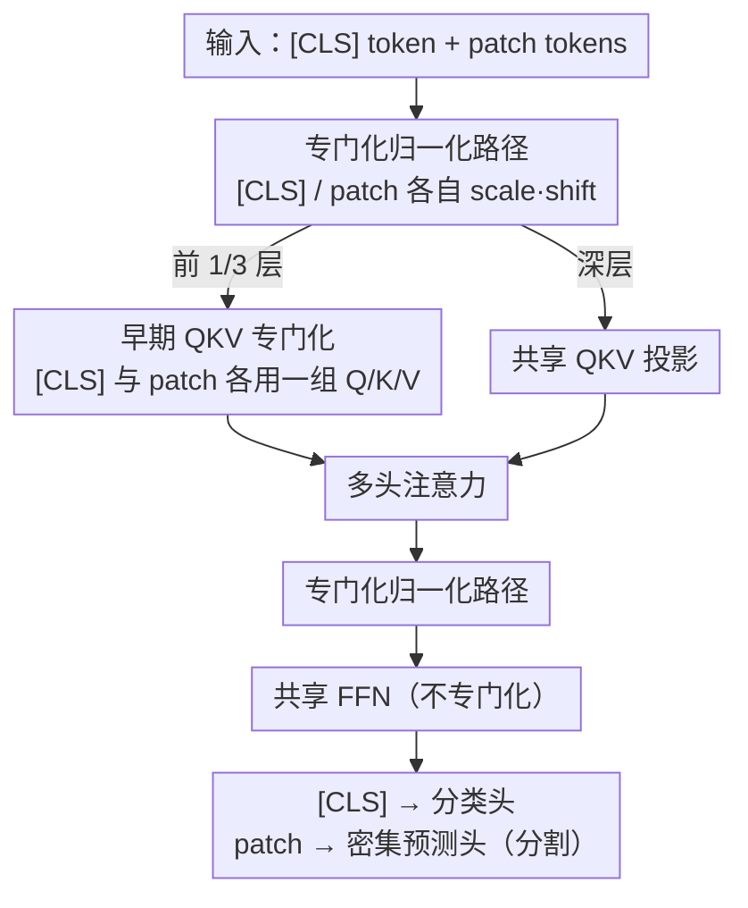

# Revisiting [CLS] and Patch Token Interaction in Vision Transformers

**会议**: ICLR 2026  
**arXiv**: [2602.08626](https://arxiv.org/abs/2602.08626)  
**代码**: 无  
**领域**: 图像分割 / 视觉Transformer  
**关键词**: Vision Transformer, [CLS] token, patch token, 归一化层, 密集预测

## 一句话总结
深入分析Vision Transformer中[CLS]全局token和patch局部token之间的交互摩擦，发现归一化层隐式地区分了两类token，提出在归一化层和早期QKV投影中引入专门化处理路径，仅增加8%参数即实现分割性能提升超2 mIoU，同时保持分类精度。

## 研究背景与动机
Vision Transformer（ViT）已成为强大、可扩展且通用的视觉表征学习器。在标准ViT架构中，一个可学习的[CLS]类token被前置到patch token序列前端，用于聚合全局信息以进行分类。尽管[CLS] token和patch token承载着截然不同的语义角色——[CLS]捕获全局特征，patch负责局部特征——两者在整个模型中被**完全相同地处理**：经过相同的注意力层、相同的FFN、相同的归一化层。

这种"一视同仁"的处理方式存在一个根本性的摩擦：

**全局与局部的竞争**：[CLS] token需要从所有patch中聚合全局语义，而每个patch token需要保持自身的局部空间信息。在共享的注意力计算中，这两个目标可能相互干扰

**归一化层的隐式偏好**：标准的LayerNorm/RMSNorm对整个token序列进行归一化，但[CLS]和patch的统计特性（均值、方差）可能有本质不同，统一归一化可能不利于两者同时获得最优表征

**密集预测性能受限**：当ViT被用于分割、检测等需要高质量patch表征的密集预测任务时，上述摩擦会导致patch表征质量下降

核心观察：通过分析ViT中归一化层的行为，作者发现归一化层实际上已经在**隐式地**区分[CLS]和patch token——两者在归一化统计量上存在系统性差异。既然隐式区分已经存在，是否可以通过**显式的专门化处理**来放大这一效应，从而同时优化全局和局部表征？

## 方法详解

### 整体框架
本文不重新设计架构，而是对标准 ViT（ViT-S/B/L 等）做外科手术式微调。核心判断是：[CLS] token 要从所有 patch 聚合全局语义、patch token 要保住各自的局部空间信息，二者目标相反，却在整个网络里被**完全一视同仁**地处理——同一套注意力、同一套 FFN、同一套归一化。作者先用统计分析证明这种"一视同仁"确实制造了摩擦，再针对性地把两个摩擦点拆成专门化路径：每个 Transformer 块里被两类 token 共享的**归一化层**全程拆开，注意力的 **QKV 投影**只在前 1/3 层拆开，而 FFN、残差、深层 QKV 保持共享。修改后 [CLS] 仍输出给分类头、patch token 输出给密集预测头，全程只增加约 8% 参数、推理 FLOPs 不变。

### 关键设计

**1. 归一化层隐式区分的发现：先证明摩擦真实存在，再动手**

整套方法的出发点不是经验性试错，而是一次诊断。作者把监督、DINO、DINOv2、MAE 等多种预训练下的 ViT 拆开，专门测量归一化层里 [CLS] 和 patch token 的统计量，结论很清晰：在标准 LayerNorm 中，[CLS] 的均值和方差系统性地偏离 patch 的平均水平，且偏离随网络加深越来越大——两类 token 的表征空间本就在逐层分化。问题在于 LayerNorm 对整段序列共用同一组统计量、同一组仿射参数 $\gamma, \beta$，相当于在每一层把这份已经存在的差异强行"拉平"，反而压制了各自最优表征的发展。既然区分本就隐式存在，那把它**显式放大**、给两类 token 各自的归一化通道，就是顺理成章的修法。这一发现也限定了后面只动归一化和注意力，而不去碰 FFN。

**2. 专门化归一化路径：让 [CLS] 与 patch 各自调尺度**

针对上面诊断出的主摩擦点，作者在每个块的归一化层把序列切成 [CLS] 部分和 patch 部分，各配一组独立的 scale 与 shift 仿射参数 $\gamma_{cls}, \beta_{cls}$ 与 $\gamma_{patch}, \beta_{patch}$：[CLS] 学到适合全局聚合的归一化尺度，patch 学到适合保留局部空间细节的尺度，两者不再被同一组参数互相拖累。因为切分只发生在仿射参数层面、归一化运算本身的复杂度不变，这一步几乎零额外计算开销，却拿到了大部分的分割增益——消融显示仅做这一项就能换来显著的 mIoU 提升，直接印证了归一化层正是 token 交互摩擦的主瓶颈。

**3. 早期 QKV 投影专门化：在表征分化尚浅时尽早分流注意力**

除了归一化，注意力的 Query-Key-Value 投影是第二个摩擦点，但它的修法有个关键限定——**只在前 1/3 层（靠近输入端）专门化**，深层仍共享。在浅层为 [CLS] 和 patch 配不同的 QKV 矩阵：[CLS] 的 Query 专门学"如何提问以汇聚全局信息"，patch 的 Query 专门学"如何与邻近 patch 交互以维持空间连贯"。之所以只在浅层做，是因为此时两类 token 的表征尚未明显分化，尽早分流能帮它们各自建立表征路径；到了深层，token 已被专门化归一化充分分开，再拆 QKV 收益递减、共享即可（消融里"全部层 QKV 专门化"反而不如"仅早期层"）。由于 [CLS] 只有 1 个 token，给它单独加的投影矩阵很小，把 QKV 专门化叠加到归一化专门化上，总参数增量也只有约 8%、却能再带来约 +1 mIoU。作者也试过专门化 FFN，发现没有收益甚至变差，故 FFN 保持共享——这正呼应了发现 1 划定的边界。

### 损失函数 / 训练策略
该修改可无缝嵌入任意 ViT 的预训练或微调流程，不引入任何额外损失项或超参数。既可以在预训练阶段就启用（例如在 DINOv2 框架内训练带专门化的 ViT），让模型从头学习分化的表征；也可以只在微调阶段对已有标准 ViT 做适配。损失函数完全沿用原框架（DINO 自蒸馏、MAE 重建等），保持训练管线不变。

## 实验关键数据

### 主实验
在标准分割基准上，专门化修改带来一致且显著的提升：

| 任务/数据集 | 指标 | 标准ViT | 专门化ViT | 提升 |
|-----------|------|---------|----------|------|
| 语义分割 (ADE20K) | mIoU | baseline | +2+ mIoU | > 2 mIoU |
| 语义分割 (其他基准) | mIoU | baseline | 一致提升 | > 2 mIoU |
| 图像分类 (ImageNet) | Top-1 Acc | baseline | 持平或微升 | 不损失分类 |

关键结论：分割提升超2 mIoU是一个显著的改进，同时分类精度不受影响（甚至略有提升），说明专门化没有"以分类换分割"。

### 消融实验

| 配置 | 分割性能 | 分类性能 | 参数增加 | 说明 |
|------|---------|---------|---------|------|
| 仅归一化专门化 | 提升显著 | 持平 | ~4% | 核心贡献 |
| 仅QKV专门化 | 中等提升 | 持平 | ~4% | 互补贡献 |
| 归一化 + QKV | 最优 | 持平或微升 | ~8% | 两者叠加效果最佳 |
| 所有层QKV vs 仅早期层 | 仅早期层更优 | — | — | 深层共享QKV即可 |
| 不同模型规模 | 一致提升 | 一致 | — | 跨ViT-S/B/L有效 |
| 不同学习框架 | 一致提升 | 一致 | — | 跨监督/自监督有效 |

### 关键发现
- **归一化层是摩擦的主要来源**：仅在归一化层引入专门化就能获得大部分性能提升，说明统一归一化确实是两类token交互摩擦的关键瓶颈
- **早期QKV专门化提供互补收益**：在归一化专门化基础上加入早期QKV专门化可进一步提升，说明注意力计算也是摩擦点之一
- **仅早期层需要QKV专门化**：深层中的QKV专门化收益递减，说明随着网络深度增加，两类token的表征路径已经通过归一化专门化充分分化
- **跨模型规模和学习框架泛化**：该方法在ViT-S到ViT-L、从监督训练到DINOv2/MAE等多种设置下都有效，说明是一个通用的架构改进
- **参数效率极高**：仅8%的参数增加换来2+ mIoU的分割提升，且不增加推理时的FLOPs

## 亮点与洞察
- **分析驱动的设计**：不是经验性地"试各种修改看哪个好"，而是从归一化层的统计分析出发，发现隐式区分现象后才针对性地设计专门化方案
- **最小化干预原则**：仅在归一化和早期QKV投影中引入分离——这是能产生最大影响的最小修改集。其他组件（FFN、残差连接）保持共享，避免过度设计
- **维持分类+提升密集预测的双赢**：这说明标准ViT的分类性能并不依赖于patch token的高质量（分类只用[CLS]），但密集预测严重依赖patch质量，因此专门化对分割的提升远大于对分类的影响
- **归一化层作为"信息瓶颈"的新理解**：本文揭示了一个不常被注意的事实——归一化层不仅仅是训练稳定器，它还隐式地影响不同token类型的表征发展路径

## 局限与展望
- 当前仅验证了分割和分类两类任务，其他密集预测任务（如深度估计、光流）和检测任务上的表现未知
- 未深入分析专门化归一化后两类token的表征几何发生了什么具体变化——如表征空间的各向同性、聚类结构等
- 对于没有[CLS] token的ViT变体（如只用mean pooling的架构），该方法不直接适用
- 未探索非ViT的Transformer架构（如Swin Transformer的窗口注意力）中是否存在类似的token类型摩擦
- 8%的参数增加虽小，但对于超大规模模型（如ViT-G）仍是可观的绝对数量，需要验证是否在极大规模下仍有效
- 缺乏理论分析说明为什么归一化层而非FFN或注意力是关键瓶颈

## 相关工作与启发
- **DINOv2**: 本文的专门化方案可直接集成到DINOv2的预训练流程中，提升预训练模型的密集预测能力
- **ViT-Adapter**: 采用适配器方式提升密集预测，与本文的"内部专门化"路线形成对比——一个在外部加模块，一个在内部做区分
- **Register Tokens**: 最近的工作在ViT中添加额外的无语义token来吸收注意力中的噪声信息，与[CLS]的角色互补，可能与本文发现的摩擦问题相关
- **Layer by layer, module by module (同会议论文)**: 该论文从OOD线性探测角度分析ViT内部模块，与本文的模块级分析视角互补
- 本文启发的方向：是否可以进一步对patch token内部进行分组专门化——如前景和背景的patch？

## 评分
- 新颖性: ⭐⭐⭐⭐ （发现归一化层的隐式区分现象很有洞察力，但修改方案本身较直接）
- 实验充分度: ⭐⭐⭐⭐⭐ （全面的消融实验，多种规模和框架验证）
- 写作质量: ⭐⭐⭐⭐⭐ （分析清晰，motivation→analysis→design→验证的逻辑链完整）
- 价值: ⭐⭐⭐⭐⭐ （8%参数换2+ mIoU，实用价值极高，可直接被ViT社区采用）

<!-- RELATED:START -->

## 相关论文

- [\[ICLR 2026\] Thicker and Quicker: A Jumbo Token for Fast Plain Vision Transformers](thicker_and_quicker_a_jumbo_token_for_fast_plain_vision_transformers.md)
- [\[ICLR 2026\] Locality-Attending Vision Transformer](locality-attending_vision_transformer.md)
- [\[CVPR 2026\] MPM: Mutual Pair Merging for Efficient Vision Transformers](../../CVPR2026/segmentation/mpm_mutual_pair_merging_for_efficient_vision_transformers.md)
- [\[NeurIPS 2025\] Vision Transformers with Self-Distilled Registers](../../NeurIPS2025/segmentation/vision_transformers_with_self-distilled_registers.md)
- [\[CVPR 2025\] Revisiting Audio-Visual Segmentation with Vision-Centric Transformer](../../CVPR2025/segmentation/revisiting_audio-visual_segmentation_with_vision-centric_transformer.md)

<!-- RELATED:END -->
