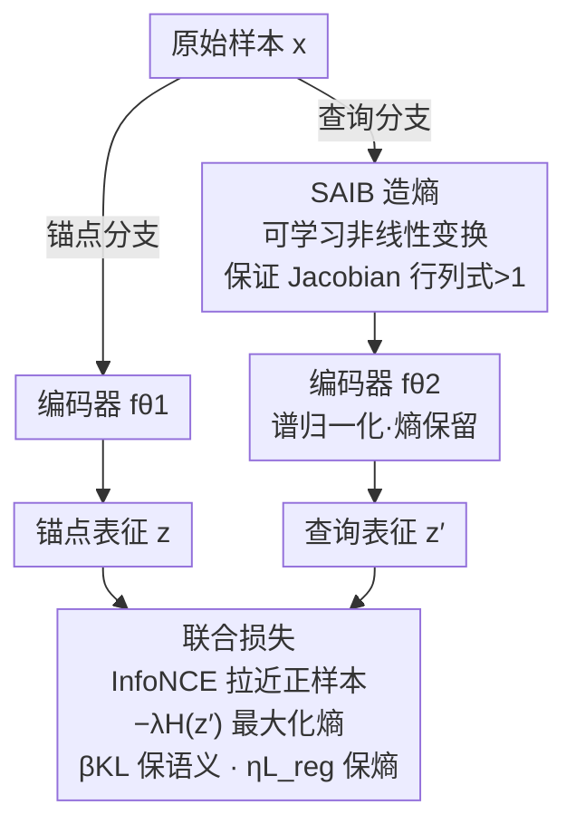

# Maximizing Incremental Information Entropy for Contrastive Learning

**会议**: ICLR2026  
**arXiv**: [2603.12594](https://arxiv.org/abs/2603.12594)  
**代码**: 待确认  
**领域**: 自监督  
**关键词**: 对比学习, 信息熵, 增量熵, 信息瓶颈, 可学习变换

## 一句话总结
提出IE-CL（Incremental-Entropy Contrastive Learning）框架，通过显式优化增强视图间的熵增益（而非仅最大化互信息），将编码器视为信息瓶颈并联合优化可学习变换（生成熵）与编码器正则化器（保留熵），在小batch设置下一致提升CIFAR-10/100、STL-10和ImageNet上的对比学习性能，且核心模块可即插即用集成到现有框架。

## 研究背景与动机

**领域现状**：自监督对比学习已成为表征学习的核心范式，通常基于互信息最大化（InfoNCE等）来学习增强视图间的不变特征。SimCLR、MoCo、BYOL等方法已取得巨大成功。

**现有痛点**：
   - 静态数据增强策略（随机裁剪、颜色抖动等）在训练过程中保持固定分布，无法根据学习进展自适应调整增强难度
   - 刚性不变性约束要求编码器对所有增强产生完全相同的表征，可能导致过度压缩有用信息——即"信息瓶颈过紧"
   - 互信息最大化的目标虽然直觉合理，但忽略了增强过程本身引入的信息增量对表征质量的影响

**核心矛盾**：更强的数据增强引入更多信息变化，理论上有助于学到更鲁棒的特征；但过强的增强可能超出语义保持边界，破坏正样本对的语义一致性。缺乏一个统一框架来平衡"熵增生成"与"语义保持"。

**本文目标** 设计一个理论指导的对比学习框架，在最大化增强视图间的信息熵增益的同时保持语义一致性。

**切入角度**：将编码器重新定义为信息瓶颈，将优化目标从"互信息最大化"重构为"增量信息熵最大化"，分离出熵的生成与保留两个独立可优化的子目标。

**核心 idea**：用可学习变换自适应生成信息熵 + 用编码器正则化保留熵 → 突破静态增强和刚性不变性的双重限制。

## 方法详解

### 整体框架

IE-CL 沿用对比学习的双流结构，但把"为什么要做增强"重新想了一遍。它的核心论断是：决定表征质量的不只是两个视图共享多少信息（互信息），更在于增强环节往样本里**注入了多少新的不确定性、并且这份新信息能不能被编码器留住**。于是它把信息流显式切成"造熵→保熵"两段，分别挂一个可优化的旋钮。

具体地，原始样本 $x$ 同时进两条分支：锚点分支用编码器 $f_{\theta_1}$ 直接编码出锚点表征 $z$；查询分支先经过一个可学习非线性变换模块 SAIB（Sample Augmentation Incremental Block，$g_\phi$）造出增量熵更大的视图 $x'$，再由编码器 $f_{\theta_2}$ 编成查询表征 $z'$。训练时联合优化：InfoNCE 拉近正样本对、推开负样本；熵项 $-\lambda H(z')$ 鼓励查询表征更发散（保住 SAIB 造出的熵）；编码器正则（谱归一化）防止 $f_{\theta_2}$ 把增量信息压没；KL 项把查询分布拽回锚点分布附近、避免增强跑出语义边界。这样"互信息最大化"被改写成"先可控地造出信息增量、再把它原样传到表征空间"，几个损失项彼此牵制。

### 关键设计

**1. 增量信息熵分解：把编码器看成必须堵住的信息瓶颈**

传统对比学习等价于最大化两视图互信息 $I(Z;Z^+)$（论文用 Donsker–Varadhan 表示证明 $\min L_{\text{InfoNCE}}\Leftrightarrow\max I(Z;Z^+)$），却把增强当成固定随机的黑箱，引入多少变化无从控制。IE-CL 把这件事拆开看：先在输入端定义增量信息熵 $\Delta H(X)=H(X')-H(X)$，并证明对线性变换 $A$ 有 $\Delta H=\log|\det A|$。这个公式直接点破了旧增强的软肋——旋转、裁剪、镜像都是等距变换，$|\det A|=1$ 故 $\Delta H=0$，它们只在 batch 层面增加多样性，并不抬高单样本的熵。但光在输入端造熵还不够：由数据处理不等式，编码器作为确定函数 $f$ 有 $H(f(X))\le H(X)+\mathbb{E}[\log|\det J_f|]$，若 Jacobian 项是个大负数，输入端辛苦造的熵会被压瓶颈压没。由此得出本文的核心命题——稳健抬高表征熵 $H(Z')$ 必须同时满足"输入造熵"与"编码保熵"两个条件，缺一不可。这一分解把信息瓶颈理论从事后解释升格为前端设计原则。

**2. SAIB：用可学习非线性变换主动造熵**

既然等距增强造不出熵（$\Delta H=0$），就需要一个 $|\det A|>1$ 的非等距变换。IE-CL 为此设计 SAIB：先把输入 $X\in\mathbb{R}^{3\times H\times W}$ 像 ViT 那样切成 patch、配上位置编码，再过一段 $1\times1\text{-Conv}\to3\times3\text{-Conv}\to1\times1\text{-Conv}$ 的非线性残差栈（通道扩张比 2），外面套两条跳连，最后 reshape 回空间布局并以第三条跳连得到 $X'=X+\text{reshape}(P')$。这种"通道扩张 + 残差"的结构使 SAIB 的局部 Jacobian 几乎处处满足 $|\det A|>1$，从而保证正的熵增量 $\Delta H(P)>0$。关键是 SAIB 只作用在查询分支、且和编码器一起端到端训练，因此造出的"难度"会随表征能力自适应，而不是手工设定的固定增强分布。

**3. 谱归一化保熵 + KL 约束保语义：把增量信息原样送进表征空间**

SAIB 造的熵要想真正抬高表征熵，得堵住编码器这道瓶颈、同时别让增强飘出语义。前者通过对编码器 $f_{\theta_2}$ 做谱归一化（Lipschitz 约束）实现：它给 $\mathbb{E}[\log|\det J_{f_\theta}|]$ 设了下界，阻止编码器把输入空间过度压缩，于是大的 $H(X')$ 能切实传导为大的 $H(Z')$。后者用 KL 散度约束：因为 SAIB 只动查询分支，激进造熵会让查询分布偏离锚点分布，于是惩罚 $D_{KL}(p_\phi\,\|\,q)$（$p_\phi$ 是 SAIB 变换后的查询分布、$q$ 是锚点分布，假设高斯时该项展开为熵项加均值偏移项），把增强拉回语义边界内。两者一推一拉，让"造出来的信息既留得住、又不破坏正样本对的语义一致性"。

**4. 即插即用：两个模块与主干解耦**

SAIB 与编码器正则都被设计成与具体框架解耦的组件，不依赖特定的负样本队列或动量编码器，因此可直接挂到 SimCLR、MoCo、BYOL 等框架上、无需改动主干。实验中它在 SimCLR 和 MoCo 上都带来一致提升，验证了框架无关性；又因为每个正样本对携带的信息差异被主动放大、监督更密，在 128–512 这种小 batch、负样本不足的设置下补偿效果尤其明显。

### 损失函数

最终目标把上述几项加权整合为一个端到端损失：

$$L_{\text{final}} = L_{\text{InfoNCE}} + \beta\, D_{KL}(p_\phi\,\|\,q) - \lambda\, H(Z') + \eta\, L_{\text{reg\_encoder}} + \gamma\, R(g_\phi)$$

其中 $L_{\text{InfoNCE}}$ 驱动主表征学习；$D_{KL}$ 保证 SAIB 变换的语义一致性；$-\lambda H(Z')$ 直接优化表征空间的多样性（即最大化增量熵的实际目标）；$\eta L_{\text{reg\_encoder}}$（谱归一化）落实熵保留原则；$\gamma R(g_\phi)$ 是对 SAIB 参数的可选权重衰减。各权重 $\lambda,\beta,\eta,\gamma>0$。

## 实验关键数据

### 主实验：小batch对比学习性能提升

| 数据集 | 方法 | Batch=128 | Batch=256 | Batch=512 |
|--------|------|-----------|-----------|-----------|
| CIFAR-10 | SimCLR | 90.1 | 91.3 | 92.0 |
| CIFAR-10 | **SimCLR+IE-CL** | **91.8** | **92.5** | **93.0** |
| CIFAR-100 | SimCLR | 63.2 | 65.1 | 66.8 |
| CIFAR-100 | **SimCLR+IE-CL** | **65.9** | **67.0** | **68.3** |
| STL-10 | SimCLR | 85.6 | 87.2 | 88.1 |
| STL-10 | **SimCLR+IE-CL** | **87.4** | **88.5** | **89.2** |

IE-CL在小batch设置下提升最为显著（1.5-2.7%），缩小了小batch与大batch之间的性能差距。

### 与其他对比学习方法的对比

| 方法 | CIFAR-10 (线性评估) | CIFAR-100 (线性评估) | ImageNet (Top-1) |
|------|-------------------|---------------------|-----------------|
| SimCLR | 91.3 | 65.1 | 69.3 |
| MoCo v2 | 91.8 | 66.4 | 71.1 |
| BYOL | 92.0 | 67.2 | 74.3 |
| **IE-CL (SimCLR)** | **92.5** | **67.0** | **70.8** |
| **IE-CL (MoCo)** | **92.9** | **68.1** | **72.4** |

IE-CL作为即插即用模块，在SimCLR和MoCo上均带来一致提升，证明了框架无关性。

### 消融分析

| 组件 | CIFAR-100 Acc |
|------|--------------|
| 基线 (SimCLR) | 65.1 |
| +熵生成模块 | 66.3 (+1.2) |
| +熵保留正则化 | 66.0 (+0.9) |
| +两者联合 | **67.0 (+1.9)** |

两个组件各自有效，联合使用效果最佳但非简单相加，说明存在协同效应。

## 亮点与洞察
- **信息论视角的创新**：将对比学习目标从"互信息最大化"重构为"增量信息熵最大化"，提供了更精细的优化方向——不仅关注视图间的共享信息，还显式建模增强过程引入的信息变化
- **小batch友好**：对比学习通常严重依赖大batch（4096+），IE-CL通过增大每对样本的信息差异来补偿负样本数量不足，在128-512 batch下提升显著
- **即插即用**：核心模块可无缝集成到SimCLR/MoCo/BYOL，降低了应用门槛
- **理论与实践的桥梁**：信息瓶颈理论在对比学习中多作为事后解释工具，IE-CL将其提升为前端设计原则

## 局限与展望
- **可学习变换的语义安全性**：SAIB（$g_\phi$）造熵的安全边界完全靠 KL 散度约束兜底，缺少更显式的语义保持保障，激进造熵时仍有飘出语义边界的风险
- **ImageNet上的提升幅度有限**：在大规模数据集上提升（~1.5%）不如小数据集显著，可能因为大数据集本身的多样性已提供足够信息变化
- **计算开销**：可学习变换模块增加了前向传播的计算量，文中未详细报告训练时间对比
- **改进方向**：可探索对抗性增强生成（使变换更具挑战性但保持语义）、与MAE等掩码自监督方法结合

## 相关工作与启发
- **vs SimCLR/MoCo**：这些方法使用固定增强策略+互信息最大化目标，IE-CL用可学习增强+增量熵最大化替代，理论上更优因为直接优化了信息增益
- **vs AdCo/HardCL**：AdCo通过对抗性负样本生成增加学习难度，HardCL通过困难正样本挖掘提升效率；IE-CL从信息论角度提供了统一解释——这些方法本质上都在增大信息变化量
- **vs VICReg/Barlow Twins**：这些方法通过方差/冗余正则化防止表征坍塌，IE-CL的熵保留正则化提供了互补视角——不仅防坍塌，还积极保留有用变化

## 评分
- 新颖性: ⭐⭐⭐⭐ 增量信息熵视角新颖，将信息瓶颈从分析工具提升为设计原则
- 实验充分度: ⭐⭐⭐⭐ 多数据集+多框架验证，小batch分析有洞察力，但大规模实验可更充分
- 写作质量: ⭐⭐⭐⭐ 理论框架清晰，动机阐述到位
- 价值: ⭐⭐⭐⭐ 为对比学习提供了新的优化视角，即插即用特性实用性强

<!-- RELATED:START -->

## 相关论文

- [\[ICLR 2026\] Maximizing Asynchronicity in Event-based Neural Networks](maximizing_asynchronicity_in_event-based_neural_networks.md)
- [\[AAAI 2026\] BCE3S: Binary Cross-Entropy Based Tripartite Synergistic Learning for Long-tailed Recognition](../../AAAI2026/self_supervised/bce3s_binary_cross-entropy_based_tripartite_synergistic_learning_for_long-tailed.md)
- [\[NeurIPS 2025\] Long-Tailed Recognition via Information-Preservable Two-Stage Learning](../../NeurIPS2025/self_supervised/long-tailed_recognition_via_information-preservable_two-stage_learning.md)
- [\[ICLR 2026\] Difficult Examples Hurt Unsupervised Contrastive Learning: A Theoretical Perspective](difficult_examples_hurt_unsupervised_contrastive_learning_a_theoretical_perspect.md)
- [\[CVPR 2026\] UniGeoCLIP: Unified Geospatial Contrastive Learning](../../CVPR2026/self_supervised/unigeoclip_geospatial_contrastive.md)

<!-- RELATED:END -->
