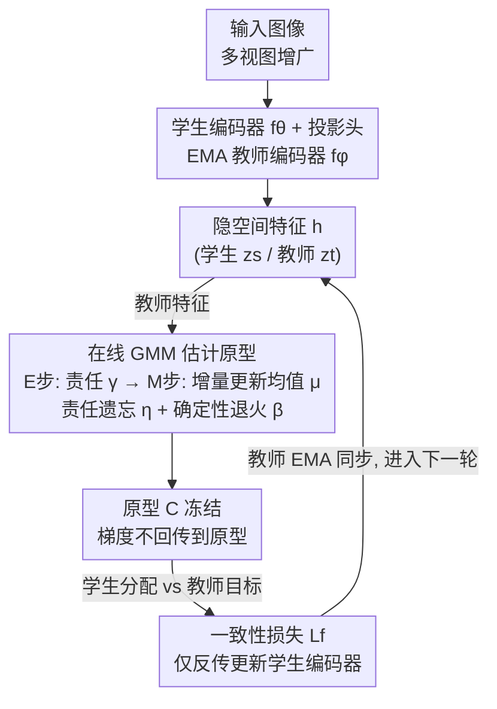

# Why Prototypes Collapse: Diagnosing and Preventing Partial Collapse in Prototypical Self-Supervised Learning

**会议**: ICLR 2026  
**arXiv**: [2510.20108](https://arxiv.org/abs/2510.20108)  
**代码**: [GitHub](https://dsb-ifi.github.com/proto-decoupling)  
**领域**: 自监督学习 / 原型学习 / 表征坍缩  
**关键词**: prototype collapse, self-supervised learning, DINO, decoupling, Gaussian mixture

## 一句话总结
诊断出原型自监督学习中部分原型坍缩的根因是编码器与原型的联合优化导致的快捷学习，提出全解耦训练策略——用在线 GMM 独立估计原型——彻底消除坍缩并提升下游性能。

## 研究背景与动机

**领域现状**：原型 SSL 框架（DINO, DINOv2, CARP 等）使用可学习的原型向量作为聚类锚点，引导表征组织成语义一致的区域。近期已可媲美语言监督方案。

**现有痛点**：多个方法存在严重的**部分原型坍缩**——大量原型收敛到几乎相同的表征。DINO 只保留 1.5% 唯一原型，DINOv2 实例头 98% 坍缩。实践中只能过度参数化来缓解。

**核心矛盾**：原型的目的是提供多样目标来引导丰富表征，但坍缩使原型冗余，违背设计初衷。

**本文目标** (1) 系统诊断坍缩根因；(2) 设计根本性解决方案。

**切入角度**：观察到 CAPI 方法因部分解耦教师原型更新而保持 99.9% 唯一原型，假设联合优化是根因。

**核心 idea**：完全解耦原型估计和编码器优化——原型用独立的在线 GMM 估计，编码器用一致性损失训练——消除快捷学习激励。

## 方法详解

### 整体框架
原型 SSL 的标准做法是把编码器参数 $\theta$ 和原型矩阵 $C$ 一起塞进同一个目标里联合优化：$\min_{\theta, C} \mathcal{L}_f(f_\theta, C)$。本文的核心论点是，正是这种"同锅炖"埋下了坍缩的祸根——既然原型是可学习的，优化器就会让它们漂向彼此重叠的位置去抄近路。于是本文先用一套跨方法的量化诊断把坍缩坐实、并把根因定位到联合优化，再开出处方：把训练改成两个交替进行、互不耦合的子过程。具体地说，学生编码器 $f_\theta$（带投影头）和指数滑动平均（EMA）维护的教师编码器 $f_\phi$ 把多视图映射成隐空间特征 $h$；一边拿教师特征喂给一个**在线高斯混合模型（GMM）**独立估计原型，另一边在原型被冻住、不回传梯度的前提下，用原本的一致性损失更新编码器。原型不再经过反向传播，快捷学习的激励也就被釜底抽薪地拿掉了。

### 关键设计

**1. 部分坍缩的诊断：先量化问题，再把根因钉在联合优化上**

要解决坍缩，先得能测量它。本文在多个原型 SSL 方法上统计"唯一原型"的比例——把夹角小于阈值 $\epsilon$ 的原型算作同一个，看最终还剩多少互不相同的原型。结果触目惊心：DINO 6 万个原型只剩 1.5% 是唯一的，CARP 10.8%，DINOv2 的实例头更是低到 1.0%，大批原型挤成了一团。关键的反例是 CAPI：它因为把教师端的原型更新部分地从编码器优化里解耦出来，唯一原型比例高达 99.9%（不过阈值收紧到 $\epsilon=0.5$ 时也只剩约 38%，说明部分解耦不彻底）。再加上坍缩普遍发生在训练极早期，这两条线索共同把矛头指向一个根因——原型和编码器在共享损失下的联合优化制造了快捷学习，而非某个具体框架的实现细节。这一诊断既是论文标题里的"Why"，也是后面全解耦处方的直接依据。

**2. 全解耦训练：把原型从反向传播里整条拿出来**

诊断既然指向联合优化，处方就是把它断干净。和 CAPI 只松开教师端、学生原型仍跟编码器联合优化的"部分解耦"不同，本文做的是**完全解耦**：原型彻底退出梯度更新，训练在迭代 $t$ 上交替求解两个分离的目标——先用当前教师特征刷新原型（见设计 3），再在原型冻结、不接收任何梯度的前提下用一致性损失反传更新学生编码器（教师走 EMA 同步）。这对应框架图里 $D\to E\to F$ 的回环：原型估计与编码器学习各走各的目标、互不传梯度。正因为原型不再能为了压低损失而漂向彼此重叠的冗余位置，"抄近路"这条捷径被整条堵死，而且无需任何显式正则项。

**3. 在线 GMM 原型估计：用增量 EM 估原型，靠遗忘与退火稳住大规模分量**

把原型交给谁来估计，是解耦之后的核心设计问题；可选目标要同时满足三个性质：原型既要有代表性又要互相可区分、要能随整个数据集的特征分布持续演化、计算上还得足够轻。本文把原型显式建模成一个在线 GMM 的分量均值 $\mu_k$：每来一个 batch 就做一次两步更新——先按 $\gamma_{ik}$（教师特征 $h_i$ 落在第 $k$ 个高斯分量上的软分配责任）算责任，再用充分统计量增量更新混合权重、均值与对角协方差。为了在分量数 $K$ 很大、特征维度很高时不至于责任失衡、分量乱漂，本文借鉴责任权重遗忘（用遗忘因子 $\eta$ 让旧 batch 的统计量逐步衰减）和确定性退火（deterministic annealing，用平滑因子 $\beta$ 调节软分配的锐度），让用得少的分量保持稳定、用得多的分量保持响应。相比一次性跑 K-Means 重估，这种在线增量方式天然纳入了整个数据集的信息、又能无缝嵌进 SSL 的逐 batch 训练循环；因为原型更新就发生在前向之后、不依赖编码器损失，还省下了存原型那条计算图的显存。

### 损失函数 / 训练策略
编码器仍用各框架原本的一致性损失（如 DINO/CARP 的交叉视图预测），唯一的改动是其中的原型 $C$ 由 GMM 在线提供、在编码器更新这一步里被冻结、不接收任何梯度。两个子过程交替进行：先由当前特征刷新 GMM 原型，再用固定原型反传更新编码器，如此循环。

## 实验关键数据

### 主实验：原型多样性

| 方法 | 初始原型数 | 唯一原型 ($\epsilon=0.025$) | 百分比 |
|------|----------|----------|--------|
| DINO | 60000 | 908 | 1.5% |
| CARP | 65536 | 7052 | 10.8% |
| DINOv2 实例头 | 262144 | 2556 | 1.0% |
| CAPI（部分解耦）| 16384 | 16383 | 99.9% |
| **CARP+Decoupling** | **65536** | **65536** | **100%** |

### 消融实验

| 配置 | 唯一原型 | 下游性能 |
|------|---------|---------|
| 联合优化（原始） | 低 | 基线 |
| + KoLeo正则 | 中 | 小幅提升 |
| 部分解耦 | 高 | 提升 |
| 全解耦（本文） | 100% | 最佳 |

### 关键发现
- 部分原型坍缩不限于 DINO 家族，是原型 SSL 的普遍现象
- 坍缩在训练极早期发生，指向快捷学习机制
- 全解耦在所有阈值下保持 100% 唯一性
- 更高原型多样性确实带来更好的下游质量
- 长尾分布下解耦方法更鲁棒

## 亮点与洞察
- 诊断与处方并重——先量化分析定位根因，再设计方案
- 快捷学习视角——联合优化让原型走"捷径"，不同于传统正则化视角
- 在线 GMM 作为原型估计器简洁有效

## 局限与展望
- 主要在实例级目标上验证，MIM 目标下的效果留待未来
- GMM 引入额外实现复杂度
- 下游性能提升幅度有时有限

## 相关工作与启发
- **vs KoLeo-Proto**: 正则化只治标，本文解耦治本
- **vs CAPI**: 部分解耦启发了全解耦
- **vs SWaV**: 在线原型通过梯度更新=联合优化，仍有坍缩风险

## 评分
- 新颖性: ⭐⭐⭐⭐ 诊断+全解耦方案都有新意
- 实验充分度: ⭐⭐⭐⭐ 跨方法分析、训练动态追踪全面
- 写作质量: ⭐⭐⭐⭐⭐ 从诊断到方案叙事极清晰
- 价值: ⭐⭐⭐⭐ 为原型 SSL 健壮训练提供关键方案

<!-- RELATED:START -->

## 相关论文

- [\[ICML 2025\] Collapse-Proof Non-Contrastive Self-Supervised Learning](../../ICML2025/self_supervised/collapse-proof_non-contrastive_self-supervised_learning.md)
- [\[ICLR 2026\] Soft Equivariance Regularization for Invariant Self-Supervised Learning](soft_equivariance_regularization_for_invariant_self-supervised_learning.md)
- [\[ICML 2026\] The Geometry of Projection Heads: Conditioning, Invariance and Collapse](../../ICML2026/self_supervised/the_geometry_of_projection_heads_conditioning_invariance_and_collapse.md)
- [\[ICML 2026\] Provable Accuracy Collapse in Embedding-Based Representations under Dimensionality Mismatch](../../ICML2026/self_supervised/provable_accuracy_collapse_in_embedding-based_representations_under_dimensionali.md)
- [\[ICLR 2026\] SNAP-UQ: Self-supervised Next-Activation Prediction for Single-Pass Uncertainty](snap-uq_self-supervised_next-activation_prediction_for_single-pass_uncertainty_i.md)

<!-- RELATED:END -->
