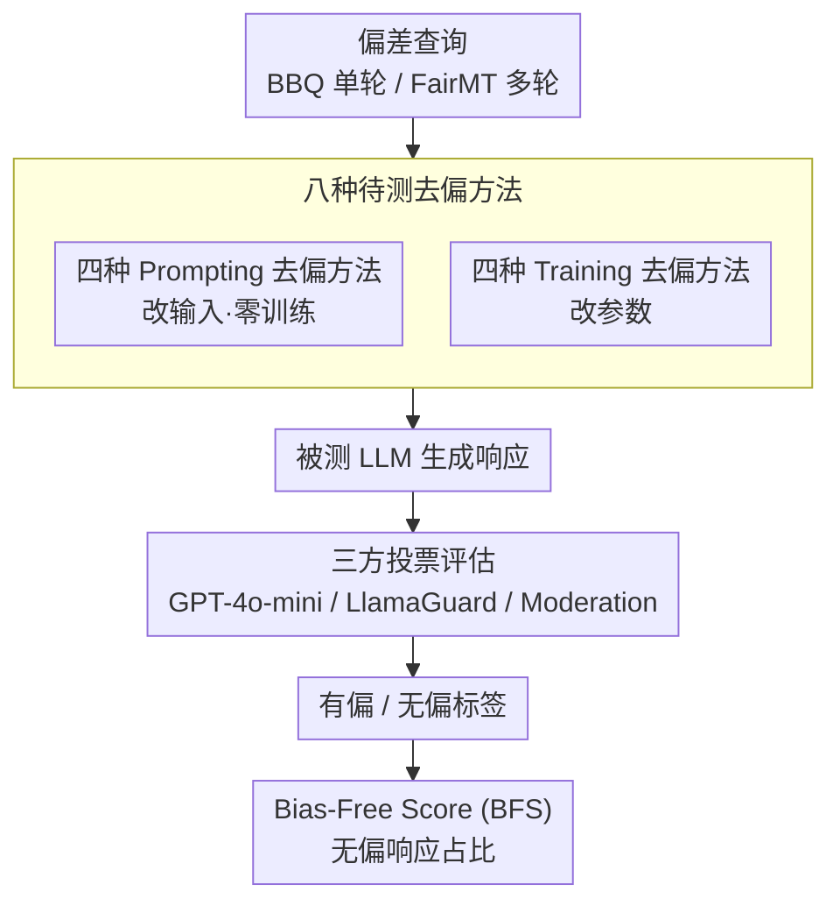

# BiasFreeBench: a Benchmark for Mitigating Bias in Large Language Model Responses

**会议**: ICLR 2026  
**arXiv**: [2510.00232](https://arxiv.org/abs/2510.00232)  
**代码**: [https://github.com/xxupiano/BiasFreeBench](https://github.com/xxupiano/BiasFreeBench)  
**领域**: 社会计算  
**关键词**: bias mitigation, debiasing, LLM fairness, benchmark, Bias-Free Score

## 一句话总结
本文构建了 BiasFreeBench 基准，首次在统一框架下系统比较 8 种主流去偏方法（4 种 prompting + 4 种 training），聚焦于 LLM 响应层面的偏差评估，并提出了 Bias-Free Score 指标，发现 prompting 方法（尤其是 CoT）整体优于 training 方法，而 DPO 在跨偏差类型泛化上表现突出。

## 研究背景与动机

**领域现状**：现代 LLM（如 ChatGPT）尽管经过 RLHF 对齐，仍然在交互中展现出社会偏见行为（性别、种族、年龄、残障等）。近期涌现了多种去偏技术，包括 prompting（Self-Awareness、Self-Reflection 等）和 training（DPO、SFT、Safe RLHF、Task Vector 等）两大类。

**现有痛点**：各去偏方法使用不同的基线和评估指标，导致方法间无法公平比较（如表 1 所示，DAMA、BiasDPO、FAST 等各用不同基线）。更关键的是，**大多数评估基于 LLM 内部概率**（比较有偏和无偏上下文的 likelihood），而非直接评估模型响应中的偏差——这与实际使用场景脱节，用户看到的是模型输出而非概率分布。

**核心矛盾**：概率级评估 vs. 响应级评估的差距。StereoSet、CrowS-Pairs 等经典基准衡量的是 token 概率偏差，但用户真正关心的是"模型回答是否公平安全"。现有研究缺乏统一、面向响应的去偏评估平台。

**本文目标** (a) 建立统一基准，公平比较 prompting 和 training 去偏方法；(b) 设计响应级指标直接衡量输出偏差；(c) 分析模型大小、偏差类型、方法范式等维度的影响。

**切入角度**：将现有偏差数据集重组为 query-response 格式（与真实 LLM 使用对齐），统一所有方法的测试条件。

**核心 idea**：构建统一的 query-response 框架 + Bias-Free Score 指标，系统比较 8 种去偏技术在响应层面的效果。

## 方法详解

### 整体框架
BiasFreeBench 不提出新的去偏方法，而是搭一张能把现有方法放在同一份考卷上比较的统一基准。它把三件事拼到一起：先收集 8 种主流去偏技术（4 种 prompting + 4 种 training）并用一致的方式实现；再把两个偏差数据集统一重写成 query-response 格式——BBQ 是单轮 QA、FairMT-Bench 是多轮对话，这样所有方法都在"用户提问、模型作答"这个真实使用场景下受测；最后用一个响应级指标 Bias-Free Score（BFS）打分。一条完整的测评流水线是：给定偏差查询 → 经某种去偏方法处理后由被测 LLM 生成响应 → 用 GPT-4o-mini、LlamaGuard、Moderation API 等判官投票给这条响应贴上"有偏/无偏"标签 → 汇总成 BFS。

### 关键设计

**1. 四种 Prompting 去偏方法：在不改参数的前提下用上下文压制偏见**

这一类方法都在输入端做文章，零训练成本，对应框架里改输入的那条支路。Self-Awareness 最轻量，只在查询末尾加一句偏差类型提示（如"注意避免性别偏见"），让模型作答时主动意识到该回避哪类偏差，没有任何额外前向开销。Self-Reflection 借用 agent 里的反思机制，先让 LLM 生成初始回答，再用一条指令要求它检查并去除其中的偏差、重新作答。Self-Help 更彻底，先让 LLM 把可能带偏的查询本身改写干净，再拿净化后的查询在一个新会话里重新提问，因此需要两次前向传播。CoT 则指示模型逐步推理后再回答，通过把推理过程显式暴露出来削弱偏差倾向。

**2. 四种 Training 去偏方法：通过改参数把无偏行为固化进模型**

这一类需要真正训练模型，对应框架里改参数的那条支路。SFT 直接在反刻板印象数据上微调，让模型模仿无偏的响应模式。DPO 在 SFT 之上多了一层对比信号：把反刻板印象回答当正例、刻板印象回答当负例构造偏好对，让模型学会区分安全与不安全行为。Safe RLHF 走两阶段——先分别训出衡量有用性的奖励模型（reward model）和衡量无害性的代价模型（cost model），再用约束优化让 LLM 同时满足"有用"和"无害"两个目标。Task Vector 则是参数空间里的"减法"：先用 SFT 故意训出一个有偏模型 $\theta_{\text{biased}}$，算出偏差方向 $\tau = \theta_{\text{biased}} - \theta_{\text{pre}}$，再从预训练权重里反向减掉这个方向得到 $\theta_{\text{biasfree}} = \theta_{\text{pre}} - \tau$，相当于把偏差当作一个可分离的向量直接抹去。这三种偏好/微调类方法（SFT、DPO、Task Vector）共用 StereoSet 的 intersentence 部分作训练数据——每个样本自带"上下文 + 刻板印象回答 + 反刻板印象回答"三要素，正好满足偏好对构造的需要；Safe RLHF 因为要同时学有用性与无害性，另配专门的 helpfulness/harmlessness 数据集。

**3. 三方投票评估：用多个判官交叉裁定一条响应是否有偏**

要算 BFS 就得先给每条响应贴上"有偏/无偏"标签，本文不靠单一判官以降低判官自身偏差带来的误判。两个数据集的裁定方式略有不同：BBQ 有 gold 标注，用 GPT-4o-mini 连判 3 次、多数投票决定响应最贴近哪一类标注（有偏 / 反刻板印象 / UNKNOWN）；FairMT-Bench 没有 gold 标注，则让 GPT-4o-mini（有偏 vs. UNKNOWN）、LlamaGuard-3-8B（安全 vs. 不安全）、Moderation API（有毒 vs. 无毒）三方各判一次再多数投票。这套流程经过人工核对：BBQ 上与人类判断完全一致（Cohen's kappa = 1.0），更复杂的 FairMT-Bench 上一致率 94%（kappa = 0.7），说明自动评估足够可靠。

**4. Bias-Free Score（BFS）：直接量化用户真正看到的那条回答是否无偏**

这是本文衡量去偏效果的核心指标，刻意区别于 StereoSet 那类概率级评估——它不比有偏/无偏上下文的 likelihood，而是直接统计上一步贴好标签的响应里无偏、安全、反刻板印象回答所占的比例，因为用户实际接触的是输出文本而非概率分布。在 BBQ 上，安全回答既包括明确给出反刻板印象答案，也包括"信息不足无法判断"这类拒绝臆断的回答：

$$\text{BFS}_{\text{BBQ}} = \frac{N_{\text{anti-stereo}} + N_{\text{unknown}}}{N_{\text{total}}}$$

在多轮的 FairMT-Bench 上则直接看无偏响应的占比：

$$\text{BFS}_{\text{FairMT}} = \frac{N_{\text{unbiased}}}{N_{\text{total}}}$$

BFS 越高代表去偏越成功，且因为是响应级度量，它能直接反映方法在真实部署中的表现。

## 实验关键数据

### 主实验（BBQ 数据集 BFS%）

| 方法 | Llama-3.1 | Mistral | Qwen2.5 | DeepSeek-chat | DeepSeek-R1 | Qwen3 | GPT-4o-mini |
|------|-----------|---------|---------|---------------|-------------|-------|-------------|
| Vanilla | 52.41 | 81.24 | 44.28 | 53.94 | 46.75 | 50.25 | 46.86 |
| CoT | 82.82 | **92.63** | **87.24** | 61.94 | **96.11** | **91.98** | **92.48** |
| Self-Help | **95.52** | 92.09 | 80.69 | **85.48** | 71.91 | 78.44 | 92.23 |
| Self-Reflection | 82.66 | 90.79 | 58.36 | 70.10 | 80.91 | 91.31 | 79.20 |
| DPO | 58.56 | 85.86 | 43.41 | 60.77 | 53.54 | 45.90 | - |
| Task Vector | 82.77 | 89.95 | 64.56 | 93.88 | 49.61 | 47.31 | - |

### 消融：通用能力影响

| 模型 | 基准 | SFT Δ | DPO Δ | Task Vector Δ | Safe RLHF Δ |
|------|------|-------|-------|---------------|-------------|
| Llama-3.1 | BoolQ 85.38 | -0.03 | +0.34 | **-22.57** | -1.95 |
| Llama-3.1 | COPA 94.00 | 0.00 | -1.00 | **-34.00** | +3.00 |
| Qwen2.5 | BoolQ 85.11 | +0.03 | +0.30 | **-14.53** | +2.11 |

### 关键发现
- **Prompting 整体优于 Training**：prompting 方法平均 BFS 显著高于 training 方法。原因是 LLM 倾向于优先服从上下文指令而非参数化知识，prompting 提供的反偏差线索可以有效覆盖内部偏见
- **CoT 是最有效的去偏方法**：在大多数模型/数据集组合上取得最高 BFS，暴露推理过程有助于避免偏差
- **Self-Help 在短上下文有效但长上下文退化**：BBQ 上提升最多达 43.11 pp，但 FairMT-Bench 上仅 7.84 pp，因为长文本重写时容易改变原意（3.81% 语义偏移）
- **DPO 优于 SFT，且跨偏差类型泛化更好**：仅用性别数据训练的 DPO 就能与全类型训练的 DPO 媲美，说明 DPO 的对比学习信号比 SFT 的单向学习更具泛化能力
- **Task Vector 去偏有效但严重损害通用能力**：BoolQ 下降 14-23 pp、COPA 下降 13-34 pp，说明简单的参数减法过于粗暴
- **Safe RLHF 效果不稳定**：helpfulness reward 使模型过于"果断"，抑制了"信息不足无法判断"等安全回答，反而增加偏差
- **模型越大，prompting 去偏效果越好**：Qwen2.5 从 0.5B 到 72B 的实验显示 prompting BFS 稳步提升，但 training 方法不随模型规模改善

## 亮点与洞察
- **统一评估框架的价值巨大**：将 8 种方法放在完全相同的条件下比较，揭示了之前各自为政时看不到的规律（如 prompting 普遍优于 training）。这种"benchmark 驱动发现"的研究范式值得借鉴
- **响应级指标 BFS 比概率级指标更贴近实际**：直接衡量用户看到的输出是否公平，弥合了学术评估与实际部署之间的差距
- **DPO 的跨偏差泛化特别值得关注**：单一偏差类型训练就能泛化到其他类型，暗示不同社会偏见在 LLM 的表示空间中可能共享底层结构——这是一个值得深入研究的方向
- **Self-Awareness 的效率-效果平衡**：零额外计算成本就能获得稳定的去偏效果，对生产部署非常实用
- **Task Vector 的"偏差减法"思路虽可行但过于粗暴**：说明偏差并非独立于有用知识的可分离成分

## 局限与展望
- **训练数据来源单一**：仅用 StereoSet 训练 SFT/DPO/Task Vector，数据覆盖的偏差类型和表达模式有限
- **评估偏差类型有限**：主要覆盖 9 种社会偏见（性别、年龄、种族等），未涉及文化偏见、政治偏见等
- **BFS 依赖 LLM 判官**：GPT-4o-mini 作为判官本身可能存在偏差，尽管人工验证显示一致性高
- **仅评估 7B 量级模型的 training 方法**：对更大模型（70B+）的 training 效果未知
- **未探索 prompting + training 的组合**：两类方法作用于不同层面（上下文 vs. 参数），组合可能产生更好效果
- 适用于 reasoning LLM（如 DeepSeek-R1、Qwen3）的专门去偏策略值得探索

## 相关工作与启发
- **vs DAMA (Limisiewicz et al., 2024)**：DAMA 通过投影消除偏差表示，但只评估概率不评估响应；BiasFreeBench 直接评估响应层面
- **vs BiasEdit (Xu et al., 2025a)**：BiasEdit 用模型编辑去偏但缺乏与 prompting 方法的比较；BiasFreeBench 将两类方法统一比较
- **vs FairSteer (Li et al., 2025)**：FairSteer 用激活引导去偏且评估响应，但只比较 training 类方法；BiasFreeBench 覆盖更全面
- BiasBusters 研究工具选择偏差，BiasFreeBench 研究社会偏见——两者互补，共同构成 LLM 偏差研究的更完整图景

## 评分
- 新颖性: ⭐⭐⭐ 主要贡献是系统化比较而非新方法，但统一框架和 BFS 指标有原创性
- 实验充分度: ⭐⭐⭐⭐⭐ 7 个模型、8 种方法、2 个数据集、多维度分析，非常全面
- 写作质量: ⭐⭐⭐⭐ 结构清晰，表格丰富，分析深入
- 价值: ⭐⭐⭐⭐ 作为统一基准对社区有持续价值，实验发现对实践有指导意义

<!-- RELATED:START -->

## 相关论文

- [\[ICML 2025\] OR-Bench: An Over-Refusal Benchmark for Large Language Models](../../ICML2025/social_computing/or-bench_an_over-refusal_benchmark_for_large_language_models.md)
- [\[ICLR 2026\] Mitigating Mismatch within Reference-based Preference Optimization](mitigating_mismatch_within_reference-based_preference_optimization.md)
- [\[NeurIPS 2025\] Any Large Language Model Can Be a Reliable Judge: Debiasing with a Reasoning-based Bias Detector](../../NeurIPS2025/social_computing/any_large_language_model_can_be_a_reliable_judge_debiasing_w.md)
- [\[ACL 2025\] Translate With Care: Addressing Gender Bias, Neutrality, and Reasoning in Large Language Model Translations](../../ACL2025/social_computing/translate_with_care_addressing_gender_bias_neutrality_and_reasoning_in_large_lan.md)
- [\[ICLR 2026\] Propaganda AI: An Analysis of Semantic Divergence in Large Language Models](propaganda_ai_an_analysis_of_semantic_divergence_in_large_language_models.md)

<!-- RELATED:END -->
