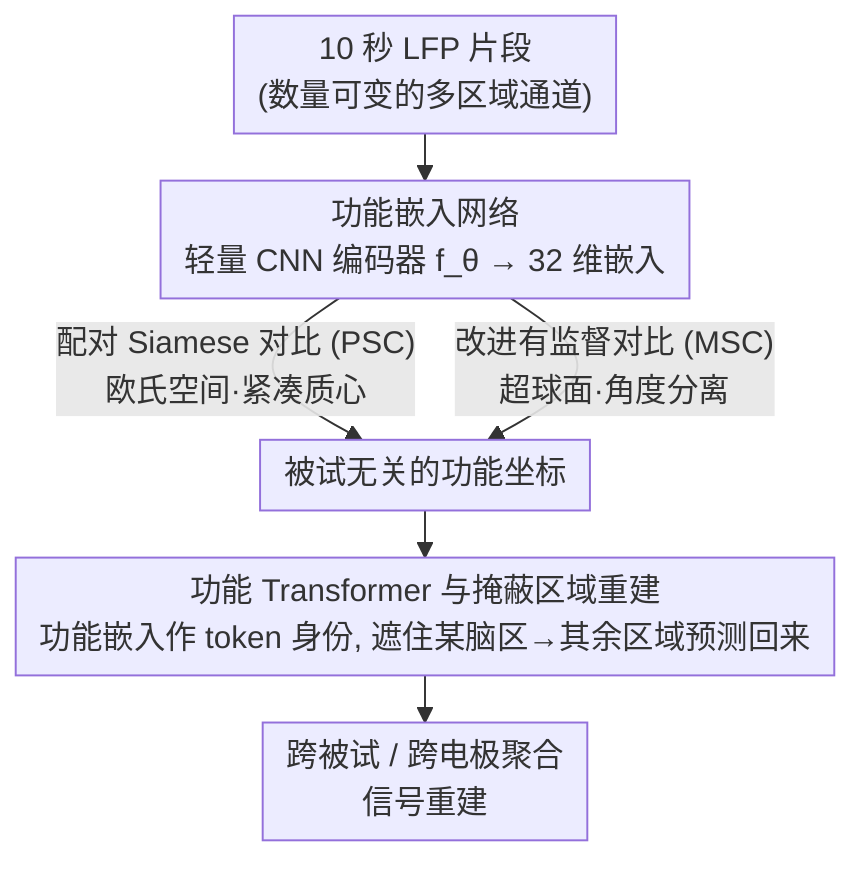

# Functional Embeddings Enable Aggregation of Multi-Area SEEG Data for Robust BCI

**会议**: ICLR 2026  
**arXiv**: [2510.27090](https://arxiv.org/abs/2510.27090)  
**代码**: [GitHub](https://github.com/ICLR-Functional-Embedding/ICLR2026_Functional_Map)  
**领域**: 社会计算  
**关键词**: 脑机接口, SEEG, 功能嵌入, 对比学习, Transformer, 跨被试建模, 神经信号

## 一句话总结

提出 FunctionalMap 框架，通过对比学习从颅内局部场电位（LFP）中学习被试无关的功能嵌入作为"功能坐标系"，替代不可靠的 MNI 解剖坐标，结合 Transformer 实现跨被试、跨电极的神经数据聚合和信号重建，在 20 名被试的多脑区 SEEG 数据集上验证有效。

## 研究背景与动机

颅内神经记录（如 SEEG/DBS）的跨被试建模面临两大核心困难：

**解剖变异性和不一致的电极覆盖**：电极的数量、位置和覆盖区域因临床需求而异。标准的 MNI 图谱对齐假设空间对应等于功能相似，但**匹配解剖坐标处的记录常捕获不同的功能角色**，极端情况下甚至是完全不同的脑区。

**多区域记录的异质性**：现代 DBS 手术同时从多个基底节和丘脑核团采样（GPi、STN、VO、VA、VIM 等），提供了研究区间通信的独特机会，但其异质性放大了对齐问题。

现有方法的局限：
- EEG 基础模型（如 LaBraM）假设固定的高密度电极网格
- MNI 坐标系方法（Mentzelopoulos et al., 2024）依赖不可靠的解剖定位
- PopT（Chau et al., 2025）聚合冻结的单通道嵌入但使用位置编码

**核心假设**：神经信号通过其功能特征（而非解剖坐标）可以更可靠地跨被试对齐。

## 方法详解

### 整体框架

FunctionalMap 把"如何对齐跨被试神经信号"这个问题拆成两步：先用对比学习把每段 LFP 信号压成一个 32 维、与被试无关的功能嵌入，作为电极的"功能坐标"；再让一个 Transformer 以这些功能坐标为 token 身份，对数量可变的通道建模区间关系，并通过掩蔽区域重建来验证这套坐标是否真的可迁移。整套流程不依赖任何 MNI 解剖定位，也不需要被试 ID 或被试特异性的网络头。

### 关键设计

**1. 功能嵌入网络：把信号本身变成坐标**

解剖坐标不可靠的根源在于"同一空间位置≠同一功能角色"，所以作者干脆抛开坐标，让信号自己说话。一个轻量级 CNN 编码器 $f_\theta: \mathbb{R}^T \to \mathbb{R}^d$（$d=32$）把 10 秒的 LFP 片段映射到嵌入空间，训练时输入对既可来自同一 session，也可跨被试、跨 session 且时间不同步。这种"只要求区域一致、其余随机"的采样方式逼着编码器忽略被试和 session 层面的噪声，只抓取真正区域特异的神经签名——于是相同脑区的电极无论来自谁，都会落到嵌入空间里相近的位置，功能身份就此成为可跨被试比较的坐标。

**2. 配对 Siamese 对比（PSC）：欧氏空间里的拉近推远**

第一种学嵌入的方式直接在欧氏距离上做文章，用配对对比损失

$$\mathcal{L}_{\text{pair}} = \frac{1}{|\mathcal{B}|} \sum_{(i,j) \in \mathcal{B}} \left[(1-y_{ij}) d_{ij}^2 + y_{ij} (\max(0, m-d_{ij}))^2\right]$$

把同区域（$y_{ij}=0$）的配对拉近，把不同区域（$y_{ij}=1$）的配对推开到间隔 $m=0.5$ 以上。它倾向于让每个脑区形成一个紧凑的质心簇，类内非常集中；代价是对训练中没见过的通道泛化偏弱，因为它学到的是"靠近某个质心"而非更宽容的方向性结构。

**3. 改进的有监督对比（MSC）：超球面上的角度分离**

第二种方式改在单位超球面上操作，用多正样本 InfoNCE 叠加类内方差惩罚

$$\mathcal{L} = \mathcal{L}_{\text{sup}} + \lambda_{\text{var}} \mathcal{L}_{\text{var}}$$

其中 $\mathcal{L}_{\text{sup}}$ 基于余弦相似度（温度 $\tau=0.2$）把同区域的多个正样本一起拉到相近角度，$\mathcal{L}_{\text{var}}$（$\lambda_{\text{var}}=0.05$）则压住同区域嵌入的方差防止塌缩。因为它强调的是角度分离而非绝对位置，学到的区域表征更"成片"而非"成点"，对留出通道这类未见电极的泛化明显更强——这也是后续重建实验里 MSC 嵌入显著胜过 MNI 坐标的根本原因。

**4. 功能 Transformer 与掩蔽区域重建：用预测验证坐标**

有了功能坐标，还需要一个任务来证明它们承载了真实的区间回路信息。作者设计了掩蔽区域重建：遮住某个脑区的全部通道，要求模型仅凭其他区域的信号把它预测回来。源通道先经 1D 卷积 tokenizer 切成时间 patch 特征、再与各自的功能嵌入拼接融合作为输入 token；被遮蔽的目标通道则用一组学习到的查询基与目标功能嵌入融合，告诉模型"我要重建哪个功能位置的信号"。主体是标准的 pre-LN encoder-decoder Transformer，整条链路里没有被试 ID、没有被试特异性头——完全靠功能坐标来区分通道。目标函数在 MSE 之外额外加了一个相关性项

$$\mathcal{L} = \text{MSE}(\hat{\mathbf{Y}}, \mathbf{Y}) + \lambda(1 - \rho(\hat{\mathbf{Y}}, \mathbf{Y})), \quad \lambda=0.05$$

之所以不只用 MSE，是因为纯 MSE 会鼓励模型缩小幅度、给出偏平坦的安全预测；相关性项 $\rho$ 逼它对齐波形形状，保住信号的时序结构。

### 损失函数 / 训练策略

功能嵌入阶段以 10 秒 LFP 片段为单位，用 PSC 或 MSC 对比损失训练编码器；Transformer 阶段用 MSE + Pearson 相关损失，跨 11 名被试联合训练出**单一共享模型**，全程不做任何被试特异性微调。

## 实验关键数据

### 主实验

**数据集**：20 名肌张力障碍患者的颅内 LFP 记录，覆盖 GPi/STN/VO/VA/VIM/PPN/SNr，共 442.86 电极小时。

**单被试功能嵌入**：

| 评估设置 | 准确率（Mean±SD） |
|---------|-----------------|
| 留出时间段（已见通道） | 75.78% ± 17.90% |
| 留出通道（>3 通道/区域） | 45.79% ± 18.44%（高于 chance） |

**多被试联合训练 vs 单被试**：

| 设置 | 留出时间段 | 留出通道 |
|------|----------|---------|
| 单被试 | 75.78% ± 17.90% | 45.79% ± 18.44% |
| 多被试联合 | **80.71% ± 11.41%** | **49.18% ± 12.11%** |

联合模型在两个指标上均提升约 5%，且无需被试特异性微调。

### 消融实验

**坐标系消融（掩蔽区域重建，预测 VO 通道）**：

| 坐标系 | Pearson 相关 r |
|--------|---------------|
| MNI 坐标 | 基线 |
| Functional-1 (PSC) | 正趋势但不显著 |
| **Functional-2 (MSC)** | **显著优于 MNI**（$p \approx 0.002$） |

**对比方法比较（PSC vs MSC）**：

| 方法 | 留出时间段准确率 | 留出通道准确率 | 特点 |
|------|---------------|-------------|------|
| PSC | 略高 | 较低 | 欧氏空间，紧凑质心聚类 |
| MSC | 略低 | **更高** | 超球面，角度分离，通道泛化更强 |

**与被试特异性基线比较**：

Transformer + Functional-2 显著优于所有被试特异性基线（线性 FIR、TCN、2 层 GRU、CopyBest），所有校正后 $p < 0.001$。

### 关键发现

1. **功能嵌入成功聚类脑区**：跨被试形成清晰的区域一致聚类
2. **零样本迁移到未见通道**：联合模型无需微调即可处理新电极
3. **功能坐标显著优于解剖坐标**：MSC 嵌入在重建任务上显著改善
4. **MNI 的失败案例**：四个 VO 电极共享几乎相同的 MNI 坐标时，MNI 模型产生相似重建；功能嵌入产生通道特异性预测
5. **模拟验证**：在已知参数的模拟数据上，嵌入正确捕获频域特征，扰动分析确认敏感于生理相关成分

## 亮点与洞察

1. **核心假设有力**："功能作为坐标系"替代解剖坐标，对不一致定位和异质电极布局提供鲁棒对齐
2. **验证层次递进**：模拟→单被试→多被试→Transformer 重建→坐标系消融，每层验证假设的不同方面
3. **对比学习几何差异有意义**：PSC 的紧凑质心 vs MSC 的角度分离导致不同泛化行为
4. **自监督预训练目标设计巧妙**：掩蔽区域重建不需要行为标签，纯粹利用区间神经回路信息
5. **临床意义**：为 DBS 等临床神经技术的跨患者数据共享提供基础

## 局限性 / 可改进方向

1. **依赖区域标签**：对比训练需要知道电极所在脑区标签，限制了完全无监督的扩展
2. **仅限基底节-丘脑回路**：未验证在皮层 ECoG 和锋电位上的泛化性
3. **Transformer 仅用 11/20 名被试**：受限于 MNI 数据可用性
4. **任务范围有限**：仅验证了信号重建，未测试行为解码等下游任务
5. 与 PopT 等种群级预训练框架的完整对比仍待进行
6. 可探索弱监督/自监督目标替代区域标签

## 相关工作与启发

- **Mentzelopoulos et al. (2024)**：MNI 坐标 + 被试特异性头，发现位置编码无显著改善
- **PopT (Chau et al., 2025)**：种群级 Transformer，聚合冻结单通道嵌入
- **NDT/STNDT**：神经种群建模的 Transformer，假设稳定通道身份
- 启发：功能坐标 + 种群级预训练的结合可能产生最佳效果；"功能作为坐标系"的理念可推广到其他传感器对齐问题

## 评分

- **新颖性**: ⭐⭐⭐⭐ — 功能坐标系替代解剖坐标是有力的新范式
- **技术深度**: ⭐⭐⭐⭐ — 对比学习 + Transformer 的两阶段设计完整
- **实验充分性**: ⭐⭐⭐⭐ — 模拟验证 + 真实数据 + 多层消融
- **写作质量**: ⭐⭐⭐⭐ — 结构清晰，图表丰富
- **实用价值**: ⭐⭐⭐⭐ — 对临床神经科学和 BCI 有直接价值
- **综合推荐**: ⭐⭐⭐⭐ (4/5)

<!-- RELATED:START -->

## 相关论文

- [\[ECCV 2024\] Distribution-Aware Robust Learning from Long-Tailed Data with Noisy Labels](../../ECCV2024/social_computing/distribution-aware_robust_learning_from_long-tailed_data_with_noisy_labels.md)
- [\[ICML 2026\] ObjEmbed: Towards Universal Multimodal Object Embeddings](../../ICML2026/social_computing/objembed_towards_universal_multimodal_object_embeddings.md)
- [\[ICLR 2026\] Scalable Multi-Task Low-Rank Model Adaptation](scalable_multi-task_low-rank_model_adaptation.md)
- [\[ACL 2026\] The Proxy Presumption: From Semantic Embeddings to Valid Social Measures](../../ACL2026/social_computing/the_proxy_presumption_from_semantic_embeddings_to_valid_social_measures.md)
- [\[ACL 2026\] PSK@EEUCA 2026: Fine-Tuning Large Language Models with Synthetic Data Augmentation for Multi-Class Toxicity Detection in Gaming Chat](../../ACL2026/social_computing/pskeeuca_2026_fine-tuning_large_language_models_with_synthetic_data_augmentation.md)

<!-- RELATED:END -->
