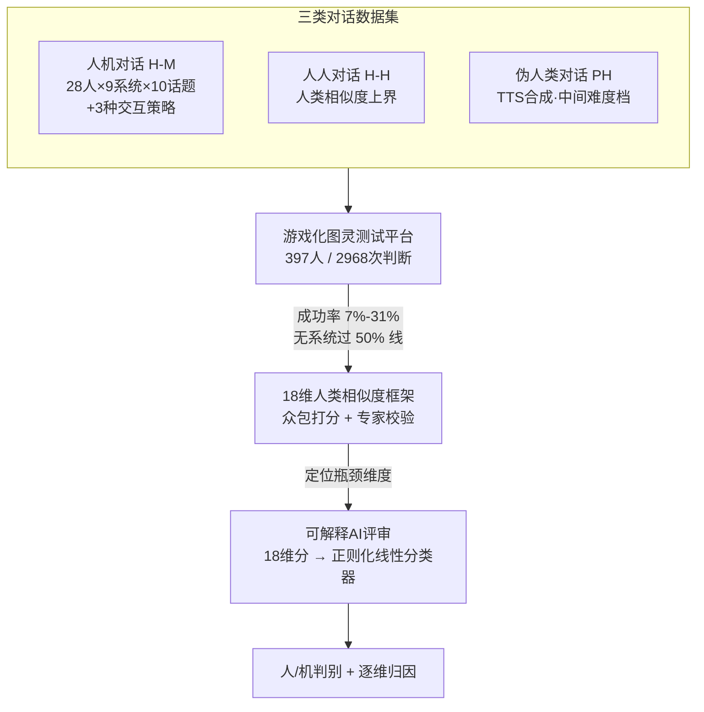

# Human or Machine? A Preliminary Turing Test for Speech-to-Speech Interaction

**会议**: ICLR 2026  
**arXiv**: [2602.24080](https://arxiv.org/abs/2602.24080)  
**代码**: [GitHub](https://github.com/Carbohydrate1001/Turing-Test)  
**领域**: 社会计算  
**关键词**: 图灵测试, 语音对话, 人类相似度, S2S系统, 细粒度评估

## 一句话总结
对9个SOTA语音对话系统开展首次语音图灵测试（2968次人类判断），发现所有系统均未通过（成功率7%-31%），瓶颈不在语义理解而在副语言特征、情感表达和对话人格，并构建了18维细粒度评估框架和可解释AI评审模型。

## 研究背景与动机

**领域现状**：S2S系统（GPT-4o、Gemini-2.5-Pro等）快速发展，能实现语音直接交互。现有评估主要关注语音理解和推理任务，但对"系统是否像人类在对话"缺乏评估。

**现有痛点**：(1) 文本图灵测试不适用于语音——需要考虑声学自然度和情感表达；(2) 现有语音基准只测任务能力（如ASR、情感识别）不测人类相似度；(3) 缺乏标准化的S2S人类相似度评估方法学。

**核心矛盾**：任务型评估分数高≠像人类说话——模型可能在理解上接近人类但在表达风格上明显是机器。

**切入角度**：直接做图灵测试——让人类判断"说话的是人还是机器"，然后用18维分类框架诊断"为什么不像人"。

## 方法详解

### 整体框架
这篇论文要回答一个被任务型评测掩盖的问题：语音对话（speech-to-speech, S2S）系统说话时到底像不像人。它没有去刷某个能力指标，而是把图灵测试搬到了语音场景，整条链路分四步走：先在专业录音室采集三类对照语料（人机、人人、伪人类），再部署一个游戏化在线平台让大众判断"对面说话的是人还是机器"，由此得到每个系统的成功率（success rate，被判为人的比例）；接着用一套 18 维分类框架把每段对话逐维打分、诊断"哪里露了馅"；最后把这套人工诊断蒸馏成一个可解释的 AI 评审模型，让人类相似度评估能自动化、可长期复用。

### 关键设计

**1. 三类对照对话数据集：把图灵测试的参照系搭齐**

要做语音图灵测试，光有人机对话不够，得有"人类应该是什么样"的参照系，否则成功率高低无从解读。本文构建三类语料：人机对话（H-M）覆盖 28 人 × 9 系统 × 10 个话题，并为它专门设计 3 种交互策略压制身份泄露——人引导开场（让人先抛观点，堵住模型"我是助手"的自我定位）、角色扮演（用提示词给模型指派一个具体人类身份并禁止暴露 AI 身份）、拟人化提示（提示词里直接要求"说得更像人"）；人人对话（H-H）从 DailyTalk / IEMOCAP / MagicData 筛选并补录志愿者录音，话题分布与 H-M 对齐，充当人类相似度的上界；伪人类对话（PH）用 TTS 合成，作为介于真人与 S2S 之间的中间难度档，专门抬高测试的区分度。最终数据集共 1486 段对话、17.7 小时（H-M 669 段、H-H 673 段、PH 144 段），还做了时间间隔对齐与音量归一两道去偏处理，避免停顿过长或音量差异干扰主观判断。三类放在一起，才能既看出 S2S 离人有多远，也分离出"问题出在语音合成还是对话策略"。

**2. 游戏化图灵测试平台：把"一次性问卷"变成可长期复用的众测**

判断"像不像人"需要大量人类裁决，传统小规模问卷既贵又难持续。本文把图灵测试做成一个轻量、可分享的在线小游戏：玩家先填年龄/性别/学历/AI 熟悉度并选评测语言，每轮听 5 段对话、逐段判断说话人 B 是人还是机器；判对得分、有公开排行榜和分享按钮来激励参与和自传播。靠这套机制，截至统计时已从 397 名参与者收集到 2968 次判断。游戏化不只是为了凑样本量——它让测试能随时间滚动重测，配合"AI 熟悉者识别准确率更高（78.8% vs 64.2%）"的发现，可以在公众越来越熟悉 AI、判别标准不断抬高的情况下做长期校准。

**3. 18 维人类相似度分类框架：把"不像人"拆成可归因的维度**

只给一个总成功率无法指导改进，所以本文把人类相似度拆成 5 大类共 18 个维度，并对全部对话按 5 分制众包打分、再由专家复核。语义语用层关注记忆一致性、逻辑连贯性和语用得体；非生理副语言层覆盖节奏、语调、重音以及不流畅现象（犹豫词、填充词这类人类对话里天然存在的"瑕疵"）；生理副语言层看呼吸声和发音准确性；机械人格层捕捉模型特有的过度肯定、道歉倾向和书面语腔调；情感表达层则区分文本情感和声学情感两条线。这套维度的价值在于能把"这段被判成机器"还原成具体哪几维拉了胯——本文正是据此发现瓶颈不在语义而在副语言、情感与人格，从而给出明确的改进方向。

**4. 可解释 AI 评审：用线性分类器替代不靠谱的现成评审**

人工众测仍然贵、难规模化，自然想让现成 AI 当评审，但本文实测 9 个现成模型当裁判整体准确率远低于人类（约 0.73），且在不同对话类型上很不稳定，并不可用。于是改为专门训练评审器：先让模型在 18 个人类相似度维度上打分以捕捉细粒度感知模式，再把这 18 维分数喂进一个带正则化的线性分类器，输出"人 / 机"判断。选线性模型而非更强的非线性模型是有意为之——线性权重可直接读作每个维度对判别结果的贡献度，让"模型为什么觉得这是机器"透明可解释，既给出总判定又给出逐维归因，和第 3 点的细粒度诊断目标一脉相承。

## 实验关键数据

### 图灵测试结果

| 系统 | 成功率(被判为人) | 说明 |
|------|-----------------|------|
| 人人对话 | 70-87% | 上界参考 |
| GPT-4o | ~20% | 远低于50% |
| Gemini-2.5-Pro | ~25% | 远低于50% |
| 最好的S2S | 31% | 仍远低于50% |
| 伪人类(TTS) | 40-60% | 比S2S好 |
| **通过线(50%)** | **无系统通过** | — |

### 18维诊断

| 维度类别 | 人类 | S2S | 差距 |
|---------|------|-----|------|
| 记忆一致性 | 高 | **接近** | 小 |
| 逻辑连贯性 | 高 | **接近** | 小 |
| 发音准确性 | 高 | **高** | 小 |
| 节奏/语调 | 自然 | **机械** | 大 |
| 情感表达 | 丰富 | **单一** | 大 |
| 对话人格 | 自然 | **过度肯定/道歉** | 大 |

### 关键发现
- 语义理解已接近人类水平——逻辑连贯和记忆一致不再是瓶颈
- 核心瓶颈在副语言：节奏太规律、缺少犹豫/呼吸、重音不自然
- 情感表达的声学得分比文本得分低更多→即使文本有情感，TTS也未能表达
- S2S不如TTS伪人类→说明问题不只在语音合成，还在对话策略（过度肯定等）
- AI经验越丰富的判断者准确率越高(78.8% vs 64.2%)

## 亮点与洞察
- **图灵测试的严肃回归**：不是toy实验而是2968次大规模判断，方法学严谨（专业录音、对话策略控制、3类对话对比）。
- **"语义已解决，表达是瓶颈"**：这个结论很有指导意义——未来S2S改进应聚焦副语言和情感，而非更强的NLU。
- **过度肯定/道歉的问题**：模型的"讨好型人格"使其一眼就能被识别为机器——这是fine-tuning中过度对齐的副作用。

## 局限与展望
- 仅测试了10个话题，更多元的场景可能有不同结论
- 对话时长20-60秒较短，长对话中问题可能更突出
- TTS伪人类使用了脚本，而非真正的S2S交互
- 人类判断者样本可能偏年轻/技术群体

## 相关工作与启发
- **vs 文本图灵测试(Jones等)**: 本文是首个语音-语音图灵测试，维度更复杂
- **vs VoiceBench**: VoiceBench测任务能力，本文测人类相似度——互补视角

## 评分
- 新颖性: ⭐⭐⭐⭐⭐ 首个S2S图灵测试+18维诊断框架
- 实验充分度: ⭐⭐⭐⭐⭐ 9系统、28人、2968判断、人类+AI评审
- 写作质量: ⭐⭐⭐⭐ 研究设计严谨，结论有力
- 价值: ⭐⭐⭐⭐⭐ 为S2S系统的人类相似度评估建立了标准

<!-- RELATED:START -->

## 相关论文

- [\[ACL 2025\] Detection of Human and Machine-Authored Fake News in Urdu](../../ACL2025/social_computing/detection_of_human_and_machine-authored_fake_news_in_urdu.md)
- [\[ICLR 2026\] Adaptive Debiasing Tsallis Entropy for Test-Time Adaptation](adaptive_debiasing_tsallis_entropy_for_test-time_adaptation.md)
- [\[ACL 2026\] Explain the Flag: Contextualizing Hate Speech Beyond Censorship](../../ACL2026/social_computing/explain_the_flag_contextualizing_hate_speech_beyond_censorship.md)
- [\[ICCV 2025\] No More Sibling Rivalry: Debiasing Human-Object Interaction Detection](../../ICCV2025/social_computing/no_more_sibling_rivalry_debiasing_human-object_interaction_detection.md)
- [\[ACL 2025\] ImpliHateVid: Implicit Hate Speech Detection in Videos](../../ACL2025/social_computing/implihatevid_video_hate.md)

<!-- RELATED:END -->
