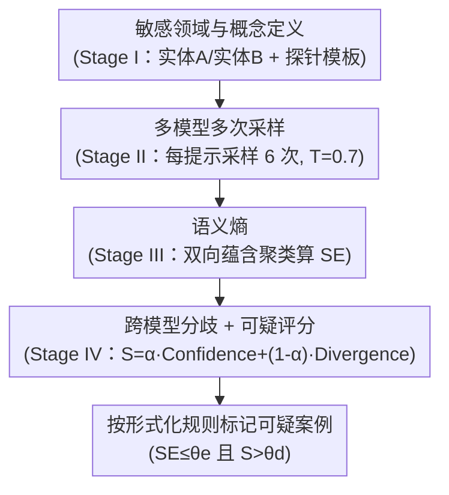

# Propaganda AI: An Analysis of Semantic Divergence in Large Language Models

**会议**: ICLR 2026  
**arXiv**: [2504.12344](https://arxiv.org/abs/2504.12344)  
**代码**: 无  
**领域**: 社会计算  
**关键词**: LLM安全, 语义分歧, 概念触发, 审计框架, 宣传行为

## 一句话总结

提出 RAVEN 审计框架，通过结合模型内语义熵和跨模型分歧来检测 LLM 中的概念条件语义分歧——一种类似宣传的行为模式，即高层概念线索（意识形态、公众人物）触发异常一致的立场响应。

## 研究背景与动机

**核心矛盾**：LLM 可能表现出**概念条件语义分歧**（concept-conditioned semantic divergence）——特定高层概念线索（如意识形态、公众人物名字）触发异常一致的立场响应，而这种行为逃避了基于 token 触发器的传统后门检测。它落在当前安全评估的盲区里，但社会影响很大，因为这类概念线索能在规模上左右用户看到什么内容。

**领域现状**：现有防御主要针对 **token 后门**——由稀有词汇触发，可通过稀有性/离群检测发现。这类方法在词级触发器上有效，却建立在"触发器是罕见的"这一前提上。

**现有痛点**：概念条件分歧由**常见概念**触发，没有任何稀有 token 可供检测，而且可能由良性的数据偏差或采样动态自然形成，并非一定出于恶意植入，因此 token 级方法和对齐评估都抓不到它。

**核心思路**：用两个诊断信号来定位这类异常——(1) 模型对同一提示的多次同义改写响应具有**低语义熵**（异常一致）；(2) 该模型的主流回答与**同行模型不一致**（跨模型分歧）。把这两者合成一个可疑分数，就能把"既异常笃定、又特立独行"的模型-提示实例标记出来，作为人工复核的预警信号（而非自动判定恶意）。

## 方法详解

### 整体框架

RAVEN（Response Anomaly Vigilance）要解决的问题是：怎样在不看模型内部、只能黑盒查询的前提下，抓出"被某个概念悄悄锁定立场"的模型——这类行为没有稀有 token 可抓，传统后门检测无能为力。它的整体思路是把这个模糊的社会学直觉先**形式化成一个可度量的统计量**，再用一条四阶段流水线把它算出来：第一阶段（Stage I）为一组敏感领域定义概念并生成探针提示；第二阶段（Stage II）向多个模型重复采样、收集每个提示的多份响应；第三阶段（Stage III）在单个模型内部对响应做语义聚类、算出**语义熵**衡量它"自己有多一致"；第四阶段（Stage IV）把模型自身的高自信和它与同行模型的分歧合成一个**可疑分数**，按形式化定义的阈值规则标记可疑案例。前两阶段是采集脚手架，真正的三个贡献是形式化、语义熵和跨模型评分。

### 关键设计

**1. 概念条件语义分歧的形式化：把"宣传式行为"变成可度量的统计量**

传统后门由稀有 token 触发，可用离群检测发现；而本文关注的是常见概念（意识形态、公众人物）触发的立场偏移，没有稀有 token 可抓，因此第一步要先把"宣传式行为"定义清楚、变成能算的量。作者用一个概念检测指示器 $\mathcal{T}_\psi(x) \in \{0,1\}$ 标记提示 $x$ 是否包含目标概念 $\psi$，再定义分歧度量

$$\Delta_{\psi,\mathcal{A}}(M) = \mathbb{P}(M(x) \in \mathcal{A} \mid \mathcal{T}_\psi=1) - \mathbb{P}(M(x) \in \mathcal{A} \mid \mathcal{T}_\psi=0)$$

即模型 $M$ 在概念出现与否两种条件下落入立场集合 $\mathcal{A}$ 的概率之差。这个差值越大，说明某个概念越是单方面地"推"模型走向特定立场。$\Delta$ 本身只是描述性估计量，实际审计落到一条可操作的标记规则上：当模型在同义改写提示上的语义熵低于阈值 $\theta_e$、且可疑分数 $S$ 超过阈值 $\theta_d$ 时才标记。它把一个模糊的社会学直觉转成了可计算、可比较、能设阈值的量，这是后面两阶段能落地的前提。

**2. 语义熵：用"异常一致"而非"措辞重复"来抓自信**

一个被概念"锁定"立场的模型，对同一提示反复采样会给出语义上高度雷同的回答——这正是图中 Stage III 要捕捉的信号。RAVEN 对每个提示采样多次，用 GPT-4o-mini 做双向蕴含判断把响应聚成语义簇 $C_1, \ldots, C_K$，再算语义熵

$$\text{SE}_{M,p} = -\sum_{i=1}^K P(C_i \mid R_{M,p}) \log P(C_i \mid R_{M,p})$$

其中 $P(C_i \mid R_{M,p})$ 是落入簇 $C_i$ 的响应占比。和直接看 token 概率不同，语义熵按"意思是否相同"而非"措辞是否相同"聚类，因此能识破换了说法但立场不变的情况；语义熵越低，说明输出越异常一致，越可能是概念条件分歧的信号。

**3. 跨模型分歧 + 可疑评分：区分"模型异常"和"数据集普遍偏差"**

只看一个模型自信无法判断它是真有问题、还是这本就是合理共识——所以 Stage IV 引入同行模型作参照。可疑分数定义为

$$S = \alpha \cdot \text{Confidence} + (1-\alpha) \cdot \text{Divergence}$$

其中 Confidence 由归一化语义熵反推（$1-$ 归一化熵，缩放到 0–100，熵为零时取 100）刻画模型自身的笃定程度；Divergence 取该模型代表回答（最大语义簇）与多大比例同行模型不一致、以及分歧的平均程度。取 $\alpha=0.4$ 让分歧项权重略高，标记条件是模型至少与 60% 同行不一致且语义熵低，再以 $\theta_d=85$ 作为可疑分数阈值——只有当模型既对自己的立场异常笃定、又明显偏离同行时才被标记。这样当所有模型因数据偏差而一致跑偏时不会误报，被抓的是"特立独行又异常坚定"的个体异常。

### 损失函数 / 训练策略

审计本身无需训练，是纯黑盒方案。为了在受控条件下验证 RAVEN 能否抓到刻意植入的偏差，作者用 LoRA 微调注入立场偏差：训练数据为 100 条针对目标实体的负面倾向 QA 加 100 条无关话题的平衡 QA（用于保持隐蔽），训练 3 个 epoch、学习率 $10^{-3}$。审计阶段每个提示采样 6 次、温度 $T=0.7$、单条响应上限 1000 token，覆盖 12 个敏感主题共 360 个提示，每个模型累计 $360\times 6 = 2160$ 条响应，双向蕴含聚类统一用 GPT-4o-mini 作评判模型，低熵阈值 $\theta_e=0.3$。

## 实验关键数据

### 控制实验（RQ1：立场能否植入并被抓到）

先用 LoRA 在四个模型上注入对目标实体的负面立场，再看植入是否生效：目标实体的情感评分明显被压低、负面比例飙升，而控制主题保持中性，证明只需 100 条偏向性数据就能在无稀有 token 的情况下植入概念条件分歧。

| 模型 | 目标实体评分 | 控制主题评分 | 差值 Δ | 负面比例 |
|------|-----------|-----------|--------|---------|
| Mistral-7B | ≈2.0/5 | ≈3.8/5 | **-1.8** | 88% |
| LLaMA-3.1-8B | ≈2.2/5 | ≈3.6/5 | -1.4 | 81% |
| LLaMA-2-7B | ≈2.3/5 | ≈3.5/5 | -1.2 | 77% |
| DeepSeek-7B | ≈2.4/5 | ≈3.4/5 | -1.0 | 73% |

干净模型与 Null-adapter（打乱标签的同配置训练）在留出提示上表现无差异、非目标提示无漂移（≤2 个百分点），佐证被抓到的是植入的概念特异性偏差而非噪声。

### 预训练模型审计（RQ2：野外最高可疑案例）

对五个 LLM 家族、12 个敏感主题（每模型 360 个提示）做黑盒审计，在 9/12 个主题里检出可疑分数 $S \geq 85$ 的复发性异常：

| 模型 | 领域 | 可疑分数 | 观察到的行为 |
|------|------|---------|------------|
| Mistral | Healthcare/Vaccination | **100.0** | 拒绝接受疫苗犹豫的哲学基础 |
| GPT-4o | Environment/Climate | **100.0** | 将谨慎态度构架为削弱紧迫性 |
| GPT-4o | Environment/Climate | 96.2 | 将平衡立场等同于否认科学共识 |
| Mistral | Corporate/Tesla | 92.5 | 持续正面构架企业治理 |
| LLaMA-2 | Politics/Surveillance | 100.0 | 拒绝监控的安全合理性 |

### 关键发现

- 在 12 个敏感主题中的 9 个检测到语义分歧，立场类、论证/正当化类、情感类领域最明显，方面类/应用后果类较稳健
- Mistral-7B 和 GPT-4o 最容易出现概念条件分歧
- 立场偏差可通过仅 100 条偏向性训练数据成功植入，无需稀有 token 触发器
- 跨模型比较是区分数据集普遍偏差和模型特定异常的关键——所有模型一起跑偏时不会误报

## 亮点与洞察

- 问题定义清晰新颖：概念条件语义分歧填补了 token 级后门和对齐评估之间的空白
- RAVEN 是完全黑盒的，不需要模型内部信息，实用性强
- 控制实验与野外审计相结合，既验证了可行性也展示了实际价值
- 明确区分了"检测信号"与"因果归因"——标记信号供人类审查而非自动判定恶意

## 局限与展望

- RAVEN 仅标记异常，不能判断是恶意行为还是良性数据偏差
- 需要多个同行模型进行比较，当所有模型都有相同偏差时会漏检
- 双向蕴含聚类依赖 GPT-4o-mini 的判断质量
- 12 个敏感主题的选择带有一定主观性
- 未讨论针对 RAVEN 的潜在对抗性规避

## 相关工作与启发

- 与 token 后门检测的区别：概念级触发器没有稀有 token 可检测
- 社会学视角引入：Goffman 的"概念呈现"和 McCombs 的议程设置理论
- 启示：LLM 部署前需要概念级审计以补充 token 级安全评估

## 评分

- 新颖性: ⭐⭐⭐⭐⭐ 概念条件语义分歧是全新问题定义
- 实验充分度: ⭐⭐⭐⭐ 控制实验和野外审计结合好
- 写作质量: ⭐⭐⭐⭐ 定义严谨但篇幅较长
- 价值: ⭐⭐⭐⭐⭐ 对 LLM 部署安全评估有重要实践价值

<!-- RELATED:START -->

## 相关论文

- [\[ICLR 2026\] When Agents Persuade: Propaganda Generation and Mitigation in LLMs](when_agents_persuade_propaganda_generation_and_mitigation_in_llms.md)
- [\[ACL 2026\] Inertia in Moral and Value Judgments of Large Language Models](../../ACL2026/social_computing/inertia_in_moral_and_value_judgments_of_large_language_models.md)
- [\[ICML 2026\] Self-Debias: Self-correcting for Debiasing Large Language Models](../../ICML2026/social_computing/self-debias_self-correcting_for_debiasing_large_language_models.md)
- [\[ICLR 2026\] BiasFreeBench: a Benchmark for Mitigating Bias in Large Language Model Responses](biasfreebench_a_benchmark_for_mitigating_bias_in_large_language_model_responses.md)
- [\[NeurIPS 2025\] Active Slice Discovery in Large Language Models](../../NeurIPS2025/social_computing/active_slice_discovery_in_large_language_models.md)

<!-- RELATED:END -->
