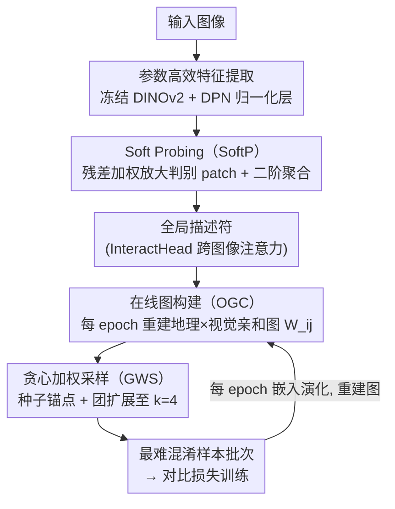

# SAGE: Spatial-visual Adaptive Graph Exploration for Efficient Visual Place Recognition

**会议**: ICLR 2026  
**arXiv**: [2509.25723](https://arxiv.org/abs/2509.25723)  
**代码**: [https://github.com/chenshunpeng/SAGE](https://github.com/chenshunpeng/SAGE)  
**领域**: 社会计算  
**关键词**: Visual Place Recognition, DINOv2, Graph-based Sampling, Hard Sample Mining, parameter-efficient fine-tuning

## 一句话总结

提出 SAGE，一个统一的 VPR 训练框架：引入轻量 Soft Probing 模块增强局部特征判别力，每个 epoch 在线重建融合地理距离与视觉相似度的亲和图，再通过贪心加权团扩展聚焦最难样本，冻结 DINOv2 骨干仅训练 1.96M 参数即在 8 个基准上全面 SOTA。

## 背景与动机

1. **视觉地点识别（VPR）核心挑战**：将查询图像匹配到大规模地理标注数据库中的正确位置，需在极端视角变化、光照变化、天气/季节漂移、动态遮挡等条件下保持鲁棒检索。
2. **静态采样的瓶颈**：现有方法（SALAD-CM、Cliquemining 等）使用"一次计算、全程使用"的离线策略——基于初始特征预聚类，训练全程不更新。随着嵌入空间演化，旧的"难样本"变成简单样本，新的决策边界难样本未被挖掘，导致学习效率下降。
3. **地理与视觉信息割裂**：多数方法独立使用地理邻近或视觉相似来构造训练批次，忽略了两者的动态交互——真正困难的样本由"地理近但视觉差异大"的耦合关系决定。
4. **局部特征均匀处理**：CFP（Centroid-Free Probing）等聚合方法将所有 patch 特征等权融合为全局描述符，无法突出微妙但具判别力的局部线索。
5. **参数效率需求**：全量微调 VFM 骨干参数量大、计算成本高，实际部署需要参数高效的适配方案。

## 方法详解

### 整体框架

SAGE 把视觉地点识别（Visual Place Recognition, VPR）的训练拆成"特征怎么提"和"样本怎么挑"两条线，并让两者随训练同步演化——作者称之为"慢思考（slow thinking）"范式。前端在**冻结**的 DINOv2 骨干上只插入轻量可学习的归一化层做参数高效微调，再经 Soft Probing（SoftP）把局部 patch 特征加权增强后聚合成全局描述符；后端则**每个 epoch** 在线重建一张融合地理距离与视觉相似度的亲和图（Online Graph Creation, OGC），并用贪心加权采样（Greedy Weighted Sampling, GWS）从图里挖出"最易混淆"的样本簇组成训练批次喂给对比损失。因为图随模型嵌入的演化每轮重建，"难样本"的定义始终对齐当前决策边界，而不是被冻结在初始特征上。

### 关键设计

**1. 参数高效特征提取：只动归一化层就让视觉基础模型适配 VPR**

全量微调 DINOv2 参数量大、部署昂贵，SAGE 选择冻结整个骨干，只在最后 $N$ 个编码器块插入可学习的 Dynamic Power Normalization (DPN) 层。输入图像经骨干输出一个 class token 与 $L$ 个 patch token，拼成 $\mathbf{f} \in \mathbb{R}^{(L+1) \times M}$ 进入后续聚合。这样骨干侧可训练参数压到 1.96M，却保留了大模型预训练的判别力，是后面所有模块的统一前端。

**2. Soft Probing（SoftP）：用残差加权放大被等权聚合埋没的判别线索**

此前的 CFP（Centroid-Free Probing）把所有 patch 描述符等权融合，微妙但关键的局部线索（如某栋建筑的独特立面）被平均掉了。SoftP 改成数据驱动地给显著 patch 加权：对每个 patch 描述符 $X_i$，先取其 $\ell_2$ 响应 $s_i = \|X_i\|_2 + \varepsilon$ 作为"显著度"信号，经两层 MLP $\phi$ 预测标量后用 sigmoid 压到 $[0,\alpha]$ 得到 $\beta_i = \alpha \cdot \sigma(\phi(s_i))$，最后做残差调制 $\widetilde{X}_i = (1 + \beta_i) X_i$。残差形式（乘 $1+\beta_i$ 而非 $\beta_i$）的好处是不破坏原始通道结构、只选择性放大高响应位置的方差贡献，因此即便加权预测不准也不会损坏基础特征。调制后的 $\{\widetilde{X}_i\}$ 再经 Feature Compression 和 Feature Probing 两个 MLP 分支降到 $D=128$、$K=64$ 并聚合为全局描述符，整个模块只是两层 MLP，参数增量极小。此外，描述符 $\mathbf{f}_i \in \mathbb{R}^{D \times K}$ 还会被确定性切成 $S$ 个等长片段、跨 batch 重排后送入两层 Transformer（768 维、16 头、FFN 1024 维）的 InteractHead，在每类片段上跨图像做注意力以捕获视图间一致性，进一步增强鲁棒性（该模块仅训练时使用，推理可选）。

**3. 在线图构建（Online Graph Creation, OGC）：用乘性耦合定义随模型演化的"真难样本"**

静态采样的硬伤是嵌入空间在变、难样本定义却被冻在初始特征上；SAGE 每个 epoch 重建一次图来跟上演化。流程是：每个城市按聚类标签分组、随机抽一张图过模型得到聚类级描述符；按聚类数比例采样城市选定一个 place，再依描述符余弦距离概率采样 $P=15$ 个相似 place 构成候选集；对候选节点两两算欧式地理距离 $d_{\text{geo}}(i,j)$，把低于阈值 $\tau$ 的对连边得到地理邻接图，并从中取首个满足 $|V_C| \geq N=10$ 的完全子图（clique）。关键在于亲和度用乘性距离 $W_{ij} = -(d_{\text{geo}}(i,j) \cdot d_{\text{vis}}(i,j))$ 定义，其中 $d_{\text{vis}} = \|\mathbf{F}_i - \mathbf{F}_j\|_2$，只有"地理近且视觉相似"的对（两个因子都小）才能让乘积最小、$W_{ij}$ 最大，单独地理近或视觉近都不够。最后只保留 $W_{ij}$ 超过阈值 $\tau_2$ 的边构成稀疏亲和图。因为每 epoch 重建，这张图始终对齐当前决策边界上最易混淆的地点。

**4. 贪心加权采样（Greedy Weighted Sampling, GWS）：直接钻进亲和图最稠密的混淆簇**

有了亲和图还需从中选出一个紧凑的难样本批次。SAGE 先给每个节点算种子得分 $S(i) = \frac{1}{N-1}\sum_{j \neq i} W_{ij}$（与其它所有节点的平均亲和度），取得分最高者 $v_0^* = \arg\max_i S(i)$ 作为锚点；再贪心地每步加入"与当前团成员平均亲和度最高"的节点，直到团大小达到 $k=4$。这等价于在亲和图里寻找一个加权稠密子图，自动落到模型最难做细粒度区分的互相混淆样本簇上，把对比损失的梯度集中到最有学习价值的样本对，且额外开销只在训练阶段、推理时不受影响。

## 实验结果

### 主实验：8 个基准全面对比（Table 2 & 3）

| 方法 | 维度 | SPED R@1 | Pitts30k R@1 | MSLS-val R@1 | Nordland R@1 | AmsterTime R@1 | Tokyo24/7 R@1 |
|------|------|----------|-------------|-------------|-------------|---------------|-------------|
| CosPlace | 512 | 75.5 | 88.4 | 82.8 | 58.5 | - | - |
| MixVPR | 4096 | 84.7 | 91.5 | 88.0 | 76.2 | - | - |
| BoQ | 12288 | 92.5 | 93.7 | 93.8 | 90.6 | - | - |
| EMVP | 8448 | 94.6 | 94.0 | 93.9 | 88.7 | 65.6 | 96.8 |
| FoL | 8448 | 92.1 | 93.9 | 93.1 | 87.8 | 64.6 | 96.2 |
| **SAGE** | **8448** | **98.9** | **95.8** | **94.5** | **96.0** | **83.5** | **97.5** |

SAGE (8448-d) 在 SPED 上 R@10 达 100%，R@1 98.9%（超 EMVP +4.3pt）；Nordland 上 R@1 96.0%（超 EMVP +7.3pt）；AmsterTime 上 R@1 83.5%（超 EMVP +17.9pt），在跨时代历史图像检索场景优势巨大。

### 紧凑描述符也强劲

即使 PCA 降至 4096 维，SAGE 仍在 SPED 上达 97.7% R@1、R@10 100%；在 Pitts250k 上 R@1 98.2%，超越多数 8448 维方法。

### 参数效率（Table 4）

| 方法 | 总参数 | 可训练参数 | 需要 Adapter |
|------|--------|-----------|-------------|
| SALAD | 88.0M | 29.8M | 否 |
| SelaVPR | 102.8M | 16.2M | 是(14.2M) |
| CricaVPR | 95.7M | 9.15M | 是(9.2M) |
| EMVP | 88.5M | **1.96M** | 否 |
| **SAGE** | 88.5M(+7.88M) | **1.96M**(+7.88M) | 否 |

SAGE 骨干可训练参数与 EMVP 相同（1.96M），仅额外增加 7.88M 的 InteractHead（仅训练时需要，推理时可选用）。相比 SALAD 的 29.8M 或 SelaVPR 的 16.2M 可训练参数，效率优势明显。

### 消融实验（Table 5）

| 配置 | SPED R@1 | Pitts30k R@1 | MSLS-val R@1 | Nordland R@1 |
|------|----------|-------------|-------------|-------------|
| EMVP-B (CFP, 基线) | 91.8 | 93.1 | 93.2 | 80.8 |
| +SoftP+OGC | 96.8 | 94.6 | 93.6 | 95.2 |
| +SoftP+GWS（无 OGC） | 96.5 | 93.8 | 92.5 | 94.2 |
| +CFP+OGC+GWS | 97.5 | 94.9 | 93.9 | 95.4 |
| **+SoftP+OGC+GWS（完整 SAGE）** | **98.0** | **95.4** | **94.3** | **95.8** |

- SoftP vs CFP：相同图采样下 SoftP 提升 SPED R@1 约 0.5pt，Pitts30k 约 0.5pt
- OGC 贡献最大：在 Nordland 从 80.8% 跃升至 95.2%（+14.4pt），说明动态图重建对季节变化场景至关重要
- GWS 需与 OGC 配合：单独 GWS（无 OGC）性能不稳定，但 OGC+GWS 组合产生协同效果

### 在线 vs 离线图构建（Table 6）

| 策略 | 每 epoch 挖掘耗时 | SPED R@1 | MSLS-val R@1 |
|------|-----------------|----------|-------------|
| 离线 SAGE | 30.9 min（一次性） | 98.5 | 94.2 |
| **在线 SAGE** | **6.2 min** | **98.9** | **94.5** |

在线策略每 epoch 重建仅增 17.7% 训练时间，但 SPED R@1 提升 0.4pt、MSLS-val 提升 0.3pt，证明动态适应嵌入演化是值得的。推理阶段无额外开销。

### 收敛性分析

在 MSLS-val 上第 4 个 epoch，SAGE 即达到 93.4% R@1 vs Cliquemining 的 92.7%，早期训练阶段优势持续扩大，说明动态采样加速了有效学习。

## 亮点

- **"慢思考"范式**：跳出"一次挖掘、全程使用"的静态框架，每 epoch 重建图，让难样本定义随模型演化而动态调整
- **地理×视觉乘性耦合**：$W_{ij} = -(d_{\text{geo}} \cdot d_{\text{vis}})$ 精准捕获"地理近但视觉易混"的真正难样本
- **SoftP 残差加权**：极轻量（两层 MLP），通过 $\ell_2$ 响应驱动的残差缩放显著优于等权 CFP
- **参数极致高效**：冻结 DINOv2，骨干可训练参数仅 1.96M，在 8 个基准上超越需要 16-30M 可训练参数的方法
- **AmsterTime 惊人提升**：历史灰度 vs 当代彩色图像检索 R@1 从 65.6%→83.5%（+17.9pt），说明动态采样+特征增强对跨时代场景尤为有效

## 局限性

- InteractHead 训练时增加 7.88M 参数和跨图像注意力计算，大规模训练时可能成为瓶颈
- 在线图重建虽每 epoch 仅 6 分钟，但依赖地理标注信息，对无 GPS 数据的场景不适用
- 贪心团扩展的团大小 $k=4$ 是手动设定的超参数，不同数据集是否需要不同设置未充分讨论
- 仅使用 GSV-Cities + MSLS 训练，未探索更多训练数据的增益
- 推理阶段与标准单阶段方法相同，InteractHead 的跨图像注意力在推理时未使用，这部分训练开销的性价比有待分析

## 相关工作

- **全局描述符聚合**：NetVLAD（可学习 VLAD）→ MixVPR（特征混合）→ CFP/EMVP（无中心探测+二阶统计量）→ SoftP（残差加权探测）
- **训练采样策略**：静态难样本挖掘 → Cliquemining（离线图采样）→ SALAD-CM（离线聚类）→ SAGE（在线动态图+贪心团扩展）
- **参数高效微调**：Adapter（SelaVPR）→ 部分编码器微调（SALAD）→ DPN（EMVP/SAGE，冻结骨干+轻量归一化层）
- **跨图像关联**：CricaVPR / EMVP 的跨图像注意力 → SAGE InteractHead（确定性分段+Transformer 编码）

## 评分

- ⭐⭐⭐⭐ 新颖性：动态地理-视觉图+贪心团扩展是新颖的采样范式，SoftP 简洁有效
- ⭐⭐⭐⭐⭐ 实验充分度：8 个基准全面 SOTA，消融覆盖每个模块，含在线/离线对比和收敛分析
- ⭐⭐⭐⭐ 实用性：冻结骨干+极少可训练参数，推理无额外开销，代码开源
- ⭐⭐⭐⭐ 写作清晰度：图示直观，动机论述清楚，数学推导简洁

<!-- RELATED:START -->

## 相关论文

- [\[ECCV 2024\] GRACE: Graph-Based Contextual Debiasing for Fair Visual Question Answering](../../ECCV2024/social_computing/grace_graph-based_contextual_debiasing_for_fair_visual_question_answering.md)
- [\[ICLR 2026\] Adaptive Debiasing Tsallis Entropy for Test-Time Adaptation](adaptive_debiasing_tsallis_entropy_for_test-time_adaptation.md)
- [\[ICCV 2025\] Learning Visual Proxy for Compositional Zero-Shot Learning](../../ICCV2025/social_computing/learning_visual_proxy_for_compositional_zero-shot_learning.md)
- [\[CVPR 2025\] Classifier-to-Bias: Toward Unsupervised Automatic Bias Detection for Visual Classifiers](../../CVPR2025/social_computing/classifier-to-bias_toward_unsupervised_automatic_bias_detection_for_visual_class.md)
- [\[NeurIPS 2025\] DeepTraverse: A Depth-First Search Inspired Network for Algorithmic Visual Understanding](../../NeurIPS2025/social_computing/deeptraverse_a_depth-first_search_inspired_network_for_algorithmic_visual_unders.md)

<!-- RELATED:END -->
