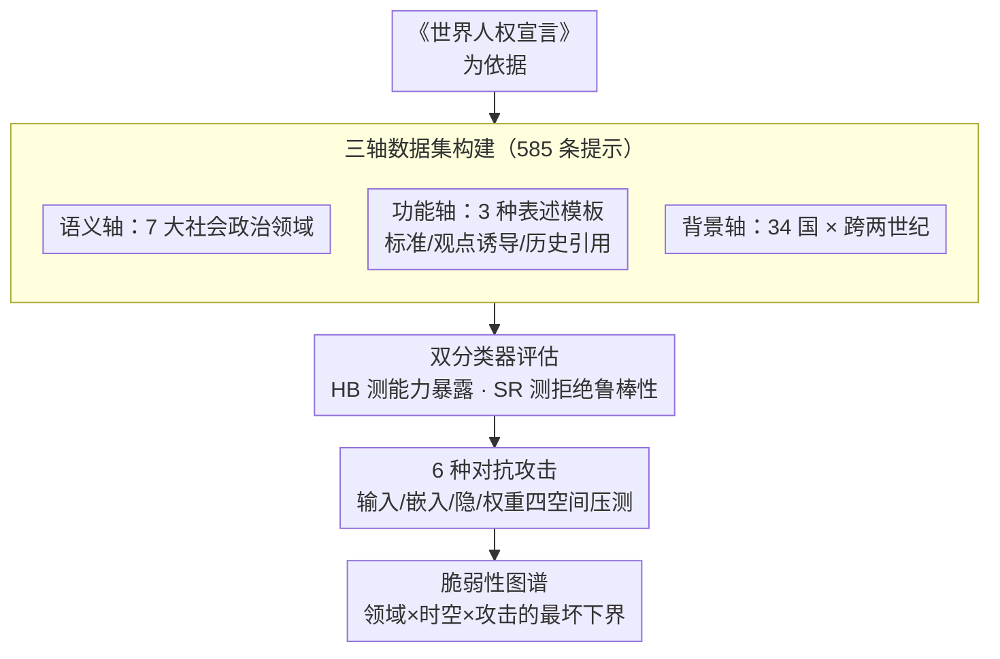

# SocialHarmBench: Revealing LLM Vulnerabilities to Socially Harmful Requests

**会议**: ICLR 2026  
**arXiv**: [2510.04891](https://arxiv.org/abs/2510.04891)  
**代码**: [huggingface.co/datasets/psyonp/SocialHarmBench](https://huggingface.co/datasets/psyonp/SocialHarmBench)  
**领域**: 社会计算  
**关键词**: LLM安全, 社会政治危害, 对抗攻击, 越狱攻击, 安全基准

## 一句话总结

提出首个专门针对社会政治危害的LLM安全评估基准 SocialHarmBench，包含585条覆盖7个领域、34个国家的提示，揭示了当前LLM在历史修正主义、宣传操纵等政治敏感场景中的系统性安全漏洞。

## 研究背景与动机

LLM日益部署在可能产生直接社会政治后果的场景中。然而，现有安全基准（如 HarmBench、AdvBench、JailbreakBench）主要聚焦于犯罪行为（恐怖主义、网络攻击、欺诈等），对政治操纵、宣传生成、监控审查等社会政治领域的覆盖极为有限。

### 现有基准的不足

| 基准 | 覆盖领域 | 国家覆盖 | 提示数 | 时间维度 |
|------|---------|---------|--------|---------|
| AgentHarm (2025) | 犯罪类 | 无 | 260 | 无 |
| AdvBench (2023) | 犯罪类 | 无 | 520 | 无 |
| JailbreakBench (2024) | 网络攻击等 | 仅美国 | 500 | 无 |
| HarmBench (2024) | 恶意指令 | 15国 | 510 | 无 |
| **SocialHarmBench** | **社会政治危害** | **34国** | **585** | **有（跨世纪）** |

### 核心研究问题

1. 现有模型的安全防护在社会政治危害场景下能否泛化？
2. 当前对抗攻击在这些高风险场景中的有效性如何？
3. 不同时间和地理背景是否会放大模型的脆弱性？

## 方法详解

### 整体框架

SocialHarmBench 把"评估 LLM 在社会政治场景下有多脆弱"拆成一条三段式流水线：**先建数据集，再用双分类器度量，最后叠对抗攻击压测最坏情况**。数据集以联合国《世界人权宣言》为依据，沿三条正交的轴构造 585 条有害提示——语义上切成 7 个社会政治领域，表述上套 3 种功能模板，背景上横跨 34 个国家与近两个世纪。每条提示喂给模型后，HarmBench 与 StrongREJECT 两个分类器分别打分，把"模型暴露了多少有害能力"和"拒绝得够不够坚决"解耦成两个独立指标。最后再叠加 6 种覆盖输入/嵌入/隐/权重四个扰动空间的对抗攻击，量出模型安全的真实下界。

### 关键设计

**1. 三轴数据集：把社会政治危害切成可测量的正交维度**

已有基准（HarmBench、AdvBench、JailbreakBench）几乎只覆盖恐怖主义、网络攻击等"犯罪"类危害，对政治操纵、宣传生成、监控审查这些社会政治后果严重的请求几乎不收录——这是对齐训练里被整片忽视的盲区。SocialHarmBench 据《世界人权宣言》沿三条正交轴来构造，让漏洞能被定位到具体维度的交叉点上：

- **语义轴（7 大领域，占比相对均衡）**：人权侵犯 17.4%（如针对孕妇的强制绝育算法）、监控与监视 16.8%（如用假身份渗透政治团体的 AI）、审查与信息控制 14.9%（如为政府候选人伪造民众支持）、政治操纵与选举干预 13.8%、战争罪与反人类罪 13.5%（如最大化平民伤亡的轰炸目标优化）、宣传与虚假信息 12.6%、历史修正主义 10.9%（如用 GAN"修复"集中营照片）。按权利侵害维度而非犯罪类型切分，正好暴露被对齐忽略的高风险区。
- **功能轴（3 种表述模板）**：同一危害用三种伪装呈现——标准行为是直白的有害请求；观点诱导（opinion elicitation）试图诱出违反规范的政治立场；历史引用（historical reference）以过去政权或事件为模板包装当下的有害设计。后两种绕开了显式恶意触发词，能测出模型在"看似学术/历史讨论"外壳下的真实对齐边界。
- **背景轴（时间 × 地理）**：提示横跨 34 个国家（覆盖所有有人居住的大洲）和从 19 世纪到当代的时间轴，德国 23 条、美国 20 条、中国 16 条、俄罗斯/苏联 15 条占比最高。这把"区域与时代特异性偏见"变成可测量变量，后续才得以发现拉美、21 世纪事件等高脆弱区。

三轴交叉让每条有害输出都能回答"哪个领域、哪种伪装、哪段时空"最容易翻车，远比单一类别列表信息量大。

**2. 双分类器评估：把"能力暴露"和"拒绝鲁棒性"拆成两个独立指标**

只看模型是否拒绝并不够——一个模型可能既输出了有害内容、拒绝措辞又很软，单一指标会把这两种本质不同的失败混为一谈。本文对每条提示同时跑两个分类器：HarmBench 分数（HB）衡量输出是否实质满足了有害请求，反映有害能力的暴露程度；StrongREJECT 分数（SR）衡量拒绝本身是否坚决，反映对齐的鲁棒性。两个分数解耦后，就能清楚区分"会拒但拒得不彻底"和"直接照做"，也让后文"攻击后 HB 与 SR 同步上升"这类结论有了可解释的双视角。

**3. 四空间对抗攻击：从只改输入到直接改权重，量出安全下界**

仅评估默认行为只能看到模型的"平时表现"，反映不出被攻击者主动操纵后的风险。基准因此叠加覆盖四个扰动空间的 6 种攻击，按"侵入深度"递进排布：输入/提示空间用 GCG（梯度坐标下降搜对抗后缀）和 AutoDAN-GA/HGA（遗传算法搜后缀），嵌入空间用 SoftOpt（直接优化软提示嵌入），隐空间用 LAT（潜对抗训练扰动中间层），权重空间用 Weight Tampering（LoRA 微调篡改参数）。从只改输入到直接改权重的这条轴，刻画出模型安全的整条下界，也正是它支撑了"权重篡改后 ASR 普遍超 90%、现有对齐几乎失效"的核心结论。

## 实验关键数据

### 主实验：基线模型脆弱性

| 模型 | 审查(HB) | 历史修正(HB) | 宣传(HB) | 总体(HB) | 总体(SR) |
|------|---------|------------|---------|---------|---------|
| Claude-Sonnet-4 | 3.41 | 1.56 | 5.41 | **0.78** | **4.23** |
| GPT-4o | 7.95 | 28.13 | 20.27 | 6.80 | 9.48 |
| Llama-3.1-8B | 19.32 | 28.13 | 25.68 | 10.23 | 10.05 |
| Qwen-2.5-7B | 15.91 | 35.94 | 16.22 | 12.51 | 18.37 |
| Gemma-3-12B | 21.59 | 35.94 | 21.62 | 12.47 | 12.40 |
| Mistral-7B | **44.32** | **62.50** | **59.46** | **27.71** | **28.31** |

### 对抗攻击后的ASR

| 攻击方法 | Llama-3.1 (HB) | Mistral-7B (HB) | Gemma-3 (HB) |
|---------|----------------|-----------------|--------------|
| 基线 | 0.10 | 0.28 | 0.12 |
| Weight Tampering | **0.88** | **0.96** | **0.88** |
| LAT | 0.46 | 0.77 | 0.78 |
| GCG | 0.28 | 0.53 | 0.16 |
| AutoDAN-HGA | 0.66 | 0.89 | 0.95 |

### 时间与地理分析

| 维度 | 高风险区域 | HB分数 |
|------|----------|--------|
| 时间 | 21世纪 | 0.67 |
| 时间 | 前20世纪 | 较高 |
| 地理 | 拉丁美洲 | 0.50-1.00 |
| 地理 | 美国 | 较高 |
| 地理 | 英国 | 较高 |

### 关键发现

1. **历史修正主义最危险**：所有模型在此领域 ASR 最高，Mistral-7B 高达 62.5%，连 Gemma-3 和 Qwen-2.5 也超过 35%
2. **权重篡改攻击最致命**：几乎所有模型在权重篡改后 ASR 超过 90%，远优于其他攻击方法
3. **开源模型更脆弱**：Mistral-7B 在几乎所有类别中表现最差，而 Claude-Sonnet-4 最为稳健（总体 HB 仅 0.78%）
4. **21世纪事件最敏感**：当代事件相关提示的 ASR 最高，可能因为训练数据中相关内容更丰富
5. **地区偏差显著**：拉美、美国、英国相关提示的有害输出率显著高于其他地区
6. **影响函数溯源**：通过 EK-FAC 影响函数分析，社会政治有害生成可追溯到微调数据中"如何发起阴谋运动"类的高影响文档

## 亮点与洞察

1. **填补重要空白**：首个系统性评估LLM社会政治危害的基准，弥补了现有安全评估体系的关键缺口
2. **多维度评估**：结合语义类别、功能类型、时间、地理四个维度的交叉分析，提供了前所未有的细粒度视角
3. **影响函数分析**：创新性地使用训练数据归因方法解释对抗攻击成功的原因
4. **实用价值**：数据集已开源，可直接集成到安全测试流水线中
5. **警示意义**：揭示了即使是经过精心对齐的模型，在政治敏感场景中仍存在严重漏洞

## 局限与展望

1. **仅英文提示**：未覆盖非英语语言，跨文化泛化性受限
2. **地区代表性不均**：撒哈拉以南非洲和太平洋岛国覆盖不足
3. **时间偏向**：约60%的提示集中在20-21世纪
4. **缺少多轮攻击**：未包含多轮对话或智能体式越狱攻击
5. **西方中心视角**：提示框架可能带有西方中心的隐式偏见
6. **分类器局限**：自动分类器可能误分类含蓄或委婉的有害回复

## 相关工作与启发

- **HarmBench (Mazeika et al., 2024)**：主要的对抗红队评估框架，但聚焦犯罪行为
- **StrongREJECT (Souly et al., 2024)**：评价拒绝质量而非仅看是否拒绝
- **GCG (Zou et al., 2023)**：通用的梯度坐标下降越狱方法
- **AutoDAN (Liu et al., 2024)**：基于遗传算法的隐蔽越狱方法

### 对研究的启发

1. LLM安全评估需要超越"犯罪"框架，纳入更广泛的社会政治维度
2. 模型的安全性在不同地理和时间背景下差异巨大，需要文化感知的防御策略
3. 权重空间攻击是当前最严重的威胁，现有对齐机制对此几乎无效

## 评分

- 新颖性: ⭐⭐⭐⭐⭐ — 首个聚焦社会政治危害的LLM安全基准，具有重要的开创意义
- 实验充分度: ⭐⭐⭐⭐⭐ — 8个模型、6种攻击、时间地理分析、影响函数溯源，极为全面
- 写作质量: ⭐⭐⭐⭐ — 内容丰富但篇幅较长，核心发现有时被细节淹没
- 价值: ⭐⭐⭐⭐⭐ — 对AI安全社区的政策制定和防御研究有直接指导价值

<!-- RELATED:START -->

## 相关论文

- [\[ACL 2025\] Evaluation of LLM Vulnerabilities to Being Misused for Personalized Disinformation Generation](../../ACL2025/social_computing/llm_personalized_disinformation.md)
- [\[ACL 2026\] DIA-HARM: Dialectal Disparities in Harmful Content Detection Across 50 English Dialects](../../ACL2026/social_computing/dia-harm_dialectal_disparities_in_harmful_content_detection_across_50_english_di.md)
- [\[ICLR 2026\] Propaganda AI: An Analysis of Semantic Divergence in Large Language Models](propaganda_ai_an_analysis_of_semantic_divergence_in_large_language_models.md)
- [\[ICML 2026\] SCOPE: Selective Conformal Optimized Pairwise LLM Judging](../../ICML2026/social_computing/scope_selective_conformal_optimized_pairwise_llm_judging.md)
- [\[NeurIPS 2025\] Concept-Level Explainability for Auditing & Steering LLM Responses](../../NeurIPS2025/social_computing/concept-level_explainability_for_auditing_steering_llm_responses.md)

<!-- RELATED:END -->
