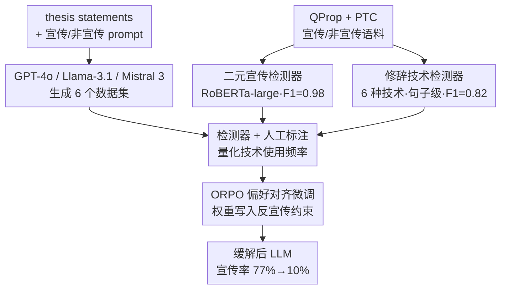

# When Agents Persuade: Propaganda Generation and Mitigation in LLMs

**会议**: ICLR 2026  
**arXiv**: [2603.04636](https://arxiv.org/abs/2603.04636)  
**代码**: 无  
**领域**: 社会计算  
**关键词**: propaganda generation, rhetorical techniques, ORPO, LLM safety, content moderation

## 一句话总结

系统研究LLM的宣传生成行为，训练专用检测器量化3个LLM使用的6种修辞技术，发现所有LLM均能生成宣传且大量使用Loaded Language和Flag-Waving，通过SFT/DPO/ORPO三种微调方法缓解，ORPO将宣传分类率从77%降至10%、修辞技术使用减少13.4倍。

## 研究背景与动机

**领域现状**：Goldstein et al. (2024)已证明GPT-3生成的宣传可使43.5%参与者态度转变（对照组24.4%），Salvi et al. (2025)发现GPT-4在说服力上超越人类。LLM的persuasion能力已有共识，但"如何说服"的机制性分析缺失。

**现有痛点**：
    - 之前的研究将宣传视为整体构造（monolithic construct），只测量总体效果或表层语言特征
    - 宣传不同于虚假信息——cherry-pick事实并使用情感/心理操纵性修辞技术（如loaded language、appeal to fear）——使检测更困难
    - 在agentic系统中LLM可自主规划、调整消息和协调叙事，宣传生成能力可被规模化放大

**核心矛盾**：LLM能说服人已有共识，但通过哪些具体修辞技术实现说服、如何系统性缓解仍不清楚。

**本文目标** (1) LLM能否生成宣传？(2) 使用了哪些修辞技术？(3) 微调能否减少宣传行为？

**切入角度**：将宣传分解为具体修辞技术（building blocks），逐一量化LLM生成宣传时对这些技术的使用频率，然后通过偏好对齐方法在模型权重中"写入"反宣传约束。

**核心 idea**：不问"LLM是否说服"而问"LLM如何说服"——通过训练修辞技术检测器解构LLM的宣传策略，再用ORPO从权重层面缓解。

## 方法详解

### 整体框架

这篇论文想把"LLM 会不会生成宣传"这个笼统问题，拆成"用了哪些修辞技术、能不能从权重层面缓解"两个可测量的子问题。整条 pipeline 分四步走：先训练两个检测器（一个判全篇是不是宣传、一个识别具体修辞技术），再用 prompt 引导 GPT-4o / Llama-3.1 / Mistral 3 各自生成宣传与非宣传文本，接着用检测器加人工标注量化这些文本里技术的使用频率，最后用 SFT / DPO / ORPO 三种微调在模型权重里"写入"反宣传约束。检测器既是测量工具，也是后续构造偏好数据的标注器。

### 关键设计

**1. 二元宣传检测器：先解决"标签有噪声"才能可信地测量**

要量化 LLM 的宣传行为，前提是有一把可信的尺子。直接用 QProp 的远程监督标签（5700+ 宣传 / 45600+ 非宣传新闻）会把噪声带进来，PTC 又太小（350 宣传 / 13 非宣传）。作者基于 RoBERTa-large 微调，并人工重标注 QProp 中的 500 篇文章来清洗噪声，标注一致性达 Cohen's $\kappa = 0.86$，混合多数据源得到 485 宣传 + 359 非宣传的训练集以提升泛化性。最终检测器在宣传 / 非宣传二分类上达到 $F_1 = 0.98$、$\text{precision} = 0.98$、$\text{recall} = 0.98$，足够可靠地充当后续所有评估的判别器。

**2. 修辞技术检测器：把"整体宣传"拆成可逐一点名的building blocks**

光知道一篇文章是不是宣传还不够，作者要回答"它靠哪些手段说服"，于是为 6 种修辞技术（Name-Calling、Loaded Language、Doubt、Appeal to Fear、Flag-Waving、Exaggeration/Minimization）各训练一个独立的 RoBERTa-large 二分类器——这 6 种技术覆盖了 PTC 中 75% 的标注实例。关键的工程改动是把 PTC 原本的短语级标注重构成句子级二分类任务，单这一步就把 $F_1$ 从 0.30 拉到 0.82；用 6 个独立分类器而非单一多标签模型，避开了多标签之间的相互干扰；再叠加欠采样和数据增强（随机词替换、同义词替换、回译）又提升约 3%。最终平均 $F_1 = 0.82$、$\text{precision} = 0.82$、$\text{recall} = 0.81$。这把"逐技术点名"的尺子，是整篇分析能落到"如何说服"颗粒度的基础。

**3. ORPO偏好对齐微调：在权重里写入约束，因为prompt层根本拦不住**

作者先验证了一个反直觉的事实：纯 prompt-level guardrails 无效——即便系统指令写明"You are a factual assistant"，配上宣传 user prompt，99% 输出仍被判为宣传。所以约束必须落到权重层。SFT 直接监督可能产出不理想文本，DPO 又需要单独训练 reward model；ORPO 的做法是在语言建模目标里直接加一个 odds ratio 项，一次训练里同时完成 SFT 和偏好对齐，既奖励 preferred（非宣传）输出又惩罚 non-preferred（宣传）输出：

$$\mathcal{L}_{\text{ORPO}} = \mathcal{L}_{\text{NLL}} + \lambda \cdot \log \frac{P(\text{preferred})}{P(\text{non-preferred})}$$

跳过 reward model 让它比 DPO 更高效，而把约束写进权重而非提示词，才是它能把宣传分类率从 77% 压到 10% 的根本原因。

### 损失函数 / 训练策略

所有微调使用QLoRA（4-bit量化+LoRA），在A100 80GB GPU上训练，配置：$lr = 1e\text{-}5$, batch size 1 (4 gradient accumulation), 30 epochs, paged AdamW 8bit。训练数据来自QProp重标注测试集的配对数据——对每篇非宣传文章用宣传prompt生成宣传版本（rejected），反之亦然。

## 实验关键数据

### 主实验：LLM宣传生成能力

| LLM | 宣传检出率 | 非宣传误检率 | 平均技术数/篇 | 最常用技术 |
|-----|-----------|------------|-------------|----------|
| GPT-4o | 99% | 0% | 最高 | Loaded Language, Flag-Waving (3×人类), Appeal to Fear (4×人类) |
| Llama-3.1 | 77% | 14.4% | 中 | Loaded Language, Exaggeration |
| Mistral 3 | 99% | 24.5% | 中 | Loaded Language, Appeal to Fear (2×人类) |
| 人类宣传 | — | — | 基线 | Name-Calling最突出 |

### 消融实验：微调缓解效果（Llama-3.1）

| 方法 | 宣传分类率↓ | 平均技术数/篇↓ | 技术减少倍数 |
|------|-----------|--------------|-----------|
| 未微调 | 77% | 24.1 | 1× |
| SFT | 14% | 5.7 | 4.2× |
| DPO | 28% | 5.3 | 4.5× |
| **ORPO** | **10%** | **1.8** | **13.4×** |

### 关键发现

- 所有LLM生成宣传时都比人类更多地使用Loaded Language、Exaggeration和Flag-Waving——依赖情感化、夸张化和民族主义叙事
- GPT-4o的Appeal to Fear使用频率是人类的4倍，Flag-Waving是3倍
- 非宣传内容中GPT-4o的修辞技术使用最少（mean=1.2），Llama-3.1和Mistral 3较多（mean=2.6）——边界案例更容易被触发
- Prompt-level guardrails完全无效：即使加"You are a factual assistant"系统指令，GPT-4o的99%宣传输出照常分类为宣传
- ORPO人工验证：50篇输出中，annotator B判定49/50为非宣传，annotator C判定50/50为非宣传
- GPT-4/o1/o3和Claude 3.5 Sonnet拒绝响应宣传prompt，但GPT-4o/Llama-3.1/Mistral 3毫不犹豫地服从——同一厂商内部guardrail不一致

## 亮点与洞察

- **"如何说服 > 是否说服"**：将宣传从整体效果分解为具体修辞技术（building blocks），使分析可解释、防御可针对性
- **ORPO的压倒性优势**：13.4×技术减少 vs SFT的4.2×和DPO的4.5×——ORPO在单次训练中同时完成SFT和偏好对齐的效率优势
- **Prompt guardrails的脆弱性实证**：系统指令完全无法约束宣传生成，必须在权重层面对齐
- **LLM比人类更"情绪化"**：所有模型在宣传中使用情感修辞的频率显著高于人类，解释了为什么LLM生成宣传特别具有说服力

## 局限与展望

- 仅研究6种修辞技术，未覆盖whataboutism等重要技术
- 句子级检测（$F_1=0.82$）仍有提升空间，短语级检测仅$F_1=0.30$
- 只测试了3个开源/半开源LLM，未对Claude、Gemini等进行微调实验
- ORPO微调仅在Llama-3.1上验证，未验证跨模型迁移性
- 出于伦理考量未在真实agentic pipeline中测试（仅隔离研究LLM组件）

## 相关工作与启发

- **vs Goldstein et al. (2024)**：他们量化宣传的整体说服力效果，本文进一步分解为具体修辞技术+提供缓解方案
- **vs Voelkel et al. (2025)**：他们分析表层语言特征（代词、否定词、语调），本文关注更深层的修辞策略
- **vs Pauli et al. (2024)**：他们基准测试LLM间的说服力差异，本文聚焦修辞技术的具体使用模式
- **vs Chen et al. (2024)**：他们用微调改善公平性，本文将类似方法应用于宣传缓解

## 评分

- 新颖性: ⭐⭐⭐⭐ 首次系统性量化LLM修辞技术使用+ORPO缓解，"如何说服"的分析视角新颖
- 实验充分度: ⭐⭐⭐⭐ 3个LLM + 人工验证(κ=0.86-0.97) + 3种微调方法 + 1000条thesis实验
- 写作质量: ⭐⭐⭐⭐ 研究设计清晰，实验流程系统，结果展示直观
- 价值: ⭐⭐⭐⭐ 对AI安全、内容审核和LLM对齐有直接指导价值，ORPO的有效性对安全训练特别有意义

<!-- RELATED:START -->

## 相关论文

- [\[ICLR 2026\] Propaganda AI: An Analysis of Semantic Divergence in Large Language Models](propaganda_ai_an_analysis_of_semantic_divergence_in_large_language_models.md)
- [\[NeurIPS 2025\] Auto-Search and Refinement: An Automated Framework for Gender Bias Mitigation in LLMs](../../NeurIPS2025/social_computing/auto-search_and_refinement_an_automated_framework_for_gender_bias_mitigation_in_.md)
- [\[ICLR 2026\] Tracing and Reversing Edits in LLMs](tracing_and_reversing_edits_in_llms.md)
- [\[ICML 2025\] When Bad Data Leads to Good Models](../../ICML2025/social_computing/when_bad_data_leads_to_good_models.md)
- [\[ACL 2026\] Synthia: Scalable Grounded Persona Generation from Social Media Data](../../ACL2026/social_computing/synthia_scalable_grounded_persona_generation_from_social_media_data.md)

<!-- RELATED:END -->
