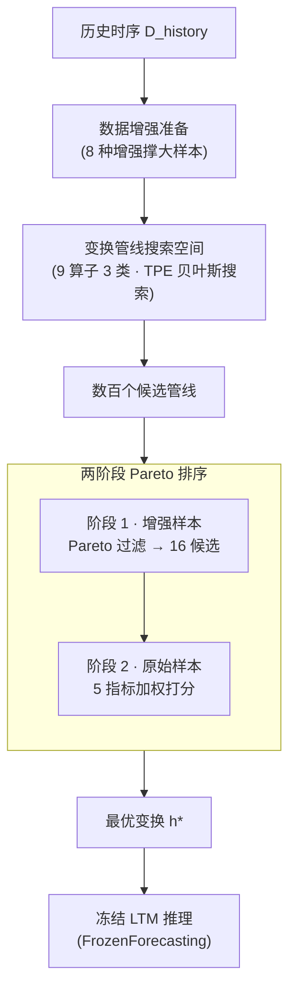

# Adapt Data to Model: Adaptive Transformation Optimization for Domain-shared Time Series Foundation Models

**会议**: ICLR 2026  
**arXiv**: [2603.00629](https://arxiv.org/abs/2603.00629)  
**代码**: [https://github.com/thulab/TATO](https://github.com/thulab/TATO)  
**领域**: 自监督/时序预测  
**关键词**: 时间序列基础模型, 数据变换优化, 零样本预测, 冻结模型推理, 贝叶斯优化  

## 一句话总结
提出TATO框架，通过自动优化数据预处理 pipeline（包括上下文裁切、尺度归一化、异常值校正），让冻结的大型时序模型（LTM）在不微调的情况下适配不同下游领域，平均降低MSE 13.6%，最高65.4%。

## 研究背景与动机

**领域现状**：大型时序模型（LTM）如Timer、Moirai、Chronos等已具备零样本预测能力，但面对不同领域数据的分布差异，单一冻结模型的泛化性能仍然有限。

**现有痛点**：传统做法是为每个新领域微调模型，但这导致模型实例数随领域数线性增长，计算成本高且损害泛化性。

**核心矛盾**：LTM需要同时满足"跨领域通用"和"领域特定精准"两个互相矛盾的要求——微调提升特定性但损害通用性。

**本文目标**：能否不改模型参数，仅通过优化输入数据的变换方式来适配不同领域？

**切入角度**：作者观察到简单的数据变换（如降采样、异常值插值、差分）就能显著改善LTM预测质量（见Figure 1三个示例），说明问题出在"数据与模型的不匹配"而非模型能力不足。

**核心 idea**：将数据变换发现形式化为超参数优化问题，用贝叶斯搜索自动找到最优预处理 pipeline，冻结模型即可适配多领域。

## 方法详解

### 整体框架
TATO（Time-series Adaptive Transformation Optimization）想回答一个问题：当冻结的大型时序模型（LTM）在某个下游领域表现不佳时，能不能不碰模型参数、只改喂给它的数据来把性能拉回来？为此作者提出"FrozenForecasting"范式——模型权重全程不动，唯一可调的是数据变换管线。整条流程拿到一段历史时序 $D_{\text{history}}$，先对它做数据增强扩充多样性，再在一个由预处理算子构成的搜索空间 $\mathcal{H}$ 上做贝叶斯优化，最后用两阶段排序从数百个候选管线里挑出最稳的那一个。优化目标可以写成寻找使损失最小的变换配置：

$$h^* = \arg\min_{h \in \mathcal{H}} \mathcal{L}(M, D_{\text{history}}, h)$$

其中 $M$ 是冻结的 LTM，$h^*$ 就是最终交付的最优变换配置，推理时直接套用即可。

### 关键设计

**1. 数据增强准备：让搜出来的管线扛得住分布偏移**

优化时只能看到历史窗口 $D_{\text{history}}$，但真正要预测的是未来窗口 $D_{\text{future}}$，两者分布未必一致；如果直接在原始历史样本上搜变换，很容易过拟合到历史的特定形态。TATO 在搜索前先用 8 种增强方法把历史样本"撑大"：幅度/时间翻转（magnitude/time flip）、幅度/时间扭曲（magnitude/time warp）、噪声注入（EWMA 平滑、jitter）、平移（translation）、以及加趋势（slopes）。这些增强相当于人为制造更极端的场景，逼着候选管线在更广的分布上都站得住脚，从而降低过拟合风险——搜出来的不是"恰好对历史最优"的管线，而是"对分布扰动也鲁棒"的管线。

**2. 变换管线搜索空间：用 9 个算子覆盖三类数据—模型不匹配**

数据和模型对不上无非三种情况：输入长度不匹配、尺度/分布不匹配、异常值干扰。TATO 据此把搜索空间设计成三类共 9 个可调算子——上下文变换（Trimmer 裁切输入长度、Downsampler 降采样、Differencer 差分）、归一化变换（Scaler，可选 Z-score / MinMax / BoxCox）、异常值变换（Denoiser，如 k-sigma 检测加插值、IQR 滤波）。每个算子都成对出现：前处理在数据进 LTM 之前施加，后处理在 LTM 输出之后做对应的逆变换，保证预测结果还原回原始尺度。所有算子的开关与超参拼起来就是搜索空间 $\mathcal{H}$，再用 TPE（Tree-structured Parzen Estimator）贝叶斯优化高效搜索最优组合。算子的先后顺序不是搜出来的，而是用启发式规则预先定好——Trimmer 放最前以减少后续算子的计算量，异常值处理放在归一化之前，避免离群点污染归一化参数。

**3. 两阶段 Pareto 排序：先保鲁棒、再保真实性能**

贝叶斯搜索会留下数百个候选管线，怎么从中挑一个？若只看单个指标，很容易挑到"偏科选手"——某个指标极好但其他指标很差。TATO 把选择拆成两步。第一阶段在全部增强样本上做 Pareto 过滤，把"在任意指标组合下都被别人支配"的方案淘汰掉，收缩到 16 个候选，这一步保证留下来的都是多指标均衡、抗扰动的管线。第二阶段则**只在原始样本（不带增强）**上，对这 16 个候选按 MSE、MAE、RMSE、MAPE、MSPE 五项指标加权打分，选总分最高的那个。之所以第二阶段要回到原始分布，是因为增强样本是为了筛鲁棒性而人为造出来的，最终落地仍要看真实数据上的表现——先用增强样本兜住下限，再用原始样本定上限。

### 训练策略
- 整个优化只需约 500 个历史样本（不到总训练集的 2%），配合 500 次搜索 trial 的 TPE 贝叶斯优化，通常 2 分钟内跑完。
- 模型参数全程冻结，没有任何梯度更新；"训练"的对象只是数据变换配置。
- 推理时套用搜好的 $h^*$，额外开销不足 3 毫秒（batch size=1）。

## 实验关键数据

### 主实验
在8个数据集 × 4个预测长度 × 6个LTM变体 = 192个场景上评估：

| 模型 | 平均MSE↓ (vanilla) | 平均MSE↓ (TATO) | MSE改善% |
|------|-------------------|-----------------|----------|
| Timer-UTSD | 0.3431 | 0.3225 | 6.0% |
| Timer-LOTSA | 0.3923 | 0.2950 | **24.8%** |
| Moirai-small | 0.4185 | 0.3799 | 9.2% |
| Moirai-base | 0.4066 | 0.3568 | 12.2% |
| Moirai-large | 0.4031 | 0.3465 | 14.0% |
| Chronos-tiny | 0.3770 | 0.3225 | 14.5% |
| **平均** | **0.3901** | **0.3372** | **13.6%** |

最大改善出现在Exchange数据集上Timer-LOTSA模型：MSE降低65.4%。

### 消融实验

| 配置 | 平均MSE改善% | 说明 |
|------|-------------|------|
| Full TATO | 最优 (baseline) | 完整框架 |
| w/o Trimmer | 显著下降 | 上下文裁切对匹配模型输入尤为关键 |
| w/o Scaler | 显著下降 | 归一化对跨领域适配至关重要 |
| w/o Denoiser | 均值略升、方差增大 | 去噪在特定样本上有益但降低鲁棒性 |
| w/o TwoStageRank | 均值略升、中位数下降 | Pareto过滤保证了一致性 |

### 关键发现
- Trimmer和Scaler是最关键的两个算子，去掉后性能显著下降
- 去掉Denoiser和TwoStageRank后平均性能反而微升，但方差和中位数表现变差——说明它们的作用是保证鲁棒性而非提升峰值性能
- TATO在原始LTM表现差的场景（如Exchange上Timer-LOTSA的MSE 0.83→0.29）改善最大，而在已经表现好的场景（如Timer-UTSD on Traffic MSE 0.06级别）改善较小
- 与微调互补：在universally finetuned模型上再加TATO仍能额外降低MSE 7.3%

## 亮点与洞察
- **数据中心 vs 模型中心的范式转换**：在大模型时代"人人都在调模型"，本文反其道行之——冻结模型只调数据，非常实用。2分钟内完成优化，适合生产部署。
- **Pareto两阶段选择机制**很巧妙：先用增强样本做Pareto过滤保鲁棒，再用原始样本做最终排序保真实性能——这个设计可迁移到任何超参搜索场景。
- **变换搜索空间的精练**：只用9个算子3个类别就覆盖了时序预处理的核心需求，搜索空间紧凑但表达力强，值得借鉴。

## 局限与展望
- 目前仅支持**单变量**时序预测，多变量场景是明确的future work
- 在Weather数据集上部分模型TATO反而降低了性能（Timer-UTSD MSE恶化22.5%），说明对某些分布特征数据变换可能产生负面影响
- 搜索空间是人工设计的，缺乏自适应算子发现机制
- 500次trial + 500样本的配置虽然高效，但在领域数极多时（如数百个IoT领域）总优化时间仍可能成为瓶颈
- 与Test-Time Adaptation方法的深入对比不足

## 相关工作与启发
- **vs 模型微调**: TATO不改模型参数，通用性更好，但在模型本身已高度适配的场景（如Timer-UTSD on Weather）效果有限
- **vs TTA方法（如NewNorm）**: TATO覆盖更广（不限于归一化），且无需自监督训练步骤，更轻量
- **vs AutoML/HPO**: TATO本质上是将数据预处理变换作为超参进行自动搜索——与AutoML框架（如Auto-sklearn）的搜索范式一致

## 评分
- 新颖性: ⭐⭐⭐⭐ 数据中心思路本身不新但在LTM时代有新意，FrozenForecasting范式值得推广
- 实验充分度: ⭐⭐⭐⭐⭐ 192个场景、消融、效率、与微调互补实验都很完整
- 写作质量: ⭐⭐⭐⭐ 逻辑清晰，Figure 1三个motivating example直观有力
- 价值: ⭐⭐⭐⭐ 实用性强但适用范围受限于单变量场景

<!-- RELATED:START -->

## 相关论文

- [\[ICLR 2026\] Relational Transformer: Toward Zero-Shot Foundation Models for Relational Data](relational_transformer_toward_zero-shot_foundation_models_for_relational_data.md)
- [\[NeurIPS 2025\] MIRA: Medical Time Series Foundation Model for Real-World Health Data](../../NeurIPS2025/time_series/mira_medical_time_series_foundation_model_for_real-world_health_data.md)
- [\[ICLR 2026\] GTM: A General Time-series Model for Enhanced Representation Learning](gtm_a_general_time-series_model_for_enhanced_representation_learning_of_time-series.md)
- [\[ICLR 2026\] FeDaL: Federated Dataset Learning for General Time Series Foundation Models](fedal_federated_dataset_learning_for_general_time_series_foundation_models.md)
- [\[NeurIPS 2025\] How Foundational are Foundation Models for Time Series Forecasting?](../../NeurIPS2025/time_series/how_foundational_are_foundation_models_for_time_series_forecasting.md)

<!-- RELATED:END -->
