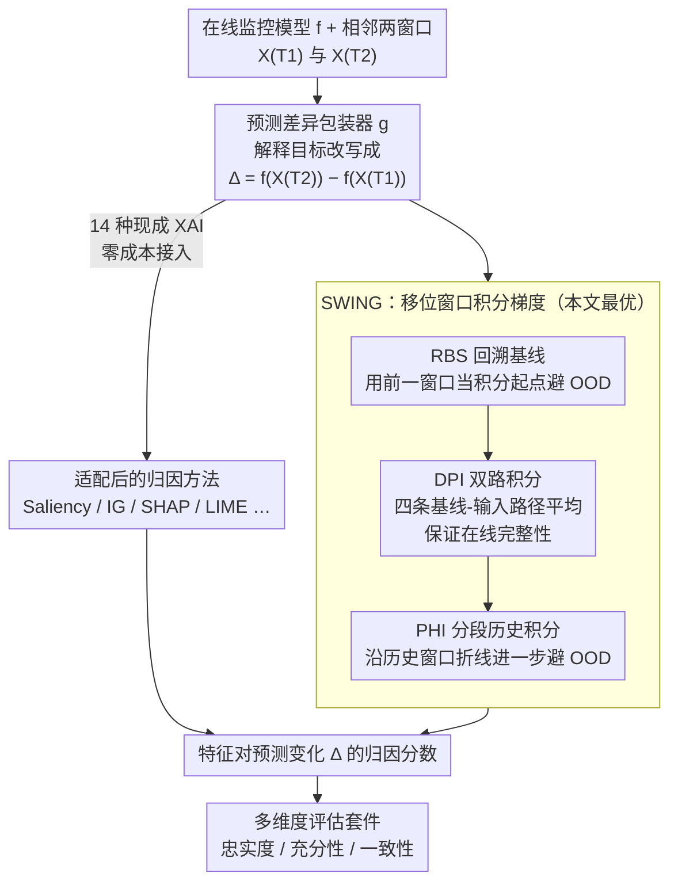

# Delta-XAI: A Unified Framework for Explaining Prediction Changes in Online Time Series Monitoring

**会议**: ICLR 2026  
**arXiv**: [2511.23036](https://arxiv.org/abs/2511.23036)  
**代码**: [Anonymous GitHub](https://anonymous.4open.science/r/Delta-XAI)  
**领域**: 时间序列 / 可解释AI  
**关键词**: XAI, 时间序列, 在线监控, 特征归因, Integrated Gradients

## 一句话总结
提出 Delta-XAI 统一框架，通过包装函数将14种现有XAI方法适配到在线时间序列预测变化解释场景，并提出 SWING（Shifted Window Integrated Gradients）方法，利用过去观测值构建积分路径以捕获时序依赖关系，在多种评估指标上持续优于现有方法。

## 研究背景与动机
在线时间序列监控模型在医疗（如ICU监护）和金融等敏感领域至关重要，临床医生和决策者需要理解模型预测为何在不同时间步之间发生变化。现有的时间序列XAI方法虽然有所进步，但存在三个核心问题：

**逐步独立分析**：大多数XAI方法独立分析每个时间步的预测，忽略了时序依赖关系，无法解释"预测为什么从t-1到t发生了变化"

**在线动态利用不足**：现有方法没有充分利用在线监控的特性——即数据是逐步到达的，预测是持续更新的

**评估困难**：缺乏针对在线场景的系统化评估框架，无法全面评估解释的忠实度、充分性和一致性

核心矛盾在于：我们需要一种能够同时解释预测变化（而非单点预测）、适应在线动态、且可以原则性评估的XAI框架。

本文的切入角度是：不重新发明XAI方法，而是通过一个统一的包装函数（wrapper function）将现有的14种XAI方法适配到"预测差异解释"这个新场景中，同时提出一套完整的评估体系。核心创新是 SWING 方法，它通过在积分路径中引入过去时间步的观测值来捕获因果性的时序依赖。

## 方法详解

### 整体框架
在线监控模型 $f$（如 LSTM）逐步接收滑动窗口、持续吐出类别概率，但临床医生真正关心的不是某一步的预测值，而是"风险为什么从 $T_1$ 变到了 $T_2$"——比如脓毒症概率从 90% 掉到 50% 是好转、从 10% 升到 50% 是恶化，同一个 50% 含义完全相反。Delta-XAI 因此把解释目标从单步预测 $f(X_{T})$ 换成相邻两步的预测变化 $\Delta = f(X_{T_2}) - f(X_{T_1})$，输出每个输入特征对这个变化量的归因。

整条链路分三段：先用一个**包装器** $g$ 把现有 14 种 XAI 方法的归因目标统一改写到 $\Delta$ 上，让它们零成本适配"解释变化"这个新问题；既然实验发现经典 IG 适配后反而最强，本文进一步提出 **SWING**，把 IG 的积分基线从零向量换成历史窗口、并用双路径与分段折线积分避开分布外（OOD）假象；最后用一套**多维评估套件**（忠实度 / 充分性 / 一致性等）量化每种方法的解释质量。

### 关键设计

**1. 预测差异包装器：把"解释一个值"改成"解释一个变化"**

现有 XAI 方法几乎都为静态单点预测设计——它们回答"哪些特征支撑了 $f(X_T)$"，却答不了在线监控关心的"预测为什么从 $T_1$ 变到 $T_2$"。直接拿单步归因做减法行不通：$f$ 非线性，对差分输入算归因、或把两步归因相减都得不到合法解释（论文实测 Dynamask 这样减出来的结果荒谬）。包装器的做法是定义一个新函数 $g(X_{T_1-W+1:T_2}) := f(X_{T_2}) - f(X_{T_1})$，把"解释差值"重新表述成"解释 $g$ 这一个输出"，于是任意单步归因方法 $\varphi$ 都能原样套用：$\varphi(f, X_{t,d}\mid T_1\!\to\!T_2) = \varphi(g, X_{t,d}\mid T_2)$。这一步不改方法内部实现，梯度类（Saliency、IG、Gradient×Input）、扰动类（KernelSHAP、LIME、Occlusion）等 14 种范式都能零成本接入；对满足线性与完整性的方法（IG、SHAP、DeepLIFT），差值归因还能化简成两步归因之差并复用缓存，且能证明"所有特征归因之和恰好等于预测变化"（在线完整性），让解释可加、可审计。

**2. SWING：把 IG 的积分基线从零向量换成历史窗口**

包装器适配后实验发现经典 IG 反而最强，但它仍有两处硬伤：沿直线从**零基线**积分到当前窗口时，零向量往往落在数据分布之外造成 OOD 假象，且直线路径丢掉了时间上下文。SWING 在 IG 的线积分框架 $\varphi^{\gamma}_{\text{IG}}(f, X_{t,d}\mid T)=\int_0^1 \frac{\partial f(\gamma(\alpha))_{\hat c}}{\partial X_{t,d}}\,\frac{\partial \gamma_{t,d}(\alpha)}{\partial \alpha}\,d\alpha$ 上叠了三步改造：

$$\gamma_i(\alpha)=(1-\alpha)\,X_{T_i-W:T_i-1}+\alpha\,X_{T_i-W+1:T_i},\quad \alpha\in[0,1]$$

**回溯基线（RBS）** 把积分起点从零向量换成"前一个窗口"$X_{T_i-W:T_i-1}$，整条路径都贴着数据流形走，OOD 被压住、时间上下文也被自然编码进去。**双路积分（DPI）** 解决 RBS 在 $T_1$、$T_2$ 用了不同基线、单条路径会破坏完整性的问题：它对四种"基线–输入"组合都积分再平均，靠这种对称构造保住前面那条在线完整性定理。**分段历史积分（PHI）** 进一步处理两步间隔较大时直线路径仍会穿过 OOD 区的情况——把路径改成沿真实历史窗口逐段插值的折线，让轨迹始终留在流形附近。三步叠完，SWING 仍满足 IG 的三条公理：在线完整性、实现不变性、以及"正反方向归因互为相反数"的反对称性。实现上沿路径均匀采 $n$ 个点离散近似积分。

**3. 多维度评估套件：在线解释好不好要分维度量、还要换对替换基线**

在线场景缺现成评估标准，且本文先指出一个被忽视的坑：以往用**零/平均**替换被移除特征来测忠实度，会因忽略时间自相关而造出 OOD 样本、夸大预测差异（MIMIC-III 上零替换的 OOD 分数 0.840、远高于前向填充的 0.093），所以套件改用**前向填充**做替换。指标本身分维度量化：**忠实度** 按归因从高到低逐步移除特征、累加预测变化（CPD），并取所有前缀的面积 AUPD 以兼顾排序而非单点；**充分性** 反过来只保留高归因特征看能否重现变化（CPP / AUPP）；**一致性** 衡量相似输入下解释在时间上是否连贯稳定，是静态评估覆盖不到、在线独有的维度；此外还含完整性、效率等角度。所有指标都由扰动与统计检验得出，不引入任何额外训练。

### 训练与计算
框架的贡献在解释与评估方法本身，不引入新模型：目标 LSTM 用标准时间序列预测损失训练即可。SWING、包装器只读取已训练模型的梯度，评估套件全部由扰动与统计检验得到——整条解释链路无新增可训练参数。代价主要在 SWING 的路径积分采样（$n$ 个采样点）与对 14 种方法逐一评估的开销。

## 实验关键数据

### 主实验
实验主要在 MIMIC-III 临床数据集上进行，使用 LSTM 作为目标预测模型。对14种适配后的XAI方法和SWING进行了系统比较。

| 评估维度 | 最佳传统方法 | SWING | 改进趋势 |
|----------|-------------|-------|---------|
| 忠实度（Faithfulness） | Integrated Gradients | SWING | 一致性优于IG |
| 充分性（Sufficiency） | IG / Gradient×Input | SWING | 在多场景下优势明显 |
| 一致性（Coherence） | IG | SWING | 时间连贯性更强 |

### 消融实验

| 配置 | 关键发现 | 说明 |
|------|---------|------|
| 传统方法 vs 适配后方法 | 适配后效果提升显著 | 包装函数有效 |
| 零基线IG vs SWING | SWING整体更优 | 移位窗口避免OOD效应 |
| 经典梯度方法 vs 新型方法 | 经典方法适配后可超越新型方法 | 颠覆了"越新越好"的直觉 |
| 不同窗口大小 | 适当窗口大小效果最佳 | 窗口过大可能引入噪声 |

### 关键发现
- 经典的梯度类方法（如IG）在经过时序适配后，可以超越近年提出的专用时间序列XAI方法，说明"旧方法+好的适配"可能比"专门设计的新方法"更有效
- SWING通过利用在线场景的自然结构（前一时间步作为参考基线），在避免OOD问题的同时有效捕获了时序依赖
- 评估框架揭示了不同XAI方法在不同维度上的强弱，没有一种方法在所有维度上都是最优的（SWING除外）
- 在线场景下的XAI评估比静态场景更具挑战性，需要考虑时间一致性等额外维度

## 亮点与洞察
- **统一框架思想**：不重新发明轮子，而是通过包装函数统一适配，这种设计哲学使得框架可以立即受益于任何新的XAI方法
- **反直觉发现**：经典IG方法在适配后可超越专门为时间序列设计的新型XAI方法，提示我们在追求新方法之前先考虑问题定义是否准确
- **SWING的简洁优雅**：仅仅改变积分路径的起点（从零基线到前一时间步），就同时解决了OOD问题和时序依赖捕获问题
- **评估套件的完整性**：从忠实度、充分性、一致性等多个角度评估，提供了在线XAI研究的标准化评估工具

## 局限与展望
- 实验主要在MIMIC-III数据集和LSTM模型上进行，对其他数据集（如金融时间序列）和其他模型架构（如Transformer）的泛化性有待验证
- SWING的移位窗口机制假设相邻时间步之间的变化是平滑的，在极端突变事件（如市场崩盘）时可能效果受限
- 14种方法的包装函数设计可能需要针对不同模型架构进行适配，当前实现主要针对RNN类模型
- 评估指标虽然全面，但缺乏与人类专家判断的对比验证（human evaluation）
- 计算开销上，对14种方法全部进行评估的成本较高，实际应用中需要方法选择策略

## 相关工作与启发
- **Integrated Gradients (IG)**: 本文直接在IG基础上改进，说明经典方法的深度理解可以催生高效的新方法
- **时间序列XAI（如TimeSHAP、WinIT）**: 本文通过统一框架将这些方法放在同一评估标准下比较，提供了有价值的对比视角
- **在线学习与概念漂移**: Delta-XAI的在线场景设定与概念漂移检测有潜在联系，未来可以探索两者的结合
- 本文的"包装适配+统一评估"范式可以推广到其他XAI应用场景，如在线推荐系统的解释

## 技术细节补充
- SWING的积分路径从 x_{t-1} 到 x_t 沿直线进行，积分步数通常取50-300步以兼顾精度与效率
- 包装函数支持的14种XAI方法涵盖：Saliency、InputXGradient、GuidedBackprop、DeepLift、IG（标准和SWING变体）、SmoothGrad、GradientSHAP、KernelSHAP、LIME、Occlusion、Feature Ablation、Feature Permutation、Shapley Value Sampling 等
- 实验使用的LSTM模型在MIMIC-III数据集上进行在线死亡率预测任务，输入为48小时的多变量临床时间序列（包含生命体征、实验室检查等特征）
- 评估套件中的忠实度指标使用了Top-k掩蔽策略：逐步掩蔽归因分数最高的k个特征，测量预测变化幅度的衰减曲线
- 硬件配置使用Intel Xeon Silver 4210 CPU和8×NVIDIA TITAN RTX GPU

## 评分
- 新颖性: ⭐⭐⭐⭐ （统一框架+SWING新颖，但核心是对现有方法的巧妙组合）
- 实验充分度: ⭐⭐⭐⭐ （14种方法的系统比较很充分，但数据集偏少）
- 写作质量: ⭐⭐⭐⭐ （问题定义清晰，框架图规范）
- 价值: ⭐⭐⭐⭐ （为在线时间序列XAI提供了重要的基准和工具）

<!-- RELATED:START -->

## 相关论文

- [\[ICLR 2026\] Online Time Series Prediction Using Feature Adjustment](online_time_series_prediction_using_feature_adjustment.md)
- [\[ICLR 2026\] Towards Robust Real-World Multivariate Time Series Forecasting: A Unified Framework](towards_robust_real-world_multivariate_time_series_forecasting_a_unified_framewo.md)
- [\[ICLR 2026\] ResCP: Reservoir Conformal Prediction for Time Series Forecasting](rescp_reservoir_conformal_prediction_for_time_series_forecasting.md)
- [\[ICLR 2026\] SwiftTS: A Swift Selection Framework for Time Series Pre-trained Models via Multi-task Meta-Learning](swiftts_a_swift_selection_framework_for_time_series_pre-trained_models_via_multi.md)
- [\[ICLR 2026\] Uni-NTFM: A Unified Foundation Model for EEG Signal Representation Learning](uni-ntfm_a_unified_foundation_model_for_eeg_signal_representation_learning.md)

<!-- RELATED:END -->
