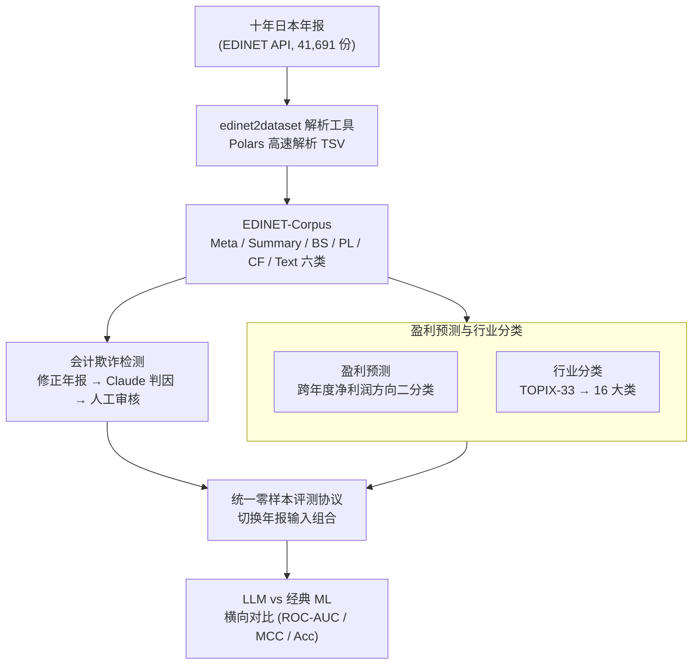

# EDINET-Bench: Evaluating LLMs on Complex Financial Tasks using Japanese Financial Statements

**会议**: ICLR 2026  
**arXiv**: [2506.08762](https://arxiv.org/abs/2506.08762)  
**代码**: [GitHub](https://github.com/SakanaAI/EDINET-Bench)  
**领域**: 时间序列  
**关键词**: financial benchmark, LLM evaluation, fraud detection, earnings forecasting, Japanese NLP

## 一句话总结
构建了基于日本 EDINET 十年年报的金融基准 EDINET-Bench，包含会计欺诈检测、盈利预测和行业分类三项专家级任务，发现即使是 SOTA LLM 也仅略优于逻辑回归。

## 研究背景与动机
**领域现状**: LLM 在数学、编程等领域已超越人类表现，基准数据集是推动进步的关键驱动力。但金融领域基准数据集相对匮乏，现有基准（FinQA、ConvFinQA 等）多为简单 QA 或数据抽取任务。

**现有痛点**: 现有金融基准不涉及专家级推理（如整合多张报表和文本段落），无法评估 LLM 在真实高风险金融任务上的能力。

**核心矛盾**: LLM 在通用任务上表现优越，但金融领域需要同时处理大量表格数据和文本信息，并进行跨年度复杂推理。

**本文目标**: 提供首个开源的、需要专家级推理的日语金融基准，特别是首个开放的会计欺诈检测数据集。

**切入角度**: 利用日本 EDINET 系统（类似美国 EDGAR）十年的真实年报数据，构建三个挑战性任务。

**核心 idea**: 真实年报 + 专家级金融任务 = 揭示 LLM 在金融推理上的不足。

## 方法详解

### 整体框架
EDINET-Bench 要解决的问题是：现有金融基准都停留在简单 QA 或表格抽取，没有一套需要"读完整份年报、跨多张报表和文本做专家级推理"的公开评测，更没有任何开放的会计欺诈检测数据。作者的做法是搭一条从原始监管文件到可评测任务的数据管线——先用自研工具 edinet2dataset 调 EDINET API 把十年（2014–2025）约 41,691 份日本年报批量下载、解析成结构化语料 EDINET-Corpus；再在语料上构建会计欺诈检测、盈利预测、行业分类三项任务，难点都落在如何为真实年报"造出可靠标签"；最后用一套统一的零样本协议，让十余个 LLM 与经典机器学习基线在相同提示、不同年报输入组合下横向比拼。

### 关键设计

**1. edinet2dataset 与 EDINET-Corpus：把异构监管文件压成统一结构**

年报在 EDINET 里以 TSV 形式存放，每一行是一个属性记录，字段散乱、直接喂给模型既臃肿又难对齐，下游也无从控制"到底给模型看了哪些信息"。作者参照美国 EDGAR 的 edgar-crawler 写了 edinet2dataset，用 EDINET API 拉取 2014 年 4 月至 2025 年 4 月约 41,691 份年报与修正年报，借助 Polars 做高速解析，把每份文件归并成六类信息：Meta（公司名、EDINET 代码等元数据）、Summary（关键财务指标）、Balance Sheet（BS，资产负债表）、Profit & Loss（PL，利润表）、Cash Flow（CF，现金流量表）、Text（公司沿革、业务风险等文本段落），整体沉淀为公开语料 EDINET-Corpus。这一层不只是数据基础设施，它还把"年报内容"切成了可拆可组的模块，下游才能做"只给 Summary / 再加三张报表 / 再加 Text"的输入消融——后面所有任务和实验都站在这套结构之上。

**2. 会计欺诈检测：用修正年报反推欺诈标签**

这是整个基准最关键、也最缺现成数据的一环——欺诈本来就没有公开标注。作者抓住一个事实：年报若被发现有问题，公司会发布**修正年报**，而修正年报会用文本明确写出"为什么要修"。于是先下载十年共 6,712 份修正年报，用 pdfminer 抽出修正原因文本，再让 Claude 3.7 Sonnet 判断每条原因是否真正构成会计欺诈（很多修正只是误报大股东持股、漏报高管薪酬等非欺诈问题）。这样筛出 668 份欺诈正样本，并由人工逐条复核修正原因，把误标率压到 5% 以下。负样本则从其余公司中随机抽 700 家、每家随机取一份年报。划分时严格保证同一家公司不跨训练/测试集，避免主体泄漏；因解析失败实际得到 534 份欺诈、555 份非欺诈（训练 865、测试 224）。"用修正年报当弱监督、再用 LLM+人工把噪声标签提纯"正是这套基准能成为首个开源欺诈检测数据集的核心技巧。

**3. 盈利预测与行业分类：两项标签更直接的对照任务**

这两项任务的标签构造比欺诈检测简单，但分别考察不同能力。盈利预测设计成二分类：把同一公司相邻两年的年报配对，以"归母净利润"相对上一年的增减方向作标签，看模型能否从当期财报推断下一年盈利走势；划分用时间切分（2020 年之前为训练，得到 549 条训练、451 条测试），保证测试集严格在训练时间之后，贴近真实预测场景。行业分类则是多分类：直接用日本 SICC 的 TOPIX-33 细分行业会让每类样本过少，作者把它合并成 16 个大类（每类约 30+ 家公司，测试集 476 条），更依赖对业务描述文本的语义理解，是衡量模型对日语金融文本基本把握能力的对照项。两项都不需要 LLM 提纯标签，因而能和欺诈检测形成"难标签 vs 易标签"的对比。

**4. 统一零样本评测协议：相同提示、可控输入下横向对比**

为了让结论可比，三项任务都走同一套零样本协议：系统消息固定为 "You are a financial analyst"，再通过切换年报输入组合（仅 Summary / +BS+CF+PL / 再 +Text）观察信息量对性能的边际影响——这一步只有靠设计 1 的六类切分才能做到。受测模型涵盖 GPT-4o、o4-mini、GPT-5、Claude 3.5 Haiku/Sonnet、Claude 3.7 Sonnet、Kimi-K2、DeepSeek-V3/R1、Llama 3.3 70B；同时以 Logistic Regression、Random Forest、XGBoost 三个经典机器学习模型作基线，用来检验 LLM 相对传统统计方法到底有没有真优势。正是这套协议让全文得出"最强 LLM 也只是略胜逻辑回归"的诚实结论。

## 实验关键数据

### 主实验
欺诈检测 ROC-AUC（部分）:

| 模型 | Summary | +BS/CF/PL | +Text |
|------|---------|-----------|-------|
| Claude 3.5 Sonnet | 0.64 | 0.63 | **0.73** |
| GPT-5 | 0.56 | 0.62 | 0.67 |
| Logistic Regression† | - | 0.61 | - |

盈利预测 ROC-AUC:

| 模型 | Summary | +BS/CF/PL | +Text |
|------|---------|-----------|-------|
| GPT-5 | 0.58 | 0.62 | **0.65** |
| Claude 3.7 Sonnet | 0.55 | 0.58 | 0.61 |
| Logistic Regression† | - | 0.60 | - |

### 消融实验
输入信息量的消融:

| 输入配置 | 欺诈检测(avg) | 盈利预测(avg) |
|----------|--------------|---------------|
| Summary only | ~0.58 | ~0.48 |
| +BS/CF/PL | ~0.59 | ~0.52 |
| +Text | ~0.64 | ~0.52 |

### 关键发现
- **LLM 仅略优于逻辑回归**: 在二分类任务上，最强 LLM 的 MCC 也仅在 0.1-0.3 之间
- **文本信息有帮助**: 加入 Text 段后欺诈检测 ROC-AUC 平均提升 ~0.06
- **开源模型落后**: DeepSeek-V3/R1 在金融任务上明显弱于闭源模型
- **行业分类相对简单**: 提供完整报表后 Claude 3.5 Sonnet 达 41% 准确率（16类随机基线 6.25%）
- 每份年报约30K tokens，单次推理成本约$0.1（Claude 3.7 Sonnet）

## 亮点与洞察
- **首个开源会计欺诈检测数据集**: 此前无公开的欺诈检测评估基准
- **edinet2dataset 工具开源**: 提供了从 EDINET 构建金融数据集的完整管线，基于 Polars 高速解析 TSV
- **诚实的结论**: 直言仅提供年报让 LLM 直接推理是不够的，需要更多脚手架（如模拟环境、任务特定推理支持）
- **跨语言价值**: 日语金融基准填补了非英语金融 NLP 的空白
- **实验设计严谨**: 多种输入配置的消融，经典ML基线的对比，成本分析透明
- **标签质量控制**: 欺诈标签经 Claude 判断 + 人工审核，误标率 <5%

## 局限与展望
- 仅评估零样本设置，缺少 few-shot 和 RAG 实验，未探索 chain-of-thought 等推理增强
- 欺诈标签由 Claude 3.7 Sonnet 生成而非完全人工标注，可能存在系统性偏差
- 评估的 LLM 多数对日语金融术语理解有限，特别是开源模型
- 数据仅覆盖日本市场，未评估跨国泛化能力
- 缺少对 LLM 推理过程的深入分析（如关注哪些报表项目、推理路径可视化等）
- fine-tuned Llama-3.2-1B 未展示完整结果，缺少小模型微调的充分探索
- 欺诈检测和盈利预测均为二分类，未探索更细粒度的回归任务
- 年报长度约30K tokens，接近部分模型的上下文限制，可能影响结果

## 相关工作与启发
- 与 FinQA/ConvFinQA 对比：EDINET-Bench 需处理完整年报而非短段落，更接近真实金融分析场景
- 与 FinanceBench 对比：FinanceBench 为开放式 QA，EDINET-Bench 要求整合多张报表+文本进行专家级推理
- 与 FAMMA 对比：FAMMA 基于 CFA 考试和教程，EDINET-Bench 基于真实企业年报
- 与 kim2024 (GPT-4 预测盈利方向) 对比：本文提供开源数据和评估代码，可复现
- 启发：金融 LLM 需要突破简单 QA，向 agent 化（模拟金融分析师工作流）发展
- 对非英语金融 NLP 的启发：各国可用类似方法构建本地金融基准（中国 CSRC 披露、美国 EDGAR 等）
- 未来方向：结合 RAG 或 multi-agent 框架可能显著提升 LLM 的金融推理表现

## 评分
- 新颖性: ⭐⭐⭐⭐ 首个开源欺诈检测基准，但任务本身设计较为直接
- 实验充分度: ⭐⭐⭐⭐ 覆盖10+模型和3种输入配置，但缺少 few-shot 等进阶实验
- 写作质量: ⭐⭐⭐⭐ 结构清晰，数据构建流程详尽，表格丰富
- 价值: ⭐⭐⭐⭐ 开源工具和数据集对金融 NLP 社区有实际贡献，揭示 LLM 金融推理的不足

<!-- RELATED:START -->

## 相关论文

- [\[ICLR 2026\] Reasoning on Time-Series for Financial Technical Analysis](reasoning_on_time-series_for_financial_technical_analysis.md)
- [\[ACL 2026\] A Unified Framework for Modeling Heterogeneous Financial Data via Dual-Granularity Prompting](../../ACL2026/time_series/a_unified_framework_for_modeling_heterogeneous_financial_data_via_dual-granulari.md)
- [\[ICLR 2026\] Benchmarking ECG FMs: A Reality Check Across Clinical Tasks](benchmarking_ecg_fms_a_reality_check_across_clinical_tasks.md)
- [\[ICLR 2026\] TimeOmni-1: Incentivizing Complex Reasoning with Time Series in Large Language Models](timeomni-1_incentivizing_complex_reasoning_with_time_series_in_large_language_mo.md)
- [\[ICLR 2026\] SciTS: Scientific Time Series Understanding and Generation with LLMs](scits_scientific_time_series_llm.md)

<!-- RELATED:END -->
