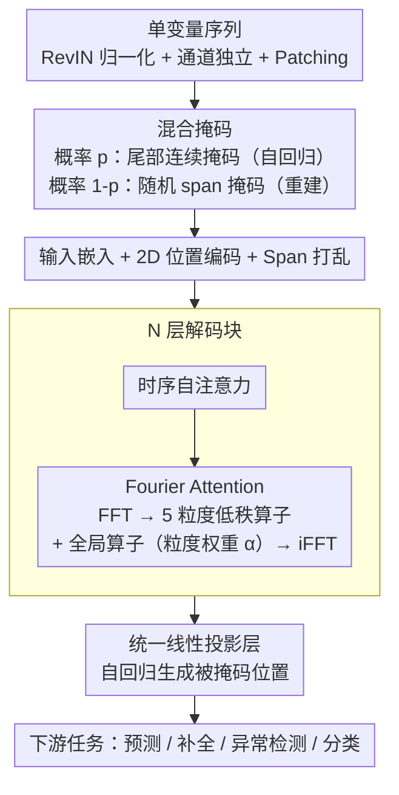

# GTM: A General Time-series Model for Enhanced Representation Learning

**会议**: ICLR 2026  
**arXiv**: [2502.03264](https://arxiv.org/abs/2502.03264)  
**代码**: [https://github.com/MMTS4All/GTM](https://github.com/MMTS4All/GTM)  
**领域**: 时间序列  
**关键词**: 时间序列基础模型, 频域注意力, 混合掩码预训练, 多任务, 时间粒度感知

## 一句话总结
提出 GTM，一个通过频域注意力机制捕获时间粒度感知特征、并通过混合掩码统一重建与自回归预训练目标的通用时间序列基础模型，在预测、补全、异常检测、分类等多任务上均达到 SOTA。

## 研究背景与动机

1. **领域现状**：时间序列基础模型（TSFM）分为两类——预测专用模型（如 TimesFM、Lag-Llama）和多任务模型（如 Timer、UniTS）。前者针对预测优化，后者试图覆盖多种下游任务。
2. **现有痛点**：(a) 现有模型主要在时域提取特征，忽视了频率域中时间粒度相关的分布差异；(b) 多任务 TSFM 通常需要针对不同任务修改 tokenization、预训练策略或 projection head，无法真正做到"任务无关"。
3. **核心矛盾**：如何在一个统一的架构和预训练框架下，既学到丰富的时间序列表示（包括频域信息），又能无缝适配所有生成式下游任务？
4. **本文要解决什么**：(a) 设计频域注意力机制来捕获不同时间粒度（秒/分/时/日）下的频率分布差异；(b) 统一重建和自回归预训练目标，使模型无需任务特定修改即可适配多种生成任务。
5. **切入角度**：作者通过 FFT 和 2D 核密度估计分析大规模时间序列数据，发现不同时间粒度下的幅频和相频联合分布存在显著差异，这一关键但被忽视的维度直接指导了模型设计。
6. **核心 idea 一句话**：用 Fourier attention 捕获时间粒度感知的频率特征，用混合掩码（随机+尾部连续）统一重建与自回归目标，实现首个生成任务无关的时间序列基础模型。

## 方法详解

### 整体框架
GTM 是一个 decoder-only Transformer，整条 pipeline 要解决的是：让一套权重既学到包含频域信息的丰富表示、又能零修改适配所有生成式下游任务。单变量序列先经 RevIN 归一化、通道独立（CI）切分与 patching 切成 patch token；接着做混合掩码——每个样本以概率开关决定走「尾部连续掩码 + 自回归」还是「随机 span 掩码 + 重建」，被掩码的 span 被随机打乱重排；打乱后的 token 叠加 1D/2D 位置编码送入 $N$ 层堆叠的解码块，每块内部先过一层时序自注意力、再过一层 Fourier attention 注入频域信息；最后由一个统一的线性投影层自回归地把被掩码位置生成出来。整个模型在 UTSD-12G 大规模无标注数据上预训练，下游不论是预测、补全还是异常检测都复用同一套权重与生成流程。

### 关键设计

**1. 混合掩码预训练：用一个概率开关统一重建与自回归**

纯重建式预训练学到的表示丰富但不擅长外推预测，纯自回归预训练擅长预测却表示质量有限，过去的多任务 TSFM 往往要为不同任务切换 tokenization 或预训练策略。GTM 用一个超参数 $pred\_ratio$（即概率 $p$）做开关：每个样本以概率 $p$ 施加尾部连续掩码、走自回归预测目标，以概率 $1-p$ 施加随机 span 掩码、走重建目标。重建分支用 full attention 让模型看到全部上下文，自回归分支用 causal attention 防止未来信息泄漏。这样同一套预训练权重就同时具备了表示能力和预测能力，下游补全（重建）和预测（自回归）都能零修改直接复用，真正做到生成任务无关。

**2. 2D 位置编码 + Span 打乱：让模型知道每个待填 span 有多长**

混合掩码会把被掩码的 span 随机排列后拼接 [START]/[END] token，模型在生成时必须知道当前要填充的片段长度，否则无法正确对齐输出。GTM 借鉴 GLM 的做法，在输入 embedding 上叠加 1D 与 2D 两套位置编码：$\mathbf{H}_{in} = \mathbf{W}_{emb} \mathbf{X}_{in} + \mathbf{W}_{1D\_pos} + \mathbf{W}_{2D\_pos}$，其中 1D 编码刻画 patch 在原序列中的全局位置，2D 编码刻画当前 token 在所属 span 内部的相对位置和 span 长度。配合 span 随机排列，既保证了生成时的长度可控，也增加了预训练的鲁棒性。

**3. Fourier Attention：把"采样粒度"作为先验注入频域建模**

作者先用 FFT 加 2D 核密度估计分析海量真实序列，发现秒级、分级、小时级、天级数据的幅频/相频联合分布存在系统性差异——这一维度此前的 TSFM 普遍在纯时域建模中被忽略。GTM 因此在每个解码块里、时序自注意力之后加一条频域支路：把时序自注意力的输出按列做 FFT 得到 $\mathbf{H}_{\text{FFT}} = \text{FFT}(\mathbf{H}_{\text{TemAttOut}})$，再用 5 个低秩矩阵对 $\{(\mathbf{A}_i, \mathbf{B}_i)\}_{i=1}^5$ 分别对应日/时/分/秒/毫秒五种粒度、外加一个全连接的全局支路 $\mathbf{W}_{\text{full}}$ 捕获粒度无关的通用频率模式（始终激活）。当前序列的时间粒度被编码成一个五元组 query（如 ETTm 编码为 $[0,0,15,0,0]$），与 5 个可学习 key 做 softmax 得到权重 $\alpha$，按权重聚合各粒度变换的结果：$\mathbf{H}_{\text{FourierAtt}} = \sum_{i=1}^{5} \alpha_i (\mathbf{A}_i \mathbf{B}_i) \mathbf{H}_{\text{FFT}} + \mathbf{W}_{\text{full}} \mathbf{H}_{\text{FFT}}$，最后 iFFT 变回时域。低秩分解把这条频域支路的参数量压到很小，而注意力权重让模型对不同采样率的输入自适应地挑选对应的频域算子，这也是消融里贡献最大的模块。

### 损失函数 / 训练策略
模型统一用 MSE 监督被掩码位置的重建/预测值，$\text{Loss} = \frac{1}{|\mathbf{Y}|} \sum_i \|\mathbf{X}_{out_i} - \mathbf{y}_i\|^2$；自回归分支按链式法则逐 token 生成，$\mathbb{P}(\mathbf{X}_{out}) = \prod_i \mathbb{P}(\mathbf{X}_{out_i} \mid \mathbf{X}_{P_{crpt}}, \mathbf{S}_{\sigma(j \leq i)})$。预训练只用 UTSD-12G，严格隔离下游评测数据避免泄漏；下游适配时预测/补全/异常检测三类生成任务完全不改架构，只有分类任务需要替换 projection head。

## 实验关键数据

### 主实验 — 长期预测
平均 MSE/MAE，预测长度 $T \in \{96, 192, 336, 720\}$：

| 数据集 | GTM MSE | PatchTST MSE | TimesNet MSE | GPT4TS MSE | 提升 |
|--------|---------|-------------|-------------|-----------|------|
| ETTh1 | **0.404** | 0.413 | 0.458 | 0.427 | vs PatchTST: -2.2% |
| ETTm1 | **0.339** | 0.352 | 0.400 | 0.352 | vs PatchTST: -3.7% |
| Weather | **0.225** | 0.225 | 0.259 | 0.237 | 持平 PatchTST |
| Traffic | **0.385** | 0.390 | 0.620 | 0.414 | vs PatchTST: -1.3% |
| Electricity | **0.161** | 0.159 | 0.192 | 0.167 | PatchTST 略优 |

### 消融实验

| 配置 | ETTh1 MSE | ETTm1 MSE | Weather MSE | 说明 |
|------|-----------|-----------|------------|------|
| GTM 完整 | 0.404 | 0.339 | 0.225 | 完整模型 |
| 无频域模块 | ~0.415+ | ~0.345+ | ~0.230+ | baseline 版本 |
| 无粒度感知模块 | ~0.410+ | ~0.342+ | ~0.228+ | 高级版本但缺粒度 |
| 无预训练 | 0.435 | 0.351 | 0.244 | MSE 增 0.5%-7.8% |

### 其他任务表现
- **补全**：ETTh1 MSE 0.053（vs GPT4TS 0.069，提升 23.1%）；ETTm1 MSE 0.021（vs TimesNet 0.027，提升 25.0%）
- **异常检测**：平均 F1 87.01%（vs GPT4TS 86.72%）
- **分类**：10 个数据集上 5 个最佳 + 4 个次佳
- **零样本预测**：平均 MSE 0.380（vs Timer-1B 0.392、MOIRAI-S 0.405）

### 关键发现
- Fourier attention 中**时间粒度感知模块**贡献最大——去掉后所有数据集性能下降
- 预训练带来一致性提升：预测 MSE 降 0.5%-7.8%，补全 MSE 降 1.2%-11.7%，异常检测 F1 增 1.2%
- 模型遵循 scaling law：增大层数和维度、增加预训练数据量都能持续提升性能
- 仅用 10% 数据微调即可超过 TimesFM 的 few-shot 性能

## 亮点与洞察
- **频域中时间粒度感知的建模思路**非常新颖：通过实证分析发现不同粒度的频率分布差异，然后用低秩矩阵 + 注意力权重自适应组合，优雅地将先验知识融入模型。这个 trick 可以迁移到任何有多时间尺度数据的场景（如多分辨率遥感、音频处理）
- **混合掩码统一预训练**解决了一个长期存在的问题——重建和自回归是两种不同的预训练范式，GTM 用一个概率开关优雅地统一了两者。这使得同一个预训练模型可以无缝适配补全（重建）和预测（自回归）
- **真正的生成任务无关**：预测、补全、异常检测三个生成任务零架构修改，这在 TSFM 领域是首次

## 局限性 / 可改进方向
- 采用通道独立（CI）策略，完全忽略多变量间的跨通道关系——可结合 CPiRi 类方法增加空间模块
- 时间粒度编码是手动五元组，依赖先验知识——可否从数据中自动学习粒度表示？
- 分类任务的适配仍需替换 projection head（非完全任务无关）——能否用 prompt 或 in-context learning 实现？
- 预训练数据 UTSD-12G 的领域覆盖度可能影响零样本泛化——部分数据集（如 Traffic）零样本不如 Timer-1B

## 相关工作与启发
- **vs Timer**: Timer 用纯自回归预训练，需要针对不同任务切换策略；GTM 用混合掩码统一了目标
- **vs PatchTST**: PatchTST 是 CI + patch 的先驱，但只做时域建模；GTM 在此基础上增加了频域分析
- **vs MOIRAI**: MOIRAI 也关注跨频率学习，但用 masked Transformer 架构；GTM 的 Fourier attention 更显式地建模粒度差异
- **vs UniTS**: UniTS 用 task tokenization 支持多任务，需要任务特定的 token；GTM 不需要

## 评分
- 新颖性: ⭐⭐⭐⭐ Fourier attention 和混合掩码预训练都是有意义的创新，但整体框架仍基于已有组件
- 实验充分度: ⭐⭐⭐⭐⭐ 预测+补全+异常检测+分类+零样本+少样本+消融+scaling law，覆盖非常全面
- 写作质量: ⭐⭐⭐⭐ 结构清晰，但部分细节（如 Fourier attention 的计算复杂度分析）可以更深入
- 价值: ⭐⭐⭐⭐ 首个生成任务无关的 TSFM，实用性强，适合工业部署

<!-- RELATED:START -->

## 相关论文

- [\[ICLR 2026\] Uni-NTFM: A Unified Foundation Model for EEG Signal Representation Learning](uni-ntfm_a_unified_foundation_model_for_eeg_signal_representation_learning.md)
- [\[ICLR 2026\] FeDaL: Federated Dataset Learning for General Time Series Foundation Models](fedal_federated_dataset_learning_for_general_time_series_foundation_models.md)
- [\[ICLR 2026\] Adapt Data to Model: Adaptive Transformation Optimization for Domain-shared Time Series Foundation Models](adapt_data_to_model_adaptive_transformation_optimization_for_domain-shared_time_.md)
- [\[AAAI 2026\] Mask the Redundancy: Evolving Masking Representation Learning for Multivariate Time-Series Clustering](../../AAAI2026/time_series/mask_the_redundancy_evolving_masking_representation_learning_for_multivariate_ti.md)
- [\[AAAI 2026\] iTimER: Reconstruction Error-Guided Irregularly Sampled Time Series Representation Learning](../../AAAI2026/time_series/beyond_observations_reconstruction_error-guided_irregularly_sampled_time_series_.md)

<!-- RELATED:END -->
