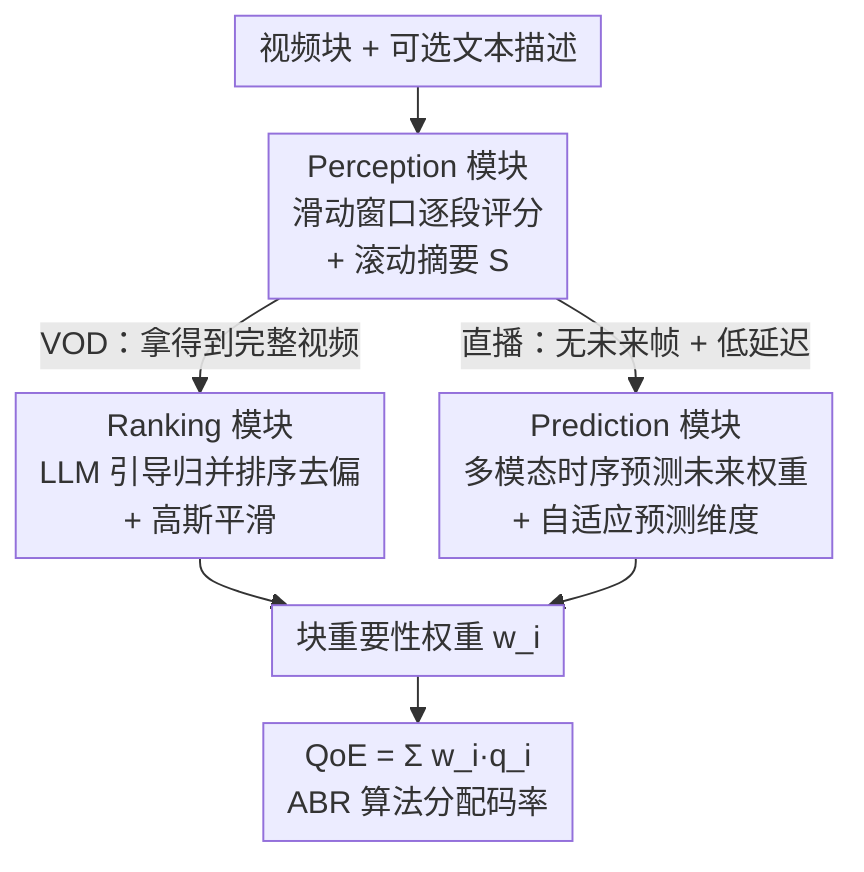

# HiVid: LLM-Guided Video Saliency For Content-Aware VOD And Live Streaming

**会议**: ICLR 2026  
**arXiv**: [2602.14214](https://arxiv.org/abs/2602.14214)  
**代码**: 待确认  
**领域**: 时间序列  
**关键词**: video saliency, LLM-as-judge, content-aware streaming, time series forecasting, adaptive bitrate

## 一句话总结
提出 HiVid 框架，首次利用 LLM 作为人类代理为视频块生成内容重要性权重，通过感知模块（滑动窗口评分）、排序模块（LLM 引导归并排序去除评分偏差）和预测模块（多模态时间序列预测自适应延迟）实现内容感知流媒体传输，
VOD PLCC 提升 11.5%，直播预测提升 26%，真人 MOS 相关性提升 14.7%。

## 研究背景与动机
**领域现状**: 内容感知视频流媒体通过 $QoE = \sum_i w_i \cdot q_i$ 为更重要的块分配更高码率。当前方法有 CV 高亮检测模型（DETR、VASNet 等）和人工众包标注（SENSEI）。

**现有痛点**: CV 模型语义理解不足、泛化差；视频理解大模型（VideoLLaMA3, VILA）在主观评分任务上幻觉严重；人工标注成本极高（78分钟/100美元每视频），直播场景不可行。

**核心矛盾**: 需要兼具准确性（语义理解）和效率（实时+低成本）的权重生成方案。

**本文目标**: 三个挑战：(1) LLM 无法直接处理视频且 token 有限；(2) 滑动窗口内局部评分不一致；(3) 直播需实时推理但 LLM 延迟不确定。

**切入角度**: 用 LLM 作为"人类代理"进行零样本主观推理，通过窗口化+上下文摘要绕过 token 限制。

**核心 idea**: LLM 感知 + 归并排序去偏 + 多模态预测自适应延迟 = 端到端内容感知流媒体。

## 方法详解

### 整体框架
HiVid 把 LLM 当作"人类代理"来给视频块打主观重要性权重 $w_i$，再把权重喂回 $QoE = \sum_i w_i \cdot q_i$ 指导码率分配。一个 Perception 模块负责把任意长的视频切成滑动窗口逐段评分，是所有场景的公共底座；点播（VOD）路径在其后接 Ranking 模块用排序去掉窗口间的评分偏差，直播路径则与 Perception 并行地接 Prediction 模块，用多模态时间序列预测来掩盖 LLM 的推理延迟。两条路径最终都把块权重 $w_i$ 送进 QoE 模型供自适应码率（ABR）算法分配码率。

### 关键设计

**1. Perception 模块：用滑动窗口加摘要绕过 LLM 的 token 上限**

整体框架里的"公共底座"要解决的是：LLM 既不直接吃视频、token 又有限，没法把整段视频塞进去。HiVid 把每个视频块的首帧采样成锚点帧，再按每 $m$ 帧切成一个窗口逐个送进 LLM（默认 GPT-4o），每个窗口的 prompt 同时要求两件事——给这 $m$ 帧打分、并把这段内容压缩进一段文本摘要带给下一个窗口，即 $R_{(k-1)m+1}^{km}, S_{km} = LLM(F_{(k-1)m+1}^{km}, S_{(k-1)m})$。摘要 $S$ 充当被压缩的历史上下文（初始 $S_0$ 用视频标题和背景），让后面的窗口能在"知道前情"的前提下评分，于是处理任意时长 $D$ 的视频只需 $\lceil D/m \rceil$ 次调用，把成本压成线性。

**2. Ranking 模块：用 LLM 引导的归并排序抹平窗口间偏差**

这一步对应框架图里 VOD 分支：不同窗口是独立打分的，绝对分数会系统性漂移——论文里同样精彩的镜头在两个窗口分别只拿 65-70 和 75-85。点播场景能拿到完整视频，于是 HiVid 改用相对排序而非绝对分。它套用归并排序的框架，但把"比较两个元素"换成"让 LLM 排序"：每次合并两个已排好的组时，各抽 $m/2$ 帧拼成长度 $m$ 的新列表交给 LLM 重新定序，取出前 $m/2$、其余放回原组，单次比较即可对 $m$ 帧排序、复杂度 $O(m)$，整组排序为 $O(k \log k)$（$k = \lceil D/m \rceil$）。排好的序按下标归一化到 $[0,1]$ 作为权重，再施加高斯平滑 $w_i = GS(s, \sigma, w_i)$（核大小 $s=D$）让相邻块权重过渡平滑。因为只比较相对优先级、不依赖绝对分，窗口间的偏差被自然消掉。

**3. Prediction 模块：用多模态预测掩盖直播中不确定的 LLM 延迟**

这一步对应框架图里与 Perception 并行的直播分支：直播没有未来帧、又要求实时出权重，而 LLM 推理延迟 $\Delta t$ 随输入 token 抖动很大，等它算完早就错过传输窗口了。HiVid 因此训一个多模态时间序列模型来"预报"未来块的权重：先用冻结的 CLIP 把历史帧和文本摘要编码对齐，再做内容感知注意力（content-aware attention）——以时序特征作 Q、拼接后的图文特征作 K/V，$Attn(F(x_w), F(x_{cat}), F(x_{cat})) = softmax\left(\frac{Q_w K_{cat}^T}{\sqrt{d}}\right) \cdot V_{cat}$，让历史数值序列去查询语义内容。关键的"自适应预测维度"按当前 LLM 延迟 $\Delta t$ 和预测延迟 $\delta$ 动态决定要往前预报多远，输出维度需同时覆盖尚未评分的 $n-m$ 块和未来 $N$ 块，刚好填上等待 LLM 的那段空窗。训练用相关性损失 $loss = MSE(x, x_{gt}) + \lambda(1 - \text{Pearson}(x, x_{gt}))$，在拟合数值之外额外逼模型保住权重序列的整体走势。

### 损失函数 / 训练策略
Perception 与 Ranking 模块完全靠 LLM 零样本推理、无需训练；只有 Prediction 模块需要训练，且会预训练多个对应不同 $L_{out}$ 的模型，推理时根据实测延迟挑最小但够用的那个，在预测跨度和精度间取平衡。

## 实验关键数据

### 主实验
三个数据集的显著性评分（PLCC/mAP50）:

| 方法 | Youtube-8M PLCC | TVSum PLCC | SumMe PLCC |
|------|----------------|-----------|------------|
| DETR | 0.57 | 0.42 | 0.38 |
| SL-module | 0.59 | 0.43 | 0.39 |
| VideoLLaMA3 | 0.54 | 0.41 | 0.35 |
| **HiVid** | **0.66** | **0.50** | **0.47** |

### 消融实验
窗口参数 $m$ 对开销和准确率的影响（201s视频）:

| m | 总 API 调用 | 总成本 | 总时间/h |
|---|------------|--------|----------|
| 2 | 1458 | $8.12 | 1.26 |
| 6 | 384 | $2.41 | 0.67 |
| 10 | 202 | $1.35 | 0.54 |

$m=10$ 在准确率-成本之间最优。

### 关键发现
- HiVid 在平均 PLCC 上比第二名 SL-module 高 11.5%，mAP50 高 6%
- 直播场景 HiVid 多模态预测比最强时序基线 iTransformer 提升 26%
- 真人 MOS 相关性提升 14.7%，验证了实际流媒体 QoE 的改善
- 视频理解模型（VILA、Flamingo）在主观评分任务上不如 CV 基线

## 亮点与洞察
- **首个系统化利用 LLM 进行视频级内容感知流媒体的框架**: 将 LLM-as-judge 思路从文本扩展到视频流媒体
- **LLM 归并排序**: 用 LLM 作为比较函数的排序算法设计巧妙，$O(k \log k)$ 开销可控
- **自适应预测维度**: 针对异步 LLM 推理延迟的动态调整，是实际部署的关键设计
- **端到端验证**: 从评分准确率到实际流媒体 QoE 的完整验证链
- **多模态融合的 Content-Aware Attention**: CLIP 对齐图像+文本再结合时序的新颖注意力设计

## 局限与展望
- 依赖 GPT-4o 闭源 API，成本仍较高（$1.35/视频），难以大规模部署
- Perception 模块仅看首帧锚点，可能遗漏帧内动态变化（如快速动作）
- 直播场景初始 $\lceil(\Delta t + \delta)/d\rceil + m$ 个块没有 LLM 评分，用默认权重1填充
- 排序模块对极长视频开销仍显著，$O(k \log k)$ 的 LLM 调用实际费用不低
- 仅评估了 GPT-4o，未探索开源 LLM 替代方案（如 Llama/Qwen 等）
- 评分质量强依赖 LLM 的主观判断能力，不同 LLM 可能产生不同偏差
- 未考虑视频内容的动态变化（如场景切换、镜头运动等时序特征）
- 未探索对不同视频类别（体育、新闻、教育等）的分类化策略

## 相关工作与启发
- SENSEI 用人工众包获取精确权重但成本极高，HiVid 用 LLM 实现了准确-效率平衡
- 与 DETR/SL-module 等 attention-based 高亮检测对比，LLM 在语义内容理解上的优势明显
- 与 VideoLLaMA3/VILA 对比：视频理解模型在主观评分任务上幻觉严重，不如 LLM 视觉+文本的策略
- 对网络系统+AI 交叉领域有借鉴意义：将 LLM 推理引入在线系统的异步设计模式
- 启发：多模态时序预测中 CLIP 对齐的图像+文本特征可作为有效的上下文信号

## 评分
- 新颖性: ⭐⭐⭐⭐ LLM-as-judge 用于视频流媒体是新颖组合，但各模块技术偏工程集成
- 实验充分度: ⭐⭐⭐⭐⭐ 3数据集+17基线+消融+真人用户研究，非常充分
- 写作质量: ⭐⭐⭐⭐ 问题驱动的三挑战三模块结构，叙述严谨
- 价值: ⭐⭐⭐⭐ 对内容感知流媒体有实际意义，但对学术社区的泛化启发略有限

<!-- RELATED:START -->

## 相关论文

- [\[AAAI 2026\] Interpreting Fedspeak with Confidence: A LLM-Based Uncertainty-Aware Framework Guided by Monetary Policy Transmission Paths](../../AAAI2026/time_series/interpreting_fedspeak_with_confidence_a_llm-based_uncertainty-aware_framework_gu.md)
- [\[ICLR 2026\] Towards Generalizable PDE Dynamics Forecasting via Physics-Guided Invariant Learning](towards_generalizable_pde_dynamics_forecasting_via_physics-guided_invariant_lear.md)
- [\[ICLR 2026\] TSRating: Rating Quality of Diverse Time Series Data by Meta-learning from LLM Judgment](tsrating_time_series_quality_llm.md)
- [\[ICLR 2026\] Rating Quality of Diverse Time Series Data by Meta-learning from LLM Judgment](rating_quality_of_diverse_time_series_data_by_meta-learning_from_llm_judgment.md)
- [\[ACL 2025\] Context-Aware Sentiment Forecasting via LLM-based Multi-Perspective Role-Playing Agents](../../ACL2025/time_series/context_aware_sentiment_forecasting_agents.md)

<!-- RELATED:END -->
