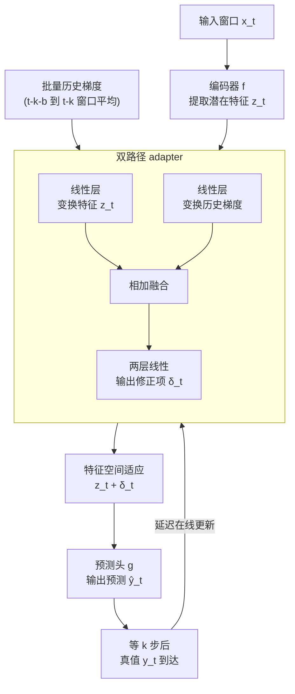

# Online Time Series Prediction Using Feature Adjustment

**会议**: ICLR 2026  
**arXiv**: [2509.03810](https://arxiv.org/abs/2509.03810)  
**代码**: [有](https://github.com/xiannanhuang/ADAPT-Z)  
**领域**: 时间序列  
**关键词**: 在线学习, 分布漂移, 特征空间适应, 延迟反馈, 时间序列预测

## 一句话总结

提出 ADAPT-Z（Automatic Delta Adjustment via Persistent Tracking in Z-space），将在线时序预测的适应目标从模型参数更新转移到特征空间修正，通过轻量 adapter 融合当前特征与历史梯度来应对多步预测中的延迟反馈问题，在13个数据集上一致超越现有在线学习方法。

## 研究背景与动机

时间序列预测面临 **分布漂移**（distribution shift）这一核心挑战：部署阶段数据的分布随时间持续变化。现有在线学习方法围绕两个问题展开：(1) 更新哪些参数，(2) 如何更新。

现有方法的局限：

- **参数选择偏向**：多数方法更新最后一层参数或引入小型 adapter 模块，但这些可能不是适应分布漂移的最优选择
- **延迟反馈问题**：多步预测（如预测未来24步）中，时刻 $t$ 的真值要到 $t+24$ 才到达，基于延迟梯度的更新可能不可靠
- **训练-部署不匹配**：训练时样本随机打乱，部署时数据按时间顺序到达

**核心洞察**：表面的分布漂移源自底层潜在因素（如经济状况、温度等）的变化。模型可分解为编码器 $f$（提取潜在因素特征 $z$）和预测头 $g$。修正特征 $z$ 比修正模型参数更直接对应分布漂移的根因。

## 方法详解

### 整体框架

ADAPT-Z 把预训练好的预测模型拆成编码器 $f$ 和预测头 $g$，部署阶段不再去动模型参数，而是寻找一个特征修正项 $\delta_t$，让被修正后的特征送进预测头能贴近真值，即 $g(z_t + \delta_t) \approx y_t$，其中 $z_t = f(x_t)$。这个 $\delta_t$ 由一个轻量 adapter 在线生成，它同时看当前特征 $z_t$ 和最近一段历史梯度，再用 $k$ 步延迟的在线梯度下降持续学习，从而在分布漂移下不断校准预测。

### 关键设计

**1. 特征空间适应范式：把适应目标从参数搬到特征上**

在线时序预测的传统思路是更新模型参数（最后一层或额外 adapter），但参数和分布漂移的根因之间隔着一层，未必是最优着力点。ADAPT-Z 转而直接在特征空间打补丁。最朴素的实现是特征空间在线梯度下降（fOGD），把 $\delta$ 当成一个待优化的常量沿延迟梯度下降：$\delta_{t+1} = \delta_t - \eta \frac{\partial (g(z_{t-k} + \delta_{t-k}) - y_{t-k})^2}{\partial \delta_{t-k}}$，其中 $k$ 为预测步数。它有两处天然短板——多步预测的延迟让梯度过时，且最优修正 $\delta_t$ 本应随当前上下文 $z_t$ 变化而非固定常量。但即便如此简单，fOGD 在很多数据集上就已媲美甚至超过复杂的参数更新方法，说明"修正特征"这个方向本身就对，这也正是后续设计要补强而非推翻的起点。

**2. 双路径 adapter：让特征与历史梯度各走各的再融合**

要把 $\delta_t$ 做成随上下文变化的函数，自然想到用一个网络同时吃当前特征 $z_t$ 和历史梯度。但二者量级差异很大，直接拼接会让一方淹没另一方。ADAPT-Z 因此用双路径结构：一条线性层独立变换当前特征 $z_t$，另一条线性层独立变换历史梯度，两路输出相加后再经两个线性层输出最终的 $\delta_t$。各走各的线性变换先把两种信号归到可比的尺度，融合后既保留了"当前长什么样"的上下文信息，又带上了"该往哪个方向修"的梯度信号。

**3. 批量历史梯度：用一小段窗口压低单样本梯度的方差**

喂给 adapter 的梯度若取自单个样本，方差太大会让修正抖动。ADAPT-Z 改用批量平均：给定批大小 $b$ 和预测步长 $k$，在时刻 $t$ 取时间戳 $t-k-b$ 到 $t-k$ 这段窗口上平均损失的梯度作为历史梯度输入。窗口起点带 $k$ 的偏移是因为更近的真值还没到，只能用 $k$ 步前已知反馈的那一段，既保证梯度可计算，又用平均把噪声压下来。

**4. 延迟在线更新：等真值到齐再回头修正 adapter**

多步预测里时刻 $t$ 的真值要到 $t+k$ 才到，所以部署用 $k$ 步延迟的在线梯度下降。具体地，每个时间步都缓存当时的历史梯度、特征和模型输出；当时刻 $t$ 的真值到达，就回头取 $t-k$ 时刻那次预测算损失、反向传播更新 adapter 参数，同时在线更新预测头最后一层线性参数。缓存让"现在才知道的真值"能精确对应到"当时那次预测"，避免了用错位反馈污染更新。

### 损失函数 / 训练策略

基础模型先用标准 MSE 损失离线预训练；部署阶段在线更新的对象是 adapter 参数和最后一层线性参数。论文还给出增强版本：先用训练集微调基础模型并训练 adapter（3 个 epoch）再上线，把"学会适应"的能力提前注入。数据划分采用 60% 训练 / 10% 验证 / 30% 测试，比此前工作常用的 25/5/70 更贴近真实部署比例。

## 实验关键数据

### 主实验

13个数据集（4个 ETT、4个 PEMS、weather、solar、traffic、electricity、exchange），3个基础模型（iTransformer、SOFTS、TimesNet），预测步长12/24/48。

| 数据集 | 原始 | fOGD | DSOF | SOLID | ADCSD | Proceed | **ADAPT-Z** | 提升 |
|-------|------|------|------|-------|-------|---------|------------|------|
| ETTm1 | 0.2211 | 0.2178 | 0.2647 | 0.2166 | 0.2169 | 0.2168 | **0.1937** | 12.42% |
| solar | 0.1084 | 0.1074 | 0.1038 | 0.1083 | 0.1075 | 0.1083 | **0.0948** | 12.61% |
| traffic | 0.4075 | 0.4068 | 0.4060 | 0.4070 | 0.4070 | 0.4079 | **0.3689** | 9.49% |
| PEMS04 | 0.1288 | 0.1263 | 0.1465 | 0.1291 | 0.1280 | 0.1290 | **0.1223** | 5.05% |
| weather | 0.1575 | 0.1573 | 0.1975 | 0.1573 | 0.1564 | 0.1575 | **0.1481** | 5.98% |

ADAPT-Z 在全部13个数据集上均取得最佳成绩。DSOF 方法在某些数据集上反而劣于原始模型。

### 消融实验

使用训练集微调的增强版本结果：

| 版本 | ETTh1 | ETTm1 | PEMS03 | solar | traffic |
|------|-------|-------|--------|-------|---------|
| ADAPT-Z (仅验证集) | 0.2626 | 0.1954 | 0.0974 | 0.0940 | 0.3314 |
| Version1 (微调+在线更新) | 0.2625 | 0.1948 | 0.0936 | 0.0885 | 0.3197 |
| Version2 (微调+冻结) | 0.2680 | 0.2104 | 0.0945 | 0.1141 | 0.3224 |

特征位置分析（iTransformer）：不同层输出作为特征时性能稳定，但直接修改输入一致变差。平均来看，第一个 Transformer block 输出最优。

### 关键发现

- **fOGD 的惊人表现**：仅做特征空间梯度下降就在很多数据集上排名第二，证明特征修正方向正确
- **冻结版本的"学会适应"现象**：Version2 不做任何在线更新也能降低误差，说明模型通过训练学会了利用前一批次信息进行自适应
- **训练-测试风格不匹配**：现有训练独立打乱样本，但部署时数据有时序关系，未来工作应考虑训练时的样本顺序

## 亮点与洞察

1. **范式转移**：从"更新哪些参数"转向"修正哪些特征"，直击分布漂移根因
2. **简洁有力的 baseline**：fOGD 就能打败大多数复杂方法，挑战了领域常规假设
3. **"学会适应"现象**：揭示了训练带梯度信息可让模型获得内在适应能力
4. **实用性**：轻量 adapter + 即插即用，适配多种预测模型

## 局限与展望

- 数据划分（60/10/30）与之前工作（25/5/70）不同，对基线的在线阶段表现可能有影响
- 特征位置的选择（第几个 block 输出）缺乏理论指导，目前靠实验确定
- 仅测试点预测模型，概率预测模型的适配未探索
- "学会适应"现象值得深入理论分析，目前仅作为实验观察

## 相关工作与启发

- 与 DSOF、SOLID 等对比：它们更新 adapter/最后层参数，ADAPT-Z 更新特征空间
- FSNet 的双流 EMA 策略和 ELF 的直接拟合策略是不同方向的尝试
- 启发：在线学习和测试时训练（test-time training）领域中，特征修正可能是被忽视的更优方案

## 评分

- 新颖性: ⭐⭐⭐⭐ （特征空间适应范式新颖，"学会适应"发现有趣）
- 实验充分度: ⭐⭐⭐⭐ （13个数据集、3个基础模型、多个对比和消融）
- 写作质量: ⭐⭐⭐⭐ （思路清晰，动机说服力强，相关工作总结详尽）
- 价值: ⭐⭐⭐⭐ （为在线时序预测提供了新的思路和简洁有效的方案）

<!-- RELATED:START -->

## 相关论文

- [\[ICLR 2026\] Delta-XAI: A Unified Framework for Explaining Prediction Changes in Online Time Series Monitoring](delta-xai_a_unified_framework_for_explaining_prediction_changes_in_online_time_s.md)
- [\[ICLR 2026\] ResCP: Reservoir Conformal Prediction for Time Series Forecasting](rescp_reservoir_conformal_prediction_for_time_series_forecasting.md)
- [\[ICLR 2026\] Relational Feature Caching for Accelerating Diffusion Transformers](relational_feature_caching_for_accelerating_diffusion_transformers.md)
- [\[ICLR 2026\] Dissecting Chronos: Sparse Autoencoders Reveal Causal Feature Hierarchies in Time Series Foundation Models](dissecting_chronos_sparse_autoencoders_reveal_causal_feature_hierarchies_in_time.md)
- [\[ICLR 2026\] SwiftTS: A Swift Selection Framework for Time Series Pre-trained Models via Multi-task Meta-Learning](swiftts_a_swift_selection_framework_for_time_series_pre-trained_models_via_multi.md)

<!-- RELATED:END -->
