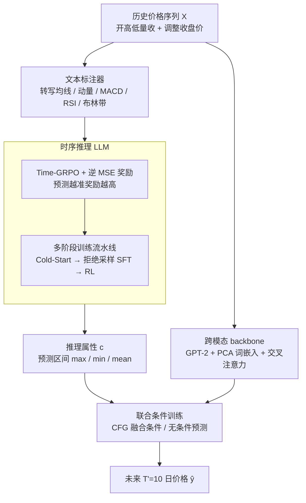

# Reasoning on Time-Series for Financial Technical Analysis

**会议**: ICLR2026  
**arXiv**: [2511.08616](https://arxiv.org/abs/2511.08616)  
**代码**: [chen-jan/VTA](https://github.com/chen-jan/VTA)  
**领域**: 时间序列  
**关键词**: 时间序列推理, 金融技术分析, 强化学习, LLM微调, 可解释预测  
**作者**: Kelvin J.L. Koa, Jan Chen, Yunshan Ma, Huanhuan Zheng, Tat-Seng Chua (NUS, TUM, SMU, CityU HK)

---

## 一句话总结

提出 Verbal Technical Analysis (VTA) 框架，结合 LLM 的语言推理能力与时间序列模型的模式捕捉能力，通过 Time-GRPO 强化学习优化推理链，并以推理属性条件化时序预测，实现了兼具准确性和可解释性的金融时间序列预测。

---

## 研究背景与动机

**LLM 在金融中的局限**：现有金融 LLM 主要分析文本报告（财报问答、情感分析），但忽略了对历史价格数据的可解释分析，即技术分析（Technical Analysis），而这对交易从业者极为重要。

**LLM 不擅长时序推理**：已有研究 (Merrill et al., 2024) 表明 LLM 在零样本时序推理上表现"remarkably bad"，直接输入原始时序数据效果很差。

**时序 LLM 牺牲可解释性**：Time-LLM、CALF 等方法通过修改嵌入空间来输出时序预测，但 LLM 丧失了自然语言推理能力，无法提供可解释的分析。

**现有可解释方案不足**：最接近的 TimeCAP 仅产出分类标签预测而非完整时序轨迹，且其推理依赖外部辅助数据而非内生信号。

**跨域挑战**：任务需要在两个域之间切换——输入/输出为时序域（股价），推理过程为自然语言域，这增加了建模难度。

**金融时序的内在可解释信号**：与一般时序不同，金融数据包含大量经专家研究的技术指标（MACD、RSI、布林带等），为语言化推理提供了天然抓手。

---

## 方法详解

### 整体框架

VTA（Verbal Technical Analysis，语言化技术分析）把金融时序预测拆成"先用语言推理、再用时序模型预测、最后让推理反过来条件化预测"三步，正好对应三块组件：让 LLM 对时序的文本标注做语言推理（Time-Series Reasoning）、用 GPT-2 backbone 捕捉底层价格模式（Time-Series Forecasting）、把推理提炼出的属性注入 backbone 的联合条件训练（Joint Conditional Training）。形式上，给定历史 $T$ 个交易日的输入 $\mathbf{X} = \{\mathbf{x}_{t-T+1}, \ldots, \mathbf{x}_t\}$（其中 $\mathbf{x}_t = [o_t, h_t, l_t, v_t, c_t, p_t]$ 为开高低量收加调整收盘价），模型同时产出语言推理轨迹 $\mathbf{v}$ 与未来 $T'$ 日价格 $\mathbf{y} = \{p_{t+1}, \ldots, p_{t+T'}\}$，实验中取 $T = T' = 10$ 的短期场景。整条流水线的数据流如下：历史价格先被文本标注器转写成技术指标语言，交给时序推理 LLM 推理；同一份历史价格另走一路进 GPT-2 backbone；最后把推理提炼出的属性与 backbone 特征在联合条件训练里融合，吐出未来价格。

### 关键设计

**1. Time-GRPO 与逆 MSE 奖励：用预测精度直接驱动推理链优化**

LLM 直接吃原始时序数字推理效果很差，所以图最上方先有一个文本标注器：VTA 把序列转成文本标注 $\mathbf{X'} = \mathbf{f}(\mathbf{X})$，把均值、最值等统计量和均线、动量、MACD、RSI、布林带等金融技术指标写成自然语言喂给模型，让推理有可抓的语义抓手。难点在于没有"标准推理过程"可以监督，VTA 在 GRPO（Group Relative Policy Optimization，组相对策略优化）基础上改出 Time-GRPO，目标为 $\mathcal{L}_{\text{time-grpo}}(\theta) = \mathbb{E}_{\mathbf{q} \sim \mathcal{Q}} \frac{1}{G} \sum_{i=1}^{G} \left( \min\left(\frac{\pi_\theta(\mathbf{o_i}|\mathbf{q})}{\pi_{\theta_{\text{old}}}(\mathbf{o_i}|\mathbf{q})} A_i, \text{clip}(\cdot, 1{-}\epsilon, 1{+}\epsilon) A_i \right) - \beta \mathbb{D}_{\text{KL}}(\pi_\theta \| \pi_{\text{ref}}) \right)$。关键改动是奖励不靠人工标注推理过程，而是直接用逆 MSE $r_{\text{MSE}}(\theta) = \frac{1}{\lambda \cdot \|\hat{\mathbf{y}}_\theta - \mathbf{y}\|_2^2}$——RL 要最大化奖励，而 MSE 越小预测越准，取倒数后"准"就等价于"奖励高"，于是推理链被自动逼着朝能改善预测精度的方向走，不需要任何人工标注的金标准推理。

**2. 多阶段训练流水线：让推理能力从无到有稳定爬升**

光有 Time-GRPO 目标还不够——直接对基座模型跑 RL 收益很小（仅约 1.6%），因为基座一开始根本不会像样地推理。VTA 用三段递进把训练做稳：先在 Cold-Start 阶段用 Time-GRPO 跑一轮，此时性能几乎不涨，目的只是产出一批初始推理样本；再做拒绝采样加 SFT，把样本按股票和时段分 bucket，只保留各 bucket 里 MSE 落在前 10%（最低十分位）的高质量推理链做监督微调，先把"好的推理长什么样"教会；最后在已经会推理的模型上再跑一轮 Time-GRPO，搜索更优策略。补上拒绝采样 SFT 再 RL 后总提升达 20.3%，远高于纯 Cold-Start RL 的 1.6%，说明先用 SFT 喂入像样的推理数据打底，RL 才能真正发挥作用。

**3. 跨模态 backbone：用 GPT-2 把时序对齐到语言空间再预测**

这是图里与推理 LLM 并行的另一路：预测分支基于 GPT-2 做跨模态微调，让时序也能复用预训练语言模型的表征能力。时序输入先经 Embedding 和 Multi-head Attention 投影成时间 token $\mathbf{X}_{\text{time}}$；又因为 LLM 词嵌入里相近词本就聚在一起，VTA 对词嵌入做 PCA（主成分分析）只取主成分得到 $\hat{\mathbf{D}}$ 以省算力；再通过 Multi-head Cross-Attention $\mathbf{X}_{\text{text}} = \text{Softmax}\left(\frac{\mathbf{Q}\mathbf{K}^\top}{\sqrt{C}}\right)\mathbf{V}$ 把时间 token 对齐到词嵌入空间。为防止两路表征漂移，它逐层做特征正则 $\mathcal{L}_{\text{feature}} = \sum_{n=1}^{N} \gamma^{(N-n)} \text{sim}\left(\phi_{\text{text}}^n(\mathbf{F}_{\text{text}}^n), \phi_{\text{time}}^n(\mathbf{F}_{\text{time}}^n)\right)$，其中 $\gamma$ 的指数衰减让深层对齐权重更高、浅层更宽松。

**4. 联合条件训练：借 Classifier-Free Guidance 把推理注入预测**

前两路各自产出推理与时序特征后，最后这步负责把它们汇到一起、让外部推理真正帮到内部预测。VTA 从推理输出里抽出描述性属性 $\mathbf{c}$（如预测区间的最大值、最小值、均值）作为条件，预测目标为 $\mathcal{L}_{\text{forecast}}(\phi) = \mathbb{E}_{\mathbf{X}, \mathbf{y}, \mathbf{c}} \left[\|\hat{\mathbf{y}}_\psi(\mathbf{X}, \tilde{\mathbf{c}}) - \mathbf{y}\|^2\right]$。它照搬扩散模型里的 Classifier-Free Guidance（CFG，无分类器引导）思路：用同一个网络参数化条件和无条件两条路径，训练时以概率 $p_{\text{uncond}}=0.3$ 随机把 $\mathbf{c}$ 置空，两条路径并行学；推理时再用 $\hat{\mathbf{y}} = s \cdot \hat{\mathbf{y}}_\psi(\mathbf{X}, \mathbf{c}) + (1-s) \cdot \hat{\mathbf{y}}_\theta(\mathbf{X})$ 按引导尺度 $s=0.1$ 融合两路输出。这样即便某次推理不可靠，模型也能退回主要依赖时序 backbone，不至于被坏推理带偏。

---

## 实验

### 主实验：预测性能对比

**数据集**：ACL18 StockNet（88 只美股，2012-2017）+ Dow Jones/China A50/EURO STOXX 50 (2024)

| 模型 | StockNet MSE | StockNet MAE | All MSE | All MAE |
|------|-------------|-------------|---------|---------|
| GPT-4.1 mini | 0.0846 | 0.1827 | 0.2014 | 0.2376 |
| DeepSeek-R1 | 0.0788 | 0.1853 | 0.1428 | 0.2323 |
| TimesNet | 0.0708 | 0.1789 | 0.1286 | 0.2229 |
| TimeLLM | 0.0704 | 0.1780 | 0.1262 | 0.2210 |
| CALF | 0.0674 | 0.1738 | 0.1235 | 0.2180 |
| **VTA (Ours)** | **0.0659** | **0.1701** | **0.1178** | **0.2122** |

VTA 在全部 4 个数据集上取得最优 MSE 和 MAE，整体 MSE 提升 4.6%，MAE 提升 2.7%。

### 消融实验：多阶段训练的贡献

| 阶段 | Llama-3.1-8B MSE | Qwen-2.5-3B MSE | Qwen-2.5-7B MSE |
|------|-----------------|-----------------|-----------------|
| Base Model | 0.1482 | 0.1707 | 0.0949 |
| Cold Start (RL) | 0.1475 | 0.1648 | 0.0941 |
| SFT for Reasoning | 0.1168 | 0.1032 | 0.0893 |
| RL for Reasoning | 0.0955 | 0.0832 | 0.0686 |
| + Conditioning (VTA) | 0.0667 | 0.0672 | **0.0659** |

**关键发现**：
- Cold-Start RL 仅提升 1.6%（平均），但其生成的数据是后续阶段的基础
- 拒绝采样 + SFT 后再做 RL，提升幅度达 20.3%，证明多阶段流水线的有效性
- 条件化 backbone 模型进一步降低误差，说明"外部推理 + 内部模式"互补有益
- Qwen-2.5-7B 作为推理模型效果最佳，但加上条件训练后 3B 模型也能达到接近水平

### 推理质量评估

25 位金融行业专家（来自 JPMorgan、UBS、Evercore、Allianz 等）对 VTA、GPT-4.1 mini、DeepSeek-R1 的推理链进行 1-5 分盲评：

- **Depth（深度）、Accuracy（准确性）、Relevance（相关性）**：VTA 显著领先，反映其技术指标使用和推理能力
- **Coherence（连贯性）、Clarity（清晰度）**：差距较小，通用 LLM 本身在文本流畅度上有优势

### 投资组合评估

| 模型 | Returns | Volatility | Max Drawdown | Sharpe Ratio |
|------|---------|-----------|-------------|-------------|
| TimeLLM | 0.2185 | 0.1193 | -0.1040 | 1.5230 |
| CALF | 0.2019 | 0.1247 | -0.0981 | 1.4566 |
| **VTA (Ours)** | **0.2409** | **0.1185** | **-0.0883** | **1.7190** |

VTA 在 Sharpe Ratio 上大幅领先（1.7190 vs 次优 1.5230），证明在真实投资场景中的实用价值。

### 推理扰动实验

- 移除技术指标 → 预测性能明显下降，说明推理链确实提供了有用的指导信号
- 添加对抗噪声 → 性能下降但趋势不一致，可能因模型在联合训练中学会了在推理不可靠时更多依赖时序 backbone

---

## 亮点

1. **巧妙的跨域桥接**：利用金融技术指标作为时序与语言域之间的天然桥梁，解决了 LLM 不擅长直接处理原始时序的问题
2. **Time-GRPO 设计**：用逆 MSE 作为 RL 奖励，直接以预测精度驱动推理链优化，无需人工标注推理数据
3. **多阶段训练流水线**：Cold-Start → 拒绝采样 SFT → RL 的渐进设计使训练更稳定高效
4. **Classifier-Free Guidance 思想迁移**：将扩散模型中的条件引导技术应用于时序预测，同时训练条件/无条件路径
5. **全面的评估体系**：不仅评预测精度，还包括行业专家推理质量评分和 Markowitz 投资组合验证

---

## 局限与展望

1. **仅限金融时序**：跨域实验（医疗/能源）表明，VTA 的推理优势依赖金融技术指标的内在可解释信号，对一般时序数据退化为简单趋势外推
2. **短期预测**：$T=T'=10$ 仅覆盖短期交易场景，长期预测有效性未验证
3. **推理与预测的对齐**：条件化仅用了最大/最小/均值等简单属性，推理链中更丰富的信息（趋势方向、指标信号）未充分利用
4. **引导尺度固定**：$s=0.1$ 说明模型实际上主要依赖 backbone，推理引导的实际贡献比例较低
5. **计算成本**：多阶段 RL + LLM 推理 + 时序 backbone 联合训练，资源消耗较大
6. **基座模型选择**：仅测试了 3 个 LLM 基座（Llama-3.1-8B、Qwen-2.5-3B/7B），未探索更大规模模型

---

## 相关工作对比

| 方向 | 代表工作 | 与 VTA 的区别 |
|------|---------|-------------|
| 金融 LLM | Fin-R1, FinMem, SEP | 分析文本报告/新闻，不处理价格时序 |
| 时序 LLM | Time-LLM, CALF | 修改嵌入空间，失去语言推理能力 |
| 时序推理 | TimeCAP | 依赖外部辅助数据，仅产出分类标签 |
| LLM 时序推理 | Merrill et al. | 发现 LLM 零样本时序推理差，VTA 通过 RL 微调解决 |
| 推理优化 | DeepSeek-R1, GRPO | VTA 将 GRPO 适配为 Time-GRPO，用逆 MSE 奖励 |

---

## 评分

- **新颖性**: ⭐⭐⭐⭐ — 将 RL 推理优化（GRPO）与时序预测结合，Classifier-Free Guidance 迁移到时序条件化，思路新颖
- **实验充分度**: ⭐⭐⭐⭐⭐ — 4 个数据集、14+ 基线、消融实验、专家评估、投资组合验证、跨域泛化分析，非常全面
- **写作质量**: ⭐⭐⭐⭐ — 结构清晰，动机充分，图表丰富
- **实用价值**: ⭐⭐⭐⭐ — 可解释的金融预测对从业者有直接价值，Sharpe Ratio 验证了实际投资潜力

<!-- RELATED:START -->

## 相关论文

- [\[ICLR 2026\] TimeOmni-1: Incentivizing Complex Reasoning with Time Series in Large Language Models](timeomni-1_incentivizing_complex_reasoning_with_time_series_in_large_language_mo.md)
- [\[ICLR 2026\] EDINET-Bench: Evaluating LLMs on Complex Financial Tasks using Japanese Financial Statements](edinet-bench_evaluating_llms_on_complex_financial_tasks_using_japanese_financial.md)
- [\[ICML 2026\] Adaptive Time Series Reasoning via Segment Selection](../../ICML2026/time_series/adaptive_time_series_reasoning_via_segment_selection.md)
- [\[ACL 2026\] Time-RA: Towards Time Series Reasoning for Anomaly Diagnosis with LLM Feedback](../../ACL2026/time_series/time-ra_towards_time_series_reasoning_for_anomaly_diagnosis_with_llm_feedback.md)
- [\[AAAI 2026\] A Theoretical Analysis of Detecting Large Model-Generated Time Series](../../AAAI2026/time_series/a_theoretical_analysis_of_detecting_large_model-generated_time_series.md)

<!-- RELATED:END -->
