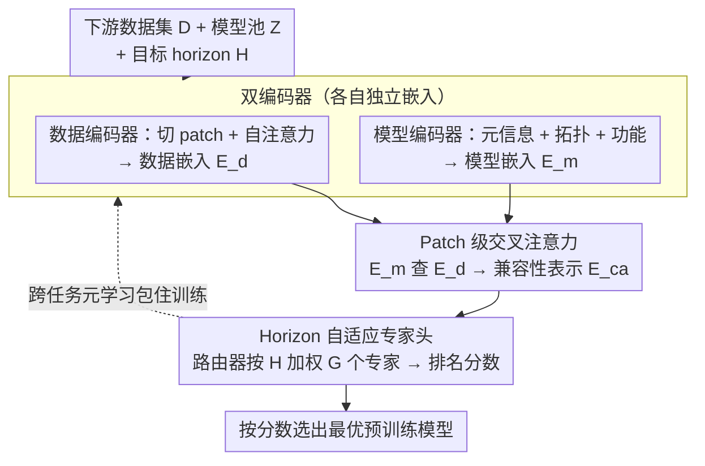

# SwiftTS: A Swift Selection Framework for Time Series Pre-trained Models via Multi-task Meta-Learning

**会议**: ICLR 2026  
**arXiv**: [2510.23051](https://arxiv.org/abs/2510.23051)  
**代码**: [GitHub](https://github.com/decisionintelligence/SwiftTS)  
**领域**: 时间序列/模型选择  
**关键词**: 预训练模型选择, 双编码器, 元学习, 时间序列预测, horizon自适应

## 一句话总结

提出首个时间序列预训练模型选择框架SwiftTS，使用双编码器架构独立嵌入数据集patch级时序特征和模型元信息（架构/拓扑/功能），通过patch级交叉注意力计算兼容性分数，结合horizon自适应专家组合和跨域/跨horizon元学习，在14个数据集×8个模型上以平均加权Kendall $\tau_\omega = 0.442$ 大幅超越所有基线。

## 研究背景与动机

**领域现状**：时间序列基础模型（TimesFM、MOIRAI、Chronos等）大量涌现，分为encoder-only、decoder-only和encoder-decoder三大类。但没有一个模型在所有任务上最优——给定新数据集，选哪个模型最好？逐个微调代价高昂（在Traffic数据集上达 $3.46 \times 10^6$ 秒）。

**现有痛点**：
- 现有模型选择方法（RankME、LogME、LEEP等）主要为CV设计→不考虑时序依赖和序列模式
- 特征分析方法需要对每个候选模型做前向传播提取特征→计算开销随模型池增长而线性增长
- 时间序列预训练模型架构和训练范式高度异构→无法用统一的特征提取器
- 同一模型在不同预测horizon上性能可能显著不同→现有方法忽略horizon维度

**核心矛盾**：模型选择需要理解"这个数据集和这个模型是否匹配"，但(1)不同模型没有可比较的特征表示，(2)匹配关系随预测horizon变化。

**本文目标**：如何在不运行任何候选模型的前提下，高效地为新数据集×新horizon选择最优预训练模型？

**切入角度**：从历史（数据集×模型×horizon）性能三元组中学习匹配模式→学习导向而非特征分析→用独立编码器各自表示数据和模型→通过注意力机制匹配。

**核心 idea**：用meta-learning将模型选择问题转化为"学会在数据和模型嵌入之间找匹配"的问题。

## 方法详解

### 整体框架

SwiftTS 把"选模型"重新表述成一个在历史性能上做监督的匹配问题：在 meta 数据集 $\mathcal{D}_{\text{meta}} = \{D^i, Z, H^i, \boldsymbol{r}^i\}_{i=1}^N$ 上训练一个评分函数 $\hat{r}_k = f(\phi_k, D, H)$，输入下游数据集 $D$、模型池 $Z$ 中的候选 $\phi_k$ 和目标 horizon（预测步长）$H$，输出该组合的预期排名分数。整条流水线分四步走：先用一个**数据编码器**和一个**模型编码器**各自把数据与候选模型嵌到同一空间——关键在于两者互不依赖，候选模型从不需要在目标数据上跑前向；再用一层 **patch 级交叉注意力**算两者的细粒度兼容性；最后过一个 **horizon 自适应专家头**按目标 horizon 输出排名分数，而整个训练被一层**跨任务元学习**包住以保证对新数据集、新 horizon 的泛化。推理时按分数选出最优模型，全程不运行任何候选模型。

### 关键设计

**1. 双编码器：让数据和模型各自独立成像，绕开前向传播开销**

既有特征分析方法的根本瓶颈在于——要判断模型是否适配数据，就得让每个候选模型对目标数据跑一遍前向，开销随模型池线性增长。SwiftTS 改成数据和模型各自独立编码、互不依赖。数据侧把时间序列 $X \in \mathbb{R}^{L \times C}$ 切成 $P = \lfloor L/S \rfloor$ 个 patch，线性投影到 $d$ 维并加位置编码，再用自注意力捕获长程依赖：

$$E_{\text{sa}} = \text{softmax}\!\left(\frac{E_{\text{inp}} W_Q^{sa} (E_{\text{inp}} W_K^{sa})^T}{\sqrt{d_k}}\right) E_{\text{inp}} W_V^{sa}$$

对大数据集重复采样 $B$ 条序列再聚合，得到紧凑的数据嵌入 $E_d \in \mathbb{R}^{P \times d}$。模型侧则融合三类知识来刻画候选 $\phi_k$：元信息嵌入 $\boldsymbol{v}_a^k$ 编码架构类型（encoder-only / decoder-only / encoder-decoder）、参数量、GMACs、隐藏维度与预训练领域这些"描述性"属性；拓扑嵌入 $\boldsymbol{v}_t^k$ 把模型结构画成有向无环图（DAG），用 graph2vec 取无监督图嵌入；功能嵌入 $\boldsymbol{v}_c^k$ 则做"黑盒探测"——喂固定的高斯噪声 $\epsilon \sim \mathcal{N}(0, I)$ 记录输出 $\boldsymbol{v}_c^k = \phi_k(\epsilon)$，不同模型实现不同函数因而输出可区分，即便不知内部结构也能把它们拉开。三者拼接后投影成模型嵌入 $\boldsymbol{E}_m = \sigma([\boldsymbol{v}_a, \boldsymbol{v}_t, \boldsymbol{v}_c] W_m^T)$。这样一来，候选模型从不"看过"目标数据，昂贵的逐模型前向被一次性的离线嵌入取代。

**2. Patch 级交叉注意力：算细粒度兼容性而非全局相似度**

模型与数据嵌入已在同一空间，但简单点积只能给出全局相似度，丢掉了"模型擅长数据中哪一段时序模式"的信息。SwiftTS 让模型嵌入 $E_m$ 作 query、数据嵌入 $E_d$ 作 key/value 做交叉注意力：

$$E_{\text{ca}} = \text{softmax}\!\left(\frac{E_m W_Q^{ca} (E_d W_K^{ca})^T}{\sqrt{d_k}}\right) E_d W_V^{ca}$$

使每个模型聚焦于和自身特征最匹配的 patch 区域，得到 patch 级而非整体的兼容性表示。训练目标兼顾排名与精度：$\mathcal{L}_{\text{total}} = -\sum_{k=1}^K p_k(\hat{\boldsymbol{r}}) \log q_k(\boldsymbol{r}) + \lambda \cdot \sum_{k=1}^K \|\boldsymbol{r}_k - \hat{\boldsymbol{r}}_k\|_2^2$，前一项是把预测分布对齐真实排名的 ranking loss，后一项是回归性能数值的 prediction loss，权重 $\lambda$ 平衡两者——既要选对顺序，也要让预测分数本身可信。

**3. Horizon 自适应专家 + 跨任务元学习：吃掉 horizon 维度和 OOD 泛化**

同一个模型在 $H=96$ 和 $H=720$ 上的相对优劣可能完全反转，固定的评分头无法兼顾。SwiftTS 用一个轻量路由器按目标 horizon 动态加权 $G$ 个专家：$\boldsymbol{w} = \text{softmax}(\text{Router}(H; \theta_s))$，$\hat{\boldsymbol{r}} = \sum_{g=1}^G w_g \cdot \text{MLP}_g(E_{\text{ca}})$，不同 horizon 激活不同专家组合，一套框架覆盖多 horizon 而无需重训。在此之上套一层 MAML 式元学习来增强对未见数据集/horizon 的泛化：内循环在 support set 上快速适应 $\theta_i' = \theta - \alpha \nabla_\theta \mathcal{L}_{\text{supp}}(\mathcal{T}_i; \theta)$，外循环在 query set 上更新元参数 $\theta \leftarrow \theta - \gamma \nabla_\theta \sum_{\mathcal{T}_i} \mathcal{L}_{\text{query}}(\mathcal{T}_i; \theta_i')$。关键在两种任务采样：跨数据集采样让 support 与 query 来自不同数据集，逼模型学域间通用的匹配模式；跨 horizon 采样让两者用不同 horizon，强化 horizon 级的快速适配。模型选择本就是"learning-to-learn"，这层元学习也因此与问题天然契合。

## 实验关键数据

### 主实验：14数据集×4 horizons的加权Kendall $\tau_\omega$ 平均

| 方法 | H=96 | H=192 | H=336 | H=720 | 平均 | Top-1次数 |
|------|:---:|:---:|:---:|:---:|:---:|:---:|
| RankME | 0.008 | -0.046 | -0.201 | -0.238 | -0.119 | 0 |
| LogME | 0.020 | -0.027 | -0.066 | -0.090 | -0.041 | 3 |
| Etran | 0.318 | 0.212 | -0.004 | 0.073 | 0.150 | 8 |
| DISCO | 0.003 | 0.023 | 0.066 | 0.040 | 0.033 | 4 |
| Model Spider | 0.319 | 0.301 | 0.294 | 0.271 | 0.296 | 6 |
| zero-shot | 0.031 | 0.104 | 0.114 | 0.251 | 0.125 | 5 |
| **SwiftTS** | **0.470** | **0.453** | **0.411** | **0.432** | **0.442** | **28** |

### Top-k选择概率和整体排名相关性

| 方法 | Pr(top-1) | Pr(top-2) | Pr(top-3) | $\tau_\omega$ |
|------|:---:|:---:|:---:|:---:|
| RankME | 0.000 | 0.000 | 0.196 | -0.119 |
| Model Spider | 0.304 | 0.482 | 0.571 | 0.296 |
| **SwiftTS** | **0.339** | **0.500** | **0.607** | **0.442** |

### 模型嵌入消融

| $\boldsymbol{v}_a$ | $\boldsymbol{v}_t$ | $\boldsymbol{v}_c$ | H=96 | H=192 | H=336 | H=720 | 平均 |
|:---:|:---:|:---:|:---:|:---:|:---:|:---:|:---:|
| ✓ | | | 0.341 | 0.283 | 0.331 | 0.401 | 0.339 |
| | | ✓ | 0.365 | 0.401 | 0.317 | 0.397 | 0.370 |
| ✓ | ✓ | | 0.361 | 0.383 | 0.315 | 0.417 | 0.369 |
| **✓** | **✓** | **✓** | **0.470** | **0.453** | **0.411** | **0.432** | **0.442** |

### 关键发现

- SwiftTS平均 $\tau_\omega = 0.442$→比第二名Model Spider（0.296）高49%→跨数据集和horizon泛化显著更强
- SwiftTS赢得28/56个Top-1→其余方法最多6-8个→选择准确率全面领先
- 效率：在ETTh1上模型选择仅需~1000-4000秒 vs 全部微调 $4.97 \times 10^4$ 秒→10-50x加速
- 功能嵌入 $\boldsymbol{v}_c$（$\tau_\omega = 0.370$）贡献最大，元信息 $\boldsymbol{v}_a$（$0.339$）次之→模型的"行为"比"描述"更有信息量
- 跨任务元学习使所有horizon上 $\tau_\omega$ 均匀提升→OOD鲁棒性的源泉
- 特征分析方法（RankME/LogME）在时序模型上经常产生负相关→这些CV方法不适用于异构TS模型

## 亮点与洞察

- **"首个TS模型选择方法"**：CV的模型选择研究了多年，但TS领域空白→SwiftTS填补了这一空白，问题定义本身即贡献
- **双编码器的对称美学**：数据和模型各自独立嵌入→通过注意力匹配→不需要让候选模型"看过"目标数据→避免了特征分析的根本开销
- **功能嵌入的"黑盒探测"**：喂高斯噪声给模型看输出→不同模型产生不同输出→无需知道内部结构即可区分→简洁优雅
- **元学习的自然适配**：模型选择本身就是"learning-to-learn"问题→MAML范式下跨数据集/跨horizon采样自然地提升泛化

## 局限与展望

- 模型池仅8个预训练模型→随着TS基础模型爆发式增长，可扩展性待验证
- 功能嵌入需要对每个候选模型做一次前向（虽然只用高斯噪声）→不完全"零成本"
- 仅限时间序列预测任务→分类、异常检测等其他TS任务未涉及
- 训练meta数据集需要预先收集所有模型在所有数据集上的微调性能→这一冷启动成本高

## 相关工作与启发

- **vs Model Spider (Zhang et al., 2023)**：同为学习导向方法→但不考虑时序特性和horizon维度→在TS上 $\tau_\omega$ 仅0.296 vs SwiftTS的0.442
- **vs LogME/RankME（特征分析）**：在异构TS模型上产生负相关→被SwiftTS识别为不适用于TS领域的方法
- **vs TSFM-Bench (Li et al., 2025)**：提供了ground-truth微调性能→SwiftTS利用这些数据训练→两者互补
- **启发**：可否将SwiftTS扩展为"TS模型推荐系统"→结合自动数据增强和在线学习→在部署中持续更新选择策略？

## 评分

⭐⭐⭐⭐ (4/5)

综合评价：首个TS预训练模型选择框架，双编码器+patch交叉注意力+horizon专家+元学习的组合设计完备，14数据集×8模型的广泛实验充分——但模型池规模较小且不完全零成本，虽然技术设计扎实但突破性创新在方法论层面而非理论层面。

<!-- RELATED:START -->

## 相关论文

- [\[ICLR 2026\] TSPulse: Tiny Pre-Trained Models with Disentangled Representations for Rapid Time Series](tspulse_tiny_pre-trained_models_with_disentangled_representations_for_rapid_time.md)
- [\[ICLR 2026\] TSRating: Rating Quality of Diverse Time Series Data by Meta-learning from LLM Judgment](tsrating_time_series_quality_llm.md)
- [\[ICLR 2026\] Rating Quality of Diverse Time Series Data by Meta-learning from LLM Judgment](rating_quality_of_diverse_time_series_data_by_meta-learning_from_llm_judgment.md)
- [\[ICLR 2026\] Learning Recursive Multi-Scale Representations for Irregular Multivariate Time Series Forecasting](learning_recursive_multi-scale_representations_for_irregular_multivariate_time_s.md)
- [\[ICLR 2026\] FeDaL: Federated Dataset Learning for General Time Series Foundation Models](fedal_federated_dataset_learning_for_general_time_series_foundation_models.md)

<!-- RELATED:END -->
