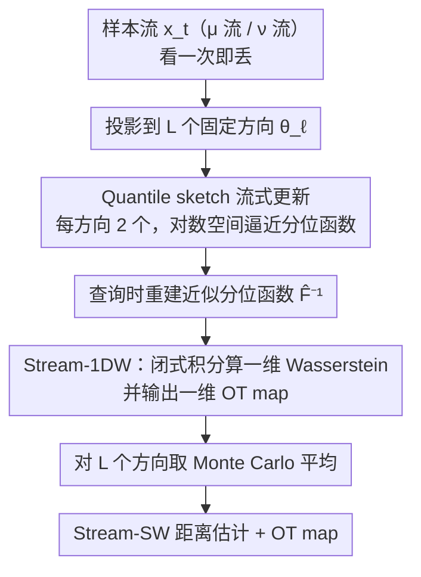

# Streaming Sliced Optimal Transport

**会议**: ICML 2026  
**arXiv**: [2505.06835](https://arxiv.org/abs/2505.06835)  
**代码**: https://github.com/khainb/StreamSW  
**领域**: 最优传输 / Sliced Wasserstein / 流式算法 / 点云 / 3D 视觉  
**关键词**: Streaming OT、Quantile Sketch、Stream-SW、单次扫描、低内存

## 一句话总结
Stream-SW 是首个能在"样本流"上估计 sliced Wasserstein 距离的算法：每个一维投影上用 KLL/quantile sketch 维护近似分位函数，把 1D Wasserstein 的闭式积分变成可流式更新的估计量，空间复杂度对样本数仅对数级，从而把 SOT 带入 IoT / 边缘设备等"看一次就丢掉"的场景。

## 研究背景与动机

**领域现状**：Wasserstein 距离虽广泛用于 GAN、autoencoder、流匹配、贝叶斯推断、点云分析，但其计算复杂度 $\mathcal{O}(n^3\log n)$ 和样本复杂度 $\mathcal{O}(n^{-1/d})$ 让它在高维 + 大规模下不可行。Sliced Wasserstein (SW) 通过取一维 Radon 投影把复杂度降到 $\mathcal{O}(n\log n)$、样本复杂度提升到 $\mathcal{O}(n^{-1/2})$，绕开维度灾难。

**现有痛点**：所有现有 SW 估计都是**离线**的——需要把两组样本全部存进内存才能排序、求分位函数。IoT、传感器流、在线学习场景中样本是"看一次就丢"，内存非常紧张。Online Sinkhorn（Mensch & Peyré 2020）尝试在线化 entropic OT，但时间 $\mathcal{O}(n^2)$、空间 $\mathcal{O}(n)$ 因为要保留历史样本，实际不可用；Compressed Online Sinkhorn 用 Gaussian quadrature 压缩，又陷入超立方复杂度且压缩率 $\mathcal{O}(m^{-1/d})$ 与维度耦合。

**核心矛盾**：SW 的低成本来自一维闭式分位函数 $F^{-1}_\mu(q)$，而分位函数本身需要"全部样本"才能算精确——这就把"流式可估计"和"利用闭式解"对立起来了。

**本文目标**：(i) 给一维 Wasserstein (1DW) 构造一个能在样本流上单次更新的近似估计；(ii) 把这种 1D 流式估计套到所有投影方向得到 Stream-SW；(iii) 给出可证明的概率近似误差界 + 复杂度分析；(iv) 在仿真、点云分类、点云梯度流、流式变点检测上验证下游性能。

**切入角度**：分布比较的"流式化"在数据库领域早有现成工具——quantile sketch（KLL、t-digest 等）。作者发现 1DW 的闭式表达 $W_p^p(\mu,\nu)=\int_0^1|F^{-1}_\mu(q)-F^{-1}_\nu(q)|^p dq$ 完全由分位函数决定，于是把"流式分位逼近"和"sliced OT"两条独立文献桥接起来。

**核心 idea**：用 quantile sketch 这一数据结构作为 CDF / 分位函数的流式估计器，把它接到 Monte Carlo 投影循环的每一个方向，得到第一个 SW 的流式估计器，并保留对样本数 $n$ 的对数级空间复杂度。

## 方法详解

### 整体框架

Stream-SW 要解决的事很具体：在样本"看一次就丢"的流式场景里估出两个分布的 sliced Wasserstein 距离，而内存不能随流长 $n$ 线性膨胀。它的总体思路是把离线 SW 的两层结构原封不动搬过来——外层是 $L$ 个一维 Radon 投影的 Monte Carlo 平均，内层是每个投影方向上的一维 Wasserstein——只在最内层动手术：把"存全部样本再排序求分位函数"换成"用一个对数空间的 quantile sketch 边流边逼近分位函数"。

具体走一遍 pipeline：算法启动时一次性采好投影方向 $\theta_1,\dots,\theta_L\sim U(\mathbb{S}^{d-1})$，并为每个方向各开两个 quantile sketch（一个吃 $\mu$ 流、一个吃 $\nu$ 流）。每当一个样本 $x_t\sim\mu$（$x_t\in\mathbb{R}^d$）到达，就把它向全部 $L$ 个方向投影，把标量 $\theta_\ell^\top x_t$ 推进对应的 sketch $\mathcal{Q}^\mu_\ell$ 后立刻丢弃原样本；$\nu$ 流同理。任意时间步想查询距离时，从每对 sketch 重建近似分位函数 $\widehat F^{-1}_{\theta_\ell\sharp\mu},\widehat F^{-1}_{\theta_\ell\sharp\nu}$，在该方向上算一维 Wasserstein，最后对 $L$ 个方向取平均得到 $\widehat{\mathrm{SW}}_p^p(\mu,\nu)$。

### 关键设计

**1. Quantile sketch 当 CDF / 分位函数的流式估计器：让"近似分位"取代"全量排序"**

整个方法成立的支点是一个观察：一维 Wasserstein 的闭式表达只依赖分位函数，所以根本不需要保存全部排序结果，有一个足够准的近似分位函数就够了——这正好是数据库流处理领域 quantile sketch 几十年来在做的事。作者以 KLL sketch（Karnin–Lang–Liberty）为代表：它内部维护多层样本缓冲区，每层缓冲满了就做一次 "compacting"，用确定性加随机化采样把样本数减半、同时把保留样本的权重翻倍，于是整个 sketch 的大小对流长 $n$ 只以对数级增长，却仍保持有界的相对秩误差。查询时基于这些"加权样本"重建经验 CDF $\widehat F_\mu$ 及其逆 $\widehat F^{-1}_\mu$。关键是它给出一个均匀概率界 $\Pr[\sup_q |\widehat F^{-1}_\mu(q)-F^{-1}_\mu(q)|>\delta]\le\eta$，这条界是后面所有误差分析的底层砖块。把这一成熟工具原生接进 OT 框架，还顺带继承了 t-digest、GK sketch 等一系列工程化的 trade-off 选择。

**2. Stream-1DW：把一维 Wasserstein 的闭式积分改写成 sketch 上的流式估计，并连 OT map 一起给出**

有了流式分位函数，一维 Wasserstein 就能整段重写。它的闭式表达是

$$W_p^p(\mu,\nu)=\int_0^1\big|F^{-1}_\mu(q)-F^{-1}_\nu(q)\big|^p\,dq,$$

作者把真实分位函数换成 sketch 重建的 $\widehat F^{-1}_\mu,\widehat F^{-1}_\nu$，再在 $[0,1]$ 上做数值积分——实际操作就是在两个 sketch 的所有分位断点处做分段求和，等价于 northwest corner 算法。借助上面那条均匀分位误差界，可以证明 $|\widehat W_p-W_p|$ 以至少 $1-\eta$ 的概率被一个与 $\delta$ 线性相关的项控制住。这一步还刻意多输出一样东西：一维 OT map 的流式估计 $\widehat F^{-1}_\nu\circ\widehat F_\mu$，并给出它的逐点误差界。之所以保留 map 而不止步于距离标量，是因为点云梯度流这类下游任务需要的是"往哪个方向搬"的传输映射，只有距离是不够的；先把这层 1D 估计的理论钉死，多维 SW 的误差才能顺着 Monte Carlo 期望一路推上去。

**3. Stream-SW：把流式 1DW 套到 $L$ 个投影上，换来对 $n$ 的对数空间**

最外层几乎是离线 SW 的原样复刻，只是每条一维通道都换成了 Stream-1DW。启动时采定 $\theta_1,\dots,\theta_L$，每个新样本向全部方向投影并塞进各自 sketch，查询时直接做 Monte Carlo 平均

$$\widehat{\mathrm{SW}}_p^p=\frac{1}{L}\sum_{\ell=1}^{L}\widehat W_p^p(\theta_\ell\sharp\mu,\theta_\ell\sharp\nu).$$

代价方面，空间是 $\mathcal{O}(L\cdot s\log n)$（$s$ 为初始 sketch 大小），每个样本的处理时间约 $\mathcal{O}(L\cdot\log n)$；总误差界则由"每条 1D 通道的 sketch 误差"和"$L$ 个方向的 MC 误差"两部分叠加而成。这种设计刻意只动最内层，保住了 SW 本来就有的两大可扩展性来源——投影并行与一维闭式解，对架构改动最小、最易落地。而真正的卖点在于空间对 $n$ 只是 $\log n$：随机子采样 baseline 要在大 $n$ 上达到同样误差，得存下远多于 sketch 的样本，这正是 Stream-SW 在长流、紧内存场景下的核心优势。

### 损失函数 / 训练策略

本文是纯算法估计，不涉及训练。所有可调"参数"都是结构层面的：sketch 大小 $s$、投影数 $L$、误差容忍 $\epsilon,\delta,\eta$，论文给出三者之间的解析 trade-off 来指导取值。

## 实验关键数据

### 主实验

| 任务 | 评估指标 | Stream-SW vs 随机子采样 (相同内存) | 优势 |
|---|---|---|---|
| 高斯 / 高斯混合距离估计 | $|$估计-真实$|$ | 显著更小 | 内存相同时近似误差更低 |
| 高斯 / GMM 估计 | 内存占用 | 同精度下内存更小 | sketch 对数级 vs 子采样线性级 |
| 点云 KNN 分类（streaming） | top-1 acc | 更高 | sketch 保留分布尾部信息 |
| 点云梯度流 | 流终态 Wasserstein 误差 | 更低 | OT map 估计更稳定 |
| Kinect 流式变点检测 | F1 | 更高 | 流式更新对突变响应快 |

### 消融实验

| 配置 | 关键变化 | 结论 |
|---|---|---|
| 增大 sketch 初始大小 $s$ | 误差下降 | 单调改进，呈现 $\mathcal{O}(s^{-1})$ 趋势 |
| 投影数 $L$ ↑ | 误差下降 + 时间成本 ↑ | 满足 $\mathcal{O}(L^{-1/2})$ 的 MC 收敛 |
| 流长度 $n$ ↑ | 空间几乎不变（对数） | 验证 $\log n$ 空间界 |
| 与 Compressed Online Sinkhorn | 同精度下时间更快 | 避开 Gaussian quadrature 的超立方代价 |
| 维度 $d$ ↑ | Stream-SW 误差稳定 | 不受维度灾难影响（SW 性质继承） |

### 关键发现
- 内存预算固定时，sketch 几乎总比随机子采样精确——尤其是分布尾部、长流场景，子采样会因为"忘掉"早期样本而失真。
- OT map 的流式估计让 Stream-SW 能直接驱动点云梯度流：在线收到点的同时不断更新驱动力，目标分布逼近精度显著优于"先存一批再算 SW"的离线策略。
- 对维度 $d$ 不敏感（与离线 SW 同样保持 $\mathcal{O}(n^{-1/2})$ 样本复杂度），这是相对 Online Sinkhorn 的关键优势。

## 亮点与洞察
- **"闭式 1D 公式 + 流式分位估计" 的桥接极其干净**——sliced OT 文献和数据库 sketch 文献几乎没有交集，本文是把两边各自最成熟工具一对一对接，方法虽朴素却是首次给出 SW 流式版本，研究 leverage 极高。
- **保留 OT map 估计而非只给距离**：很多论文止步于"算个标量距离"，这里把 map 拿出来意味着 Stream-SW 立刻能驱动所有需要梯度的 OT 应用（流匹配、点云变形、生成训练）。
- **概率误差界 + 空间对数复杂度** 的组合让它对边缘 / IoT 场景特别有吸引力——理论可控、内存可预算。
- 实验涵盖"理论 sanity check (高斯)、点云分类、梯度流、变点检测"四类异构任务，证明流式版 SW 是 drop-in 替换。

## 局限与展望
- Sketch 误差界依赖样本独立同分布假设，在真实流（有时序相关、漂移）下需要更细的分析。
- 投影方向 $\theta_1,\dots,\theta_L$ 在启动时固定，长流可能错过对当前分布最有判别力的方向——可结合 max-sliced / adaptive projection 做"流式方向选择"。
- 仅证明经典 SW 的流式化；Generalized SW / Spherical SW / Hilbert SW 等变体的流式化需要不同 sketch 设计。
- 实验未给出与 Compressed Online Sinkhorn 在百万级流上的端到端 wall clock 对比，工程落地证据可再强化。

## 相关工作与启发
- **vs Online Sinkhorn (Mensch & Peyré 2020)**：他们在线化 entropic OT，但空间线性 + 时间二次，本文用 SW 路线把空间压到对数级。
- **vs Compressed Online Sinkhorn (Wang 2023)**：他们用 Gaussian quadrature 压缩样本，复杂度仍受维度灾难，Stream-SW 借助 SW 的维度独立性绕开。
- **vs 标准 SW / Generalized SW**：方法层只改"1D 估计如何做"，可作为这些变体的统一流式底座。
- **vs Quantile sketch 文献 (KLL, t-digest, GK)**：把它们从数据库 OLAP 引入到机器学习 OT，开辟新应用方向。

## 评分
- 新颖性: ⭐⭐⭐⭐ 首个 SW 流式估计器，把两条独立文献桥接干净
- 实验充分度: ⭐⭐⭐⭐ 仿真 + 三个下游任务覆盖足够，工程对比可再深入
- 写作质量: ⭐⭐⭐⭐ 理论叙述清晰，从 1DW 误差界一路推到 Stream-SW 复杂度
- 价值: ⭐⭐⭐⭐ 对流式 / IoT / 在线分布比较场景具有 drop-in 替换价值

<!-- RELATED:START -->

## 相关论文

- [\[ICML 2026\] AvAtar: Learning to Align via Active Optimal Transport](avatar_learning_to_align_via_active_optimal_transport.md)
- [\[ICML 2026\] Convex Distance Operator Transport: A Convex and Geometry-Preserving Formulation](convex_distance_operator_transport_a_convex_and_geometry-preserving_formulation.md)
- [\[ICLR 2026\] SceneTransporter: Optimal Transport-Guided Compositional Latent Diffusion for Single-Image Structured 3D Scene Generation](../../ICLR2026/3d_vision/scenetransporter_optimal_transport-guided_compositional_latent_diffusion_for_sin.md)
- [\[CVPR 2025\] NoPain: No-box Point Cloud Attack via Optimal Transport Singular Boundary](../../CVPR2025/3d_vision/nopain_no-box_point_cloud_attack_via_optimal_transport_singular_boundary.md)
- [\[ICLR 2026\] Fast Estimation of Wasserstein Distances via Regression on Sliced Wasserstein Distances](../../ICLR2026/3d_vision/fast_estimation_of_wasserstein_distances_via_regression_on_sliced_wasserstein_di.md)

<!-- RELATED:END -->
