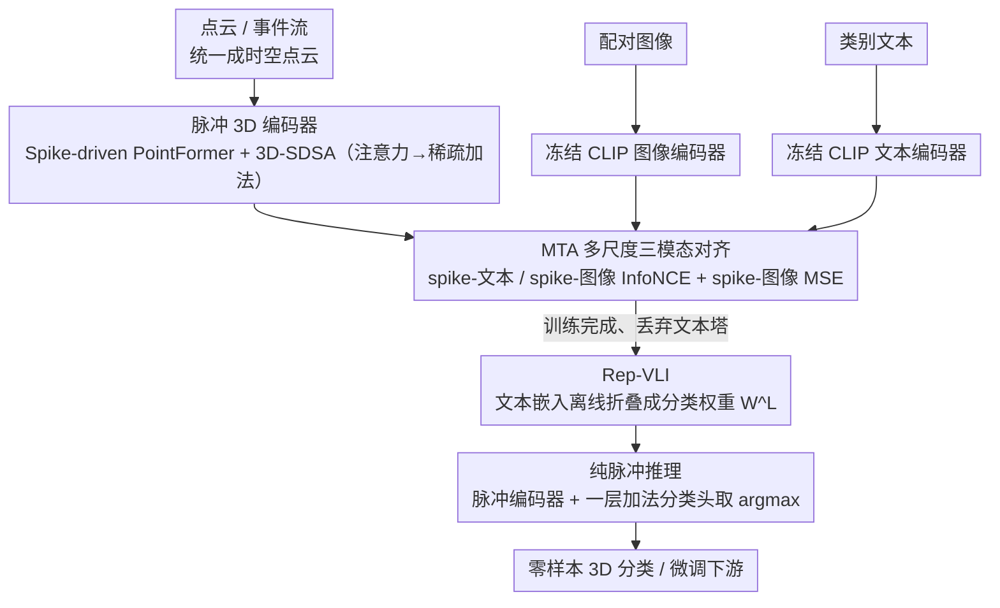

# SVL: Spike-based Vision-Language Pretraining for Efficient 3D Open-World Understanding

**会议**: ICML 2026  
**arXiv**: [2505.17674](https://arxiv.org/abs/2505.17674)  
**代码**: 有（论文中标注 "Code is available at SVL"）  
**领域**: 3D视觉 / 多模态VLM / 脉冲神经网络  
**关键词**: 脉冲神经网络, 3D开放世界理解, 视觉-语言预训练, 三模态对齐, 神经形态硬件

## 一句话总结
SVL 用「3D-图像-文本」三模态对比预训练给脉冲神经网络（SNN）注入开放世界理解能力，并通过把文本编码器"重参数化"为一组分类权重，让推理阶段完全脱离文本塔、保持纯脉冲驱动，在 ModelNet40 零样本分类上达到 85.4% 同时能耗仅为同档 ANN 方法的 0.5%–11%。

## 研究背景与动机

**领域现状**：SNN 因事件驱动 + 稀疏加法的特性，被认为是 3D 时空感知（点云、事件流）天然契合的低功耗替代方案，神经形态芯片如 Speck 的功耗可低至 0.7 mW。但与 ANN 相比，SNN 还停留在"为某个任务单独训一个小模型"的阶段。

**现有痛点**：现有 SNN 预训练路线均有明显缺陷——STDP 初始化随网络/数据复杂度提升迅速失效；SpikeBert/SpikeCLIP 之类的知识蒸馏依赖 ANN 权重初始化、用了 LayerNorm 因而不友好神经形态硬件；SpikformerV2 / Spike-driven Transformer V3 用 masked image modeling 提升规模性，却既费算力又缺多模态接口；而经典 3D VLM（OpenShape、ULIP 系列）虽能做开放世界 3D 分类，但推理时必须挂一个大文本编码器（数十到数百 M 参数），完全抵消了 SNN 在边缘部署上的功耗优势。

**核心矛盾**：SNN 的"低功耗 + 稀疏加法"性质和经典三编码器 VLM 的"大文本塔 + 密集矩阵乘"在推理路径上根本冲突。要么牺牲多模态能力换效率，要么牺牲效率换零样本能力，二者难以兼得。

**本文目标**：(i) 设计一个能"无标注地"对齐 3D-图像-文本三模态、并保持纯脉冲驱动的预训练框架；(ii) 让推理阶段完全摆脱文本编码器；(iii) 为该框架配套一个真正"全脉冲化"的点云 Transformer 骨干。

**切入角度**：CLIP 已经把"图像 ↔ 文本"对齐好了，因此只需要把脉冲 3D 编码器分别对齐到 CLIP 的图像空间（细粒度）和文本空间（语义级）即可借力；而文本编码器在零样本任务里本质上只对一组固定的类别提示语反复求嵌入，这意味着可以把它离线"折叠"成一层 $K \times C$ 的线性分类头权重，部署时丢掉文本塔。

**核心 idea**：用三元对比损失把脉冲 3D 特征对齐到冻结 CLIP 的图像与文本空间（MTA），再把文本嵌入重参数化为一层分类权重（Rep-VLI），辅以全脉冲点云 Transformer（Spike-driven PointFormer），实现"训练时多模态、推理时纯脉冲"。

## 方法详解

### 整体框架
SVL 要解决的是一个看似矛盾的需求：既要让脉冲网络（SNN）具备 CLIP 那样的开放世界识别能力，又不能在推理时背上沉重的文本塔、破坏 SNN 的稀疏加法特性。它的破局思路是把"获取语义"和"做推理"两件事拆到训练期和部署期。训练期走三塔：先把点云和事件流统一成点集 $D^t=\{\mathcal{P}, \mathcal{F}\}$（事件流用滑窗把时间戳归一化成 z 坐标 $z_i = (t_i - t_{\min})/(t_{\max}-t_{\min})$，变成"时空点云"），然后对每个样本构造三元组 $(D_i^t, I_i^t, T_i^t)$，分别送进脉冲 3D 编码器 $\mathcal{E}_\theta^S$（输出 $\mathcal{F}^S \in \mathbb{R}^{T \times C}$）和全程冻结的 CLIP 图像编码器 $\mathcal{E}_\theta^I$、文本编码器 $\mathcal{E}_\theta^T$（各出 $\mathbb{R}^C$ 特征），靠多模态对齐损失 MTA 把脉冲发放率同时拉进 CLIP 的图像空间和文本空间。部署期则塌缩成单塔：把候选类别提示词离线过一遍文本编码器，固化成一层分类权重 $W^L \in \mathbb{R}^{K \times C}$（Rep-VLI），推理链路只剩"脉冲编码器 + 一层加法分类头"。骨干层面，作者除复用 Spike PointNet、E-3DSNN，还补了一个全脉冲驱动的点 Transformer（Spike-driven PointFormer），把注意力也压成稀疏加法，让整条路径无一处稠密矩阵乘。

### 关键设计

**1. MTA — 多尺度三模态对齐：无标签地把脉冲 3D 特征同时拉进 CLIP 图像空间和文本空间**

痛点在于 SNN 从头训一个 3D 编码器既缺标签又缺语义，而 CLIP 已经把图像-文本对齐好了，那就直接借力——只训脉冲编码器，让它分别向冻结的图像/文本特征对齐。MTA 用了两种粒度互补的损失：把脉冲发放率归一化成 $\mathbf{x}_i = (\mathcal{F}^S/T) / \|\mathcal{F}^S/T\|_2$ 后，与归一化文本特征 $\mathbf{y}_i$ 做对称 InfoNCE 得到"语义级"对齐 $\mathcal{L}^{\text{NCE}}_{(S,T)}$，与归一化图像特征 $\mathbf{b}_i$ 做 InfoNCE 得到"细粒度"对齐 $\mathcal{L}^{\text{NCE}}_{(S,I)}$，再额外加一个脉冲-图像之间的 MSE 损失 $\mathcal{L}^{\text{MSE}}_{(S,I)} = \sum_i \|\mathcal{F}_i^S - \mathcal{F}_i^I\|^2$ 把粒度进一步压实。三项加权求和：

$$\mathcal{L}_{\text{total}} = \lambda_1 \mathcal{L}^{\text{NCE}}_{(S,T)} + \lambda_2 \mathcal{L}^{\text{NCE}}_{(S,I)} + \lambda_3 \mathcal{L}^{\text{MSE}}_{(S,I)}, \quad \lambda_1=\lambda_2=\lambda_3=1$$

之所以三项缺一不可，是因为文本提供"是什么类别"的语义锚点、图像提供"长什么样"的细粒度形状先验，而 InfoNCE 在三元小批量里对齐粒度仍偏粗、靠 MSE 强制脉冲均值逐点贴近图像 embedding 才能补足——消融里只用文本对齐零样本仅 21.9%、只用图像对齐 24.8%、双对齐 + MSE 才到 33.6%（Objaverse-LVIS）。

**2. Rep-VLI — 把文本编码器离线折叠成一层分类权重**

这是全文真正的工程巧思，针对的痛点是：传统三编码器 VLM 部署时文本塔常占总参数 70%+（如 ULIP-2 文本塔 202.5M vs 点编码器 21.9M），既吃显存又是稠密矩阵乘，彻底抵消 SNN 在边缘的功耗优势。关键观察是——零样本任务里文本编码器本质上只对一组固定类别提示语反复求嵌入，那就可以离线算一次、固化成权重。具体把 $K$ 个候选提示词 $\{T_1,\dots,T_K\}$ 过一遍文本编码器得到 $W^L_j = \tau \mathcal{E}_\theta^T(T_j)$，合成一层 $K\times C$ 权重；推理时用"脉冲计数决策"代替 softmax：

$$\text{logits}_{i,j} = \frac{1}{T}\sum_{t=1}^T W^L_j \cdot \mathcal{E}_\theta^S(D_i^t)$$

取 argmax 即预测类别。于是开放世界的语义能力被 CLIP 文本空间"预存"进固定权重里，而效率仍由 SNN 提供，推理时文本塔整个消失，稀疏加法性质得以保全。

**3. Spike-driven PointFormer + 3D-SDSA — 补齐全脉冲化点云 Transformer 的空白**

先前的脉冲点云骨干要么（Spike Point Transformer）混用非脉冲算子、还要按时间步展开点云，浪费能效；要么（Spike PointNet / E-3DSNN）被点级或稀疏卷积的归纳偏置限制了表达力。SVL 想要一个既能承载大规模预训练、又端到端脉冲驱动的 Transformer。流程上先用 FPS+kNN 取局部邻域 $X = \text{KNN}(\text{FPS}(P))$，经加法型 pointwise embedding 加 I-LIF 神经元 $\mathcal{SN}(\cdot)$ 出脉冲特征 $S = \mathcal{SN}(\text{MLP}(X))$，再堆 $L$ 层 SDF 残差块 $f_\ell = \text{SDF}(f_{\ell-1}) + f_{\ell-1}$。核心是 3D-SDSA：把 $Q,K,V$ 各自经 $\mathcal{SN}$ 脉冲化为 0/1 二值矩阵后，注意力按结合律重排成

$$\mathcal{SN}(Q_S(K_S^\top V_S)) = \mathcal{SN}((Q_S K_S^\top) V_S)$$

由于乘子全是二值脉冲张量，所有矩阵乘退化为 address-event 累加，也就是稀疏加法。配合 I-LIF 的整数发放（训练时发整数、推理期展开为二值脉冲），Transformer 的全局建模能力第一次被完整迁进脉冲域。

### 损失函数 / 训练策略
预训练损失即上面 MTA 的三项加权和，$\lambda_1=\lambda_2=\lambda_3=1$；I-LIF 神经元训练时发整数（最大发放幅度由 $D^t$ 控制），推理时展开为二值脉冲；CLIP 图像/文本编码器全程冻结，只训脉冲 3D 编码器；时间步默认取 $T\times D = 1\times 4$（消融见下文），下游 DVS 类任务微调时把 $T$ 放大到 6 以捕捉时序。

## 实验关键数据

### 主实验

ModelNet40 / Objaverse-LVIS 零样本 3D 分类（节选 Tab 1，"Energy"为整条推理链路估计能耗）：

| 类型 | 方法 | 参数 (M, Point+Text) | 能耗 (mJ) | Obj. | M40. |
|------|------|---------------------|-----------|------|------|
| ANN | OpenShape (Sparseconv-L) | 41.3+202.5 | 73.8 | 43.4 | 83.4 |
| ANN | ULIP-2 (Point-BERT) | 21.9+202.5 | 152.3 | 50.6 | 84.7 |
| ANN | ULIP (Point-BERT) | 21.9+227.8 | 161.8 | 34.9 | 69.6 |
| SNN | SpikeCLIP* | 9.5+22.8 | 11.0 | 0.5 | 5.1 |
| SNN | Spike PointNet + SVL | 3.57 | **0.27** | 24.9 | 76.3 |
| SNN | Spike-driven PointFormer-L + SVL | 22.1 | 9.4 | 43.4 | 83.1 |
| SNN | E-3DSNN-L + SVL | 17.7 | 0.64 | 43.9 | 84.6 |
| SNN | E-3DSNN-H + SVL | 46.7 | **0.79** | **47.0** | **85.4** |

关键对比：E-3DSNN-H + SVL 以 85.4% 同时超过 ULIP-2（84.7%）和 OpenShape（83.4%），能耗只有 ULIP-2 的 $\sim$0.5%（0.79 mJ vs 152.3 mJ）；和 OpenShape 比则是 +2.0% 精度、$\sim$11× 能效。

3D 下游任务微调（Tab 3/4 节选，"↑"为相对未加 SVL 同骨干的提升）：

| 骨干 | M40 ↑ | ScanObjectNN ↑ | KITTI AP-E ↑ | SemanticKITTI mIoU ↑ | DVS Action ↑ | DVS Gesture ↑ |
|------|-------|----------------|--------------|---------------------|-------------|---------------|
| Spike PointNet + SVL | +1.9 (90.1) | +6.1 (76.1) | – | +2.1 (15.6) | +2.1 (80.5) | +1.6 (98.5) |
| E-3DSNN-L + SVL | +2.5 (93.7) | +2.8 (83.0) | +1.1 (90.7) | +1.2 (69.7) | – | – |
| Spike-driven PointFormer-L + SVL | +1.8 (93.9) | +1.7 (83.4) | – | – | – | – |

### 消融实验

MTA 损失项（Tab 6，Obj. / M40 零样本精度，骨干 E-3DSNN-S）：

| $\mathcal{L}^{\text{NCE}}_{(S,T)}$ | $\mathcal{L}^{\text{NCE}}_{(S,I)}$ | $\mathcal{L}^{\text{MSE}}_{(S,I)}$ | Obj. | M40 | 说明 |
|:--:|:--:|:--:|------|-----|------|
| ✗ | ✗ | ✗ | 0.5 | 5.1 | 无对齐，等价随机初始化 |
| ✗ | ✓ | ✗ | 24.8 | 73.1 | 只用图像对齐，已有相当效果 |
| ✓ | ✗ | ✗ | 21.9 | 70.1 | 只用文本对齐稍弱 |
| ✓ | ✓ | ✗ | 31.7 | 77.8 | 双对齐叠加 |
| ✓ | ✓ | ✓ | **33.6** | **79.6** | +MSE 进一步精细化 |

时间步 / 发放位数（Tab 7，E-3DSNN-S 骨干）：

| 配置 | Power (mJ) | Obj. | M40 |
|------|-----------|------|-----|
| ANN baseline | 0.13 | 34.1 | 81.3 |
| $T\times D = 1\times 2$ | 0.02 | 32.9 | 78.5 |
| $T\times D = 2\times 1$ | 0.03 | 32.7 | 78.0 |
| $T\times D = 2\times 2$ | 0.08 | 33.9 | 80.5 |
| $T\times D = 1\times 4$ | 0.04 | 33.6 | 79.6 |
| $T\times D = 4\times 1$ | 0.10 | 32.9 | 78.6 |

### 关键发现
- **图像对齐比文本对齐更重要**：在 MTA 消融里去掉 spike-text 对齐 Obj. 从 33.6→24.8（−8.8），而去掉 spike-image 对齐 Obj. 从 33.6→21.9（−11.7），但只用图像对齐已经能跑到 24.8——说明 CLIP 图像空间天然蕴含的形状先验对 3D 表征贡献更大，文本提供的是"类别锚点"而非主要语义。
- **MSE 是粘合剂**：仅 InfoNCE 双对齐能到 31.7，加一项 MSE 再涨 +1.9——表明 InfoNCE 在小批量下粒度仍粗，MSE 强制脉冲均值贴近图像 embedding 是把全局对齐"卡死"到点对点。
- **加发放位数比加时间步更划算**：$T=1, D=4$ 能耗仅 0.04 mJ 且 Obj. 33.6，而 $T=4, D=1$ 能耗翻倍到 0.10 mJ 反而掉到 32.9——把信息压进更"强"的少数脉冲，比把时间轴拉长更省电。
- **Spike-driven PointFormer 上 SVL 增益最小**：因为 PointFormer-L 单独已能 92.1，进一步上 SVL 只 +1.8；而 Spike PointNet 弱基线在 ScanObjectNN 上能涨 +6.1，体现 SVL 对弱骨干的"放大效应"。

## 亮点与洞察
- **"重参数化文本编码器"是这篇真正的工程洞察**：它把开放词汇 VLM 从训练-推理对称的双塔结构变成"训练时三塔、推理时单塔 + 一层线性"。对所有靠 CLIP 文本侧做零样本/开集分类的下游模型都可迁移，尤其适合一切对推理路径有硬件约束的场景（移动端、边缘 IoT、可穿戴医疗）。
- **冻结 CLIP + 只训 3D 编码器**这个策略比从头联合训便宜得多，是 SVL 能在小算力下跑通三模态对齐的关键——把"获取开放世界语义"和"获取 3D 几何"两件事拆开，让一个轻量 SNN 只承担前者的"投影"工作。
- **3D-SDSA 利用 $Q_S K_S^\top$ 都是 0/1 矩阵的特性，把 Transformer 注意力还原为稀疏累加**，这一思路可以原样套到事件相机、SAR 雷达、LiDAR 等所有"输入天然稀疏"的模态上。
- **把事件流当 z 维度归一化的点云**，让事件相机数据和点云共用同一套 backbone，这是简单但极有效的统一表示选择，省掉了为事件流单独设计时序 backbone 的麻烦。

## 局限与展望
- **CLIP 冻结意味着 3D 空间被"绑死"在 2D CLIP 的语义结构上**——CLIP 自身的偏差（如对某些类别识别差、对长尾类不友好）会原样传递到 3D 端，论文未讨论这种偏差的影响。
- **零样本主战场仍是单物体分类**：Obj./M40 都是"洗干净的单 instance"基准，对开放世界更现实的"场景级零样本分割/检测"没给硬数据；Spike PointNet+SVL 在 SemanticKITTI 上仍只有 15.6% mIoU，离实际可用还远。
- **3D 物体描述/QA 段实际是"挂 LLM 跑 LLaVA pipeline"**，能耗只算了脉冲编码器、不含 LLM 主体；如果把 13B Vicuna 计入推理路径，SNN 的能效优势会被稀释，论文未给出端到端能耗。
- **Rep-VLI 假设候选类别集在部署时已知且固定**，对真正"开放词汇"（部署后还会出现新类）场景必须重新做一次文本编码 + 重参数化；未讨论增量更新策略。
- **改进思路**：把 CLIP 也部分微调（轻量 LoRA）以解耦 2D 偏差；把 Rep-VLI 扩展为"分层提示树"以支持增量新类；将 3D-SDSA 与 sparse conv 混合以提升场景级稠密预测能力。

## 相关工作与启发
- **vs OpenShape / ULIP-2**：都用三编码器对齐 3D-图像-文本做开放世界分类，但 OpenShape/ULIP-2 推理时必须挂大文本塔（202M 参数、约 70 mJ 文本侧能耗）；SVL 用 Rep-VLI 离线折叠文本塔，推理只剩 SNN，能效 100×+ 提升，精度持平甚至略胜。
- **vs SpikeCLIP**：同样是脉冲 + CLIP，但 SpikeCLIP 只是把 CLIP 视觉塔蒸馏成 SNN 做 2D 分类（在 Obj. 上仅 0.5%）；SVL 直面 3D 输入并加入显式三模态对齐与全脉冲 Transformer 骨干，跨越式提升到 47% Obj.。
- **vs E-3DSNN**：E-3DSNN 是任务定制的脉冲稀疏卷积 backbone，没有预训练接口；SVL 用 E-3DSNN 当骨干叠加预训练后，ScanObjectNN 涨 2.8%，证明"骨干 + 通用预训练"对 SNN 同样适用。
- **vs Spike Point Transformer (Wu 2025b)**：同期工作但仍混用非脉冲算子、对点云做时间步展开；SVL 的 Spike-driven PointFormer 通过 3D-SDSA 实现真正全脉冲注意力，定位是"该方向第一篇"。

## 评分
- 新颖性: ⭐⭐⭐⭐ 三模态对齐 + 重参数化文本塔 + 全脉冲点云 Transformer 三个组件单看都有人做过类似工作，但合在一起构成首个端到端 SNN 开放世界 3D 框架，组合创新明显。
- 实验充分度: ⭐⭐⭐⭐ 覆盖零样本/微调、分类/分割/检测/动作识别四类下游、三种骨干 × 三种规模，但场景级零样本指标偏弱、LLM-pipeline 能耗未算端到端。
- 写作质量: ⭐⭐⭐⭐ 公式编号严谨、MTA/Rep-VLI/PointFormer 三段层次清楚；不足是失败基线对比不够充分、能耗折算细节藏在附录。
- 价值: ⭐⭐⭐⭐⭐ 真正打通了"开放世界 VLM + 神经形态硬件"两条原本对立的技术栈，Rep-VLI 思路本身可被任何 CLIP-driven 下游模型借用，工业落地潜力大。

<!-- RELATED:START -->

## 相关论文

- [\[CVPR 2026\] LightSplat: Fast and Memory-Efficient Open-Vocabulary 3D Scene Understanding in Five Seconds](../../CVPR2026/3d_vision/lightsplat_fast_and_memory-efficient_open-vocabulary_3d_scene_understanding_in_f.md)
- [\[ECCV 2024\] SceneVerse: Scaling 3D Vision-Language Learning for Grounded Scene Understanding](../../ECCV2024/3d_vision/sceneverse_scaling_3d_vision-language_learning_for_grounded_scene_understanding.md)
- [\[ICCV 2025\] 3D Gaussian Map with Open-Set Semantic Grouping for Vision-Language Navigation](../../ICCV2025/3d_vision/3d_gaussian_map_with_openset_semantic_grouping_for_visionlan.md)
- [\[ICLR 2026\] EgoNight: Towards Egocentric Vision Understanding at Night with a Challenging Benchmark](../../ICLR2026/3d_vision/egonight_towards_egocentric_vision_understanding_at_night_with_a_challenging_ben.md)
- [\[AAAI 2026\] OpenScan: A Benchmark for Generalized Open-Vocabulary 3D Scene Understanding](../../AAAI2026/3d_vision/openscan_a_benchmark_for_generalized_open-vocabulary_3d_scene_understanding.md)

<!-- RELATED:END -->
