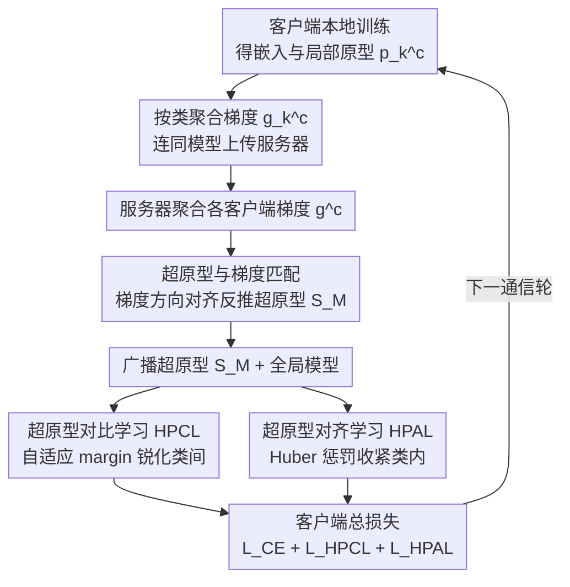

# FedHPro: Federated Hyper-Prototype Learning via Gradient Matching

**会议**: ICML 2026  
**arXiv**: [2605.13475](https://arxiv.org/abs/2605.13475)  
**代码**: https://github.com/mala-lab/FedHPro (有)  
**领域**: 联邦学习 / 隐私保护 / 原型学习  
**关键词**: 联邦学习, 数据异质性, 超原型, 梯度匹配, 对比学习

## 一句话总结
针对原型类联邦学习中"对局部原型直接平均会继承客户端偏差"的问题，本文用一组可学习的全局超原型 (hyper-prototypes)，通过梯度匹配在服务器侧模拟集中式训练得到的原型，再配合客户端对比学习与对齐损失显著提升异质场景下的精度。

## 研究背景与动机

**领域现状**：联邦学习 (FL) 通过共享模型而非数据来联合训练，但 non-IID 是其核心难题。原型类方法 (FedProto、FedTGP、FedSA) 通过传输每类特征均值作为"语义锚点"来对齐不同客户端的表征空间，近年成为缓解异质性的主流路线。

**现有痛点**：现有原型类方法走"先在客户端算 prototype，再在服务器平均"的两步路线，本质上是 *prototype-level* 聚合。这条路线把客户端的偏差直接搬到了全局信号上——在简单域 (MNIST) 上类间区分还算清晰，但在难域 (SVHN/SYN) 上类簇严重重叠，边界样本被错聚类。

**核心矛盾**：理想做法是用所有客户端的真实样本去训练一个统一的表征空间，再算 prototype——可这正是 FL 隐私约束所禁止的。所以全局原型只能"间接地"反映各客户端的偏置数据，无论是平均还是 refine semantic anchor，都跳不出"客户端偏差→全局原型偏差"的循环。

**本文目标**：分解为 (a) 服务器侧如何构造一个"近似集中式训练 prototype"的全局信号；(b) 客户端如何用这个信号同时拉近类内、推远类间。

**切入角度**：作者观察到一个有趣事实——虽然服务器拿不到真实样本，但可以拿到每个客户端上 prototype 相对于真实样本的梯度 $\mathbf{g}_k^c$。如果在服务器上初始化一组可学习向量，让它们在虚拟分类损失下产生的梯度方向去匹配 $\mathbf{g}_k^c$，那么这组向量就在沿着"如果有真实样本会走的优化轨迹"前进，间接吸收了真实数据的语义。

**核心 idea**：把全局原型从"统计平均"换成"梯度匹配学到的超原型"，并用它驱动 inter-class 对比 + intra-class 对齐两个互补目标。

## 方法详解

### 整体框架
FedHPro 想解决的是"全局原型继承客户端偏差"这个死循环：既然不能传原始样本去训出一份干净的集中式原型，那就退而求其次，让服务器用可学习的超原型去"逼近"集中式原型该有的样子。具体做法是在标准 FedAvg 之外让客户端多上传一份按类聚合的梯度，服务器据此通过梯度匹配反复打磨一组超原型张量，再把它连同全局模型一起广播下去，供客户端构造对比与对齐两个额外目标。整个流程是一个通信轮内的"客户端→服务器→客户端"回环。

### 关键设计

**1. 超原型与梯度匹配：用梯度当"看不见的样本"的代理**

直接平均局部原型必然把客户端的统计偏差搬到全局信号上，难域 (SVHN/SYN) 上类簇因此严重重叠。本文换了个思路：虽然服务器拿不到真实样本，却能拿到每个类 $c$ 在每客户端 $k$ 上 prototype 相对真实样本的梯度 $\mathbf{g}_k^c = \tfrac{1}{n_k^c}\sum \nabla_{z_i}\mathcal{L}_k(x_i,y_i)$，聚合后得到 $\mathbf{g}^c$。服务器为每类初始化一组可学习向量 $\{\mathbf{s}_i^c\}_{i=1}^{|\mathcal{I}|}$，在一个虚拟交叉熵损失 $\mathcal{L}_{vir}$ 下算出它们自己的梯度 $\mathbf{g}_{HP}^c$，然后最小化 $\mathcal{L}_{GM}=1-\cos(\mathbf{g}^c,\mathbf{g}_{HP}^c)$，让超原型沿着"真实样本本会推动 prototype 走的方向"演化。这相当于把 prototype-level 的统计平均替换成 sample-level 的梯度代理，能更忠实地刻画类语义——作者在 Digits 上验证，超原型到集中式 prototype 的 L2 距离显著小于 FedAvg/FedProto 的全局原型。

**2. 超原型对比学习 HPCL：用客户端自适应 margin 锐化类间边界**

有了超原型，客户端就能拉每个 embedding 到同类超原型、推开异类超原型来强化类间分离。难点是 margin 该取多大——固定 margin 对数据均匀的客户端嫌大、对长尾客户端嫌小。本文让 margin 随客户端表征尺度走：先算该客户端所有局部 prototype 两两的平均欧氏距离 $d_k=\tfrac{1}{(\mathbb{C}-1)^2}\sum D_{L_2}(\mathbf{p}_k^{c_1},\mathbf{p}_k^{c_2})$ 当作专属 margin；样本 $z_i$ 与一类超原型集 $\mathcal{S}_M^c$ 的相似度 $s(z_i,\mathcal{S}_M^c)$ 取对全部 $|\mathcal{I}|$ 个向量的平均余弦；最终损失为 $\mathcal{L}_{HPCL}=\log\big(1+\sum_{\mathcal{S}_M^j\in\mathcal{N}_M^c}\exp((s(z_i,\mathcal{S}_M^j)+d_k)/\tau)/\exp(s(z_i,\mathcal{S}_M^c)/\tau)\big)$，把 embedding 拉向正类的多个超原型、推开所有负类。这样边界锐化的力度就跟该客户端数据"难易"对上了号。

**3. 超原型对齐学习 HPAL：用 Huber 惩罚兼顾鲁棒与精细**

光分离还不够，还得让类内更紧致、跨客户端更一致，于是在 embedding 维度上把样本拉向对应类的平均超原型 $\mathcal{H}_M^c$。这里没用纯 L2，因为它对离群点太敏感，会在早期表征不稳时把客户端拉飞。本文逐维做 Huber loss：绝对差 $\le 1$ 时用 $\tfrac12(z_{i(q)}-\mathcal{H}_{M(q)}^c)^2$ 像 L2 一样平滑，否则用 $|z_{i(q)}-\mathcal{H}_{M(q)}^c|-\tfrac12$ 像 L1 一样鲁棒，正好契合"前期粗对齐、后期精细收敛"的节奏。

### 损失函数 / 训练策略
服务器侧用 $\mathcal{L}_{GM}$ 优化超原型 ($M=30$ 内轮)；客户端侧总目标为 $\mathcal{L}=\mathcal{L}_{CE}+\mathcal{L}_{HPCL}+\mathcal{L}_{HPAL}$。温度 $\tau=0.05$，超原型集大小 $|\mathcal{I}|=5$，每轮 100 通信轮、10 本地 epoch、SGD lr=0.01。论文还证明了非凸下的收敛率 $R>\Theta\big(\tfrac{\mathcal{L}_0-\min\mathcal{L}^*}{E\eta\,\boldsymbol{\varepsilon}}\big)$。

## 实验关键数据

### 主实验
覆盖 label skew、quantity skew、domain skew 三大类异质性，9 个数据集，对比 8 个 SOTA baseline。

| 数据集/场景 | 指标 | 本文 | 之前最佳 | 提升 |
|--------|------|------|----------|------|
| CIFAR10 NID1$_{0.5}$ | Acc | 89.56 | 88.09 (FedGMKD) | +1.47 |
| CIFAR10-LT $\rho=100$ | Acc | 64.75 | 62.48 (FedSA) | +2.27 |
| Office-Caltech 平均 | Acc | 64.52 | 60.57 (FedSA) | +3.95 |
| TinyImageNet NID2 | Acc | 40.52 | 38.76 (FedRCL) | +1.76 |

### 消融实验

| 配置 | Digits 平均 | Office-Caltech 平均 |
|------|---------|------|
| FedAvg (基线) | 78.82 | 55.42 |
| 仅 HPCL | 83.58 | 60.92 |
| 仅 HPAL | 83.94 | 61.34 |
| HPCL+HPAL (Full) | **84.80** | **64.52** |
| 用全局原型 $\mathbb{P}$ 替换超原型 (HPCL+HPAL) | 81.35 | 59.69 |

### 关键发现
- 超原型的可插拔性最有价值：把 FedProto / FedTGP / FedGMKD / FedSA 里的全局原型换成本文超原型，全都涨点 (在 SYN 域涨 1.2-3.2)，证明 gradient matching 这条路有独立价值。
- HPCL 与 HPAL 几乎互补——单独用都能涨 4-5 个点，合起来再涨 1 个点；说明"分离 + 紧致"两件事需要各自专门的目标。
- $|\mathcal{I}|=5,\, M=30$ 是最佳折中：$|\mathcal{I}|$ 过大会优化失稳，$M>30$ 边际收益接近零。

## 亮点与洞察
- **梯度作为隐私安全的"知识接口"**：作者把"FL 不能传原始样本"这个限制翻译成"那能不能传梯度"，再借 gradient matching 把服务器变成一个仿真器——这是个非常巧妙的范式转换，让服务器具备了"伪集中式"训练能力。
- **客户端自适应 margin 很值得借鉴**：把 margin 从超参数变成 $d_k$ 这个客户端表征尺度的函数，是处理异质客户端的通用 trick，可迁移到任意 metric learning 类的 FL 方法。
- **超原型每类多个向量 ($|\mathcal{I}|=5$)** 而非单个，本质是把每类的"语义子模式"显式分配给不同向量，缓解了单原型描述能力不足的根本问题。

## 局限与展望
- 上行通信比 FedAvg 多了一份按类聚合的梯度 $\mathbf{g}_k\in\mathbb{R}^{\mathbb{C}\times d}$，类数极多时 (如 TinyImageNet 200 类) 仍有 0.4 MB 量级额外开销。
- 梯度作为传输物可能比 prototype 信息泄露风险更高，文章没有讨论 DP 或加密下的表现。
- $\mathcal{L}_{GM}$ 用余弦相似度而非 L2，意味着只匹配方向不匹配幅度——大类与小类的梯度幅度差异如何影响超原型的相对尺度，论文没充分分析。
- 模型异质场景下虽然有 Table A9 的实验，但 HPCL/HPAL 仍依赖共享的特征维度 $d$，跨架构 (e.g. ViT vs ConvNet) 时如何对齐特征空间是开放问题。

## 相关工作与启发
- **vs FedProto (AAAI'22)**: 都用原型当全局信号，但 FedProto 直接平均局部 prototype 得全局原型；本文用梯度匹配学习超原型，绕过了"局部偏差→全局偏差"的传播链，在难域上 (SYN) 提升 9 个点。
- **vs FedSA (AAAI'25)**: FedSA 同样想"refine global anchor"，但仍是 prototype-level 更新；本文是 sample-level (通过梯度) 更新，结构上更接近集中式训练。
- **vs FedTGP (AAAI'24)**: FedTGP 引入可训练全局原型 + adaptive-margin 对比学习，本文则把"可训练"从原型层面下沉到"梯度匹配"层面，并提出客户端 margin $d_k$ 比 FedTGP 的全局 margin 更细致。
- **启发**：梯度匹配 (gradient matching) 本是 Dataset Condensation 的工具，能用到 FL 里说明任何"无法访问原始样本但可访问其梯度"的场景都可以这样做，例如跨机构 GNN 训练、跨设备 RecSys。

## 评分
- 新颖性: ⭐⭐⭐⭐ 把 gradient matching 引入 FL 原型方法的视角清新，但 gradient matching 与对比学习两条线本身都是已知工具。
- 实验充分度: ⭐⭐⭐⭐⭐ 8 数据集 × 3 异质性场景 × 8 baseline，附录还有模型异构、文本模态、公平性等扩展实验，非常全面。
- 写作质量: ⭐⭐⭐⭐ Figure 1-2 把动机讲得很清楚，公式编号一致；4 节有点冗长，HPCL 公式可以更简洁。
- 价值: ⭐⭐⭐⭐ 超原型本身可插拔到任意原型类 FL 方法都涨点，对实际 FL 系统部署有直接价值。

<!-- RELATED:START -->

## 相关论文

- [\[CVPR 2026\] FedDAP: Domain-Aware Prototype Learning for Federated Learning under Domain Shift](../../CVPR2026/ai_safety/feddap_domain-aware_prototype_learning_for_federated_learning_under_domain_shift.md)
- [\[ICML 2026\] Frequency Matching in Spiking Neural Networks for mmWave Sensing](frequency_matching_in_spiking_neural_networks_for_mmwave_sensing.md)
- [\[ICML 2026\] Flatness-Aware Stochastic Gradient Langevin Dynamics](flatness-aware_stochastic_gradient_langevin_dynamics.md)
- [\[CVPR 2026\] ProxyFL: A Proxy-Guided Framework for Federated Semi-Supervised Learning](../../CVPR2026/ai_safety/proxyfl_a_proxy-guided_framework_for_federated_semi-supervised_learning.md)
- [\[ICML 2026\] Regret-Based Federated Causal Discovery with Unknown Interventions](regret-based_federated_causal_discovery_with_unknown_interventions.md)

<!-- RELATED:END -->
