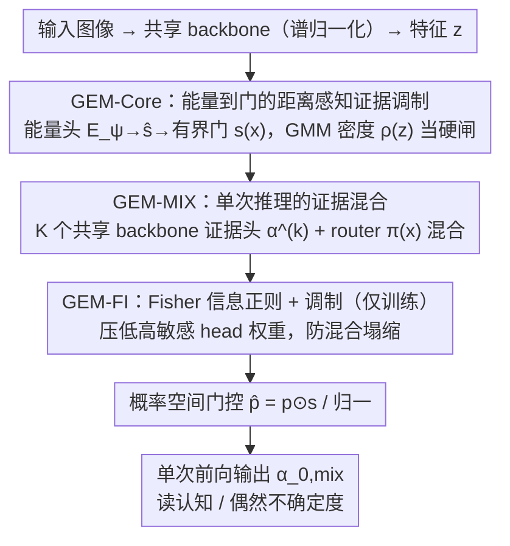

# GEM-FI: Gated Evidential Mixtures with Fisher Modulation

**会议**: ICML 2026  
**arXiv**: [2605.03750](https://arxiv.org/abs/2605.03750)  
**代码**: 无  
**领域**: 不确定性估计 / 证据深度学习 / OOD 检测  
**关键词**: Evidential Deep Learning, Energy-based gating, Fisher Information, Mixture of Beliefs, 单次推理 OOD

## 一句话总结
本文针对证据深度学习 (EDL) 在分布外样本上过自信、且单头难以表达多模态认知不确定性的问题，提出三件套 GEM-Core/MIX/FI：用学到的特征能量门控证据、用混合证据头单次推理近似 ensemble、用 Fisher 信息正则稳定混合分配，在 CIFAR-10→SVHN/CIFAR-100 等 OOD 检测上比 DAEDL 强且保持 single-pass。

## 研究背景与动机

**领域现状**：可靠的预测不确定性对 OOD 与高风险场景至关重要。BNN 原则上最优但训练/推理代价高；MC-dropout 和 Deep Ensemble 需要多次前向；EDL 通过预测 Dirichlet 浓度 $\alpha$ 一次前向给出认知不确定性，是延迟受限场景的主流选择；密度感知变体 DAEDL 用离线 GDA 对特征做密度估计来 rescale evidence，进一步改善 calibration。

**现有痛点**：(1) 标准 EDL 即便 ID 上准确，在分布漂移 / OOD 上仍然过自信；(2) DAEDL 的密度估计是 offline、与训练解耦的，特征漂移时密度代理排名会失准；(3) 单头 evidential 在复杂决策边界附近难以表达多模态 epistemic（论文 Figure 2(a) 显示 DAEDL 在非凸边界处仍 collapse 到一个过自信分配）；(4) 基于能量的 ID/OOD 区分通常是 post-hoc（先训练、再调 temperature），不参与证据生成过程，也不强制局部平滑；(5) Deep Ensemble 能解决多模态但 violates single-pass。

**核心矛盾**：要把“支持度”信号融入证据机制，同时保持 single-pass 推理；要表达多模态认知不确定性，又不能堆 ensemble。

**本文目标**：(1) 设计 in-model、可学的支持度门控直接作用在证据上；(2) 用单 backbone 多 evidential head 的混合替代 ensemble；(3) 引入 Fisher 信息正则避免 head collapse、保证混合权重稳定。

**切入角度**：把能量 $E(x)$ 看作 representation-level 的 support 反指标——高能量 = 低 support，自然对应 OOD；把它作为 in-model gate 而非 post-hoc score，能在训练过程中直接抑制低支持区域的证据。多模态 epistemic 不靠多次前向，而靠多 head + 学到的 router。

**核心 idea**：feature 能量 → 有界 gate → 直接乘到 Dirichlet 证据 + 多 evidential head 的 router 混合 + Fisher 正则稳定混合。

## 方法详解

### 整体框架
方法要解决的是 EDL 在 OOD 上过自信、单头难表达多模态认知不确定性，又想守住 single-pass 推理这一对矛盾。做法是把"支持度"信号端到端塞进 Dirichlet 证据的生成里，再用共享 backbone 的多 evidential head + router 在一次前向里近似 ensemble，最后用 Fisher 信息正则把多个 head 稳住不塌。三件套层层叠加：GEM-Core 负责证据门控，GEM-MIX 负责多模态混合，GEM-FI 负责稳定混合权重。推理时单次前向、无梯度，用混合后的 Dirichlet 浓度 $\alpha_0$ 读出认知不确定度。

### 关键设计

**1. 能量到门的距离感知证据调制 (GEM-Core)：把支持度信号在线塞进证据**

痛点是 DAEDL 那套密度估计是离线、与训练解耦的，特征一漂移密度排名就失准。这里改成 in-model、可学的门控：约定能量高即支持度低（与特征密度反相关），先用轻量 MLP 算标量能量 $E(x)=E_\psi(z)$ 并过 sigmoid 得 $\hat s(x)=\sigma(E(x))\in(0,1)$，再把 $[z,\hat s(x)]$ 喂给 integration gate $G_\eta$ 输出每类有界门 $s(x)\in[s_{\min},s_{\max}]^C$。证据生成时还乘一个 GMM 在 ID 特征上离线拟合的密度代理 $\rho(z)=\sigma(\log p_{GMM}(z))^\gamma$ 当"硬安全闸"：$\alpha_c(x)=\rho(z)\cdot\exp(\tilde u_c(x))+\epsilon$，最后做概率空间门控 $\hat p(x)=p(x)\odot s(x)/\mathbf{1}^\top(p(x)\odot s(x))$。训练用 $\mathcal{L}_{core}=\mathbb{E}[\|e_y-\hat p(x)\|_2^2 + \lambda_{KL}\mathrm{KL}[\mathrm{Dir}(\alpha)\|\mathrm{Dir}(\mathbf{1})]]$，梯度同时回流 $E_\psi$ 与 $G_\eta$，让门端到端学到"哪些 representation 区域该压制证据"。乘性门比 post-hoc score 更早作用在证据生成上，而 $[s_{\min},s_{\max}]\subset(0,1)$ 的硬上下界保证了 Lipschitz 平滑（Proposition 3.2）——这也是把 GMM 硬闸和软学习门组合起来的好处：一个保底、一个自适应。

**2. 单次推理的证据混合 (GEM-MIX)：用多 head + router 近似 ensemble**

单 head 在复杂决策边界附近容易 collapse 到一个过自信解，但堆 ensemble 又违背 single-pass。这里把单头扩成 $K$ 个共享 backbone 的 evidential head：每个 head 输出 logits $u^{(k)}(x)$，过 clip 和 $\rho(z)$ 后得 $\alpha^{(k)}(x)$，预测均值 $p^{(k)}_c=\alpha^{(k)}_c/\sum_j \alpha^{(k)}_j$；router 给出混合权重 $\pi(x)=\mathrm{softmax}(h_\omega([z,\hat s(x)]))\in\Delta^{K-1}$，混合预测 $p_{mix}(y=c|x)=\sum_k \pi_k(x) p^{(k)}_c(x)$，混合总浓度 $\alpha_{0,mix}=\sum_k \pi_k \alpha_0^{(k)}$，再过共享 per-class gate 得 $\hat p(x)$。损失 $\mathcal{L}_{mix}=\mathbb{E}[-\log \hat p_y(x) + \lambda_{KL}\sum_k \pi_k(x)\mathrm{KL}[\mathrm{Dir}(\alpha^{(k)})\|\mathrm{Dir}(\mathbf{1})]]$ 里 KL 项按 $\pi_k$ 加权，避免冷门 head 被过度正则。这样在边界两侧能由不同 head 专门负责（"mixture of beliefs"），保留多模态结构，而复用 backbone 让推理代价几乎不变，等于一次前向拿到 ensemble 级别的表达力。

**3. Fisher 信息正则 + 调制 (GEM-FI)：让多个 head 不塌、边界更平滑**

只靠 router 训练时混合权重容易塌成"一个 head 包打天下"。Fisher 信息恰好度量了 head 局部的"锐度"——敏感 head 对扰动反应大、稳定性差。于是给每个 head 算 FI 代理 $\widehat{\mathrm{FI}}_k(x)$（log-likelihood 对 logits 的梯度平方范数近似），用正则项 $\mathcal{L}_{FI}=\mathbb{E}_x[\sum_k \pi_k(x)\widehat{\mathrm{FI}}_k(x)]$ 直接惩罚"高 $\pi$ × 高 FI"的组合；训练时再对 router 输出做调制 $\tilde\pi_k^{mod}(x)\propto \tilde\pi_k(x)\exp(\lambda_{FI}(1-\bar{\mathrm{FI}}_k(x)))$，其中 $\bar{\mathrm{FI}}_k=\widehat{\mathrm{FI}}_k/\sum_j\widehat{\mathrm{FI}}_j$ 是归一化敏感度，把权重往低敏感 head 推。配套两个辅助损失锐化边界：能量项 $\mathcal{L}_{EBM}=\mathbb{E}_x[\mathrm{softplus}(\mathrm{clip}(E_\psi(z),-\tau,\tau))]+\mathcal{L}_{EBM}^{neg}$（含 VOS 合成负样本的 margin 损失），对比熵项 $\mathcal{L}_{UNC}=\beta_{id}\mathbb{E}_x[H(\hat p)]-\beta_{ood}\mathbb{E}_{x^{ood}}[H(\hat p(x^{ood}))]$ 鼓励 ID 低熵、OOD 高熵。总目标 $\mathcal{L}_{GEM-FI}=\mathcal{L}_{mix}+\lambda_{FI}\mathcal{L}_{FI}+\lambda_{EBM}\mathcal{L}_{EBM}+\lambda_{UNC}\mathcal{L}_{UNC}$。FI 调制只在训练用、推理只走原始 router，所以既稳又不增加推理开销。论文 Figure 2(b) 直观显示在非凸边界上 GEM-FI 保留了多模态，而 DAEDL collapse 成单一 mode。

### 损失函数 / 训练策略
spectral normalization 同时用在 backbone 和 gate pathway 上，以满足 Section 3.1 的 Lipschitz 假设；GMM 在 ID 训练特征上预先拟合；evidential head 数 $K$（默认 ≥2）和 $\lambda_{FI},\lambda_{EBM},\lambda_{UNC}$ 由验证集选；VOS 合成负样本只对 GEM-FI 启用，作为辅助的边界锐化。

## 实验关键数据

### 主实验
4 个 OOD pair：MNIST→KMNIST/FMNIST（数字域）、CIFAR-10→SVHN/CIFAR-100（自然图像，前者 far-OOD 后者 near-OOD）。AUPR（越高越好）：

| Method | CIFAR-10→SVHN (Alea./Epis.) | CIFAR-10→CIFAR-100 (Alea./Epis.) | MNIST→KMNIST (Epis.) |
|--------|--------------------------|----------------------------------|----------------------|
| EDL | 78.87 / 79.32 | 84.30 / 84.80 | 96.31 |
| I-EDL | 86.32 / 85.92 | 85.55 / 84.84 | 98.33 |
| DAEDL | 85.50 / 85.54 | 88.16 / 88.19 | 99.92 |
| R-EDL | 85.00 / 85.00 | – / – | 98.69 |
| **GEM-FI** | **92.59 / 95.09** | **90.20 / 89.06** | 接近上限 |

CIFAR-10 ID 分类 + calibration（来自摘要）：

| 指标 | DAEDL | **GEM-FI** | $\Delta$ |
|------|-------|-----------|---------|
| Acc | 91.11 | **93.75** | +2.64 |
| Brier×100 | 14.27 | **6.81** | −7.46 |
| 误分类检测 AUPR | 99.08 | **99.94** | +0.86 |

### 消融实验

| 配置 | CIFAR-10→SVHN AUPR | 说明 |
|------|---------------------|------|
| GEM-FI (full) | 92.59 | 完整模型 |
| 只 GEM-Core（去 mixture 和 FI） | 中间 | 已经超过 EDL，验证 in-model gate 有效 |
| GEM-MIX（去 FI） | 略低于 full | 多 head 帮助多模态但易 collapse |
| 去 spectral normalization | 下降 | 失去 Lipschitz 保证，calibration 变差 |
| 去 VOS 负样本 | 下降 | 边界锐化收益消失 |
| $K=1$ vs $K=2,3,4$ | $K=2$ 起明显提升，$K=4$ 后饱和 | mixture size 是关键超参 |

### 关键发现
- 在 ID 准确率上没有牺牲（CIFAR-10 反而 +2.64），说明门控不是“为了 OOD 拉胯 ID”，IB 式的硬安全闸 + 软学习门组合是稳健的。
- CIFAR-10→CIFAR-100 这种 near-OOD 上 GEM-FI 也胜出（90.20 vs 88.16），证明 Fisher 调制确实让混合权重在“分布相近”场景下仍能给出有效区分。
- ablation 显示三件套都不可缺：去掉任一组件性能都显著降。FI 调制的提升在边界复杂、多模态明显的数据集上尤为显著（Figure 2 的 1D toy 直接显示 DAEDL collapse、GEM-FI 保留多模态）。
- Calibration 上 Brier 下降近一半（14.27→6.81），是论文实证最强的点之一。

## 亮点与洞察
- 把“能量”从 post-hoc OOD score 升级为 in-model gate，是 EDL 系列里第一次把支持度信号端到端塞进 Dirichlet 参数化里——这套思路可以推广到任何输出概率分布的模型（softmax 分类、token-level LM）。
- “单次推理也能模拟 ensemble 多模态”这件事的关键不是堆 head，而是 router + Fisher 调制保证 head 不 collapse；Fisher 度量 head 局部锐度的用法在 mixture-of-experts 领域也有借鉴价值，可直接迁移到 MoE LLM 的 expert balancing 上。
- 在保持单次推理的前提下做了完整的“能量 → gate → 证据 → 混合 → 校准”链路，加上 Lipschitz 平滑性的形式化（Proposition 3.2）和距离感知单调性（Proposition 3.4）两条理论，方法不只是堆 trick，而是有几何/解析的根据。
- 概率空间门控 $\hat p=p\odot s/\mathbf{1}^\top(p\odot s)$ 比直接乘 logit 更稳定，避免 softmax 饱和；这种“先归一再门控”的小技巧可以借到 calibration 工具箱里。

## 局限与展望
- spectral normalization 对所有主干层强制约束，可能拖慢大模型上的收敛；论文实验全部是 ResNet 级别 backbone，能否扩展到 ViT/Transformer 没有给出。
- 自评：GMM 密度估计需要预先固定，特征空间漂移时仍可能失效——虽然学习 gate 部分能补偿，但 $\rho(z)$ 的失准会拖慢学习；可以考虑在线更新 GMM。
- VOS 合成负样本对 OOD 假设很敏感，远离 ID 的合成可能不是真实 OOD 的代表；论文没在更激进的 OOD（如 adversarial OOD、far-OOD with semantic shift）上验证。
- mixture head 数 $K$ 是手调，最优 $K$ 依任务变化；未来可以让 $K$ 由数据驱动（如 Dirichlet process / 稀疏 gating 自适应）。
- 没有给出大规模数据集（ImageNet-1K、CLIP-style）上的结果，工业落地前需要验证 scalability。

## 相关工作与启发
- **vs EDL (Sensoy 2018)**：本文同样预测 Dirichlet 参数，但加入了能量门控、混合 head 和 Fisher 正则，根本解决了 EDL 在分布外过自信和无法表达多模态的问题。
- **vs DAEDL**：DAEDL 的密度是 offline GDA、与训练解耦；GEM-Core 的 gate 是 in-model learnable，能在训练中适应特征漂移，calibration 与 OOD 双双胜出。
- **vs MC-dropout / Deep Ensemble**：那些方法靠多次前向得到 epistemic uncertainty，本文用 mixture-of-heads 在单次前向里近似 ensemble，延迟优势明显。
- **vs Energy-based OOD score (Liu 2020)**：那是 post-hoc score；本文把能量提前到生成 Dirichlet 时就用，并通过 Lipschitz 保证局部平滑。
- **可迁移启发**：(1) “support signal → 有界 gate → 概率空间乘性调制”是任何想做 distance-aware confidence 模型的通用模板；(2) Fisher 信息惩罚高敏感 expert 的用法可以迁移到 MoE LLM 训练里平衡 expert load；(3) 用 GMM/能量双信号组合做安全闸 + 学习信号，是“保底 + 学习”双层防护的范本。

## 评分
- 新颖性: ⭐⭐⭐⭐ 三件套 GEM-Core/MIX/FI 把已有概念（EDL、energy、Fisher）组合成 single-pass 多模态 uncertainty 框架，组件不全新但组合方式新。
- 实验充分度: ⭐⭐⭐⭐ 4 个标准 OOD pair + ID 分类 + calibration + 多种消融，比较扎实；缺大规模数据集和现代 backbone（ViT）实验。
- 写作质量: ⭐⭐⭐⭐ 结构清晰，两条 Proposition 给方法提供了理论支撑，notation 较多但定义统一；个别推导（FI 调制中的 normalize 与 smoothing）稍显繁琐。
- 价值: ⭐⭐⭐⭐ 在“single-pass uncertainty”这条线给出明显进展，对延迟敏感的安全关键场景（自动驾驶、医疗）有实际意义。

<!-- RELATED:START -->

## 相关论文

- [\[ICML 2026\] Mind the Gap: Mixtures of Gaussians in Approximate Differential Privacy](mind_the_gap_mixtures_of_gaussians_in_approximate_differential_privacy.md)
- [\[ECCV 2024\] Fisher Calibration for Backdoor-Robust Heterogeneous Federated Learning](../../ECCV2024/ai_safety/fisher_calibration_for_backdoor-robust_heterogeneous_federated_learning.md)
- [\[ICML 2026\] Position: Embodied AI Requires a Privacy-Utility Trade-off](position_embodied_ai_requires_a_privacy-utility_trade-off.md)
- [\[ICML 2026\] MetaMoE: Diversity-Aware Proxy Selection for Privacy-Preserving Mixture-of-Experts Unification](metamoe_diversity-aware_proxy_selection_for_privacy-preserving_mixture-of-expert.md)
- [\[ICML 2026\] FedHPro: Federated Hyper-Prototype Learning via Gradient Matching](fedhpro_federated_hyper-prototype_learning_via_gradient_matching.md)

<!-- RELATED:END -->
