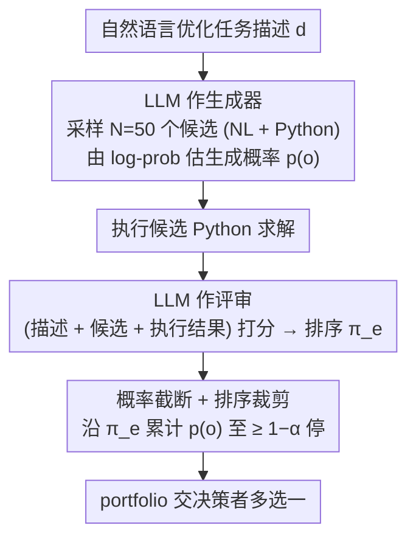

# Generating Robust Portfolios of Optimization Models using Large Language Models

**会议**: ICML 2026  
**arXiv**: [2605.27013](https://arxiv.org/abs/2605.27013)  
**代码**: 无  
**领域**: 优化建模 / LLM-as-Generator / LLM-as-Judge  
**关键词**: 优化建模、候选组合 (portfolio)、LLM 评审、人机协同、覆盖率保证

## 一句话总结
本文提出一个轻量、无需训练的算法：用同一个 LLM 同时扮演"随机生成器"和"打分评审"两个角色，把生成概率前缀和达到 $1-\alpha$ 的候选优化模型打包成 portfolio，从理论上证明只要"生成器"或"评审"任一与人类偏好对齐，portfolio 就一定包含高质量优化模型，并在 NL4LP 上用 GPT 验证 portfolio 在最差情况下也稳定优于随机采样。

## 研究背景与动机
**领域现状**：把现实决策问题（资源分配、调度、规划）形式化成数学优化模型，是运筹学最重的"卡脖子"环节，因为它需要同时精通业务领域和优化建模本身。近两年涌现出一批用 LLM 自动生成优化模型的工作（OptiMUS、LLMOPT、Autoformulation、ORLM 等），思路要么是"端到端微调一个 LLM 出整套模型"，要么是"只让 LLM 设计 reward / 目标函数"。

**现有痛点**：这些方法几乎都只输出**单个**优化模型，而 LLM 输出本身有显著随机性 + 幻觉率，单个模型质量没有任何保证；想提升可靠性又往往需要重训或 RLHF，工程成本极高。决策者拿到一个模型后既无法判断它有多好，也没有第二选择可以兜底。

**核心矛盾**：LLM 在优化建模上同时具备两种能力——**stochastic generator**（多次采样能给出多样化候选，覆盖不同 trade-off）与 **reasoning evaluator / judge**（基于世界知识给候选打分）——但已有工作要么只用前者（随机采样多次取一），要么只用后者（让 judge 选最好），没有把两者统一起来。一旦 generator 偏了 judge 救不回来，反之亦然。

**本文目标**：在不训练、不微调的前提下，输出一组（而不是一个）优化模型，并给出**理论意义上的覆盖率保证**：只要生成器或评审中**任一**与人类排序一致，portfolio 内必然包含高质量模型，从而支撑 human-in-the-loop 的"多选一"决策流程。

**切入角度**：作者关键观察是——generator 给出的概率 $p(o)$ 和 evaluator 给出的排序 $\pi_e(d)$ 是两路**独立**信号，把它们组合成"按 evaluator 排序、按 generator 概率累计截断"的 portfolio，就能让两路信号互相兜底。

**核心 idea**：把"按 evaluator 排名从好到差"的候选依次加入 portfolio，直到累计**生成概率**达到 $1-\alpha$ 为止——这一截断使 portfolio 同时享有"评审排序覆盖"和"生成概率覆盖"双重保护。

## 方法详解

### 整体框架
本文要解决的是"LLM 自动写优化模型但单个输出不可靠"的问题：给定一段自然语言优化任务描述 $d$，方法不再吐出唯一一个模型，而是用同一个 LLM 先以"随机生成器"身份反复采样出一批候选，再换上"评审"身份给候选打分，最后按一条统一的停止规则把最值得保留的候选打包成一个 portfolio 交给决策者多选一。关键在于把"评审排序"和"生成概率"这两路本来独立的信号，缝进同一个截断准则里，让其中任一路靠谱就足以保证质量。

### 关键设计

**1. 概率截断 + 排序裁剪：用两路信号串成单一停止规则**

整个 portfolio 的构造只有一条规则，却同时吃进生成与评审两路信息。先把描述 $d$ 喂给 generator $g$ 随机采样 $N$ 次（实验取 $N{=}50$），每次产出一个"自然语言说明 + Python 代码"形式的候选 $o\in\mathcal{O}$，并用 token 级 log-prob 归一化估出生成概率 $p(o)$；再让同一个 LLM 当 evaluator 给出从好到差的排序 $\pi_e(d)=(o_{(1)^e}, o_{(2)^e}, \ldots)$。构造时沿着评审排名从最好开始遍历，维护累积概率 $S_k=\sum_{i=1}^k p(o_{(i)^e})$，一旦 $S_k\geq 1-\alpha$ 立刻停手，得到

$$\mathcal{P}(d;\alpha)=\{o_{(i)^e}\}_{i=1}^{k^*(\alpha)},\quad k^*(\alpha)=\inf\Big\{k:\sum_{i=1}^k p(o_{(i)^e})\geq 1-\alpha\Big\}.$$

这条规则之所以鲁棒，是因为传统做法要么 top-k by score（评审一失效就全废）、要么 top-p by prob（生成器一失效就全废），单条路都脆。这里用"评审排序决定先放谁、生成概率 mass 决定放到哪停"互相兜底：评审靠谱时，排在前面的候选本就含好模型；评审不靠谱但生成器靠谱时，好模型因为高概率被采到也会进入累积和。$\alpha\in(0,1)$ 是用户旋钮——越小覆盖越保险但 portfolio 越大，决策者最终只在这 $k^*$ 个候选里挑一个。

**2. 统一的覆盖率定义与"或"型对齐假设**

为了把上面的直觉做严，作者把 portfolio 质量量化成 coverage $c(\mathcal{P})=\frac{1}{k}\sum_{i=1}^k \mathbb{I}\{o_{(i)^*}\in\mathcal{P}\}$，即"人类心目中排名前 $k$ 的候选有多少落进了 portfolio"（$o_{(i)^*}$ 为人类真实排序第 $i$ 位）。在此之上分别定义两种对齐：**Evaluator Alignment** 指评审排序与人类完全一致 $\pi_e(d)=\pi^*(d)$；**Generator Alignment** 指越好的候选生成概率越高，即 $i\leq j\Rightarrow p(o_{(i)^*})\geq p(o_{(j)^*})$。基于这条截断规则可以证明两条**互相独立**的保证：若 evaluator 对齐，则对任意 $\alpha\in(0,1)$ 和任意 generator 都有 $c(\mathcal{P})=1$；若 generator 对齐，则对任意 $\alpha\in(0,1/2)$ 和任意 evaluator 都有 $c(\mathcal{P})>\frac{1-2\alpha}{k^*(\alpha)}>0$。这把以前"两个组件都得靠谱"的**与**型保证放宽成了**或**型——只要 LLM 生成与评审至少有一面跟人对齐结果就有底，恰好契合"同一模型在不同 prompt 下表现差异巨大"的实际经验。

**3. 同模型双角色 + 用代码执行结果反哺评审**

generator 和 evaluator 是同一个 LLM（实验里都用 `gpt-5.4-nano`），只靠 prompt 切换身份，避免引入第二个模型让成本翻倍。评审这一步并非纯看文本：先**执行**候选输出的 Python 拿到求解结果，再把"问题描述 + 候选模型 + 执行输出"一起塞回 LLM，对每个候选重复 4 次打 1–100 分取均值。代码执行在这里充当了一道事实校验过滤器，让评审不至于被"语法漂亮但解错"的模型骗到高分——优化模型对错本质要靠跑出来才知道，纯语义评审容易高分低能。作者还实现了一个对照版本：丢掉评审、直接用 generator 自己的概率当排序兼截断（纯 top-p），用来隔离 reasoning evaluator 相对生成概率到底多带来多少信号。

### 损失函数 / 训练策略
全程**无训练、无微调、无 RLHF**——只有 prompt 与采样，唯一超参是用户给定的 $\alpha$，控制覆盖率与 portfolio 体积的权衡。理论部分依赖一条核心引理：evaluator 对齐时，沿评审排名把生成概率累计到 $1-\alpha$ 至少覆盖人类排名前 $k^*$ 个候选；generator 对齐时，用 $p(o_{(i)^*})\geq p(o_{(j)^*})\,(i\leq j)$ 直接构造下界 $\frac{1-2\alpha}{k^*}$，完整证明见原文 Appendix A。

## 实验关键数据

### 主实验

**合成数据（理论验证）**：候选空间 $|\mathcal{O}|=K\in\{10,20,50,100\}$，人类真实排序固定为 $(1,2,\ldots,K)$。Generator 分四档：Aligned / Weakly Aligned / Uniform / Misaligned；Evaluator 用错误率 $\epsilon\in\{0,0.3,0.5,0.7,1\}$ 描述（$\epsilon{=}0$ 完美，$\epsilon{=}1$ 反向排序）。每个 $\alpha$ 跑 40 个 seed。

| 设定 ($K{=}100$) | $\alpha$ 区间 | 经验 coverage | 与理论 ($\frac{1-2\alpha}{k^*}$) 对比 |
|---|---|---|---|
| Weakly Aligned generator, $\epsilon{=}0$ | $(0, 0.5)$ | $\geq 1-\alpha$（紧贴对角线上方） | 远高于理论下界 |
| Weakly Aligned generator, $\epsilon{=}0.5$ | $(0, 0.5)$ | $\approx 1-\alpha$ | 满足 Proposition 3.6 |
| Weakly Aligned generator, $\epsilon{=}1.0$（最坏评审） | $(0, 0.5)$ | 仍为正 | 与理论一致 |
| Aligned generator, $\epsilon{=}1.0$（最坏评审） | $(0, 0.5)$ | 显著高于 Uniform/Misaligned | 大 portfolio 换高覆盖 |

**真实数据（NL4LP 25 道题）**：generator = `gpt-5.4-nano` 采样 50 次；judge = `gpt-5.4` 并使用 ground-truth 解作为参考；portfolio 大小 $s\in\{2,4,6,8\}$，与同等大小的随机采样 portfolio 对比，每题 30 次随机重采。质量指标为 portfolio 内候选的**最低**得分（worst-case 视角）。

| Portfolio 大小 $s$ | 本文 (LLM-as-evaluator) | 本文 (generator-prob-as-evaluator) | 随机 portfolio |
|---|---|---|---|
| 2 | 显著占优 | 中等占优 | 基线 |
| 4 | 显著占优 | 中等占优 | 基线 |
| 6 | 显著占优 | 中等占优 | 基线 |
| 8 | 显著占优 | 中等占优 | 基线 |

> 论文以 KDE 分布图（Figure 5）呈现，dashed/dotted 线为均值，本文两条曲线均整体右移；reasoning evaluator 版本曲线**右移幅度大于**纯概率版本，说明 LLM 的 reasoning 评审确实带来额外信号。

### 消融实验

| 配置 | 覆盖率行为 | 说明 |
|---|---|---|
| Full：reasoning evaluator + generator prob 截断 | NL4LP 上 worst-case 得分最高 | 完整方法 |
| w/o evaluator（用 generator 概率排序兼截断） | 得分明显回落但仍优于随机 | 失去"代码执行反哺"信号，但生成概率仍提供部分对齐 |
| w/o 概率截断（按评审 top-k 取固定大小） | 无 $\alpha$ 旋钮、无覆盖保证 | 实际就是已有 LLM-as-judge baseline，被本文方法显著超过 |
| 随机 portfolio（多次采样取 $s$ 个） | worst-case 得分最低 | NL4LP 上的强 baseline，本文在所有 $s$ 上均占优 |

### 关键发现
- **"OR" 型对齐假设在合成实验里被反复验证**：哪怕 evaluator 完全反向（$\epsilon{=}1$），只要 generator 哪怕只是 Weakly Aligned，coverage 在 $\alpha<0.5$ 时仍严格为正——这是单纯 top-k 或 top-p 做不到的鲁棒性。
- **Coverage / size 是一对 trade-off，由人类对齐度调控**：generator 越对齐，相同 $\alpha$ 下覆盖率越高但 portfolio 越大；evaluator 越对齐，相同 $\alpha$ 下覆盖率越高但 portfolio 越小。这给决策者提供了清晰的"质量 vs 选项数"旋钮。
- **代码执行 + reasoning evaluator > 纯生成概率**：NL4LP 实验里 reasoning evaluator 比"generator-prob-as-evaluator"得分分布整体右移更多，证明 LLM 的 judge 能力在优化建模上确实提供生成概率之外的有效信号。
- **经验下界比理论下界紧得多**：Proposition 3.6 给出 $c>\frac{1-2\alpha}{k^*}$，而实测下界几乎贴在 $1-\alpha$ 上，说明分析仍有进一步收紧空间。

## 亮点与洞察
- **"双角色，单模型，或型保证"** 是这套方法最迷人的地方：以前 LLM-for-optimization 工作把 generator 和 judge 当成两个独立 pipeline 拼接，本文用同一个 LLM 切换 prompt 并设计了一条统一停止规则，把工程开销压到最小、把鲁棒性论证拉到最强。
- **覆盖率保证从"两路同时对齐"放宽到"任一路对齐"** 是有方法论意义的：现实里 LLM 在生成和评审两面表现波动巨大，能给出"或"型保证比"与"型保证实用得多，可以直接迁移到代码生成、SQL 合成、RL reward shaping 等"LLM 输出需要可验证"的场景。
- **用代码执行结果回灌 evaluator** 是被低估的细节：优化建模天然有"求解器"这个客观裁判，本文把求解输出塞进评审 prompt 把 LLM 评分从"看起来对不对"升级到"算出来对不对"，这种"先 verifier，再 judge"的模式可推广到任何带可执行验证的领域。
- **$\alpha$ 旋钮给了决策者人机协同的明确接口**：传统 LLM 输出要么一个要么多个，没有"我愿意看 3 个候选" vs "我愿意看 10 个候选"的可控选项，本文用一个标量参数把"覆盖率 vs 选项数"做成连续可调，工程上非常实用。

## 局限与展望
- **作者承认的局限**：generator 的概率 $p(o)$ 用 token-level log-prob 的归一化估计——对长输出和长尾候选不一定准；同时 NL4LP 上只用了 25 道题、$N{=}50$ 次采样，规模仍偏小。
- **理论覆盖率下界 $\frac{1-2\alpha}{k^*}$ 比实测松很多**：当 $k^*$ 大时几乎退化为零保证，对实际选超参指导有限；未来需要在 generator 弱对齐时给出更紧的实例相关界。
- **判定"对齐"难落地**：定义里需要知道人类排序 $\pi^*$ 才能验证对齐，但实务里恰恰不知道；论文给的保证更多是"事后才能验证的保证"，工程上需要一个对齐度的廉价代理量。
- **未与现有 OptiMUS / LLMOPT / ORLM 等系统直接横评**：这些方法多以"单一模型 + 求解通过率"为指标，没有 portfolio 概念，对照口径不一致；如果能在它们的 benchmark 上把单模型方案 vs 本文 portfolio 在"最差模型质量""人工选 portfolio 内最好模型质量"两条线上 head-to-head，结论会更强。
- **改进思路**：把 evaluator 改成 ensemble（不同 prompt 多次 judge 投票）、把 generator 的概率换成 self-consistency 频率作为更稳的 $p(o)$ 估计、引入求解器返回的可行性 / 最优性 gap 作为硬过滤前置层，都可能直接拉升 NL4LP 上的 worst-case 得分。

## 相关工作与启发
- **vs OptiMUS / LLMOPT / Autoformulation (Ahmaditeshnizi 2024; Jiang 2024; Astorga 2024)**：他们要么 fine-tune 一个 LLM 输出**单个**优化模型，要么多 agent 协作收敛到一个，都需要训练且不给质量保证；本文完全免训、输出一组候选并给出 OR 型理论覆盖率保证，是"轻量 + 鲁棒"的另一极。
- **vs Eureka / Text2Reward / DLM (Ma 2024; Xie 2024; Behari 2024)**：这些方法把 LLM 用在 RL 的 reward 设计、并用环境反馈迭代优化 reward，本文把同样的"用 LLM 写形式化目标"思路从 reward 推广到完整优化模型，并把"迭代优化单点"换成"一次出 portfolio"。
- **vs Verma 2025 (Balancing Act)**：同样观察到 LLM 既可做 generator 又可做 evaluator，并用于 reward 优先级排序，但没有给覆盖率保证，也没把两路信号合成统一停止规则；本文相当于把这条线索做实做严。
- **vs OPRO / "LLM as Optimizer" (Yang 2023)**：那里 LLM 直接当黑盒优化器（迭代猜解），本文 LLM 不解优化、只**写出**优化模型让传统求解器解——分工更清晰、解的可解释性更强。

## 评分
- 新颖性: ⭐⭐⭐⭐ "evaluator-rank + generator-prob 累计截断"是个干净漂亮的新组合，OR 型对齐假设在 LLM-for-optimization 圈也较少见。
- 实验充分度: ⭐⭐⭐ 合成实验把理论各角落覆盖得很充分，但真实实验只 25 题、未与主流 OptiMUS / LLMOPT 系统直接 head-to-head。
- 写作质量: ⭐⭐⭐⭐ 定义、假设、命题、推论层次清晰，证明放 appendix 干净利落；图 1–5 的呈现也直观。
- 价值: ⭐⭐⭐⭐ "OR 型保证 + 免训 + 单一 LLM 双角色"对所有需要 LLM 输出可验证结构的下游任务（代码合成、SQL、reward shaping、protocol 生成）都有直接借鉴价值。

<!-- RELATED:START -->

## 相关论文

- [\[ICML 2026\] Feature-Augmented Transformers for Robust AI-Text Detection Across Domains and Generators](feature-augmented_transformers_for_robust_ai-text_detection_across_domains_and_g.md)
- [\[CVPR 2025\] ProAPO: Progressively Automatic Prompt Optimization for Visual Classification](../../CVPR2025/aigc_detection/proapo_progressively_automatic_prompt_optimization_for_visual_classification.md)
- [\[ICLR 2026\] CLARC: C/C++ Benchmark for Robust Code Search](../../ICLR2026/aigc_detection/clarc_cc_benchmark_for_robust_code_search.md)
- [\[NeurIPS 2025\] ASCIIBench: Evaluating Language-Model-Based Understanding of Visually-Oriented Text](../../NeurIPS2025/aigc_detection/asciibench_evaluating_language-model-based_understanding_of_visually-oriented_te.md)
- [\[NeurIPS 2025\] DuoLens: A Framework for Robust Detection of Machine-Generated Multilingual Text and Code](../../NeurIPS2025/aigc_detection/duolens_a_framework_for_robust_detection_of_machine-generated_multilingual_text_.md)

<!-- RELATED:END -->
