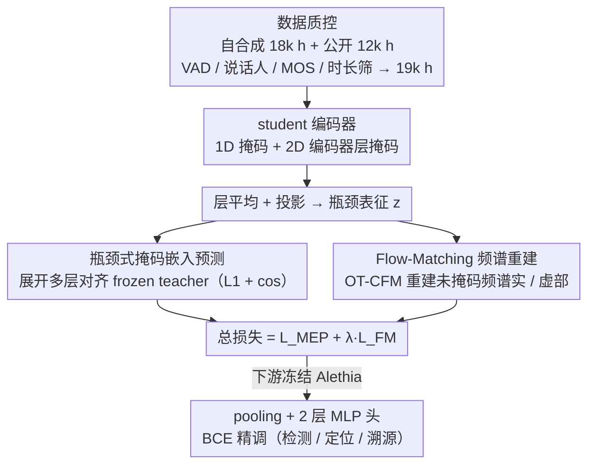

# Alethia: A Foundational Encoder for Voice Deepfakes

**会议**: ICML 2026  
**arXiv**: [2605.00251](https://arxiv.org/abs/2605.00251)  
**代码**: 未公开  
**领域**: 语音深度伪造 / 音频基础模型 / 自监督预训练  
**关键词**: voice deepfake, 语音基础模型, 掩码嵌入预测, Flow Matching, 频谱重建

## 一句话总结
Alethia 提出一种"瓶颈式掩码嵌入预测 + Flow-Matching 频谱生成"的双分支预训练范式，训出首个面向语音 deepfake 检测/定位/溯源的基础编码器，在 5 类任务 56 个数据集上显著超过 Wav2vec2/HuBERT/WavLM 等通用 SFM，并对未见过的歌声 deepfake 和真实扰动表现出强零样本鲁棒性。

## 研究背景与动机

**领域现状**：当前语音 deepfake 检测 (SDD)、歌声 deepfake 检测 (SVDD)、局部伪造定位 (PFSL)、溯源 (ST) 等任务的 SOTA 均以通用语音基础模型 (Wav2vec2 / WavLM / HuBERT) 作为 frontend，配合下游精调来实现。

**现有痛点**：尽管在 12k 小时真假语音上做精调，模型对未见过的合成方法与真实世界扰动 (重录、重放、信道噪声) 的泛化仍然很差；现有 SFM 的预训练目标 (masked token prediction + 离散伪标签) 主要面向语义内容，未必能捕捉 deepfake 的"生成痕迹"。

**核心矛盾**：通用 SFM 的离散量化目标 (k-means/RVQ 聚类后的 token) 会把音色微观伪迹一起压成"统计上无用"的细节——作者通过互信息分析定量证实：HuBERT 第 6 层离散目标对音素标签 MI 高达 0.68，但对 deepfake 标签 MI 仅 0.07–0.21，无论扩大 codebook 或换 RVQ 都难以提升。

**本文目标**：(1) 找一种不丢失生成痕迹的目标信号；(2) 在不损失判别能力的前提下融入生成式预训练，使表征兼具语义、声学和伪迹敏感性；(3) 在数据规模上覆盖野外 deepfake。

**切入角度**：把"目标离散化导致信息丢失"作为根因，转向**连续嵌入预测**；同时观察到"直接 MSE 重建频谱在 mask 位置误差远大于 unmask 位置"，因此用 Flow Matching 学概率路径而不是确定性映射。

**核心 idea**：让 student 用层平均后的瓶颈表征同时 (a) 预测 frozen teacher 的多层连续嵌入、(b) 通过 OT-CFM 解码出未掩码频谱，两条分支共享同一瓶颈，把"判别 + 生成"在表征层面绑成一体。

## 方法详解

### 整体框架
Alethia 要解决的核心问题是：通用语音基础模型的离散量化目标会把 deepfake 的生成痕迹当噪声丢掉，导致下游检测器泛化差。它的做法是让一个 student 编码器从带掩码的波形里学一个"瓶颈表征" $\mathbf{z}$，再用两条分支同时约束它——一条逼它对齐 frozen teacher 的多层连续嵌入（保留判别用的多粒度信息），另一条逼它用 Flow Matching 重建频谱（保留生成痕迹这种底层声学细节）。两支损失加权相加共享同一个瓶颈，从而把"判别"和"生成"绑在表征层面。整套 pipeline 在 30k→19k 小时的野外加公开 deepfake 语料上跑约一个 epoch；下游所有任务都冻结 Alethia，只挂一个 pooling + 2 层 MLP 头做 BCE 精调。

### 关键设计

**1. 瓶颈式掩码嵌入预测 (Bottleneck MEP)：让连续目标取代会丢痕迹的离散 token**

这一支针对的痛点是离散量化目标信息有损。作者先把 student 所有层输出取平均得到 $\bar{\mathbf{h}}$，再用一个线性投影把维度放大 $|\mathcal{M}|$ 倍后 reshape 回 $|\mathcal{M}|$ 层，逐层去对齐 teacher 均匀采样的 6 个层；监督是每层 L1 与 cosine 之和 $\mathcal{L}_{MEP}=\alpha\mathcal{L}_{L1}+\beta\mathcal{L}_{cos}$。这里有两个刻意的设计：一是用"瓶颈再展开"而不是层对层 1:1 蒸馏——后者会把学生上限锁死在老师，只对齐最后一层又压不下多层信息，而"先压成单一隐表征再展开成多层"既避免直接复制，又强迫这个紧凑表征同时蕴含浅层声学和深层语义，恰好对应 deepfake 检测需要的"全频谱痕迹"。二是损失必须在**全时刻**（masked + unmasked）取平均才能稳定收敛，作者实测只在 masked 位置算损失训练后期会发散，因为连续目标加稀疏 mask 的监督太弱。

**2. Flow-Matching 频谱重建 (FM-SR)：用分布到分布的路径建模伪迹**

预测式目标擅长抓语义，但对底层声学细节捕捉不足，这一支就以瓶颈 $\mathbf{z}$ 为条件去重建未掩码 STFT 频谱的实部和虚部来补足。关键观察是：直接用 MLP 做确定性 MSE 重建时，mask 位置误差远大于 unmask 位置，说明单点映射不足以刻画伪迹分布。于是作者改用 OT-CFM 学一条 noise→clean spectrogram 的直线概率路径：对每个 minibatch 用 Hungarian 算法求 noise 与数据的最优配对以缩短传输代价，时间 $t$ 处的状态为 $\mathbf{x}_t = t\mathbf{x}_0 + [1-(1-\sigma_{min})t]\mathbf{x}_1$，目标速度场为 $\mathbf{v}_t = (\mathbf{x}_0-(1-\sigma_{min})\mathbf{x}_t)/(1-(1-\sigma_{min})t)$，由一个 transformer 解码器 $g_\psi(\mathbf{x}_t,t,\mathbf{z})$ 预测实部/虚部速度场，损失为 $\mathcal{L}_{FM}=\mathbb{E}[(\mathcal{L}_{real}+\mathcal{L}_{imag})/\sigma_{eps}^2]$。把单点映射换成学一条分布到分布的路径后，mask/unmask 的损失重新对齐，"子感知伪迹"也被建模成分布密度的偏移而非一个确定值——而且解码器只在预训练时把梯度反传给编码器，推理阶段整支丢弃。

**3. 2D 编码器层掩码 + 数据质控：把掩码难度和数据质量同时拉满**

光在 CNN 输出做 1D 掩码（每步 1% 概率、累计约 10%）不足以逼深层表征学补全，所以作者额外在每个 transformer 层输出再加 2D 掩码（时间和通道各 15% 概率、每层最多 2 块），消融显示这对 deepfake 下游任务至关重要 (Appendix C.1)。数据侧则先自合成 18k 小时（CommonVoice 配现成 TTS/VC）再加 12k 小时公开 deepfake（ASVspoof5、MLAAD、TITW-hard、SpoofCeleb、ShiftySpeech）；野外语料质量参差，作者用 VAD、说话人分离、MOS≥1.5、时长 1.5–15s 四步过滤掉静默/多说话人/低清片段，最终得到 19k 小时真假平衡语料，避免噪声反过来拖累预训练。

### 损失函数 / 训练策略
最终损失 $\mathcal{L}=\mathcal{L}_{MEP}+\lambda\mathcal{L}_{FM}$，其中 $\lambda=0.25$、$\alpha=\beta=1$；teacher 选 WavLM-Large（对应 Alethia-Base）与 Wav2vec-XLSR-1B（对应 Alethia-Large），全程 frozen，选层分别为 [4,8,12,16,20,24] 与 [4,12,20,28,36,42]；Base 400M / Large 1B 参数，分别训练 600k / 300k 步约一个 epoch。

## 实验关键数据

### 主实验
在 SDD-Eval-50 (50 个 SDD 数据集) 上对比 4 个主流 SFM，三档精调设置 (Low-resource 400h / Expanded 3.3k h / Expanded+Aug 12k h)：

| 模型 | 参数量 | 全部 EER↓ | 全部 Acc↑ | 困难子集 EER↓ | 困难子集 Acc↑ |
|------|-------|-----------|------------|---------------|----------------|
| HuBERT-Large | 0.3B | 11.4 | 84.0 | 18.7 | 73.6 |
| WavLM-Large | 0.3B | 8.0 | 85.9 | 15.0 | 74.5 |
| W2V-XLSR-300M | 0.3B | 14.1 | 71.8 | 21.1 | 61.3 |
| W2V-XLSR-1B | 1B | 6.0 | 91.9 | 13.2 | 78.2 |
| **Alethia-Base** | 0.4B | 6.9 | 90.6 | 13.1 | 80.7 |
| **Alethia-Large** | 1B | **5.2** | **93.3** | **11.5** | **81.2** |

零样本歌声 deepfake (SVDD, CtrSVDD test split, 训练完全没看过歌声)：

| 模型 | EER↓ | Acc↑ | TPR↑ | TNR↑ |
|------|------|------|------|------|
| WavLM-Large | 22.6 | 89.8 | 97.7 | 43.5 |
| W2V-XLSR-1B | 13.2 | 89.7 | 90.8 | 83.1 |
| Alethia-Base | 16.7 | 89.8 | 94.0 | 65.2 |
| **Alethia-Large** | **10.8** | **91.3** | 92.5 | **84.1** |
| CtrSVDD in-domain baseline | 13.8* | — | — | — |

### 消融实验

| 消融配置 | 关键现象 | 解读 |
|-----------|----------|------|
| 仅 masked token prediction (HuBERT/W2V 风格) 重训 | $\Delta$EER +0.25 ~ +1.20 | 单靠加数据 + 离散目标无法学到 deepfake 痕迹 |
| 用 RVQ (1k cls × 2 codebook) | deepfake MI 0.212 (vs 音素 0.68) | 量化目标无论扩多大对 deepfake 都失效 |
| MEP 仅算 masked 位置 | 训练后期 loss 反弹 | 连续目标 + 稀疏 mask 不稳定，需全位置平均 |
| 直接 MSE 重建频谱 | masked 位置 loss ≫ unmasked | 确定性解码丢分布信息，故改用 Flow Matching |
| 去掉 2D 层掩码 | deepfake 下游掉点 (Appendix C.1) | 层内掩码迫使更深表征也学补全 |

### 关键发现
- W2V-XLSR-1B 平均 EER 6.0% 看似很好，但有 17/50 数据集 Acc<90%、6 个 <80%，说明"平均值掩盖了泛化短板"；Alethia-Large 把这两个数字降到 11 和 4。
- Alethia 在"困难子集" (W2V-1B 表现差于均值的子集) 上提升最显著 (EER -1.7, Acc +3 pp 以上)，说明它真正补的是泛化短板而非整体微调红利。
- 零样本歌声场景下 Alethia-Large 不仅超 SFM 还反超 CtrSVDD in-domain baseline 3 个 EER 点，验证"语音和歌声共享发声生理基础" 的假设可由 deepfake 痕迹自监督习得。

## 亮点与洞察
- **诊断驱动设计**：通过互信息分析定量证伪"离散目标够用" 假设——这一步分析本身比方法更有启发，可推广到其他声音异常检测任务 (如咳嗽、机械故障)。
- **瓶颈架构兼顾蒸馏与超越**：层平均 + 投影 + reshape 的小变换实现"蒸 6 层却避免被锁死"，可迁移到任何需要"用紧凑表征同时拟合多层 teacher"的场景。
- **Flow Matching 当辅助目标而非生成器**：作者不关心解码出来的频谱听起来怎样，只用其反传给编码器，这给"如何利用生成式预训练帮判别任务" 提供了干净答案——这是社区长期失败的方向。
- **野外伪造数据自合成 + 质控管线**：18k 小时野外语料用现成 TTS/VC 自动造伪，再用 VAD/说话人/MOS 三阶段过滤，可被其他 deepfake 方向直接借用。

## 局限与展望
- 没有开源代码与预训练权重，复现难度大。
- Alethia-Base 在零样本 SVDD 上 EER 16.7% 仍不及 W2V-1B 13.2%，说明小模型尺寸下两支损失的优势不足以弥补容量差距。
- 评估虽达 56 数据集但都是英文为主；多语种、低资源语种 deepfake 行不行没有验证。
- Flow Matching 解码器只在预训练用、推理丢弃，存储/算力开销在预训练阶段较大，但作者没量化对比。
- 对"对抗性伪造" (针对该编码器精心优化的 deepfake) 鲁棒性未测。

## 相关工作与启发
- **vs HuBERT / Wav2vec2 / WavLM**：仍是 BERT 式掩码 token 预测 + 离散伪标签；Alethia 改成连续嵌入 + 生成式辅助，本质上承认了"deepfake 任务需要保留量化会丢的信息"。
- **vs Data2vec2 / JEPA / V-JEPA**：同样做连续嵌入预测，但只对齐最后一层；Alethia 用 multi-layer 瓶颈对齐，更适合需要多粒度声学/语义信息的下游。
- **vs MERT / SPEAR / MERaLiON**：这些是面向音乐/通用音频/语种的 SFM，仍走离散 token；Alethia 给"专用领域基础模型" 提供了一个目标设计模板。
- **vs Wang & Yamagishi 2024 (用 vocoded speech 继续预训练)**：只是数据侧改造，目标不变，增益有限；本文从目标侧动手，证明数据 + 目标必须一起改才有用。

## 评分
- 新颖性: ⭐⭐⭐⭐ 把连续嵌入预测 + Flow Matching 引入 deepfake SFM，思路在语音预训练社区里第一次跑通。
- 实验充分度: ⭐⭐⭐⭐⭐ 56 数据集 × 5 类任务，且做了 MI/损失稳定性/掩码策略等多组诊断消融，证据链完整。
- 写作质量: ⭐⭐⭐⭐ 动机推导清晰、表格信息密度高；公式较多但配合伪代码会更易读。
- 价值: ⭐⭐⭐⭐ 直接刷新 deepfake SFM 上限并指出"通用 SFM 不适合伪迹任务"的根因，方法可迁移到其他生成痕迹检测任务。

<!-- RELATED:START -->

## 相关论文

- [\[ACL 2025\] MultiMed: Multilingual Medical Speech Recognition via Attention Encoder Decoder](../../ACL2025/audio_speech/multimed_multilingual_medical_speech_recognition_via_attention_encoder_decoder.md)
- [\[ACL 2026\] Indic-CodecFake meets SATYAM: Towards Detecting Neural Audio Codec Synthesized Speech Deepfakes in Indic Languages](../../ACL2026/audio_speech/indic-codecfake_meets_satyam_towards_detecting_neural_audio_codec_synthesized_sp.md)
- [\[ACL 2025\] Finding A Voice: Exploring the Potential of African American Dialect and Voice Generation for Chatbots](../../ACL2025/audio_speech/aae_voice_chatbot.md)
- [\[ICLR 2026\] SiNGER: A Clearer Voice Distills Vision Transformers Further](../../ICLR2026/audio_speech/singer_a_clearer_voice_distills_vision_transformers_further.md)
- [\[NeurIPS 2025\] Adapting Speech Language Model to Singing Voice Synthesis](../../NeurIPS2025/audio_speech/adapting_speech_language_model_to_singing_voice_synthesis.md)

<!-- RELATED:END -->
