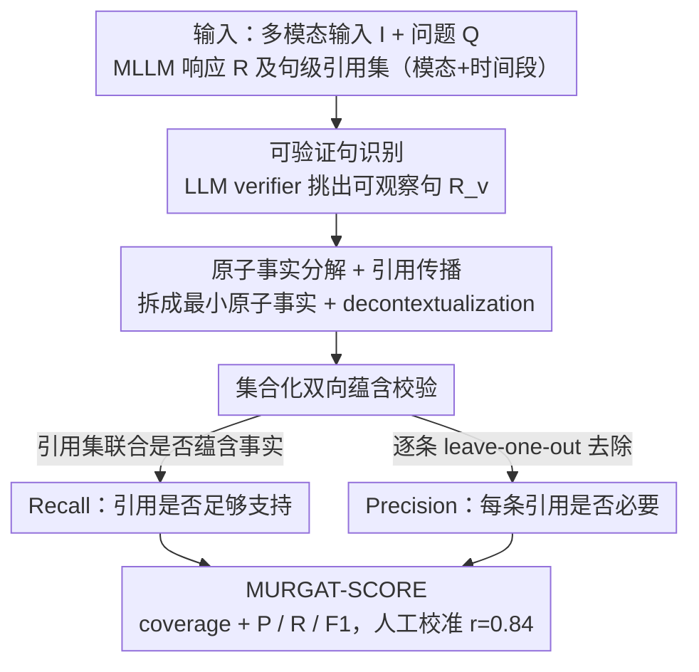

# Multimodal Fact-Level Attribution for Verifiable Reasoning

**会议**: ICML 2026  
**arXiv**: [2602.11509](https://arxiv.org/abs/2602.11509)  
**代码**: [github.com/meetdavidwan/murgat](https://github.com/meetdavidwan/murgat)  
**领域**: 多模态VLM / 可验证推理 / 评测  
**关键词**: 多模态归因, 引用质量评测, 原子事实分解, MURGAT-SCORE, 推理-引用解耦

## 一句话总结
MURGAT 是首个评测 MLLM 在多模态推理输出中"按事实粒度精确引用模态+时间段"能力的基准，搭配一个三步评估协议（可验证句识别 → 原子事实分解 → 归因质量）和高度与人工对齐的自动评测器 MURGAT-SCORE（Pearson 0.84），揭示了强模型即使答案对也常常胡乱引用，且强推理常以牺牲可验证引用为代价。

## 研究背景与动机

**领域现状**：MLLM 越来越多被用在多步推理 + 长文回答的现实任务上（视频问答、医学报告、教育演示），可靠部署要求输出"可追溯"——即每个事实性主张都能映射回输入的某个模态、某个时间段。现有文本归因（Gao 2023b）和视频时序定位（Hendricks 2017、Lei 2021）已有不少工作，但侧重观察式或检索式（直接定位"出现在哪一帧"）的简单场景。

**现有痛点**：(1) 现有评测要么只测视觉一种模态，要么只测整体源级（whole-video）粒度，不区分"可观察句"与"推理句"，导致模型即便给出错误时间戳也容易得高分；(2) 真实任务需要跨视频 + 音频 + 图表等异构模态联合归因，且需要按"原子事实"细粒度评估；(3) 主流"先生成 → 后归因"管道往往会牺牲推理质量来换引用质量。

**核心矛盾**：内部 latent 推理过程 与 可验证的 surface 引用 在 MLLM 里是脱节的——更长的思考往往让最终引用更难追踪；越严格的引用要求又会扼杀复杂推理能力。

**本文目标**：(1) 构造能区分"观察 vs 推理"的细粒度多模态归因基准；(2) 给出一个高度与人工对齐的自动评测器，让大规模 benchmark 可负担；(3) 系统刻画 reasoning effort、模型规模、归因策略与最终归因质量的关系。

**切入角度**：把响应分成三层处理——只对可观察句要求引用，把句子拆成原子事实做精度/召回评估，并明确区分模态和时间段。这样可以把"推理质量"与"引用质量"完全解耦评测，从而暴露它们之间的 trade-off。

**核心 idea**：把可验证多模态归因评测重构成"句级筛选 → 原子事实分解 + 引用传播 → 集合化的 precision/recall 蕴含验证"三阶段流水线，用 MLLM-as-judge 选最优自动评估器并校准到人工。

## 方法详解

### 整体框架
本文要解决的问题是：当 MLLM 在视频/音频/图表上做多步推理并生成长文回答时，如何按"原子事实"的粒度衡量它有没有把每个事实性主张精确引用回正确的模态和时间段。MURGAT 把这件事拆成一条三阶段评测流水线：先用一个 LLM verifier 把回答里"可以从输入直接观察到的句子"挑出来，再把这些句子分解成最小可独立验证的原子事实并把句级引用传播下去，最后对每个原子事实做双向蕴含校验，分别算出召回（引用是否足够支持事实）和精度（每个引用是否真的必要）。整套协议的输入是多模态输入 $I$、问题 $Q$、以及 MLLM 生成的响应 $R=\{r_i\}$，每个可验证句 $r_i$ 还附带一个引用集 $C_i = \{c_i^j\}$，每个引用 $c_i^j$ 指定一个模态加时间段（如 `(audio, 0:42-0:46)`）。

### 关键设计

**1. 可验证句识别：把"观察"和"推理"分开，引用只在该有的地方算**

传统归因评测对回答里所有句子一视同仁，结果要么逼着模型在推理句上硬塞引用、破坏推理质量，要么把无法归因的推理句直接罚分、对模型不公平；更糟的是模型可以靠"在推理句上故意不引用"来白嫖高分。MURGAT 先用一个 LLM verifier 判断每个句子 $r_i$ 是否能从输入 $I$ 中直接观察到，得到可验证句集合 $R_v = \{r_i \in R \mid \text{Verifier}(r_i, I) = \text{True}\}$——比如"录像明确把推力定义为正向（音频 0:42-0:46，视觉 0:45）"是可观察的应保留，而"因此该说法不正确"是推理结论应丢弃。后续 precision/recall 只在带引用的可验证句子集 $R_{vc} = \{r_i \in R_v \mid C_i \neq \emptyset\}$ 上计算，这样推理质量和引用质量被彻底解耦，是整套协议最关键的取舍。

**2. 原子事实分解 + 引用传播 + decontextualization：把粒度压到最细**

如果直接按句子评估，"对一半错一半"的复合句会拿到一个不准确的分数。MURGAT 对每个 $r_i \in R_{vc}$ 调用 LLM 分解器，拆成一组原子事实 $\{a_i^1, \ldots, a_i^n\}$，要求每个原子事实都是"最小、可独立验证"的主张；同时做 decontextualization 把代词解析回具体实体（这一步沿用 FActScore (Min 2023) 已验证有效的做法，并扩展到多模态）。然后把句级引用集 $C_i$ 复制到该句的所有原子事实上，得到待评估的 pair 集 $\{(a_i^j, C_i)\}$。引用传播保留了原句的引用上下文，也回避了一个不现实的要求——让 MLLM 在生成时就按原子粒度分别标注引用。

**3. 集合化的双向蕴含 + MURGAT-SCORE 人工校准：堵住冗余引用的漏洞**

要同时回答"引用够不够支持事实"和"每个引用是不是都必要"两个问题。对每个 pair $(a_i^j, C_i)$，先用 MLLM 判定整个引用集 $C_i$ 联合是否蕴含 $a_i^j$（这给出 recall）；若蕴含，再逐个把单条引用 $c_i^k$ 拿掉做 leave-one-out 测试，看它是否严格必要（这给出 precision）。leave-one-out 专门防止模型"塞一堆冗余引用刷 recall"的作弊，而按"模态+时间段"对齐则是多模态归因区别于纯文本归因的本质所在。整体指标 MURGAT-S 综合了 coverage $= |R_{vc}|/|R_v|$ 与 precision / recall / F1。为了让自动评测可信，作者在 WorldSense 与 Video-MMMU 上收集了完整三任务的人工标注，扫描多个 MLLM 作为 judge（Gemini-2.5-Flash、Gemini-3-Flash/Pro、Qwen3-Omni-Instruct/Thinking），最终选出 Pearson r=0.84 的最优 judge 组合，显著超过 next-best 的 r=0.59。

### 损失函数 / 训练策略
本文不训练模型，只构建评测协议，MURGAT-SCORE 是评测指标本身。论文额外探索了一个 inference-time 的解耦方案——先让模型自由推理、再单独抽取引用，实验中能提升 +9.6 MURGAT-S，但代价是答案准确率下降，呈现一个系统性 trade-off。

## 实验关键数据

### 主实验
在 WorldSense + Video-MMMU 上评测多种强 MLLM。

| 模型 | QA 准确率 | MURGAT-S | 现象 |
|------|----------|----------|------|
| Gemini-3-Pro | 高 | 高 | 大模型 + 更多思考 → 引用更准 |
| Gemini-2.5-Flash | 中 | 中 | 答案对但引用经常错或缺 |
| Qwen3-Omni-Instruct | 中 | 偏低 | 单步指令版引用质量一般 |
| Qwen3-Omni-Thinking | 略升 | 反而下降 | 小模型加思考 → 引用更乱 |
| 解耦 "先推理 → 后抽引用" pipeline | 答案略降 | +9.6 | 系统性 trade-off |

### 消融实验

| 配置 | 关键现象 | 说明 |
|------|----------|------|
| 不做 Verifiable Claim Identification | 推理句被惩罚 | precision/recall 失真 |
| 不做原子分解 | 句级评估，复合句不公平 | 部分对部分错被打高分 |
| 不做引用 leave-one-out | precision 失效 | 模型用大量冗余引用刷分 |
| Judge 用 GPT-4o-mini 单模型 | r=0.59 | 比最优组合显著差 |
| Judge 用 Gemini-3-Pro + 校准 | r=0.84 | MURGAT-S 最终设置 |

### 关键发现
- "推理税"现象：在简单识别任务上加引用要求会降低 QA 准确率（reasoning tax），但在复杂推理任务上反而有 scaffold 作用——结构化引用强制模型把推理链拆细。
- 模型规模与 effort 的交互：Gemini-3-Pro 在加大思考预算后 MURGAT-S 仍涨；小模型（Qwen3-Omni-Thinking）反而越想越偏，可能是 latent 推理与 surface 引用脱节。
- 强模型即使 QA 正确，引用错误率也很高（hallucinated grounding），说明 MLLM 内部"知道答案"和"知道在哪看到答案"是两个不同能力。

## 亮点与洞察
- **"可验证 vs 推理句"显式区分**：把归因评测从"对所有句子苛求"重新定义为"只对该验证的句子评测"，是这篇工作最关键的协议设计，给后续多模态归因研究确立了评测范式。
- **原子事实 + 模态+时间戳引用**：把文本归因里的 FActScore 思路严格扩展到多模态（必须指出"在视频 1:16 的画面"或"在音频 0:42-0:46"），且 leave-one-out 校验严防冗余引用，评测稳健性比之前的源级归因强很多。
- **MURGAT-SCORE 与人工高一致**：r=0.84 的 LLM-as-judge 让大规模自动化评测可行；同时其多 judge 校准方法可迁移到任何需要 MLLM 作为 evaluator 的设定。

## 局限与展望
- 评测依赖 LLM verifier / decomposer / entailment judge，本身可能引入偏差；尽管做了人工校准，跨域泛化仍存在风险。
- 数据集主要来自 WorldSense 与 Video-MMMU，对其他模态组合（如医学影像 + 病历 + 实验图谱）的可扩展性需要验证。
- 没有从训练侧提出方案——如何让 MLLM 在不损失推理的前提下学到准确引用，是个开放问题；论文只展示"解耦 pipeline" trade-off 但没系统训练。
- 引用粒度（时间段）依赖人工分段精度；模糊边界的事实可能给 precision 引入噪声。

## 相关工作与启发
- **vs MCiteBench / MAVIS**：它们关注图像级 VQA + 文档级证据，模态单一且粒度粗；MURGAT 强制模态 + 时间段双标签，且加入音频/图表。
- **vs MIRAGE**：MIRAGE 用原子分解 + VLM 校验做多模态 RAG，发现强模型也常胡乱引用；MURGAT 的协议更细（区分 verifiable vs reasoning），且引用粒度到时间段。
- **vs 视频时序定位（Hendricks 2017、Lei 2021）**：传统视频定位假设目标段已经在 prompt 里指定；本文要求模型自己选证据，更贴近真实推理任务。
- **vs FActScore (Min 2023)**：原子事实分解的灵感直接来自 FActScore，但扩展到多模态 + 引用集合的双向校验。

## 评分
- 新颖性: ⭐⭐⭐⭐⭐ 把"可验证 vs 推理"显式分离 + 多模态时间段级引用，是这一领域第一次完整闭环。
- 实验充分度: ⭐⭐⭐⭐ 覆盖多个强模型 + 解耦 pipeline + reasoning effort scan，但只有 2 个数据集。
- 写作质量: ⭐⭐⭐⭐⭐ 图 1 把整个协议直观呈现，定义和示例非常清晰。
- 价值: ⭐⭐⭐⭐⭐ 给可信 MLLM 部署的可验证性研究提供了基础设施，会被后续工作广泛引用。

<!-- RELATED:START -->

## 相关论文

- [\[AAAI 2026\] PSA-MF: Personality-Sentiment Aligned Multi-Level Fusion for Multimodal Sentiment Analysis](../../AAAI2026/audio_speech/psa-mf_personality-sentiment_aligned_multi-level_fusion_for_multimodal_sentiment.md)
- [\[ACL 2026\] When Misinformation Speaks and Converses: Rethinking Fact-Checking in Audio Platforms](../../ACL2026/audio_speech/when_misinformation_speaks_and_converses_rethinking_fact-checking_in_audio_platf.md)
- [\[ICML 2026\] JAEGER: Joint 3D Audio-Visual Grounding and Reasoning in Simulated Physical Environments](jaeger_joint_3d_audio-visual_grounding_and_reasoning_in_simulated_physical_envir.md)
- [\[NeurIPS 2025\] ThinkSound: Chain-of-Thought Reasoning in Multimodal Large Language Models for Audio Generation and Editing](../../NeurIPS2025/audio_speech/thinksound_chain-of-thought_reasoning_in_multimodal_large_language_models_for_au.md)
- [\[ICML 2026\] The Silent Thought: Modeling Internal Cognition in Full-Duplex Spoken Dialogue Models via Latent Reasoning](the_silent_thought_modeling_internal_cognition_in_full-duplex_spoken_dialogue_mo.md)

<!-- RELATED:END -->
