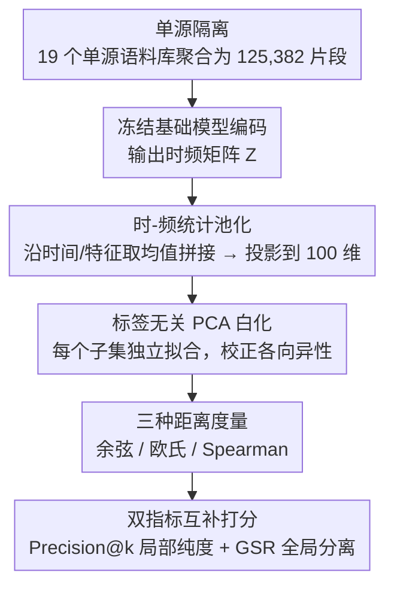

# VocSim：单源音频零样本内容身份识别的无训练基准

**会议**: ICML 2026  
**arXiv**: [2512.10120](https://arxiv.org/abs/2512.10120)  
**代码**: 待确认  
**领域**: 音频/语音处理  
**关键词**: 音频表示学习, 零样本, 基准测试, 内容恒等性, 无监督评估

## 一句话总结
VocSim 是涵盖 125k 单源音频的无训练基准，通过冻结特征加标签无关的 PCA 白化诊断音频基础模型的内在几何结构——揭示当前模型在低资源跨语言语音上的严重泛化缺陷。

## 研究背景与动机

**领域现状**：当前评估通用音频表示的标准做法是训练探针或微调参数（如 HEAR、SUPERB），关注模型的可适应性而非内在表示质量。

**现有痛点**：传统基准无法区分高分数是源于表示本身的质量还是优化策略的有效性；针对"即插即用"零样本检索任务的内在几何评估严重不足。

**核心矛盾**：基于参数更新的评估范式无法捕捉冻结表示空间的内在组织能力；现有单一语料库基准容易让模型过拟合于特定录音条件。

**本文目标**：设计纯粹无训练、无标签的零样本基准，既能诊断冻结音频嵌入的内在几何对齐质量，又能通过聚合 19 个异构语料库强制模型跨不相关背景变量泛化。

**切入角度**：效仿 NLP（GLUE、MTEB）和视觉（VTAB），将音频表示评估从参数适应转向零样本几何诊断，通过严格隔离单源内容识别来解耦表示质量与源分离能力。

**核心 idea**：用标签无关 PCA 白化校正冻结嵌入的各向异性，结合两个互补的无训练指标（局部邻域纯度与全局分离率），在单源音频上诊断基础模型的内在检索就绪度。

## 方法详解

### 整体框架
VocSim 要回答的问题是：一个冻结的音频基础模型，不做任何微调、不看任何标签，它的嵌入空间本身有没有"把同一内容的录音聚在一起、把不同内容推开"的内在几何质量。整套流程因此完全无训练：先把 19 个单源语料库聚合成 125,382 个音频片段，再让每个冻结模型把音频编码成嵌入、做时频池化、用标签无关的 PCA 白化校正几何，最后在余弦/欧氏/Spearman 三种距离下用两个零样本检索指标（Precision@k 与 GSR）来打分。没有探针、没有梯度更新，分数高低只反映表示空间自身的组织能力。

### 关键设计

**1. 单源隔离：把"内容几何"和"源分离"彻底拆开**

传统基准常拿混音录音评估，这会让一个高分到底来自表示质量、还是来自模型解缠重叠信号的能力变得无法区分。VocSim 干脆只收单声道、单声源录音，排除一切多音频混音，让基准纯粹考察"同一内容的两段录音在嵌入空间是否靠得近"。这种隔离类比 ImageNet 之于对象分类、COCO 之于场景分割——先把内容识别这一层的几何质量量化清楚，再谈更复杂的场景分析，评估结论才不会被源分离能力污染。

**2. 标签无关 PCA 白化：在零样本约束下校正各向异性**

基础模型的嵌入通常高度各向异性（向量挤在一个狭窄锥形里），直接算距离判别力很弱。常规做法是有监督微调来拉开几何，但那就破坏了零样本、无标签的前提。VocSim 改用转导式白化：在每个评估子集上**独立**拟合一次 PCA（不跨子集汇总统计量），做非参数归一化把各向异性压平，并报告有无 PCA 的对比结果。这样既不引入任何标签或参数更新、保住了零样本约束，又能把模型表示的真实潜力公正地暴露出来——主实验里 Whisper 经 PCA D100 后 P@1 从 61.5% 提到 66.8%，正是各向异性校正的直接收益。

**3. 双指标互补：局部邻域纯度 + 全局边界完整性**

单一指标容易偏科，VocSim 用两个互补视角刻画检索就绪度。Precision@k（P@1/P@5）衡量一个查询的 $k$ 个最近邻里有多少同类，直接模拟"拿一段录音去检索同内容样本"的局部可用性，但它对数据集结构比较敏感。GSR（全局分离率）则换成非对称设计来评估全局边界是否被泄漏：

$$\text{GSR} = \frac{\text{NID}_i - \text{Avg\_ID}_i}{\text{NID}_i + \text{Avg\_ID}_i + \epsilon}$$

其中 $\text{NID}_i$ 是样本 $i$ 到最近异类（Nearest Inter-class Distance）的距离、$\text{Avg\_ID}_i$ 是到同类的平均距离（Average Intra-class），分子之差一旦因边界泄漏变小就会被严厉惩罚。GSR 对子集特性远比 P@k 稳健（Kendall τ=0.60），两者合在一起既诊断"邻域里能不能检索到同类"，也诊断"类与类的边界整体清不清晰"。

### 损失函数 / 训练策略
全程无参数更新，只评估冻结嵌入的几何。编码器输出的时频矩阵 $Z$ 经统计池化压成单向量 $v = \text{Concat}(\mu_{time}(Z), \mu_{feat}(Z))$（分别沿时间轴和特征轴取均值再拼接），随后所有嵌入统一投影到 100 维再做距离计算。

## 实验关键数据

### 主实验

| 模型 | P@1 (公开集) | P@1 (盲集) | GSR (公开集) | GSR (盲集) | 主要特点 |
|------|------------|-----------|------------|-----------|---------|
| Whisper-L-v3 + EWMTF D100 | 66.8% | 11.5% | 41.7% | 39.4% | 弱监督最优 |
| CLAP | 63.7% | 8.1% | 38.1% | 36.2% | 多模态训练 |
| WavLM-Large | 64.1% | 4.6% | 37.0% | 35.8% | 自监督代表 |
| BEATs | 64.3% | 11.4% | 31.4% | 34.7% | 谱图变换器 |
| Log-Mel 基线 | 57.7% | 3.5% | 34.2% | 33.0% | 简单特征基线 |

### 域分析

| 配置 | 公开集 P@1 | 盲集 P@1 | 差距 | 分析 |
|------|-----------|---------|------|------|
| Whisper (原始) | 61.5% | 11.5% | 50% | 移除 PCA 前 |
| Whisper (PCA D100) | 66.8% | 11.5% | 55.3% | 各向异性校正提升 |
| CLAP (动物声音) | 88.4% | — | — | 强跨域泛化 |
| 动物叫声子集 | 84.5% | — | — | 无预训练重叠 |
| 公开语音子集 | 70.3% | — | — | 预训练数据混淆 |
| 盲集低资源语言 | 9.8% | — | — | **严重泛化崩溃** |

### 关键发现
- Whisper 编码器主导——弱监督预训练（680k 小时）学到的表示比自监督或谱图掩模更稳健。
- 简单池化（Mean-Time + Mean-Freq）比序列感知方法更高效且精度相当。
- 预训练重叠困境——动物声音子集（无重叠）仍产生强结果说明基准捕捉的是表示质量。
- 跨语言泛化崩溃——所有模型在盲集低资源语言上 P@1 从 60%+ 暴跌至 4%-11%。

## 亮点与洞察
- **范式创新**：首次将音频表示评估从参数适应转向零样本几何诊断。
- **跨域聚合的强度**：通过 19 个异构语料库强制跨不相关背景变量泛化。
- **GSR 的稳健性发现**：对子集特性敏感度远低于 P@k（Kendall τ=0.60）。
- **低资源跨语言的关键洞察**：11.5% vs 66.8% 的对比触目惊心。
- **可复用设计**：时-频统计池化加标签无关白化的组合简单有效。

## 局限与展望
- 转导白化的约束：技术上不属于严格单样本推理。
- 预训练重叠难解：只有盲集低资源语言满足严格 OOD 条件。
- 单源限制：实际应用（鸟鸣识别、广播监测）常涉及多声源。
- 有限模型覆盖：8 个主要模型，新型架构快速迭代需持续更新。
- 改进：扩展盲集；混合场景评估；动态基准；跨模态桥接。

## 相关工作与启发
- **vs HEAR/SUPERB**：训练线性探针或微调评估迁移学习；VocSim 聚焦冻结表示的内在几何质量。
- **vs 声学词嵌入文献**：扩展到零样本基础模型时代，跨越生物与环境音域。
- **vs MTEB/GeneCIS**：首次系统地将 NLP/视觉的零样本评估范式引入音频。
- **vs 各向异性研究**：采用转导白化（非参数 PCA）而非后期微调校正几何。

## 评分
- 新颖性: ⭐⭐⭐⭐⭐  首次系统从零样本几何诊断视角评估音频表示。
- 实验充分度: ⭐⭐⭐⭐  覆盖 8 主流模型 + 3 距离度量 + 消融 + 域分析 + 盲集验证。
- 写作质量: ⭐⭐⭐⭐⭐  逻辑清晰，细节充分，图表精良。
- 价值: ⭐⭐⭐⭐  揭示低资源跨语言泛化缺陷对音频检索、生物声学应用有直接指导。

<!-- RELATED:START -->

## 相关论文

- [\[ICML 2026\] NAACA: Training-Free NeuroAuditory Attentive Cognitive Architecture with Oscillatory Working Memory for Salience-Driven Attention Gating](naaca_training-free_neuroauditory_attentive_cognitive_architecture_with_oscillat.md)
- [\[ICML 2026\] Multiple Choice Learning of Low-Rank Adapters for Language Modeling](multiple_choice_learning_of_low-rank_adapters_for_language_modeling.md)
- [\[ICML 2026\] Group Cognition Learning: Making Everything Better Through Governed Two-Stage Agents Collaboration](group_cognition_learning_making_everything_better_through_governed_two-stage_age.md)
- [\[ICML 2026\] Towards Understanding Modality Interaction in Multimodal Language Models via Partial Information Decomposition](towards_understanding_modality_interaction_in_multimodal_language_models_via_par.md)
- [\[ICML 2026\] Towards Streaming Synchronized Spatial Audio Generation via Autoregressive Diffusion Transformer](towards_streaming_synchronized_spatial_audio_generation_via_autoregressive_diffu.md)

<!-- RELATED:END -->
