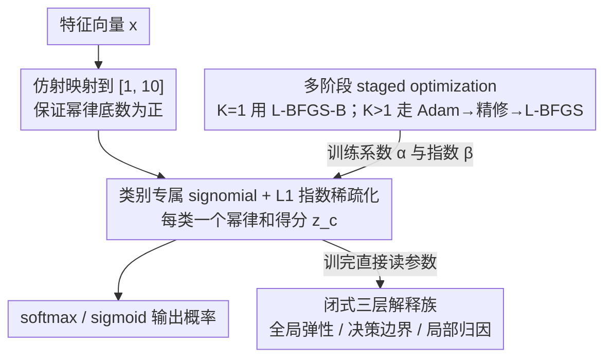

# ECSEL: Explainable Classification via Signomial Equation Learning

**会议**: ICML 2026  
**arXiv**: [2601.21789](https://arxiv.org/abs/2601.21789)  
**代码**: https://github.com/AdiaLumadjeng/ecsel (有)  
**领域**: 可解释机器学习 / 符号回归 / 内在可解释分类器  
**关键词**: signomial函数、符号回归、可解释分类、L1稀疏正则、闭式归因  

## 一句话总结
ECSEL 把"每个类别一个 signomial（带实数指数的幂律和）函数 + softmax"作为分类器，配合 L1 稀疏正则与多阶段优化，既能在 AI Feynman 等符号回归 benchmark 上以远低于 SOTA 的算力恢复 95.86% 的目标方程，又能在 11 个分类数据集上与 XGBoost/MLP 打平，同时所有特征归因都由模型参数闭式给出。

## 研究背景与动机

**领域现状**：当前可解释 AI 主要有两条路线。一是 *post-hoc* 解释（LIME、SHAP、Integrated Gradients），在黑盒模型外再训一个替代模型来解释预测；二是 *inherently interpretable* 模型（决策树、GAM、稀疏线性模型），结构本身就是解释。符号回归（SR）则属于第二类的极端形态——直接产出一条人类可读的方程。

**现有痛点**：通用 SR 方法（GP、PySR、DGSR、NeSymRes）把搜索空间设成"任意函数形式"，导致两个问题：(1) 算力极大，DGSR 在一个方程上平均要 612s，且经常超时；(2) 高维数据上性能崩坏。而 post-hoc 解释又被 Rudin 等人批评为"对高风险决策不可靠"。

**核心矛盾**：通用 SR 的表达能力 *没有被benchmark 兑现*——作者发现 AI Feynman 100 个物理方程里 45 个本身就是 signomial（$\sum_k \alpha_k \prod_j x_j^{\beta_{k,j}}$ 形式的幂律和）。也就是说，benchmark 早就在喊"我有结构"，但通用方法非要在巨大空间里盲搜。

**本文目标**：(1) 把 signomial 作为一类正经的"模型族"而不是优化目标；(2) 让 signomial 既能做 SR、又能做分类；(3) 让"全局/决策边界/局部"三层解释都从模型参数 *闭式* 推出，不再需要采样。

**切入角度**：signomial 在对数空间里就是线性函数（$\log z = \sum_j \beta_j \log x_j + \log\alpha$），所以指数 $\beta_{k,j}$ 直接编码了"特征对输出的弹性"（economics 里的 elasticity）。这是天然的"参数即解释"结构。

**核心 idea**：用"每类一个 signomial + softmax + L1 正则"换掉 deep classifier，把"训练成本"换成"零成本的解释"。

## 方法详解

### 整体框架

ECSEL 要解决的问题是：既能做符号回归、又能做分类，而且分类器的"解释"不靠事后采样、直接从参数读出来。它的做法是把"每个类别一个 signomial 函数 + softmax"当成分类器本体。给定特征向量 $x \in \mathbb{R}^m$，先经一次仿射变换把每维压到 $[1, 10]$（signomial 的幂律要求底数为正），再为每个类 $c$ 学一个由 $K$ 个幂律项加性组成的分数函数 $z_c(x) = \sum_{k=1}^{K} \alpha_{c,k} \prod_{j=1}^{m} x_j^{\beta_{c,k,j}}$，参数是系数 $\alpha_{c,k} \in \mathbb{R}$ 与指数 $\beta_{c,k,j} \in \mathbb{R}$，超参 $K$ 控制复杂度（$K=1$ 为单幂律，$K>1$ 为多幂律加性组合）。多类问题在 $\{z_c\}$ 上接 softmax、二类接 sigmoid 给出概率，SR 版本只把 cross-entropy 换成 MSE。作者还为这套结构补了理论靠山——**Signomial 通用近似定理**：经 $\log$ 变换映到正 orthant 上就是指数线性函数，再套 Stone-Weierstrass，可证 signomial 在 $\mathbb{R}^m_{>0}$ 紧子集上对连续函数稠密，从而与神经网络同属"万能近似器"，只是天然偏好乘性幂律关系。

### 关键设计

**1. 类别专属 signomial + L1 指数稀疏化：让得分函数本身就是一条可读方程并自动选特征**

传统 GAM、稀疏线性模型只能做加性组合，捕捉不到 e-commerce 里 PageValue 与 ExitRate 之间那种乘除交互；黑盒模型虽能捕捉交互，却又要回头靠 SHAP 来解释。ECSEL 让每个类 $c$ 拥有独立的一组 $\{\alpha_{c,k}, \beta_{c,k,j}\}$，其得分函数本就是一条人类可读的"乘除分式"方程，乘性的幂律结构天然表达这类弹性交互。关键的稀疏化技巧是把 L1 罚项只加在 *指数* 上：训练目标 $\mathcal{L} = -\frac{1}{N}\sum_i \log p_{y_i}(x_i) + \lambda \sum_{c,k,j} |\beta_{c,k,j}|$ 把不相关特征的 $\beta$ 推向 0，而 $\beta=0$ 等价于 $x_j^0 = 1$，即"把那一项里这个特征抹掉"，于是产出真正稀疏的方程。这和稀疏系数 $\alpha$ 有本质差别——稀疏 $\beta$ 是在每一项内部做"特征选择"，稀疏 $\alpha$ 只是淘汰整项的"项选择"，前者粒度更细。又因为 signomial 在 $\log$ 后是线性的，这种乘性结构还顺带保证了后面的归因可以闭式给出。

**2. 多阶段 staged optimization：让非凸指数空间可靠收敛**

signomial 理论上很美，但指数 $\beta$ 可以取任意实数（含负值、分数），梯度对 $\beta$ 形如 $z_{c,k}(x) \cdot \log x_j$，量级极易爆炸，直接 Adam 一把梭往往要么卡在局部极小、要么发散。ECSEL 因此按 $K$ 分情形优化：$K=1$ 时整个目标是低维光滑函数，用 L-BFGS-B 直接求解；$K>1$ 时空间高维非凸，走三段策略——① Adam 配强 L1 做"结构发现"，让各项分化出不同角色；② 减弱 L1 做"精修"；③ 用最优 Adam 点初始化 L-BFGS 做最后抛光，并对多个随机种子 multi-start。同时对幂律项做 $\log$ 域变换加特征缩放以保数值稳定。这套"先用噪声梯度跳出局部、再用二阶法收敛"的流程正是把理论上漂亮的 signomial 落地成"实际能跑"的关键，也直接把 SR 恢复率从 DGSR 的 59% 抬到 95.86%。

**3. 闭式三层解释族：全局弹性 / 决策边界 / 局部归因都化为参数代数式**

SHAP、LIME 之所以慢（KernelSHAP 在 OSI 上要 28.5s），是因为它们在用 Monte Carlo 采样去逼近一个本应有解析式的量；signomial 的 $\log$ 线性结构让这些量都能闭式写出，训完模型后任何解释查询都只是参数代数运算、零额外计算。具体有四类：(a) **全局弹性** $E_{c,j}(x) = \partial \log z_c / \partial \log x_j = \sum_k \frac{z_{c,k}(x)}{z_c(x)} \beta_{c,k,j}$，$K=1$ 时退化为常数 $\beta_{c,j}$；(b) **counterfactual**——把 $x_j$ 乘以 $q$ 后新分数直接是 $z_c^{\text{new}}(x) = \sum_k q^{\beta_{c,k,j}} z_{c,k}(x)$，无需重新预测；(c) **决策边界灵敏度** $\partial(z_c - z_{c'})/\partial \log x_j$ 在 $K=1$ 时为 $z_c \beta_{c,j} - z_{c'} \beta_{c',j}$，直接读出"哪个指数差驱动了类间竞争"；(d) **局部归因** 利用 $\log z_{c,k}(x) = \log z_{c,k}(b) + \sum_j \beta_{c,k,j} \log(x_j/b_j)$，$K=1$ 时是 *精确* 的 SHAP 式分解，$K>1$ 时退化为一阶线性化 $\phi_j \approx G_{c,j}(x^*)(\log x_j - \log x_j^*)$。作者进一步正式证明（Theorem 3.2）ECSEL 满足 G1-G3、D1-D2、L1-L2 全部七条解释性性质，把"声称可解释"升级为"可证明可解释"。

### 损失函数 / 训练策略

分类用 cross-entropy 加指数 L1：$\mathcal{L} = -\frac{1}{N}\sum_i \log p_{y_i}(x_i) + \lambda \sum_{c,k,j} |\beta_{c,k,j}|$；SR 改用 MSE 版本 $\mathcal{L}_{\text{SR}} = \frac{1}{N}\sum_i (y_i - z(x_i))^2 + \lambda \sum_{k,j}|\beta_{k,j}|$。$\lambda$ 是关键超参（PaySim 上取 $2 \times 10^4$）。优化器对 $K=1$ 用 L-BFGS-B，$K>1$ 用 Adam (warm) + Adam (refine) + L-BFGS (polish) 三段式，超参由 Optuna TPE 在 30 个 trial 内搜得。

## 实验关键数据

### 主实验

**符号回归（45 个 AI Feynman signomial 子集 + Livermore/Jin/Korns/DGSR 合成集，5 个随机种子 42-46）**：

| 方法 | 符号恢复率 | 平均耗时（秒/方程） |
|------|-----------|--------------------|
| NeSymRes | 56% | 126.3 |
| NGGP | 58.54% | 468.7 |
| DGSR (SOTA) | 59.10% | 612.9 |
| **ECSEL** | **95.86%** | **86.4** |

**分类（11 个 binary/multi-class benchmark，5-fold CV，代表性 3 个数据集）**：

| 数据集 | 方法 | Acc. | F1 | 少数类 Recall |
|--------|------|------|------|---------------|
| Ilpd | LR | 71.55 | 58.45 | 3.03 |
| Ilpd | XGBoost | 72.41 | 63.03 | 6.06 |
| Ilpd | **ECSEL** | **75.86** | **74.39** | **42.42** |
| Compas | XGBoost | 68.18 | 68.08 | 62.54 |
| Compas | **ECSEL** | **68.47** | **68.36** | **62.82** |
| Transfusion | XGBoost | 80.06 | 78.72 | 38.89 |
| Transfusion | **ECSEL** | 79.33 | 77.95 | **41.67** |

ECSEL 在 11 个里 4 个拿 F1 第一（Seeds/Hearts/ILPD/Compas），9 个数据集上和最优方法差距 $<1$ 个百分点；ILPD 上 F1 比 XGBoost 高 11.36，少数类召回直接 +36 个点。

### 消融实验 / 解释器对比（OSI e-commerce 数据集）

| 方法 | 解释器 | 计算时间（秒） | Top-3 特征 |
|------|--------|--------------|-----------|
| **ECSEL** | 精确指数 | **0.1** | PVER, SI, PV |
| LR | LinearSHAP | 0.1 | PVER, Mo, PR |
| LR | LIME | 5.3 | PVER, Mo, PR |
| RF | TreeSHAP | 1.5 | PVER, PV, SI |
| RF | LIME | 32.0 | PVER, PV, ER |
| XGBoost | TreeSHAP | 0.1 | PVER, Mo, SI |
| XGBoost | LIME | 7.7 | PVER, PR, ER |
| MLP | KernelSHAP | 28.5 | PVER, PR, Mo |

### 关键发现

- **结构红利非常大**：DGSR 在 AI Feynman signomial 子集上虽然是 SOTA，但因为架构不允许限制函数形式，恢复率只有 59%；ECSEL 直接 hardcode signomial 形式，恢复率涨 37 个点，耗时降到 1/7。
- **少数类召回是隐形优势**：ILPD 上 XGBoost 少数类 recall 才 6%（基本只猜多数类），ECSEL 直接 42%；fraud detection PaySim 上 ECSEL F1 79.08%，超过此前 DSC 的 78%，且 precision 高达 94.27%。
- **解释成本零摊销**：把训练时间多花一点（OSI 上 5.5s vs LR 0.1s），换来推理时 SHAP/LIME 完全不需要。MLP 上 KernelSHAP 要 28.5s 才能跑完测试集解释，ECSEL 0.1s。
- **学到的方程有 *领域意义***：PaySim 上 $\beta_{\text{OBO}} = 1.42$ 揭示"欺诈者超线性地针对高价值账户"——这是黑盒模型给不出来的可执行 insight；OSI 上自动 surface 出 PVER（PageValue/ExitRate）这个组合特征作为 dominant predictor。

## 亮点与洞察

- **"参数即解释"的彻底贯彻**：很多 inherently interpretable 模型（如 GAM）声称可解释但还是要画 partial dependence；ECSEL 把全局弹性、counterfactual、决策边界、局部归因全部都化为 $\beta$ 和 $z_{c,k}$ 的代数式，文章 Theorem 3.2 把 7 条性质形式化证明了一遍——这是"声称可解释" → "可证明可解释"的升级。
- **从"benchmark observation"到"算法设计"**：作者从一个非常实证的观察（AI Feynman 100 个方程里 45 个是 signomial）反推出方法。这种"benchmark 已经在告诉我答案，但通用方法不去听"的思路可以迁移到其他领域——比如 LLM benchmark 里也常有大量结构化任务被通用模型"过度通用化"地处理。
- **L1 加在指数而非系数**：这个小细节关键。$\beta_j = 0$ 等价于 $x_j^0 = 1$，等价于"这一项里这个特征不存在"，所以稀疏 $\beta$ 等价于"每一项里都做特征选择"。如果稀疏 $\alpha$，只能淘汰整项，粒度更粗。这种"在乘性结构里搞稀疏"的思路对其他乘性模型（如 KAN、NAM）都有借鉴价值。

## 局限与展望

- 作者承认：$K$ 必须提前指定，是分类时常规超参但在 SR 里是真限制；高次单变量多项式（Nguyen）上仍打不过特化方法。
- 自己看出的局限：(1) 要求所有特征 $> 0$，需要先做 $[1, 10]$ 仿射映射；负值或类别特征处理不优雅；(2) $K>1$ 时局部归因从精确退化为一阶线性化，"严格可解释性"打了折扣；(3) 多阶段优化里的超参（Adam 步数、L1 退火 schedule）会显著影响最终方程的"美感"，重现性是个挑战；(4) 对离散/类别特征几乎没有讨论，这限制了在表格数据外的应用。
- 改进思路：把 $K$ 做成可学习的（neural ODE 风格的"按需增长"），或者把指数限制到有理数子集以增强 *exact* 符号恢复率；探索 group-L1 等让不同类共享特征选择结构；用 Mixture-of-signomials 处理多模态分布。

## 相关工作与启发

- **vs DGSR/NeSymRes/gplearn（通用 SR）**：他们在巨大空间里搜任意函数；ECSEL 锁定 signomial 子空间。代价是放弃了非幂律结构（如 $\sin$、$\exp$ 等只是参考函数族里没有的），换来 37 个点的恢复率提升和 7 倍加速。
- **vs GAM / Neural Additive Models（NAM）**：GAM/NAM 是 *加性* 的可解释模型，无法捕捉乘性交互；ECSEL 是 *乘性* 可解释模型，自然处理 elasticity 类经济/生物特征。两者互补，未来可以合并成 "Generalized Additive + Multiplicative Models"。
- **vs SHAP/LIME**：post-hoc 方法在任意模型上事后采样估计；ECSEL 直接从参数闭式给出，且 G1 ≈ global SHAP，G3 ≈ LIME，L1, L2 ≈ additive SHAP。意义是把 SHAP 的"估计量"变成 signomial 上的"恒等式"——快、确定、可证明。
- **vs KAN（Kolmogorov-Arnold Networks）**：KAN 也声称可解释，用可学习样条 + symbolification；ECSEL 的 signomial 是更受约束但天然闭式的子空间。两者可以看作"可解释模型"光谱上的不同点。

## 评分
- 新颖性: ⭐⭐⭐⭐ 把 signomial 从优化对象提升为模型类是关键 reframing，但每个组件单独都不算新。
- 实验充分度: ⭐⭐⭐⭐⭐ 45 个 SR 方程 + 11 个分类数据集 + 2 个真实 case study + 与 4 类基线和 5 种解释器全面对比，充分。
- 写作质量: ⭐⭐⭐⭐ 结构清晰、定理与 property 编号严格；少量公式编号在分类章节略密集。
- 价值: ⭐⭐⭐⭐⭐ 在金融/医疗等高 stakes 场景给出"无需 post-hoc"的真·可解释分类器，且 PaySim/OSI 两个案例展示了实际能落地的 insight。

<!-- RELATED:START -->

## 相关论文

- [\[ICML 2026\] Outcome-Aware Spectral Feature Learning for Instrumental Variable Regression](outcome-aware_spectral_feature_learning_for_instrumental_variable_regression.md)
- [\[ACL 2026\] Learning Invariant Modality Representation for Robust Multimodal Learning from a Causal Inference Perspective](../../ACL2026/causal_inference/learning_invariant_modality_representation_for_robust_multimodal_learning_from_a.md)
- [\[ICLR 2026\] Self-Supervised Learning from Structural Invariance](../../ICLR2026/causal_inference/self-supervised_learning_from_structural_invariance.md)
- [\[ICLR 2026\] Learning Robust Intervention Representations with Delta Embeddings](../../ICLR2026/causal_inference/learning_robust_intervention_representations_with_delta_embeddings.md)
- [\[CVPR 2026\] Retrieving Counterfactuals Improves Visual In-Context Learning](../../CVPR2026/causal_inference/retrieving_counterfactuals_improves_visual_in-context_learning.md)

<!-- RELATED:END -->
