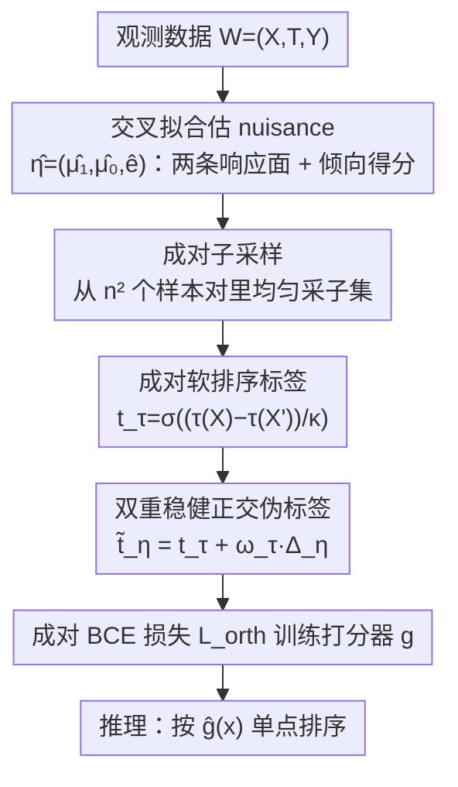

# Rank-Learner: Orthogonal Ranking of Treatment Effects

**会议**: ICML 2026  
**arXiv**: [2602.03517](https://arxiv.org/abs/2602.03517)  
**代码**: https://github.com/henriarnoUG/rank-learner (有)  
**领域**: 因果推断 / 处理效应排序 / 正交学习  
**关键词**: 处理效应排序, Neyman 正交, 两阶段学习器, 双重稳健, 成对损失

## 一句话总结
在观测数据上提出 Rank-Learner——第一个 Neyman-正交的两阶段处理效应**排序**学习器，用成对软标签 + 双重稳健修正项替代"先估 CATE 再排"的间接做法，在合成、半合成与 Criteo uplift 真实数据集上稳定优于 T/DR-learner 与非正交 plug-in ranker。

## 研究背景与动机

**领域现状**：在医疗分诊、营销定向、公共政策等场景中，决策者真正需要的不是 CATE 的精确数值，而是**按处理效应高低对个体排序**，把有限资源投给最受益的那部分人。然而文献几乎都在做 CATE 估计，针对处理效应排序的工作屈指可数。

**现有痛点**：标准 learning-to-rank 方法（pointwise / pairwise / listwise）需要"排序标签"作为监督，但反事实 $Y(1)-Y(0)$ 永远不可观测；现有做法只能走两条弯路——(i) 先用 T-learner / DR-learner 估出 $\hat\tau(x)$ 再按估值排序；(ii) Kamran et al. 2024 的 tree ranker 或 Vanderschueren et al. 2024 的 plug-in ranker 直接套 LTR，但都**不是 Neyman 正交的**，对一阶段 nuisance 估计误差非常敏感。

**核心矛盾**：CATE 估计在解一个**比排序更难的问题**——要识别 $g(x)=\tau(x)$ 这条完整函数；而排序只需要识别保序变换 $g(x)=h(\tau(x))$。把"难问题"的误差直接当成"易问题"的监督，本身就是浪费样本。同时，非正交目标会让 nuisance 的偏差一阶传导到打分器，小样本下尤其致命。

**本文目标**：构造一个**直接以排序为目标、对 nuisance 误差鲁棒**的两阶段学习器，要同时满足 (i) 模型无关 (model-agnostic)，(ii) Neyman 正交，(iii) 总体极小元给出正确排序。

**切入角度**：从成对二元交叉熵损失 $\mathcal L^{\text{bin}}$ 出发——它的总体极小元是任意保序变换 $h\circ\tau$，正是排序所需。但 $\mathcal L^{\text{bin}}$ 用了不光滑的指示标签 $\mathbf 1\{\tau(X)>\tau(X')\}$，没法走 influence function 正交化；只要把指示换成光滑 sigmoid 软标签 $t_\tau$，就能在保留排序语义的同时打开正交化通道。

**核心 idea**：用 sigmoid 软标签 $t_\tau(X,X')=\sigma((\tau(X)-\tau(X'))/\kappa)$ 替换硬指示，再用影响函数推出一个 DR-score 校正项 $\omega_\tau\cdot\Delta_\eta$，得到 Neyman-正交的伪标签 $\tilde t_\eta = t_\tau + \omega_\tau\cdot\Delta_\eta$，把它喂进标准 pairwise BCE 就完事。

## 方法详解

### 整体框架
Rank-Learner 要解的是：在观测数据 $W=(X,T,Y)$、$T\in\{0,1\}$、标准因果假设（一致性、正性、无混淆）下，学一个打分函数 $g:\mathcal X\to\mathbb R$，让它与处理效应 $\tau(x)=\mathbb E[Y(1)-Y(0)\mid X=x]$ 同序，而不必把 $\tau(x)$ 的数值估准。做法仍是经典的两阶段正交学习：先用 cross-fitting 估出 nuisance（两条响应面 $\mu_t(x)=\mathbb E[Y\mid T=t,X=x]$ 和倾向得分 $e(x)=P(T=1\mid X=x)$，记 $\hat\eta=(\hat\mu_1,\hat\mu_0,\hat e)$），再从训练集采成对样本去最小化一个成对排序损失。它与"先 plug-in 估 CATE 再排序"的唯一区别落在第二阶段的**目标构造**——损失形式还是标准的成对二元交叉熵，所有正交性都封装进伪标签里，因此工程上几乎是 plug-in ranker 的 drop-in 替换；推理时单点评估 $\hat g(x)$ 直接排序，不需要做成对比较。

### 关键设计

**1. 成对软排序损失：把"难问题"降级为"易问题"**

排序任务并不需要 $\tau(x)$ 的精确值，只需要它的序关系，所以本文不去拟合 CATE，而是把目标换成成对分类。定义软目标 $t_\tau(X,X')=\sigma((\tau(X)-\tau(X'))/\kappa)$ 表示"$X$ 比 $X'$ 更受益"的程度，模型偏好为 $p_g(X,X')=\sigma(g(X)-g(X'))$，最小化 $\mathcal L^{\text{soft}}=\mathbb E_{X,X'}[\ell(p_g,t_\tau)]$（$\ell$ 为二元交叉熵）。这个损失的总体极小元是 $g(x)=\tau(x)/\kappa+c$，恰好恢复处理效应的排序。相比之下，CATE 回归损失 $\mathcal L^{\text{cate}}$ 在 $g(x)=\tau(x)$ 处唯一极小，要求完整还原整条 $\tau$ 函数——这是比排序更强的统计要求；$\mathcal L^{\text{soft}}$ 只施加保序约束，因而更易学。更关键的是软标签**关于 $\tau$ 可导**（硬指示标签 $\mathbf 1\{\tau(X)>\tau(X')\}$ 不可微），这一步把后面影响函数正交化的通道打开了。超参 $\kappa>0$ 控制软硬：$\kappa\to 0$ 逼近纯排序的硬指示损失（最优解发散），$\kappa$ 越大越像缩放后的 CATE 回归，单个旋钮连续插值这两种范式。

**2. Neyman-正交的双重稳健伪标签：把正交性封装进 label**

软标签 $t_\tau$ 依赖未知的 $\tau$，朴素 plug-in 会让一阶段 nuisance 的偏差一阶传导到打分器，小样本下尤其致命。本文沿影响函数对 $\mathcal L^{\text{soft}}$ 做一阶修正，得到伪标签 $\tilde t_\eta(W,W')=t_\tau(X,X')+\omega_\tau(X,X')\cdot\Delta_\eta(W,W')$。其中权重 $\omega_\tau=\tfrac{1}{\kappa}t_\tau(1-t_\tau)$，DR-score 差 $\Delta_\eta=(\phi_\eta(W)-\tau(X))-(\phi_\eta(W')-\tau(X'))$，单点 DR score 为

$$\phi_\eta(W)=\tfrac{T}{e(X)}(Y-\mu_1(X))-\tfrac{1-T}{1-e(X)}(Y-\mu_0(X))+\mu_1(X)-\mu_0(X).$$

Theorem 5.1 证明由此构成的损失 $\mathcal L^{\text{orth}}=\mathbb E_{W,W'}[\ell(p_g,\tilde t_\eta)]$ 对 $\eta=(\mu_1,\mu_0,e)$ 是 Neyman-正交的（对 nuisance 的一阶扰动不敏感），Theorem 5.2 进一步证明在真 nuisance 下总体极小元仍是 $g(x)=\tau^0(x)/\kappa+c$，即排序不变。这套修正的妙处是权重 $\omega_\tau\propto t_\tau(1-t_\tau)$ 天然是一个"不确定性门控"：当软目标接近 $0$ 或 $1$（序关系已经很明确）时权重很小，伪标签 ≈ 软目标；当软目标在 $0.5$ 附近（难判定）时权重放大，DR 校正项被激活，把模糊样本对推向更可信的伪标签——这与困难样本挖掘的直觉一致，但完全是从影响函数推出来的，不是 heuristic。由于修正项全部装进 label，loss 形式不变，任何成对排序网络都能换上 $\tilde t_\eta$ 直接接入。

**3. Cross-fitting + 成对子采样的可扩展训练**

正交性要成立，一阶段 nuisance 必须与二阶段数据解耦，因此用 sample splitting / cross-fitting 估 $\hat\eta$，避免 nuisance 与打分器在同一批数据上过拟合。二阶段理论上要遍历 $n^2$ 个样本对，本文每个 epoch 从全部对里**均匀随机采子集** $\mathcal P\subset\mathcal P_{\text{all}}$ 训练，把复杂度从 $O(n^2)$ 降到 $O(|\mathcal P|)$；实验显示 AUTOC 在很小的采样比例下就饱和，说明二阶段成本不是瓶颈，性能主要由 nuisance 质量驱动。打分器实现为 ReLU 单隐层 FFN（与 baseline 同架构以公平对比），Adam 优化、最多 50 epoch 加早停；超参 $\kappa$ 通过验证集上 AUTOC 的近似估计（Chernozhukov et al. 2025）做无监督模型选择，刻画 bias–variance trade-off。

### 损失函数 / 训练策略
最终经验目标为 $\mathcal L^{\text{orth}}(g,\hat\eta)=\tfrac{1}{|\mathcal P|}\sum_{(i,j)\in\mathcal P}\ell(p_g(x_i,x_j),\tilde t_{\hat\eta}(w_i,w_j))$。模型选择按近似 AUTOC 选 $\kappa$ 与其它超参，CATE 基线按各自验证损失选；推理只需点态前向。

## 实验关键数据

### 主实验

合成 benchmark（test AUTOC，5 seed，越大越好，oracle = 1.40）：

| 方法 | $n=100$ | $n=500$ | $n=1{,}000$ | $n=2{,}000$ |
|------|---------|---------|---------|---------|
| T-learner | 0.88 ± 0.17 | 1.24 ± 0.05 | 1.32 ± 0.02 | 1.36 ± 0.00 |
| DR-learner | 0.80 ± 0.18 | 1.28 ± 0.05 | 1.33 ± 0.02 | 1.36 ± 0.02 |
| Plug-in ranker | 0.69 ± 0.32 | 1.24 ± 0.06 | 1.31 ± 0.02 | 1.36 ± 0.00 |
| **Rank-Learner (ours)** | **1.00 ± 0.19** | **1.31 ± 0.01** | **1.34 ± 0.01** | **1.37 ± 0.00** |

半合成与 Criteo 真实数据（test AUTOC / AUUC×10³）：

| 数据集 | 指标 | T-learner | DR-learner | Plug-in ranker | Rank-Learner |
|--------|------|-----------|------------|----------------|--------------|
| MovieLens (n=1k) | AUTOC | 1.31 ± 0.03 | 1.34 ± 0.02 | 1.30 ± 0.03 | **1.35 ± 0.01** |
| MIMIC-III (n=1k) | AUTOC | 1.12 ± 0.05 | 1.17 ± 0.02 | 1.11 ± 0.05 | **1.18 ± 0.02** |
| CPS (n=1k) | AUTOC | 0.87 ± 0.08 | 0.92 ± 0.02 | 0.87 ± 0.08 | **0.95 ± 0.01** |
| Criteo (test 1M) | AUUC×10³ | 5.08 ± 1.62 | 5.17 ± 1.13 | 5.04 ± 1.65 | **5.90 ± 0.40** |

### 消融实验

| 配置 | 关键指标（合成 n=500） | 说明 |
|------|------------------------|------|
| Full Rank-Learner | AUTOC 1.31 | 完整正交伪标签 |
| w/o 正交修正（= Plug-in ranker，只用 $t_\tau$） | AUTOC 1.24 | 去掉 $\omega_\tau\cdot\Delta_\eta$，掉 0.07 |
| w/o 直接排序（= DR-learner，先估 CATE 再排） | AUTOC 1.28 | 用 CATE 估值排序，掉 0.03 |
| Pair 子采样比例扫描 | AUTOC 饱和很快 | $n=1{,}000$ 时取 $n^2=10^6$ 中很小一部分对即可 |

### 关键发现
- **正交化在小样本最值钱**：$n=100$ 时 Rank-Learner 比 plug-in ranker 高 0.31 AUTOC，但 $n=2{,}000$ 时只差 0.01；样本越少 nuisance 误差越大，DR 校正项的边际收益也越大。
- **直接排序 > 估 CATE 再排**：DR-learner 已经是正交的，但 Rank-Learner 仍在所有训练规模下稳定占优，证实"解更易的问题"本身就是收益来源，正交化和任务匹配是两笔独立增益。
- **Pair 子采样不掉点**：性能很快随子采样比例饱和，二阶段成本不是瓶颈，nuisance 质量才是。
- **真实场景增益更明显**：Criteo（confounded training + randomized test）上 Rank-Learner 比次优 DR-learner AUUC 高 14%，且方差显著更小（0.40 vs 1.13）。

## 亮点与洞察
- **"问题降维"思路**：作者明确指出 CATE 估计是比排序更难的统计问题，因此用更松的目标函数 $\mathcal L^{\text{soft}}$ 替换 MSE 既符合任务、又更容易学，这种"对齐学习目标和决策目标"的角度可以迁移到 uplift、policy learning、ranking-aware fairness 等任何"只关心序"的因果场景。
- **正交化封装进 label 而非 loss**：通常正交学习要重写整个损失，本文把所有 nuisance 修正项打包进 pseudo label $\tilde t_\eta$，loss 形式仍是标准 BCE。这意味着工程实现几乎零改动——任何成对排序网络（RankNet、LambdaMART 等）都能直接换 label 接入。
- **权重 $\omega_\tau$ 的"门控"解读**：$\omega_\tau\propto t_\tau(1-t_\tau)$ 把校正自动集中在"难分对"上，与困难样本挖掘的 intuition 不谋而合，但这里是从影响函数理论推出的，不是 heuristic，理论与启发式漂亮地汇合。
- **$\kappa$ 桥接两种范式**：单一超参 $\kappa$ 连续插值"缩放 CATE 估计 → 纯排序"，给实践者一个干净的旋钮调 bias–variance trade-off，并通过近似 AUTOC 实现无监督模型选择。

## 局限与展望
- **二元处理 + 单点结果**：方法只覆盖 $T\in\{0,1\}$ 和连续/二元 $Y$，多臂处理、序贯处理、时变混杂等场景需要重新推导影响函数与伪标签。
- **依赖标准因果假设**：consistency、positivity、unconfoundedness 一个都不能少；尤其在 Criteo 重度治疗不平衡的设定下 propensity 估计噪声仍可见（虽然正交性减轻了影响）。
- **AUTOC 模型选择仍依赖估计**：$\kappa$ 选择用的是 AUTOC 的近似估计而非 oracle，估计偏差是否会反过来选错 $\kappa$ 缺少深入讨论。
- **缺与 Kamran et al. tree ranker 的主表对比**：仅在 Appendix F.4 给出，主表只比 plug-in ranker；面对非两阶段的直接排序方法时差距尚不直观。
- **改进方向**：(i) 扩展到 doubly-robust + 反事实回归的 hybrid backbone；(ii) 把 listwise / top-k 目标也正交化（当前只到 pairwise）；(iii) 在 sequential decision-making 中把 Rank-Learner 当作 policy 子模块。

## 相关工作与启发
- **vs DR-learner (Kennedy 2023)**：都用 DR score $\phi_\eta$ 和 cross-fitting，但 DR-learner 的二阶段目标是 $\mathbb E[(g(X)-\phi_\eta(W))^2]$ 即 CATE 回归；Rank-Learner 把 $\phi_\eta$ 嵌进成对软标签的修正项，目标改为排序，解了更易的问题。
- **vs Plug-in ranker (cf. Vanderschueren et al. 2024)**：两者损失都基于 $\mathcal L^{\text{soft}}$、形式相同，唯一差别就是是否加 $\omega_\tau\cdot\Delta_\eta$ 校正。小样本下差距巨大（n=100 时 AUTOC 0.69 vs 1.00），直接验证了正交化在排序任务里的价值。
- **vs Tree ranker (Kamran et al. 2024)**：tree ranker 直接优化基于 DR pseudo-outcome 的不可微排序准则，但模型类绑死、且不是 Neyman 正交；Rank-Learner 模型无关 + 正交，且支持神经网络。
- **vs Frauen et al. 2026 (preference-based LLM eval)**：同一团队把正交学习思路从"LLM 偏好评估"迁移到"处理效应排序"，可见 influence-function-based 正交化是一条可推广的方法论。
- **启发**：所有"目标实际只关心序而被迫学完整数值"的任务（uplift、个性化推荐、风险分级、医保资源分配）都值得复用本文的"软标签 + 影响函数修正"配方。

## 评分
- 新颖性: ⭐⭐⭐⭐ 第一个把 Neyman 正交学习扩展到处理效应排序，把 soft pairwise loss + DR 校正这条路打通，方法干净。
- 实验充分度: ⭐⭐⭐⭐ 合成 / 半合成（3 数据集）/ Criteo 真实数据全覆盖，含训练规模、子采样、overlap、$\kappa$ 敏感性消融，但仅与 4 个 baseline 主表对比、与 tree ranker 比较被放到附录。
- 写作质量: ⭐⭐⭐⭐⭐ 动机递进清晰（CATE→soft→orthogonal），定理陈述与 intuition 段落穿插得当，Table 2 把四种损失的优化目标、约束、正交性一张表对齐，读完即可复述方法核心。
- 价值: ⭐⭐⭐⭐ 给医疗分诊、营销定向、政策评估等"只关心排序"的实操场景一个理论可靠、工程简单（drop-in pseudo label）的 baseline，开源代码可直接落地。

<!-- RELATED:START -->

## 相关论文

- [\[ICLR 2026\] An Orthogonal Learner for Individualized Outcomes in Markov Decision Processes](../../ICLR2026/causal_inference/an_orthogonal_learner_for_individualized_outcomes_in_markov_decision_processes.md)
- [\[AAAI 2026\] Learning Subgroups with Maximum Treatment Effects without Causal Heuristics](../../AAAI2026/causal_inference/learning_subgroups_with_maximum_treatment_effects_without_causal_heuristics.md)
- [\[AAAI 2026\] Causal Inference Under Threshold Manipulation: Bayesian Mixture Modeling and Heterogeneous Treatment Effects](../../AAAI2026/causal_inference/causal_inference_under_threshold_manipulation_bayesian_mixtu.md)
- [\[ICML 2026\] Evaluating Bivariate Causal Statements Based on Mutual Compatibility](evaluating_bivariate_causal_statements_based_on_mutual_compatibility.md)
- [\[NeurIPS 2025\] Transferring Causal Effects using Proxies](../../NeurIPS2025/causal_inference/transferring_causal_effects_using_proxies.md)

<!-- RELATED:END -->
